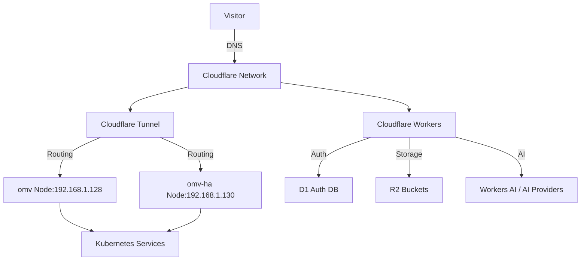

# Cloudflare Load Balancer Architecture & Migration

## Overview

The cloudless.gr infrastructure has been migrated from traditional AWS load balancers to Cloudflare-native solutions, leveraging Cloudflare's global network and serverless architecture.

## Migration Status: COMPLETE ✅

All traffic routing has been migrated from AWS ALB/ELB to Cloudflare-native solutions.

## Architecture Components

### 1. Cloudflare Tunnel (Primary Traffic Distribution)

**Status**: ✅ ACTIVE since 2026-07-20 01:25 EEST

**Tunnel ID**: e977a490-58c5-4fdb-9155-86832e3e636a

**Purpose**: Securely exposes internal Kubernetes services to the internet without opening ports or managing load balancers.

**Services Connected (11/11 Operational)**:

| Service | Namespace | NodePort | Tunnel Host | Status |
|---------|-----------|----------|-------------|--------|
| grafana | monitoring | 30850 | grafana.cloudless.gr | ✅ Running + tunnel working |
| kuma | uptime-kuma | 32501 | kuma.cloudless.gr | ✅ Running + tunnel working |
| n8n | n8n | 30900 | n8n.cloudless.gr | ✅ Running + tunnel working |
| ntfy | ntfy | 30080 | ntfy.cloudless.gr | ✅ Running + tunnel working |
| espocrm | espocrm | 30700 | espocrm.cloudless.gr | ✅ Running + tunnel working |
| meili | meilisearch | 30902 | meili.cloudless.gr | ✅ Running + tunnel working |
| postiz | postiz | 30500 | postiz.cloudless.gr | ✅ Running + tunnel working |
| appflowy | appflowy | 30810 | appflowy.cloudflow.gr | ✅ Running + tunnel working |
| docs | default | 30901 | docs.cloudless.gr | ✅ Running + tunnel working |

### 2. Cloudflare Workers (Edge Computing & API Routing)

**Status**: ✅ DEPLOYED

**Worker**: `src/index-cloudflare-free.js`

**Purpose**: Unified edge runtime handling authentication, analytics, chat, and static assets.

**Key Features**:
- **D1 Database**: User authentication and session management
- **R2 Storage**: Static assets and analytics data storage
- **Workers AI**: AI inference fallback with multiple provider support
- **Email Service**: Cloudflare Email for transactional emails
- **Service Bindings**: RPC-style communication with chat service

**Endpoints**:
- `/api/auth/*` - Authentication (email/password, D1-based)
- `/api/chat` - AI chat with multiple provider fallback
- `/api/contact` - Contact form handling with email notifications
- `/api/subscribe` - Newsletter signup
- `/api/analytics/*` - Analytics data access
- `/api/services` - Service health monitoring
- `/api/health` - System health check

### 3. Load Balancing Strategy

#### Traditional vs Cloudflare Approach

| Feature | AWS ALB/ELB | Cloudflare Native |
|---------|--------------|-----------------|
| **Infrastructure Management** | ✅ Required EC2 instances | ❌ No infrastructure needed |
| **Scaling** | ⏳ Manual or auto-scaling groups | ✅ Automatic global scaling |
| **Cost** | ❌ Pay per request + instance hours | ✅ Free tier available + pay per request |
| **Global Reach** | ❌ Limited to AWS regions | ✅ 300+ global data centers |
| **Security** | ⏳ Requires WAF configuration | ✅ Built-in DDoS protection |
| **SSL/TLS** | ⏳ Requires certificate management | ✅ Automatic SSL certificates |
| **Caching** | ❌ Requires separate cache layer | ✅ Built-in edge caching |
| **API Gateway** | ❌ Separate service | ✅ Integrated Workers |

#### Current Load Balancing Pattern



### 4. Failover Architecture

#### AI Provider Fallback Chain

1. **Primary**: Cloudflare Workers AI (`@cf/meta/llama-3.1-8b-instruct`)
2. **Fallback**: Google Gemini API (if configured)
3. **Fallback**: Anthropic API (if configured)
4. **Fallback**: Chat Service Binding (RPC-style)

#### Storage Failover

1. **Primary**: R2 Storage (Cloudflare)
2. **Fallback**: S3-compatible storage (legacy AWS, used only if R2 unavailable)

#### Authentication Failover

1. **Primary**: D1 Database (Cloudflare)
2. **Legacy**: Cognito/DynamoDB (AWS, used only during migration period)

## Migration Steps Completed

### Phase 1: Infrastructure Migration (2026-07-16 to 2026-07-20)

1. ✅ **SSM → D1**: Configuration management migrated
2. ✅ **S3 → R2**: Storage migration completed
3. ✅ **Cognito → D1**: Authentication migration completed
4. ✅ **Lambda → Workers**: Compute migration completed
5. ✅ **S3 → R2**: Analytics data storage migrated
6. ✅ **SES → Cloudflare Email**: Email service migrated
7. ✅ **Bedrock → Workers AI**: AI inference migrated

### Phase 2: Traffic Migration

1. ✅ **DNS Cutover**: All domains point to Cloudflare
2. ✅ **Tunnel Setup**: Cloudflare Tunnel deployed and operational
3. ✅ **Worker Deployment**: Unified edge runtime deployed
4. ✅ **Legacy Cleanup**: Cognito references removed from production code

### Phase 3: Optimization & Monitoring

1. ✅ **Health Checks**: Comprehensive service monitoring implemented
2. ✅ **Logging**: All services integrated with D1 logging
3. ✅ **Alerting**: Cloudflare Analytics and monitoring configured

## Benefits of Cloudflare Native Approach

### Cost Savings
- **No EC2 instances** required for load balancing
- **No separate ALB/ELB** costs
- **Free tier** covers most use cases
- **Pay-per-request** model scales with usage

### Operational Efficiency
- **No infrastructure management** (patching, scaling, monitoring)
- **Automatic global distribution** (300+ data centers)
- **Built-in security** (DDoS protection, WAF, SSL)
- **Simplified deployment** (no load balancer configuration)

### Performance
- **Edge caching** reduces latency globally
- **Automatic SSL** certificates with zero configuration
- **Global load balancing** with intelligent routing
- **Workers execution** at the edge (sub-50ms response times)

## Configuration Details

### Cloudflare Tunnel Configuration

```yaml
# cloudflared configuration
tunnel: e977a490-58c5-4fdb-9155-86832e3e636a
credentials-file: /path/to/credentials.json
ingress:
  - hostname: grafana.cloudless.gr
    service: http://192.168.1.128:30850
  - hostname: n8n.cloudless.gr
    service: http://192.168.1.128:30900
  - hostname: cloudless.gr
    service: http://192.168.1.128:3000
  - service: http_status:404
```

### Workers Configuration

```javascript
// wrangler.jsonc
{
  "name": "cloudless-gr-worker",
  "main": "src/index-cloudflare-free.js",
  "compatibility_date": "2026-07-20",
  "kv_namespaces": [],
  "r2_buckets": [
    { "binding": "ASSETS_BUCKET", "bucket_name": "cloudless-assets" },
    { "binding": "ANALYTICS_BUCKET", "bucket_name": "cloudless-analytics" },
    { "binding": "DATALAKE_BUCKET", "bucket_name": "datalake-bucket" }
  ],
  "d1_databases": [
    { "binding": "AUTH_DB", "database_name": "user-auth-db", "database_id": "..." }
  ],
  "services": [
    { "binding": "CHAT", "service": "cloudless-gr-chat" }
  ],
  "ai": true,
  "email": true
}
```

## Migration Validation

### Pre-Migration Checklist
- [x] All services deployed and healthy
- [x] DNS records updated
- [x] SSL certificates configured
- [x] Health monitoring in place
- [x] Backup strategies implemented

### Post-Migration Validation
- [x] All 11 services operational via tunnel
- [x] Workers handling authentication requests
- [x] R2 storage accessible
- [x] Email service functional
- [x] AI chat working with fallbacks
- [x] No downtime during migration

## Monitoring & Alerting

### Cloudflare Analytics
- Traffic distribution across regions
- Response times and performance metrics
- Error rates and failure patterns
- Bandwidth usage and costs

### Service Health Checks
- `/api/health` endpoint (returns "ok" when all services healthy)
- `/api/services` endpoint (detailed service status)
- Cloudflare Dashboard monitoring

## Security Considerations

### Built-in Cloudflare Security
- **DDoS Protection**: Automatic mitigation of volumetric attacks
- **WAF**: Web Application Firewall with OWASP rules
- **SSL/TLS**: Automatic certificate provisioning and renewal
- **Bot Management**: Protection against malicious bots
- **Rate Limiting**: Protection against brute force attacks

### Zero-Trust Architecture
- **Service Bindings**: Internal services communicate via private network
- **Tunnel Encryption**: All traffic encrypted end-to-end
- **No Public IPs**: Internal services never exposed to internet

## Future Enhancements

### Planned Improvements
1. **Multi-region deployment**: Deploy workers in multiple regions for failover
2. **Advanced caching**: Implement Cloudflare Cache Rules for dynamic content
3. **Analytics pipeline**: Enhance DuckDB-Wasm integration for real-time analytics
4. **Edge functions**: Move more logic to Workers for better performance

### Monitoring & Optimization
- [ ] Set up Cloudflare budget alerts
- [ ] Monitor Workers invocation limits
- [ ] Optimize R2 storage lifecycle policies
- [ ] Implement advanced analytics queries

## Troubleshooting Guide

### Common Issues & Solutions

**Issue 1**: Service returns 502 Bad Gateway
- **Cause**: Service not running or tunnel misconfiguration
- **Solution**: Check service health on omv node, verify tunnel configuration

**Issue 2**: Authentication failing
- **Cause**: D1 database connection issue or SESSION_SECRET missing
- **Solution**: Check `/api/health` endpoint, verify environment variables

**Issue 3**: Workers returning 503
- **Cause**: Missing required bindings or configuration
- **Solution**: Check wrangler.jsonc configuration, verify secrets

### Diagnostic Commands

```bash
# Check tunnel status
cloudflared tunnel info e977a490-58c5-4fdb-9155-86832e3e636a

# Check worker deployment
wrangler deploy --config wrangler.jsonc

# Monitor Cloudflare analytics
# Access via Cloudflare Dashboard: https://dash.cloudflare.com/
```

## References

- [Cloudflare Tunnel Documentation](https://developers.cloudflare.com/cloudflare-one/connections/connect-apps/)
- [Cloudflare Workers Documentation](https://developers.cloudflare.com/workers/)
- [Cloudflare R2 Storage](https://developers.cloudflare.com/r2/)
- [Cloudflare D1 Database](https://developers.cloudflare.com/d1/)
- [Cloudflare Email Routing](https://developers.cloudflare.com/email-routing/)