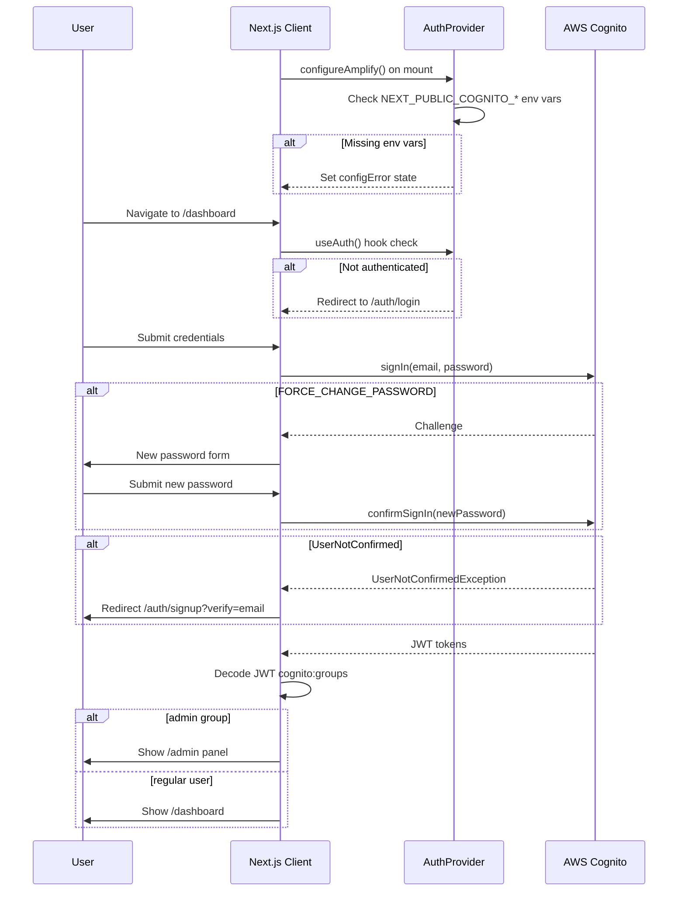
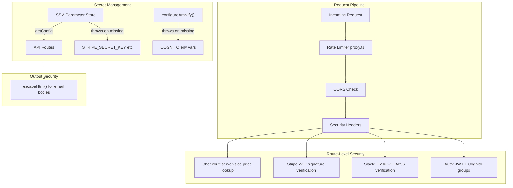
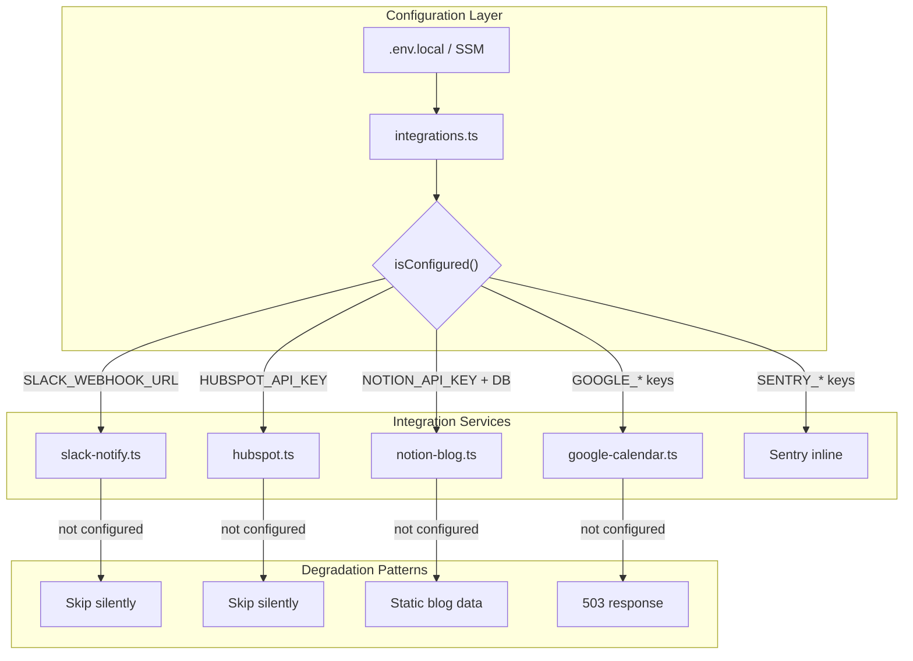
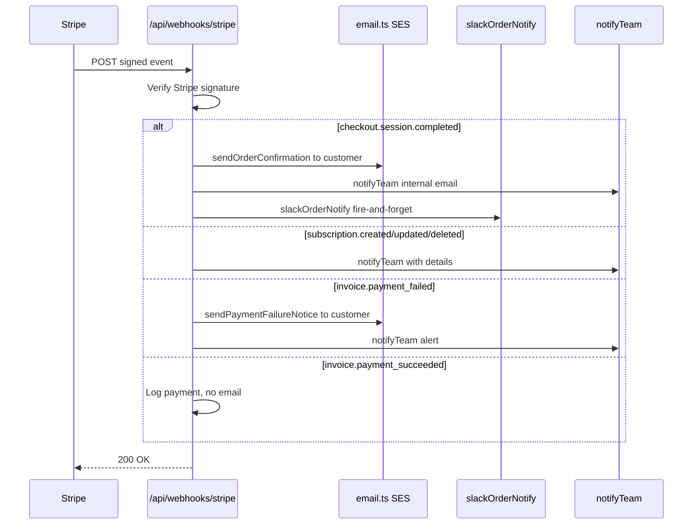

<!-- BEGIN:nextjs-agent-rules -->
# This is NOT the Next.js you know

This version has breaking changes — APIs, conventions, and file structure may all differ from your training data. Read the relevant guide in `node_modules/next/dist/docs/` before writing any code. Heed deprecation notices.
<!-- END:nextjs-agent-rules -->

# Cloudless.gr — Project Architecture

## Tech Stack

- **Framework:** Next.js 16.2.1 (App Router, React 19.2.4, Turbopack)
- **Styling:** Tailwind CSS 4 with `@theme inline` custom tokens
- **3D:** @react-three/fiber + @react-three/drei + three.js
- **Animation:** GSAP (ScrollTrigger) + Lenis smooth scroll
- **Command palette:** cmdk
- **Auth:** AWS Cognito (Amplify v6) with admin group
- **Payments:** Stripe (webhooks, checkout)
- **Email:** AWS SES
- **Secrets:** AWS SSM Parameter Store (no .env files in prod)
- **Testing:** Vitest + @testing-library/react + jsdom
- **Deployment target:** AWS (serverless)

## Design System (Cyberpunk × Quantum Devflow)

- **Void colors:** `#0a0a0f` (void), `#12121a` (void-light), `#1a1a2e` (void-lighter)
- **Neon colors:** cyan `#00fff5`, magenta `#ff00ff`, green `#00ff41`, blue `#4d7cff`
- **Fonts:** Instrument Sans (heading), Work Sans (body), Geist Mono (code)
- **Effects:** scanlines, cyber-grid, neon-border, glow-cyan, dot-matrix

### Card & Section Patterns (QD-inspired)

- **Cards:** `rounded-xl border border-slate-800 bg-void-light/50 hover:border-neon-cyan/50`
- **Icon boxes:** `w-10 h-10 bg-neon-cyan/10 border border-neon-cyan/20 rounded-lg`
- **Section rhythm:** `py-20 lg:py-28` for major sections
- **Pill badges:** `inline-flex items-center gap-2 px-3 py-1.5 bg-neon-cyan/10 border border-neon-cyan/20 rounded-full`
- **Tags:** `rounded-full` (was `rounded-sm`)
- **Buttons:** `rounded-lg` (was `rounded-sm`)
- **Backdrop:** `bg-void/90 backdrop-blur-xl` on navbar
- **Top accent bar:** 1px neon-cyan glow line on navbar
- **CTA gradients:** `bg-gradient-to-r from-neon-cyan/10 via-neon-blue/10 to-neon-magenta/10`
- **FAQ details:** `bg-void border border-slate-800 rounded-xl open:border-neon-cyan/30`
- **Section borders:** `border-y border-slate-800` (was `border-neon-cyan/10`)
- **IMPORTANT:** Never use dynamic Tailwind class names (e.g., `` bg-${var}/10 ``). Tailwind 4 JIT cannot detect them. Use a static class mapping object instead.

## Project Structure

> Full architecture documentation → **[ARCHITECTURE.md](ARCHITECTURE.md)**

```
src/
├── app/
│   ├── layout.tsx               # Root layout: AuthProvider → CartProvider → CookieConsentProvider → LenisProvider → Navbar, Footer, SW, CommandPalette, NeonCursor, KonamiEasterEgg
│   ├── [locale]/                # i18n routing (en · el · fr)
│   │   ├── page.tsx             # Homepage (Hero, Stats, Services, FAQ, CTA)
│   │   ├── services/            # Service offerings & pricing
│   │   ├── blog/[slug]/         # Blog (Notion CMS, static fallback)
│   │   ├── docs/[slug]/         # Docs (Notion CMS)
│   │   ├── store/               # E-commerce (Stripe live products)
│   │   │   ├── page.tsx         # Store listing
│   │   │   ├── [id]/page.tsx    # Product detail + JSON-LD
│   │   │   └── success/         # Order confirmation
│   │   ├── contact/             # Contact form (SES + Slack + HubSpot + Notion)
│   │   ├── auth/                # Login · Signup · Forgot Password (Cognito Amplify v6)
│   │   ├── dashboard/           # Customer portal (auth-protected, cyan accent)
│   │   │   ├── profile/         # Edit name, company, phone (Cognito attributes)
│   │   │   ├── purchases/       # Stripe order history
│   │   │   ├── consultations/   # Google Calendar bookings
│   │   │   └── settings/        # Theme, language, notifications
│   │   └── admin/               # Admin panel (admin group only, magenta accent)
│   │       ├── orders/          # Stripe sessions + subscriptions
│   │       ├── crm/             # HubSpot contacts
│   │       ├── analytics/       # Google Search Console SEO dashboard
│   │       ├── errors/          # Sentry issues
│   │       ├── notion/          # Notion DB explorer
│   │       ├── notifications/   # Slack test panel
│   │       ├── settings/        # App config viewer
│   │       └── users/           # Cognito user management
│   └── api/
│       ├── contact/             # POST → SES + Slack + HubSpot + Notion
│       ├── checkout/            # POST → Stripe Checkout Session
│       ├── subscribe/           # POST → SES + Slack
│       ├── unsubscribe/         # POST → SES suppression list
│       ├── health/              # GET → status + version
│       ├── blog/posts/          # GET → Notion blog (fallback: static)
│       ├── calendar/
│       │   ├── availability/    # GET → open slots (Google Calendar, 5min cache)
│       │   └── book/            # POST → create event + Slack notify
│       ├── slack/
│       │   ├── events/          # POST → Events API (HMAC verified)
│       │   ├── commands/        # POST → /cloudless-status, /cloudless-orders
│       │   └── interactions/    # POST → Block Kit button clicks
│       ├── user/
│       │   ├── purchases/       # GET → Stripe orders (requires JWT)
│       │   └── consultations/   # GET → Calendar bookings (requires JWT)
│       ├── crm/contact/         # POST → HubSpot upsert
│       ├── hubspot/ticket/      # POST → HubSpot support ticket
│       ├── webhooks/
│       │   ├── stripe/          # POST → fulfillment (SES + Slack)
│       │   └── notion/          # POST → cache invalidation + email
│       └── admin/               # All require admin JWT
│           ├── analytics/       # 10x GSC endpoints
│           ├── cache/           # Notion cache flush
│           ├── crm/             # HubSpot contacts/companies/deals/owners/pipelines
│           ├── notifications/   # Slack test
│           ├── notion/          # Blog/docs/tasks/projects/submissions/search
│           ├── ops/errors/      # Sentry issues
│           ├── orders/          # Stripe orders summary
│           └── users/           # Cognito user list
│
├── components/
│   ├── Navbar.tsx · Footer.tsx
│   ├── CommandPalette.tsx       # Cmd+K global search (cmdk)
│   ├── NeonCursor.tsx           # Desktop-only cursor effect
│   ├── GSAPReveal.tsx · ScrollReveal.tsx · LenisProvider.tsx
│   ├── CookieConsent.tsx · PushNotificationPrompt.tsx
│   ├── ServiceWorkerRegistration.tsx
│   ├── ParticleField.tsx · ParticleField3D.tsx
│   ├── HolographicCard.tsx · TerminalBlock.tsx · TypingText.tsx
│   ├── KonamiEasterEgg.tsx · JsonLd.tsx
│   └── store/
│       ├── StoreGrid.tsx · CartSlideOver.tsx
│       ├── CartButton.tsx · AddToCartButton.tsx · ProductIcon.tsx
│
├── context/
│   ├── AuthContext.tsx           # Cognito state: signIn/signUp/signOut, admin detection, profile
│   ├── CartContext.tsx           # Cart (useReducer, in-memory)
│   └── CookieConsentContext.tsx
│
├── lib/                         # Server + shared utilities (see ARCHITECTURE.md §9)
│   ├── ssm-config.ts            # SSM secrets loader (5-min TTL, fails fast on required keys)
│   ├── integrations.ts          # isConfigured() guards for all optional integrations
│   ├── api-auth.ts              # requireAuth() / requireAdmin() — Cognito JWKS verification
│   ├── amplify-config.ts        # Amplify v6 Cognito client (client-side singleton)
│   ├── email.ts                 # SES: sendEmail, sendOrderConfirmation, notifyTeam
│   ├── ses-suppression.ts       # SES suppression list management
│   ├── stripe.ts                # Stripe client, product/session helpers
│   ├── store-products.ts        # Maps Stripe products to store format (5-min cache)
│   ├── store-products-client.ts # Client-safe product helpers
│   ├── notion.ts                # Base Notion client + block renderers
│   ├── notion-blog.ts           # Blog DB: getPosts, getPost, getAllSlugs
│   ├── notion-docs.ts           # Docs DB: getDocs, getDoc
│   ├── notion-forms.ts          # Submissions DB: saveSubmission
│   ├── notion-projects.ts       # Projects + Tasks DB queries
│   ├── notion-search.ts         # Cross-DB full-text search
│   ├── notion-comments.ts       # Comment threads
│   ├── notion-analytics.ts      # Analytics DB: trackEvent, getAnalyticsSummary
│   ├── notion-cache.ts          # In-memory TTL cache + invalidateCache()
│   ├── hubspot.ts               # CRM: upsertContact, createTicket, listContacts/Deals/Companies
│   ├── slack-notify.ts          # SlackClient with retry: contact/subscriber/order/error/deploy
│   ├── slack-verify.ts          # HMAC-SHA256 inbound verification
│   ├── slack-rate-limit.ts      # Per-IP rate limiting for Slack endpoints
│   ├── google-calendar.ts       # getAvailableSlots, bookConsultation, getConsultationsByEmail
│   ├── gsc.ts                   # 11x GSC functions (SEO snapshot, keywords, pages, intent…)
│   ├── sentry.ts                # captureException, getUnresolvedIssues, Sentry REST client
│   ├── meta-pixel.ts            # trackPixelEvent — no-op until NEXT_PUBLIC_META_PIXEL_ID set
│   ├── meta-capi.ts             # sendLeadEvent — no-op until META_CAPI_ACCESS_TOKEN set
│   ├── blog.ts                  # Static blog fallback data
│   ├── blog-source.ts           # Selects Notion vs static source
│   ├── structured-data.ts       # JSON-LD schemas (Organization, Product, FAQ, Blog…)
│   ├── i18n.ts                  # translate() · translateArray() · getMessages()
│   ├── server-locale.ts         # getServerLocale() — reads NEXT_LOCALE cookie server-side
│   ├── use-locale.ts            # useCurrentLocale() — client hook
│   ├── locale-defaults.ts       # DEFAULT_LOCALE = 'en-IE' · DEFAULT_CURRENCY = 'EUR'
│   ├── fetch-with-auth.ts       # Adds Cognito JWT to client-side API calls
│   ├── format-price.ts          # Currency formatter (imports from locale-defaults)
│   ├── validation.ts            # isValidEmail() and other validators
│   └── escape-html.ts           # HTML sanitiser for email bodies

src/locales/
├── en.json                      # 195 translation keys
├── el.json                      # Greek (195 keys)
└── fr.json                      # French (195 keys)
└── fr.json                  # French translations (195 keys)

public/
├── sw.js                    # Service worker (versioned caches, cache-first static, network-first nav)
├── offline.html             # Cyberpunk offline page
├── icons/                   # PWA icons
└── favicons/                # Favicons

__tests__/
├── cart-context.test.ts     # Cart reducer tests
├── contact-api.test.ts      # Contact API route tests
├── checkout-api.test.ts     # Checkout API server-side validation tests
├── format-price.test.ts     # Price formatting tests
├── i18n.test.ts             # i18n utility tests
├── locale-switcher.test.tsx # LocaleSwitcher component tests
├── store-products.test.ts   # Product catalog tests
├── structured-data.test.ts  # JSON-LD schema generator tests
├── components.test.tsx      # Component render tests (JsonLd, HolographicCard, ScrollReveal, Navbar)
├── store-components.test.tsx # Store UI tests (ProductIcon, AddToCartButton, CartSlideOver, StoreGrid)
└── service-worker.test.tsx  # SW registration + push notification tests
```

## Authentication (Cognito + Amplify v6)



- **User Pool:** `us-east-1_JQWwFbO9a` with App Client `2qq6i24oc48391cmuv4kfl1rm2`
- **Env vars required:** `NEXT_PUBLIC_COGNITO_USER_POOL_ID` + `NEXT_PUBLIC_COGNITO_CLIENT_ID` (set in `.env.local`)
- **Admin group:** `admin` — checked via JWT `cognito:groups` claim
- **AuthProvider:** Wraps entire app in `layout.tsx`, calls `configureAmplify()` on mount with try/catch (sets `configError` state on failure instead of crashing)
- **Route protection:** Client-side via `useAuth()` hook in dashboard/admin layouts
  - `/dashboard/*` → redirects to `/auth/login` if not authenticated
  - `/admin/*` → redirects to `/dashboard` if not in admin group, `/auth/login` if not authenticated
- **Sign-in edge cases:**
  - `FORCE_CHANGE_PASSWORD` → handled via `confirmSignIn` challenge flow on login page
  - `CONFIRM_SIGN_UP` → redirects unverified users to `/auth/signup?verify=email`
  - `UserAlreadyAuthenticatedException` → auto-signs out and retries sign-in
- **Friendly error mapping:** `friendlyAuthError()` in `AuthContext.tsx` maps raw Cognito error names (`NotAuthorizedException`, `CodeMismatchException`, `LimitExceededException`, etc.) to user-friendly messages across all auth handlers
- **Form UX:** All auth forms include `autoComplete` attributes (`email`, `current-password`, `new-password`, `one-time-code`) for password manager integration
- **Navbar integration:** Shows "Sign In" button when logged out, user avatar dropdown when logged in (greets by name, Dashboard, Admin Panel if admin, Sign Out)
- **Color coding:** Cyan for user-facing auth, magenta for admin
- **i18n:** All pages fully translated in 3 locales (en, el, fr) — 195 keys each
- **User personalization:** AuthUser interface includes `name`, `company`, `phone`, `preferences` (theme, language, notifications)
  - Profile data stored in Cognito standard attributes (`name`, `phone_number`) and custom attributes (`custom:company`, `custom:preferences`)
  - `fetchUserAttributes` + `updateUserAttributes` from `aws-amplify/auth` for reading/writing
  - Preferences stored as JSON string in `custom:preferences` custom attribute
  - `updateProfile()` and `updatePreferences()` methods exposed via `useAuth()` hook
  - Signup form optionally collects name
  - Dashboard overview shows time-based greeting with user's name + live stats
  - **Cognito custom attributes required:** `custom:company` (String), `custom:preferences` (String) — must be added in AWS Console

## SEO

- JSON-LD on every page: Organization, BreadcrumbList, FAQPage, Service, BlogPosting, Product
- Dynamic OG images via `opengraph-image.tsx` (Edge runtime)
- Per-page metadata via Next.js Metadata API
- Sitemap + robots.txt auto-generated

## PWA

- Service worker: cache-first static, network-first navigation, network-only API
- Offline fallback page
- Web app manifest with shortcuts
- Install prompt banner
- Push notification opt-in (delayed 30s or 2nd visit)

## Mobile Responsiveness

- **Overflow guard:** `overflow-x: hidden` on html + body; `-webkit-text-size-adjust: 100%` prevents iOS auto-zoom
- **Touch targets:** All interactive elements (buttons, links, controls) have `min-h-[44px]` or larger per WCAG 2.5.5
- **Tap feedback:** `@media (pointer: coarse)` applies neon-cyan tap highlight; `active:` states mirror `hover:` effects across all components
- **NeonCursor:** Automatically disabled on touch devices via `window.matchMedia("(pointer: coarse)")`
- **Navbar:** Mobile hamburger menu with cart button row, 44px link targets, `active:text-neon-cyan`
- **Store cards:** Price/button row uses `flex-wrap gap-3` to wrap on narrow screens
- **CartSlideOver:** Quantity buttons sized to 36px, Remove/Close/Checkout buttons meet 44px+ targets
- **Design system rule:** Use `rounded-lg` for buttons and controls (not `rounded-sm`)

## Security



- **Rate limiting:** Centralized in `proxy.ts` (IP-based, per endpoint). Do not add per-route rate limiters.
- **CORS:** Restricted to `cloudless.gr` in production, localhost in dev.
- **Headers:** X-Content-Type-Options, X-Frame-Options, Referrer-Policy, Permissions-Policy, Strict-Transport-Security (HSTS with preload).
- **Checkout validation:** Server-side product lookup by ID; client cannot set prices.
- **SSM secrets:** `getConfig()` throws on missing required secrets (`STRIPE_SECRET_KEY`, `STRIPE_WEBHOOK_SECRET`). Validates SES email fields.
- **Amplify config:** `configureAmplify()` throws if `NEXT_PUBLIC_COGNITO_*` env vars are missing (no hardcoded fallbacks).
- **Email bodies:** HTML-escaped via `escapeHtml()` to prevent injection.

## Internationalization (i18n)

- **Supported locales:** `en` (English, default), `el` (Greek), `fr` (French) — all fully translated
- **Locale detection:** Cookie-based (`NEXT_LOCALE`), set by `LocaleSwitcher` component
- **Dictionary files:** `src/locales/en.json`, `src/locales/el.json`, `src/locales/fr.json` — 195 keys each, organized by section (common, navbar, hero, stats, guarantees, credibility, servicesSection, leadCapture, faq, founder, cta, footer, newsletter, contact, store, cart, auth, dashboard, pwa)
- **Core utilities (`src/lib/i18n.ts`):**
  - `translate(locale, key, fallback)` — dot-notation key lookup, returns string
  - `translateArray(locale, key, fallback)` — same but for array values (e.g., typing animation texts)
  - `getMessages(locale)` — lazy-loads and caches JSON dictionaries
  - `isSupportedLocale(str)` — type guard
- **Server components:** Use `getServerLocale()` from `src/lib/server-locale.ts` (async `cookies()` API)
- **Client components:** Use `useCurrentLocale()` hook from `src/lib/use-locale.ts`
- **Translated pages/components:** Homepage, Services, Contact, Store, Auth (Login, Signup, Forgot Password), Dashboard, Navbar, Footer, NewsletterForm, ServiceWorkerRegistration, CartSlideOver, CommandPalette, PWA prompts
- **Not yet translated:** Blog pages (hardcoded English; content-heavy, may stay English-only)
- **Rule:** Always import locale/currency constants from `locale-defaults.ts` — never hardcode locale/currency strings in other files
- **Rule:** For new UI strings, add the key to all three locale files (`en.json`, `el.json`, `fr.json`), then use `translate()` or `translateArray()` in the component

## Locale & Currency

- **Default locale:** `en-IE` — defined in `src/lib/locale-defaults.ts`
- **Default currency:** `EUR` — same file
- **Usage:** Imported by `format-price.ts`, `email.ts`, and `blog.ts` for consistent formatting
- **Rule:** Always import from `locale-defaults.ts` — never hardcode locale/currency strings in other files

## Optional Integrations



All integrations are optional and degrade gracefully. Config is centralized in `src/lib/integrations.ts` which reads env vars and provides `isConfigured(...keys)` to check availability. Every API route and lib that depends on an integration checks `isConfigured()` first and returns a 503 or null/empty result when not configured.

**Required env vars per integration:**

| Integration        | Env vars                                                     | Lib file            |
| ------------------ | ------------------------------------------------------------ | ------------------- |
| Slack              | `SLACK_WEBHOOK_URL`                                          | `slack-notify.ts`   |
| HubSpot CRM        | `HUBSPOT_API_KEY`                                            | `hubspot.ts`        |
| Notion CMS         | `NOTION_API_KEY`, `NOTION_BLOG_DB`                           | `notion-blog.ts`    |
| Google Calendar    | `GOOGLE_SERVICE_ACCOUNT_EMAIL`, `GOOGLE_PRIVATE_KEY`, `GOOGLE_CALENDAR_ID` | `google-calendar.ts` |
| Sentry             | `SENTRY_AUTH_TOKEN`, `SENTRY_ORG`, `SENTRY_PROJECT`          | (inline in route)   |

**Integration patterns:**
- **Fire-and-forget:** Contact route uses `Promise.allSettled([slackNotify, hubspotUpsert]).catch(() => {})` so the main email flow isn't blocked
- **Fallback:** Blog API returns static `lib/blog.ts` data when Notion isn't configured
- **Cache:** Calendar availability is cached 5 minutes; Google OAuth tokens cached until expiry

## Webhook Fulfillment



The Stripe webhook handler (`api/webhooks/stripe/route.ts`) processes these events:

- **`checkout.session.completed`**: Sends order confirmation email to customer, notifies team via email + Slack
- **`customer.subscription.created`**: Notifies team of new subscription
- **`customer.subscription.updated`**: Notifies team of plan/status changes
- **`customer.subscription.deleted`**: Notifies team of cancellation
- **`invoice.payment_failed`**: Sends payment failure notice to customer, notifies team
- **`invoice.payment_succeeded`**: Logs payment (no email)

Email sending is handled by `src/lib/email.ts` which provides:
- `sendEmail()`: Low-level SES wrapper with cached client
- `sendOrderConfirmation()`: Customer order receipt with cyberpunk-styled HTML
- `sendPaymentFailureNotice()`: Payment failure alert with support CTA
- `notifyTeam()`: Internal team notification for orders, subscriptions, failures

## Testing

- Run tests: `npm test` (watch) or `npm run test:ci` (single run)
- Test files in `__tests__/` directory
- Vitest + jsdom environment
- Path aliases resolve via `resolve.tsconfigPaths` in vitest config
- Mock AWS services (SES, SSM) in API tests
- **React 19 compatibility:** `define: { "process.env.NODE_ENV": "development" }` in vitest config ensures React's CJS build exports `act`, which `@testing-library/react` requires
