# Cloudless.gr — System Architecture

> **Purpose:** Digital solutions business providing cloud computing, AI marketing, serverless development, and e-commerce services to startups and SMBs.
>
> **Stack:** Next.js 16 · React 19 · Tailwind CSS 4 · TypeScript · AWS · Stripe · Notion · HubSpot

---

## Table of Contents

1. [Business Architecture](#1-business-architecture)
2. [Deployment & Infrastructure](#2-deployment--infrastructure)
3. [Application Layer Map](#3-application-layer-map)
4. [Secrets & Configuration](#4-secrets--configuration)
5. [Authentication & Authorization](#5-authentication--authorization)
6. [Full Data Flow Diagram](#6-full-data-flow-diagram)
7. [API Route Reference](#7-api-route-reference)
8. [Integration Map](#8-integration-map)
9. [Library Module Reference](#9-library-module-reference)
10. [Frontend Architecture](#10-frontend-architecture)
11. [E-Commerce Flow](#11-e-commerce-flow)
12. [Marketing & Analytics Stack](#12-marketing--analytics-stack)
13. [AI Marketing Roadmap](#13-ai-marketing-roadmap)
14. [Testing Strategy](#14-testing-strategy)
15. [What's Working vs What's Staged](#15-whats-working-vs-whats-staged)

---

## 1. Business Architecture

Cloudless.gr is a **digital solutions agency** that sells services AND digital products. The platform serves two audiences:

| Audience | Entry Point | Goal |
|---|---|---|
| **Leads / Prospects** | Homepage → Contact / Consult | Book a consultation, request a service |
| **Customers** | Store → Checkout | Buy digital products, subscriptions |
| **You (Admin)** | `/admin` | Monitor orders, CRM, SEO, errors |

The business model has three revenue streams:
1. **Services** — Cloud, AI marketing, digital marketing consulting (sold via consultation booking)
2. **Digital Products** — Templates, scripts, tools (sold via Stripe store)
3. **Subscriptions** — Recurring service packages (Stripe subscriptions)

---

## 2. Deployment & Infrastructure

```
┌─────────────────────────────────────────────────────────────────┐
│                        PRODUCTION                               │
│                                                                 │
│   cloudless.gr ──► CloudFront CDN ──► Lambda@Edge (arm64)       │
│                            │                                    │
│                     SST v4 (OpenNext)                           │
│                     1 GB RAM · 30s timeout · 5 warm instances   │
│                                                                 │
│   Domain: cloudless.gr (Route53 + ACM)                          │
│   Redirect: www.cloudless.gr → cloudless.gr                     │
│   Cache: Full CloudFront invalidation on every deploy           │
└─────────────────────────────────────────────────────────────────┘
```

### Deploy commands

```bash
pnpm deploy              # → production (cloudless.gr)
pnpm deploy:staging      # → staging.cloudless.gr
pnpm sst:dev             # → local dev tunnel via SST
pnpm dev                 # → localhost:4000 (Turbopack)
```

### Environment stages

| Stage | Domain | SSM Prefix | Warm instances |
|---|---|---|---|
| `production` | `cloudless.gr` | `/cloudless/production` | 5 |
| `staging` | `staging.cloudless.gr` | `/cloudless/staging` | 0 |
| `local` | `localhost:4000` | reads `.env.local` | — |

---

## 3. Application Layer Map

```
src/
├── app/                          ← Next.js App Router
│   ├── layout.tsx                ← Root layout (providers, fonts, SW, global nav)
│   ├── [locale]/                 ← i18n routing (en · el · fr)
│   │   ├── page.tsx              ← Homepage (Hero, Services, FAQ, CTA)
│   │   ├── services/             ← Service offerings & pricing
│   │   ├── blog/                 ← Blog listing + [slug] detail (Notion CMS)
│   │   ├── docs/                 ← Documentation pages (Notion CMS)
│   │   ├── store/                ← E-commerce (Stripe products)
│   │   │   ├── page.tsx          ← Store listing
│   │   │   ├── [id]/page.tsx     ← Product detail + JSON-LD
│   │   │   └── success/          ← Order confirmation page
│   │   ├── contact/              ← Contact form (SES + Slack + HubSpot + Notion)
│   │   ├── auth/                 ← Login · Signup · Forgot Password (Cognito)
│   │   ├── dashboard/            ← Customer portal (auth-protected)
│   │   │   ├── page.tsx          ← Personalized overview
│   │   │   ├── profile/          ← Edit name, company, phone
│   │   │   ├── purchases/        ← Stripe order history
│   │   │   ├── consultations/    ← Google Calendar bookings
│   │   │   └── settings/         ← Theme, language, notifications
│   │   └── admin/                ← Admin panel (admin-group only)
│   │       ├── page.tsx          ← Dashboard: orders, contacts, SEO, errors
│   │       ├── orders/           ← Stripe sessions + subscriptions
│   │       ├── crm/              ← HubSpot contacts
│   │       ├── analytics/        ← Google Search Console + Notion Analytics
│   │       ├── errors/           ← Sentry issues
│   │       ├── notion/           ← Notion DB explorer (blog, docs, tasks, projects)
│   │       ├── notifications/    ← Slack test panel
│   │       ├── settings/         ← App config viewer
│   │       └── users/            ← Cognito user management
│   └── api/                      ← API Routes (server-only)
│       ├── contact/              ← POST: SES + Slack + HubSpot + Notion
│       ├── checkout/             ← POST: Stripe checkout session
│       ├── subscribe/            ← POST: newsletter (SES + Slack)
│       ├── unsubscribe/          ← POST: SES suppression list
│       ├── health/               ← GET: status + version
│       ├── blog/posts/           ← GET: Notion blog (fallback: static)
│       ├── calendar/
│       │   ├── availability/     ← GET: open slots (Google Calendar)
│       │   └── book/             ← POST: create event (Google Calendar + Slack)
│       ├── slack/
│       │   ├── events/           ← POST: Events API (mentions, DMs)
│       │   ├── commands/         ← POST: /cloudless-status, /cloudless-orders
│       │   └── interactions/     ← POST: Block Kit button clicks
│       ├── user/
│       │   ├── purchases/        ← GET: Stripe orders for authenticated user
│       │   └── consultations/    ← GET: Calendar bookings for authenticated user
│       ├── crm/contact/          ← POST: HubSpot contact upsert (standalone)
│       ├── hubspot/ticket/       ← POST: HubSpot support ticket creation
│       ├── webhooks/
│       │   ├── stripe/           ← POST: Stripe webhook (orders, subs, failures)
│       │   └── notion/           ← POST: Notion webhook (cache invalidation)
│       └── admin/                ← All require admin JWT
│           ├── analytics/        ← Google Search Console data (10 endpoints)
│           ├── cache/            ← Notion cache management
│           ├── crm/              ← HubSpot: contacts, companies, deals, owners, pipelines
│           ├── notifications/    ← Slack test messages
│           ├── notion/           ← Notion DB queries: blog, docs, tasks, projects, submissions
│           ├── ops/errors/       ← Sentry issues
│           ├── orders/           ← Stripe orders summary
│           └── users/            ← Cognito user list
│
├── components/                   ← Shared UI components
│   ├── Navbar.tsx
│   ├── Footer.tsx
│   ├── CommandPalette.tsx        ← cmdk-powered global search
│   ├── ContactFormSection.tsx
│   ├── NeonCursor.tsx            ← Desktop-only cursor effect
│   ├── KonamiEasterEgg.tsx
│   ├── GSAPReveal.tsx / ScrollReveal.tsx
│   ├── LenisProvider.tsx / LenisInitializer.tsx
│   ├── CookieConsent.tsx
│   ├── PushNotificationPrompt.tsx
│   ├── ServiceWorkerRegistration.tsx
│   └── store/
│       ├── StoreGrid.tsx
│       ├── CartSlideOver.tsx
│       ├── CartButton.tsx
│       └── AddToCartButton.tsx
│
├── context/
│   ├── AuthContext.tsx            ← Cognito auth state + useAuth() hook
│   ├── CartContext.tsx            ← Shopping cart (useReducer, in-memory)
│   └── CookieConsentContext.tsx
│
├── lib/                          ← Server + shared utilities (see Section 9)
│
├── i18n/
│   ├── request.ts                ← next-intl locale resolver
│   ├── routing.ts                ← Locale routing config
│   └── navigation.ts
│
└── locales/
    ├── en.json                   ← 195 keys
    ├── el.json                   ← 195 keys (Greek)
    └── fr.json                   ← 195 keys (French)
```

---

## 4. Secrets & Configuration

**Rule: No secrets in environment variables in production. All secrets live in AWS SSM Parameter Store.**

```
┌──────────────────────┐     ┌────────────────────────────────────────┐
│   Local Dev          │     │   Production (Lambda)                  │
│                      │     │                                        │
│   .env.local         │     │   SSM Parameter Store                  │
│   (gitignored)       │     │   /cloudless/production/*              │
│        │             │     │              │                         │
│        ▼             │     │              ▼                         │
│   process.env        │     │   getConfig() — ssm-config.ts          │
│                      │     │   (5-min TTL cache, lazy-loaded)       │
└──────────────────────┘     └────────────────────────────────────────┘
```

### SSM Parameters (all in `us-east-1`)

| Parameter | Type | Used By |
|---|---|---|
| `STRIPE_SECRET_KEY` | SecureString | Stripe checkout, webhooks |
| `STRIPE_PUBLISHABLE_KEY` | SecureString | Client-side Stripe |
| `STRIPE_WEBHOOK_SECRET` | SecureString | Stripe webhook verification |
| `SES_FROM_EMAIL` | String | All outbound emails |
| `SES_TO_EMAIL` | String | Contact form recipient |
| `AWS_SES_REGION` | String | SES client config |
| `COGNITO_USER_POOL_ID` | String | API JWT verification |
| `COGNITO_CLIENT_ID` | String | API JWT verification |
| `SLACK_BOT_TOKEN` | SecureString | Slack API calls |
| `SLACK_SIGNING_SECRET` | SecureString | Inbound Slack verification |
| `SLACK_WEBHOOK_URL` | SecureString | Outbound Slack notifications |
| `HUBSPOT_API_KEY` | SecureString | CRM operations |
| `NOTION_API_KEY` | SecureString | All Notion DB access |
| `NOTION_BLOG_DB_ID` | String | Blog CMS |
| `NOTION_WEBHOOK_SECRET` | SecureString | Notion webhook auth |
| `GOOGLE_CLIENT_EMAIL` | String | Calendar + GSC service account |
| `GOOGLE_PRIVATE_KEY` | SecureString | Calendar + GSC JWT auth |
| `GOOGLE_CALENDAR_ID` | String | Consultation booking |
| `GSC_SITE_URL` | String | Google Search Console property |

### Public env vars (baked into Lambda at deploy time via `sst.config.ts`)

| Variable | Value |
|---|---|
| `NEXT_PUBLIC_SITE_URL` | `https://cloudless.gr` |
| `NEXT_PUBLIC_STAGE` | `production` |
| `NEXT_PUBLIC_COGNITO_USER_POOL_ID` | `us-east-1_JQWwFbO9a` |
| `NEXT_PUBLIC_COGNITO_CLIENT_ID` | `2qq6i24oc48391cmuv4kfl1rm2` |
| `NOTION_BLOG_DB_ID` | (Notion DB ID — non-secret) |
| `NOTION_SUBMISSIONS_DB_ID` | (Notion DB ID — non-secret) |
| `NOTION_DOCS_DB_ID` | (Notion DB ID — non-secret) |
| `NOTION_PROJECTS_DB_ID` | (Notion DB ID — non-secret) |
| `NOTION_TASKS_DB_ID` | (Notion DB ID — non-secret) |
| `NOTION_ANALYTICS_DB_ID` | (Notion DB ID — non-secret) |

---

## 5. Authentication & Authorization

```
Browser (Amplify v6)
      │
      │  signIn(email, password)
      ▼
AWS Cognito User Pool (us-east-1_JQWwFbO9a)
      │
      │  JWT tokens (ID + Access + Refresh)
      ▼
AuthContext.tsx  ──► useAuth() hook everywhere

User Groups:
  - (none)  → regular user → /dashboard
  - admin   → /admin + /dashboard

API Route Protection:
  requireAuth(req)   → 401 if missing/invalid JWT
  requireAdmin(req)  → 401/403 if not admin group
  (uses JWKS endpoint for RS256 verification)
```

### Route access matrix

| Route | Access |
|---|---|
| `/` `/services` `/blog` `/store` `/contact` | Public |
| `/auth/*` | Public (redirect if already logged in) |
| `/dashboard/*` | Authenticated users |
| `/admin/*` | Admin group only |
| `GET /api/blog/posts` | Public |
| `POST /api/contact` `POST /api/checkout` | Public |
| `GET /api/user/*` | Authenticated (Bearer JWT) |
| `GET /api/admin/**` | Admin JWT |
| `POST /api/webhooks/*` | Signed (Stripe/Notion secret) |
| `POST /api/slack/*` | Signed (HMAC-SHA256) |

---

## 6. Full Data Flow Diagram

```mermaid
graph TB
    subgraph Browser["🌐 Browser"]
        UI["Next.js App<br/>React 19 + Tailwind 4"]
        SW["Service Worker<br/>PWA / Offline"]
        Cart["CartContext<br/>(in-memory)"]
        Auth["AuthContext<br/>(Cognito Amplify v6)"]
    end

    subgraph Routes["📡 API Routes (Lambda)"]
        RC["/api/contact"]
        RCO["/api/checkout"]
        RSub["/api/subscribe"]
        RUnsub["/api/unsubscribe"]
        RCal["/api/calendar/*"]
        RSlack["/api/slack/*"]
        RBlog["/api/blog/posts"]
        RUser["/api/user/*"]
        RWebhook["/api/webhooks/*"]
        RAdmin["/api/admin/**"]
        RHealth["/api/health"]
    end

    subgraph AWS["☁️ AWS (us-east-1)"]
        Cognito["Cognito<br/>User Pool"]
        SES["SES<br/>Transactional Email"]
        SSM["SSM Parameter Store<br/>/cloudless/production/*"]
        CF["CloudFront CDN"]
        Lambda["Lambda (arm64)<br/>1GB · 30s · 5 warm"]
    end

    subgraph Stripe["💳 Stripe"]
        SCO["Checkout Sessions"]
        SProd["Products API"]
        SWH["Webhooks"]
        SSub["Subscriptions"]
    end

    subgraph Notion["📝 Notion"]
        NB["Blog DB"]
        ND["Docs DB"]
        NF["Submissions DB"]
        NP["Projects DB"]
        NT["Tasks DB"]
        NA["Analytics DB"]
    end

    subgraph CRM["🤝 HubSpot CRM"]
        HC["Contacts"]
        HD["Deals"]
        HT["Tickets"]
        HP["Pipelines"]
    end

    subgraph External["🔌 External Services"]
        SlackAPI["Slack"]
        GCal["Google Calendar<br/>(Service Account)"]
        GSC["Google Search Console<br/>(Service Account)"]
        Sentry["Sentry<br/>Error Monitoring"]
        MetaPX["Meta Pixel<br/>(staged)"]
        MetaCAPI["Meta CAPI<br/>(staged)"]
    end

    CF --> Lambda
    UI --> Routes
    Auth --> Cognito
    Routes --> SSM

    RC --> SES
    RC --> SlackAPI
    RC --> HC
    RC --> NF

    RCO --> SCO
    RCO --> SProd

    RSub --> SES
    RSub --> SlackAPI

    RUnsub --> SES

    RCal --> GCal
    RCal --> SlackAPI

    RSlack --> SlackAPI

    RBlog --> NB

    RUser --> SCO
    RUser --> GCal

    RWebhook --> SES
    RWebhook --> SlackAPI
    RWebhook --> NB
    RWebhook --> ND

    RAdmin --> GSC
    RAdmin --> HC
    RAdmin --> SCO
    RAdmin --> Sentry
    RAdmin --> NA
    RAdmin --> NB
    RAdmin --> ND
    RAdmin --> NP
    RAdmin --> NT

    Sentry -.->|captures errors| Lambda
    MetaPX -.->|browser events| Browser
    MetaCAPI -.->|server events| RC
```



---

## 7. API Route Reference

### Public Routes

| Method | Route | What it does | Key integrations |
|---|---|---|---|
| `GET` | `/api/health` | App status + version | — |
| `GET` | `/api/blog/posts` | Blog posts (Notion or static fallback) | Notion Blog DB |
| `POST` | `/api/contact` | Contact form submission | SES · Slack · HubSpot · Notion Submissions |
| `POST` | `/api/checkout` | Create Stripe checkout session | Stripe |
| `POST` | `/api/subscribe` | Newsletter signup | SES · Slack |
| `POST` | `/api/unsubscribe` | Unsubscribe (SES suppression) | SES |
| `GET` | `/api/calendar/availability` | Open consultation slots | Google Calendar |
| `POST` | `/api/calendar/book` | Book consultation | Google Calendar · Slack |

### Authenticated User Routes (Bearer JWT)

| Method | Route | What it does |
|---|---|---|
| `GET` | `/api/user/purchases` | Stripe checkout history for current user |
| `GET` | `/api/user/consultations` | Google Calendar bookings for current user |

### Inbound Integrations (Signed)

| Method | Route | Auth | What it does |
|---|---|---|---|
| `POST` | `/api/webhooks/stripe` | Stripe signature | Orders, subscriptions, payment failures |
| `POST` | `/api/webhooks/notion` | x-webhook-secret | Cache invalidation, email on status change |
| `POST` | `/api/slack/events` | HMAC-SHA256 | App mentions, DMs |
| `POST` | `/api/slack/commands` | HMAC-SHA256 | `/cloudless-status`, `/cloudless-orders` |
| `POST` | `/api/slack/interactions` | HMAC-SHA256 | Block Kit buttons |

### Standalone CRM Routes

| Method | Route | What it does |
|---|---|---|
| `POST` | `/api/crm/contact` | Upsert contact in HubSpot (standalone) |
| `POST` | `/api/hubspot/ticket` | Create support ticket in HubSpot |

### Admin Routes (Admin JWT required)

| Route | Source | Description |
|---|---|---|
| `GET /api/admin/analytics/seo` | GSC | 28-day snapshot |
| `GET /api/admin/analytics/keywords` | GSC | Top keywords |
| `GET /api/admin/analytics/pages` | GSC | Top pages by clicks |
| `GET /api/admin/analytics/history` | GSC | Daily trend data |
| `GET /api/admin/analytics/ctr-opportunities` | GSC | High-impression, low-CTR keywords |
| `GET /api/admin/analytics/devices` | GSC | Traffic by device |
| `GET /api/admin/analytics/products` | GSC | Store page metrics |
| `GET /api/admin/analytics/query-pages` | GSC | Keyword-to-page mapping |
| `GET /api/admin/analytics/search-intent` | GSC | Intent classification |
| `GET /api/admin/analytics/countries` | GSC | Traffic by country |
| `GET /api/admin/analytics/web` | GSC + Notion | Combined analytics |
| `POST /api/admin/cache` | — | Invalidate Notion cache |
| `GET /api/admin/crm/contacts` | HubSpot | Contact list |
| `GET /api/admin/crm/companies` | HubSpot | Company list |
| `GET /api/admin/crm/deals` | HubSpot | Deal pipeline |
| `GET /api/admin/crm/owners` | HubSpot | CRM owners |
| `GET /api/admin/crm/pipelines` | HubSpot | Pipeline stages |
| `POST /api/admin/notifications/test` | Slack | Test Slack message |
| `GET /api/admin/notion/analytics` | Notion | Analytics DB |
| `GET /api/admin/notion/comments` | Notion | Comment threads |
| `GET /api/admin/notion/projects` | Notion | Projects DB |
| `GET /api/admin/notion/search` | Notion | Search across DBs |
| `GET /api/admin/notion/status` | Notion | Connectivity check |
| `GET /api/admin/notion/submissions` | Notion | Contact form submissions |
| `GET /api/admin/notion/tasks` | Notion | Tasks DB |
| `GET /api/admin/ops/errors` | Sentry | Unresolved issues |
| `GET /api/admin/orders` | Stripe | Orders summary |
| `GET /api/admin/users` | Cognito | User list |

---

## 8. Integration Map

```
Integration         Status      Auth Method              Used In
─────────────────────────────────────────────────────────────────────
AWS Cognito         ✅ Live      JWKS / Amplify v6        Auth, all protected routes
AWS SES             ✅ Live      IAM (Lambda role)         Contact, subscribe, webhooks
AWS SSM             ✅ Live      IAM (Lambda role)         All API routes (secrets)
Stripe              ✅ Live      Secret key (SSM)          Store, checkout, webhooks
Notion              ✅ Live      API key (SSM)             Blog, docs, forms, analytics
HubSpot             ✅ Live      API key (SSM)             CRM, contact form, admin
Slack               ✅ Live      Bot token + secret        Notifications, inbound cmds
Google Calendar     ✅ Live      Service account (SSM)     Consultation booking
Google Search Con.  ✅ Live      Service account (SSM)     SEO admin dashboard
Sentry              ✅ Live      DSN (SDK) + auth token    Error monitoring, admin
Meta Pixel          🔶 Staged    Pixel ID (env)            Client-side tracking
Meta CAPI           🔶 Staged    Access token (SSM)        Server-side lead events
```

### Integration degradation behaviour

| Integration | What happens when not configured |
|---|---|
| Slack | Notifications skipped silently |
| HubSpot | 503 response from CRM routes |
| Notion | Blog falls back to static `lib/blog.ts` data |
| Google Calendar | 503 response from calendar routes |
| Google Search Console | 503 response from analytics routes |
| Sentry | Errors not captured (app still runs) |
| Meta Pixel / CAPI | No-op, never throws |

---

## 9. Library Module Reference

All modules live in `src/lib/`. They are **server-side only** unless noted.

### Infrastructure

| File | Purpose |
|---|---|
| `ssm-config.ts` | Loads all secrets from SSM (5-min TTL cache). Single source of truth for prod config. |
| `integrations.ts` | Reads integration keys from env. Provides `isConfigured(...keys)` guard. |
| `api-auth.ts` | `requireAuth()` / `requireAdmin()` — JWT verification against Cognito JWKS. |
| `amplify-config.ts` | Configures Amplify v6 Cognito client (singleton, client-side). |

### Email

| File | Purpose |
|---|---|
| `email.ts` | `sendEmail()` · `sendOrderConfirmation()` · `sendPaymentFailureNotice()` · `notifyTeam()` |
| `ses-suppression.ts` | `addToSuppressionList()` — SES account-level unsubscribe. |
| `escape-html.ts` | Sanitises HTML in email bodies (injection prevention). |

### Payments

| File | Purpose |
|---|---|
| `stripe.ts` | Stripe client singleton, `listStripeProducts()`, `listRecentCheckoutSessions()`, `formatPrice()`. |
| `store-products.ts` | Maps Stripe products to store format. Cached 5 min. Falls back to local demo data. |
| `store-products-client.ts` | Client-safe product helpers (no secret keys). |

### CMS (Notion)

| File | Purpose |
|---|---|
| `notion.ts` | Base Notion client: `notionFetch()`, `notionFetchAll()`, `extractText()`, block renderers. |
| `notion-blog.ts` | `getPosts()`, `getPost(slug)`, `getAllSlugs()` — Blog DB. |
| `notion-docs.ts` | `getDocs()`, `getDoc(slug)` — Docs DB. |
| `notion-forms.ts` | `saveSubmission()` — writes contact form data to Submissions DB. |
| `notion-projects.ts` | Projects + Tasks DB queries for internal project management. |
| `notion-search.ts` | Cross-DB full-text search. |
| `notion-comments.ts` | Comment threads on Notion pages. |
| `notion-analytics.ts` | Reads/writes analytics events. `trackEvent()`, `getAnalyticsSummary()`. |
| `notion-cache.ts` | In-memory cache with TTL + `invalidateCache()` for webhook-driven invalidation. |
| `blog.ts` | Static blog fallback data (used when Notion not configured). |
| `blog-source.ts` | Selects between Notion and static source. |

### CRM

| File | Purpose |
|---|---|
| `hubspot.ts` | `upsertContact()` · `createTicket()` · `searchContacts()` · `getPipelines()` · `listDeals()` · `listCompanies()` · `listOwners()` |

### Communications

| File | Purpose |
|---|---|
| `slack-notify.ts` | `SlackClient` with retry/backoff. `slackContactNotify()` · `slackSubscriberNotify()` · `slackOrderNotify()` · `slackErrorNotify()` · `slackDeployNotify()` · `slackNotify()`. |
| `slack-verify.ts` | HMAC-SHA256 request verification for inbound Slack. |
| `slack-rate-limit.ts` | Per-IP rate limiting for Slack inbound endpoints. |

### Calendar & SEO

| File | Purpose |
|---|---|
| `google-calendar.ts` | `getAvailableSlots()` · `bookConsultation()` · `getConsultationsByEmail()` — service account JWT auth. |
| `gsc.ts` | 11 Google Search Console functions. Shared service account with Calendar. |

### Marketing (Staged)

| File | Purpose |
|---|---|
| `meta-pixel.ts` | Client-side `trackPixelEvent()` — no-op until Pixel ID configured. |
| `meta-capi.ts` | Server-side `sendLeadEvent()` — no-op until CAPI token configured. |

### Error Monitoring

| File | Purpose |
|---|---|
| `sentry.ts` | `captureException()` wrapper, `getUnresolvedIssues()`, Sentry REST API client for admin. |

### Utilities

| File | Purpose |
|---|---|
| `validation.ts` | `isValidEmail()` and other input validators. |
| `format-price.ts` | Currency formatting (always imports from `locale-defaults.ts`). |
| `locale-defaults.ts` | Constants: `DEFAULT_LOCALE = 'en-IE'`, `DEFAULT_CURRENCY = 'EUR'`. |
| `i18n.ts` | `translate()` · `translateArray()` · `getMessages()` · `isSupportedLocale()`. |
| `server-locale.ts` | `getServerLocale()` — reads `NEXT_LOCALE` cookie server-side. |
| `use-locale.ts` | `useCurrentLocale()` hook for client components. |
| `structured-data.ts` | JSON-LD schemas: Organization, BreadcrumbList, FAQPage, Product, BlogPosting. |
| `fetch-with-auth.ts` | `fetchWithAuth()` — adds Cognito JWT to requests from client components. |
| `sound-effects.ts` | Browser audio effects (UI easter eggs). |

---

## 10. Frontend Architecture

### Providers (wrapping order in `layout.tsx`)

```
AuthProvider
  └── CartProvider
        └── CookieConsentProvider
              └── LenisProvider
                    └── {children}
                    └── Navbar
                    └── Footer
                    └── ServiceWorkerRegistration
                    └── CommandPalette
                    └── NeonCursor (desktop only)
                    └── KonamiEasterEgg
```

### Design System

- **Theme:** Cyberpunk × Quantum Devflow
- **Void palette:** `#0a0a0f` · `#12121a` · `#1a1a2e`
- **Neon palette:** cyan `#00fff5` · magenta `#ff00ff` · green `#00ff41` · blue `#4d7cff`
- **Fonts:** Instrument Sans (headings) · Work Sans (body) · Geist Mono (code/badges)
- **3D:** Three.js via `@react-three/fiber` + drei (particle fields)
- **Animation:** GSAP ScrollTrigger + Lenis smooth scroll
- **Command palette:** `cmdk`

### i18n

- Locales: `en` (default) · `el` (Greek) · `fr` (French)
- 195 translation keys per locale
- Cookie-based switching (`NEXT_LOCALE`)
- Server: `getServerLocale()` | Client: `useCurrentLocale()`
- **Rule:** Never hardcode locale/currency strings — always import from `locale-defaults.ts`

### PWA

- Service worker: cache-first static, network-first navigation, network-only API
- Offline fallback page
- Web app manifest with shortcuts
- Push notification opt-in (30s delay or 2nd visit)

---

## 11. E-Commerce Flow

```
Customer browses /store
        │
        ▼
StoreGrid renders products (from Stripe live catalog via store-products.ts)
        │
        ▼
Add to Cart → CartContext (in-memory useReducer)
        │
        ▼
CartSlideOver → "Checkout" button
        │
        ▼
POST /api/checkout
  → Server-side price lookup by product ID (no client price trust)
  → Creates Stripe Checkout Session
  → Returns { url }
        │
        ▼
Redirect to Stripe hosted checkout
        │
        ▼
Stripe processes payment
        │
        ▼
POST /api/webhooks/stripe (checkout.session.completed)
  → sendOrderConfirmation() → SES email to customer
  → notifyTeam()           → SES email to admin
  → slackOrderNotify()     → Slack notification (fire-and-forget)
        │
        ▼
Redirect to /store/success
```

---

## 12. Marketing & Analytics Stack

### Current (Live)

| Tool | Purpose | Where |
|---|---|---|
| Google Search Console | Organic SEO data — keywords, pages, CTR, intent | Admin analytics dashboard |
| Notion Analytics DB | Custom event tracking (page views, form submits, orders) | `notion-analytics.ts` |
| Sentry | Error monitoring + performance | Admin errors panel |
| Slack | Real-time business event notifications | Contact · Orders · Subscribers |

### Staged (needs activation)

| Tool | What's needed to activate | Purpose |
|---|---|---|
| Meta Pixel | Create Pixel in Events Manager → set `NEXT_PUBLIC_META_PIXEL_ID` | Browser-side conversion tracking |
| Meta CAPI | Get CAPI access token → set `META_CAPI_ACCESS_TOKEN` in SSM | Server-side lead/purchase events |

---

## 13. AI Marketing Roadmap

These are the recommended next layers to build toward an AI-powered marketing platform:

### Phase 1 — Foundation (Data Collection)
- [ ] Activate Meta Pixel + CAPI (see `meta-account-runbook.md`) — blocked by Meta advertising restriction
- [x] Wire `notion-analytics.ts` `trackEvent()` to all key user actions (blog views, doc views, form submits) — done 2026-04-21
- [ ] Set up weekly GSC digest to Slack (script exists: `scripts/weekly-gsc-sync.ts`)

### Phase 2 — Lead Intelligence
- [x] HubSpot deal automation: contact form → contact upsert already live; deal creation via `createDeal()` added 2026-04-21
- [x] Google Calendar → HubSpot: create deal on consultation booking — done 2026-04-21
- [x] Stripe → HubSpot: create deal on checkout (via `checkout.session.completed` webhook) — done 2026-04-21

### Phase 3 — AI Content & Automation
- [ ] AI blog post generation pipeline: brief in Notion → draft via LLM → publish to Notion blog DB
- [ ] AI-powered SEO suggestions: GSC data → LLM analysis → content recommendations in admin
- [ ] Automated email sequences (post-signup, post-purchase) via SES templates

### Phase 4 — Advanced Marketing
- [ ] Meta Ads integration (campaign management via Meta Marketing API)
- [ ] HubSpot email sequences for lead nurturing
- [ ] A/B testing on landing page CTAs (using feature flags or edge middleware)
- [ ] Customer lifetime value dashboard (Stripe + HubSpot combined)

---

## 14. Testing Strategy

```bash
pnpm test          # Vitest watch mode
pnpm test:ci       # Vitest single run (CI)
pnpm test:e2e      # Playwright E2E
```

### Test files

| File | Coverage |
|---|---|
| `__tests__/admin-api.test.ts` | All `/api/admin/**` routes: auth, 503, response shape |
| `__tests__/gsc.test.ts` | All 11 GSC functions, success + error paths |
| `__tests__/hubspot-crm.test.ts` | `getPipelines`, `listCompanies`, `listDeals`, `listOwners` |
| `__tests__/contact-api.test.ts` | `POST /api/contact` full flow |
| `e2e/*.spec.ts` | Full browser flows via Playwright + axe-core accessibility |

### Key testing rules
- AWS services (SES, SSM, Cognito) are mocked in unit tests
- `resetSsmCache()` + `vi.stubEnv()` pattern for per-test config
- `NODE_ENV=test` skips SSM entirely — reads from `process.env`

---

## 15. What's Working vs What's Staged

### ✅ Fully Live

- Next.js app deployed on AWS Lambda via SST v4
- Cognito auth (login, signup, forgot password, admin group)
- Stripe store, checkout, subscriptions, webhooks
- AWS SES email (contact form, order confirmation, newsletter)
- SES suppression list (unsubscribe)
- Notion CMS (blog, docs, forms, projects, analytics)
- HubSpot CRM (contacts, deals, companies, pipelines, tickets)
- Slack two-way integration (notifications + slash commands + events)
- Google Calendar consultation booking
- Google Search Console SEO analytics
- Sentry error monitoring
- Admin dashboard (orders, CRM, SEO, errors, Notion explorer)
- Customer dashboard (purchases, consultations, profile, settings)
- i18n (en, el, fr)
- PWA (service worker, offline, push notifications)
- Security: rate limiting, CORS, CSP headers, HMAC verification, server-side price validation

### 🔶 Staged (code exists, needs activation)

- Meta Pixel (client-side) — needs Pixel ID · **blocked by Meta advertising restriction**
- Meta CAPI (server-side) — needs access token + wire-up in `/api/contact` · **blocked by Meta advertising restriction**
- Notion webhook invalidation — webhook route fully built, needs external trigger (Make/Zapier/n8n) pointed at `POST /api/webhooks/notion`

### 🚧 Planned (not yet built)

- AI content generation pipeline
- ~~HubSpot deal automation (Calendar → Deal, Stripe → Deal)~~ ✅ Done 2026-04-21
- Email marketing sequences
- A/B testing framework
- Customer lifetime value dashboard
- Weekly GSC → Slack digest (script exists, needs scheduling via cron/GitHub Actions)
