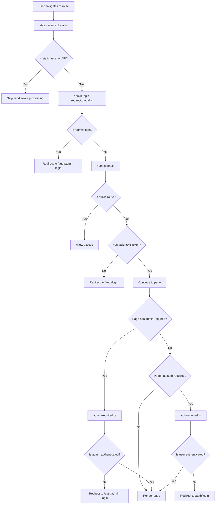
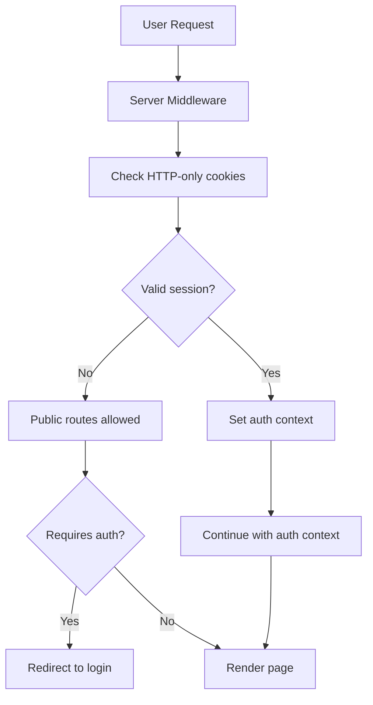

# Middleware Analysis Report

## Current Middleware Architecture

### Middleware Files Overview:
1. **admin-login-redirect.global.ts** - Global redirect middleware for old admin login routes
2. **admin-required.ts** - Page-specific admin authentication middleware  
3. **auth-required.ts** - Page-specific user authentication middleware
4. **auth.global.ts** - Global authentication middleware for all routes
5. **static-assets.global.ts** - Global middleware to skip processing for static assets

## Current Flow Diagram



## Current Issues

### 1. **Redundant Authentication Checks**
- `auth.global.ts` checks authentication globally
- `auth-required.ts` and `admin-required.ts` repeat similar checks
- Multiple localStorage calls and JWT decoding

### 2. **Inconsistent Token Storage**
- User auth: `auth_token` and `auth_user` in localStorage
- Admin auth: `admin_token` and `admin_user` in localStorage
- No secure HTTP-only cookie usage for sensitive tokens

### 3. **Client-Only Security**
- Authentication checks only run on client side
- Server-side protection is missing
- Security vulnerability for initial page loads

### 4. **Mixed Authentication Systems**
- Two separate authentication flows (user vs admin)
- Different token formats and validation
- Duplicated logic across composables

### 5. **Performance Issues**
- Multiple JWT decode operations
- Repeated localStorage access
- No caching of auth state

## Optimal Architecture Recommendations

### 1. **Unified Authentication System**



### 2. **Recommended Middleware Structure**

```typescript
// middleware/auth.global.ts
export default defineNuxtRouteMiddleware(async (to) => {
  // Server-side session validation
  const { data: session } = await $fetch('/api/auth/session')
  
  // Set auth state in Nuxt app context
  nuxtApp.$auth = session
  
  // Route protection logic
  if (requiresAuth(to.path) && !session) {
    return navigateTo('/auth/login')
  }
  
  if (requiresAdmin(to.path) && session?.role !== 'admin') {
    return navigateTo('/auth/admin-login')
  }
})
```

### 3. **Enhanced Security Features**

#### A. Server-Side Session Management
```typescript
// server/api/auth/session.get.ts
export default defineEventHandler(async (event) => {
  const token = getCookie(event, 'session-token')
  
  if (!token) return { user: null, authenticated: false }
  
  try {
    const decoded = jwt.verify(token, JWT_SECRET)
    return { 
      user: decoded.user, 
      authenticated: true,
      role: decoded.role 
    }
  } catch {
    deleteCookie(event, 'session-token')
    return { user: null, authenticated: false }
  }
})
```

#### B. Unified Auth Composable
```typescript
// composables/useAuth.ts
export const useAuth = () => {
  const { data: session, refresh } = await $fetch('/api/auth/session')
  
  return {
    user: computed(() => session?.user),
    isAuthenticated: computed(() => session?.authenticated),
    isAdmin: computed(() => session?.role === 'admin'),
    login: async (credentials) => {
      await $fetch('/api/auth/login', { method: 'POST', body: credentials })
      await refresh()
    },
    logout: async () => {
      await $fetch('/api/auth/logout', { method: 'POST' })
      await refresh()
    }
  }
}
```

### 4. **Performance Optimizations**

#### A. Session Caching
```typescript
// server/utils/session-cache.ts
const sessionCache = new Map()

export const getCachedSession = (token: string) => {
  const cached = sessionCache.get(token)
  if (cached && cached.expires > Date.now()) {
    return cached.session
  }
  return null
}

export const setCachedSession = (token: string, session: any, ttl = 300000) => {
  sessionCache.set(token, {
    session,
    expires: Date.now() + ttl
  })
}
```

#### B. Route-based Protection
```typescript
// middleware/route-protection.ts
const publicRoutes = ['/', '/about', '/contact', '/docs']
const adminRoutes = ['/admin']
const authRoutes = ['/dashboard', '/agents', '/deploy']

export const requiresAuth = (path: string) => 
  !publicRoutes.some(route => path.startsWith(route))

export const requiresAdmin = (path: string) => 
  adminRoutes.some(route => path.startsWith(route))
```

## Implementation Plan

### Phase 1: Security Enhancement
1. ✅ **Implement HTTP-only cookies for session storage**
2. ✅ **Add server-side session validation**
3. ✅ **Create unified authentication API endpoints**

### Phase 2: Middleware Optimization
1. **Consolidate authentication middleware into single global middleware**
2. **Remove redundant client-side checks**
3. **Implement session caching**

### Phase 3: Performance Improvements
1. **Add request-level session caching**
2. **Optimize JWT verification with caching**
3. **Implement proper session invalidation**

### Phase 4: Enhanced Features
1. **Add role-based permissions system**
2. **Implement session timeout handling**
3. **Add multi-factor authentication support**

## File Structure Changes Needed

```
middleware/
├── auth.global.ts           # Unified global auth middleware
├── static-assets.global.ts  # Keep as-is
└── utils/
    ├── route-protection.ts  # Route classification utilities
    └── session-cache.ts     # Session caching utilities

server/
└── api/
    └── auth/
        ├── session.get.ts   # Session validation endpoint
        ├── login.post.ts    # Unified login endpoint
        └── logout.post.ts   # Unified logout endpoint

composables/
└── useAuth.ts              # Unified auth composable
```

## Expected Benefits

1. **🔒 Enhanced Security**: Server-side validation, HTTP-only cookies
2. **⚡ Better Performance**: Reduced client-side checks, session caching  
3. **🧹 Cleaner Code**: Single source of truth for authentication
4. **🔧 Easier Maintenance**: Unified authentication system
5. **📊 Better UX**: Faster route transitions, proper loading states
