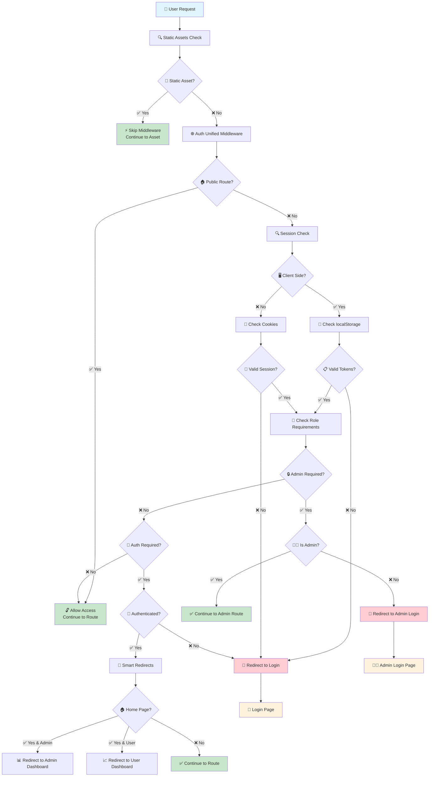
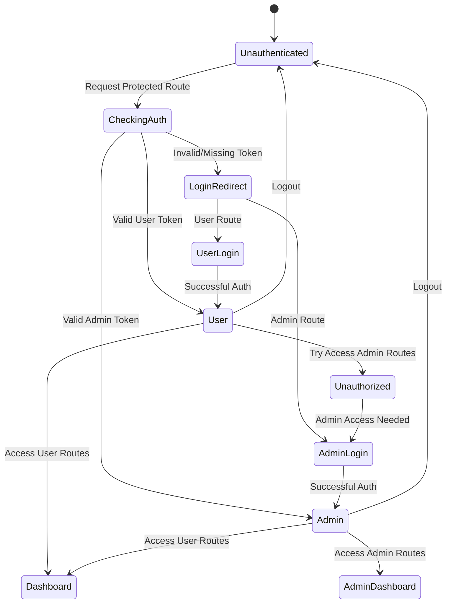
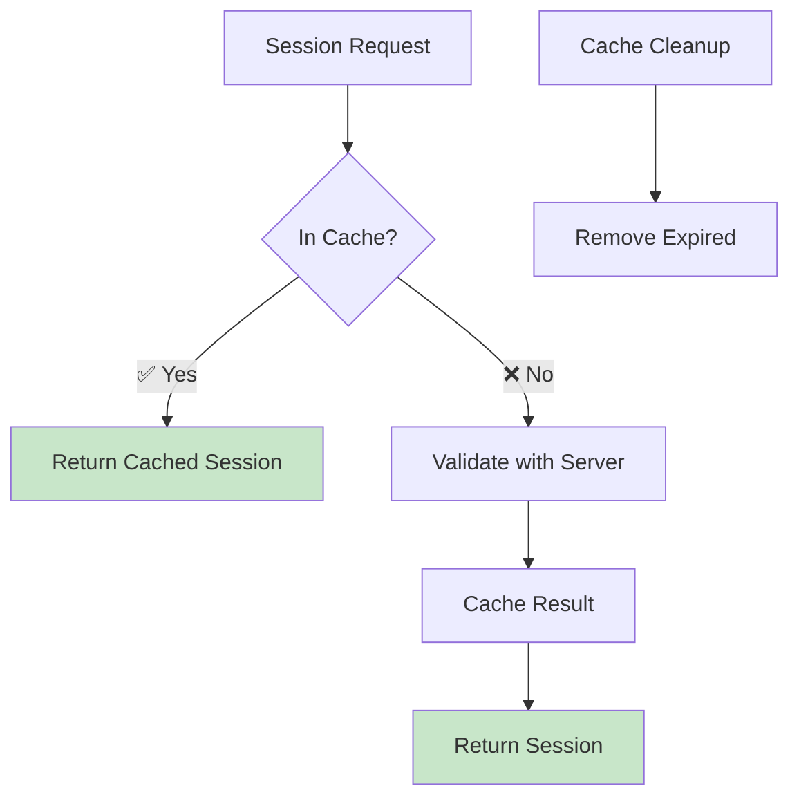
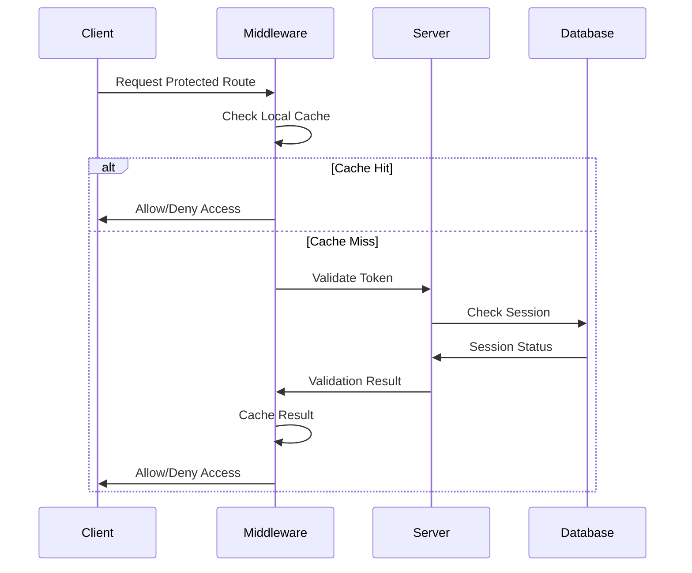
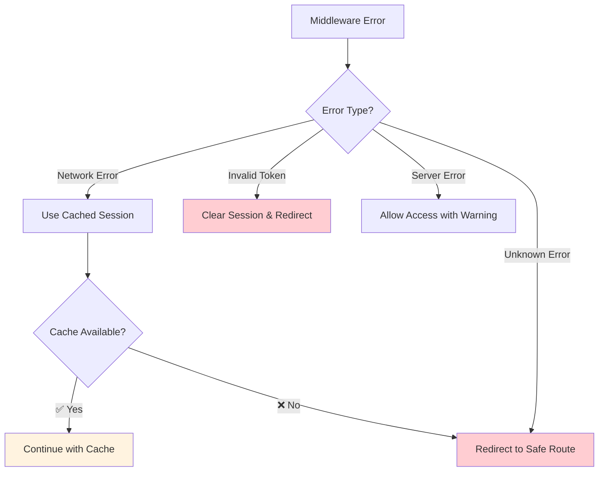
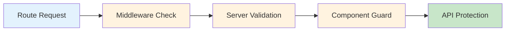
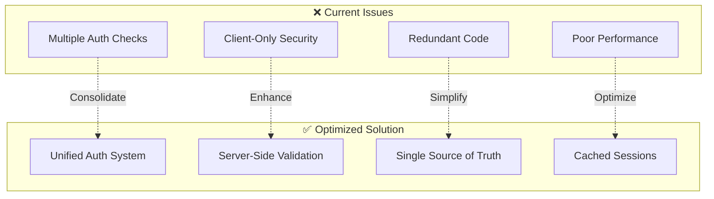

# Cloudless.gr Middleware Flow Architecture

## Complete Middleware Flow Diagram



## Detailed Middleware Priority Order

```mermaid
gantt
    title Middleware Execution Order
    dateFormat X
    axisFormat %L
    
    section Priority 1
    Static Assets     :1, 5
    
    section Priority 2
    Auth Unified      :6, 25
    
    section Priority 3
    Admin Redirect    :26, 30
    
    section Priority 4
    Admin Required    :31, 35
    
    section Priority 5
    Auth Required     :36, 40
```



## Route Classification Matrix

```mermaid
graph LR
    A[All Routes] --> B[🌐 Public Routes]
    A --> C[🔐 Protected Routes]
    A --> D[👑 Admin Routes]
    A --> E[📁 Static Assets]
    
    B --> B1[/ - Home]
    B --> B2[/about]
    B --> B3[/contact]
    B --> B4[/docs]
    B --> B5[/auth/*]
    
    C --> C1[/dashboard]
    C --> C2[/agents]
    C --> C3[/deploy]
    C --> C4[/builder]
    C --> C5[/workflows]
    
    D --> D1[/admin/*]
    
    E --> E1[/_nuxt/*]
    E --> E2[/api/*]
    E --> E3[/*.js,css,png...]
    
    style B fill:#c8e6c9
    style C fill:#fff3e0
    style D fill:#ffcdd2
    style E fill:#e3f2fd
```

## Authentication State Flow



## Middleware Implementation Details

### 1. Static Assets Middleware (Priority 1)
```typescript
// 05.static-assets.global.ts
export default defineNuxtRouteMiddleware((to) => {
  if (isStaticAsset(to.path)) {
    return // Skip all other middleware
  }
})
```

### 2. Unified Auth Middleware (Priority 2)
```typescript
// 02.auth-unified.global.ts
export default defineNuxtRouteMiddleware(async (to) => {
  // Skip static assets (already handled)
  if (isStaticAsset(to.path)) return
  
  // Allow public routes
  if (isPublicRoute(to.path)) return
  
  // Session validation & route protection
  const session = await validateSession()
  
  if (requiresAdmin(to.path) && !isAdmin(session)) {
    return navigateTo('/auth/admin-login')
  }
  
  if (requiresAuth(to.path) && !isAuthenticated(session)) {
    return navigateTo('/auth/login')
  }
})
```

### 3. Smart Redirect Logic
```typescript
// Auto-redirect authenticated users
if (to.path === '/' && session.authenticated) {
  return navigateTo(session.role === 'admin' ? '/admin/dashboard' : '/dashboard')
}

// Prevent authenticated users from accessing auth pages
if (to.path.startsWith('/auth/') && session.authenticated) {
  return navigateTo(getDefaultDashboard(session.role))
}
```

## Performance Optimizations

### Session Caching Strategy


### Token Validation Flow


## Error Handling & Fallbacks



## Security Considerations

### 1. **Server-Side Protection**
- HTTP-only cookies for sensitive tokens
- CSRF protection
- Rate limiting on auth endpoints

### 2. **Client-Side Resilience**
- Graceful fallbacks for network errors
- Secure token storage patterns
- Automatic session refresh

### 3. **Route Protection Layers**


## Migration Benefits

### Before vs After Comparison


## Implementation Checklist

- [x] **Static assets middleware** - Skip processing for assets
- [x] **Unified auth middleware** - Single authentication logic
- [x] **Route protection utilities** - Centralized route classification
- [x] **Session caching** - Performance optimization
- [ ] **Server-side session API** - HTTP-only cookie validation
- [ ] **Enhanced error handling** - Graceful fallbacks
- [ ] **Performance monitoring** - Middleware timing metrics
- [ ] **Security audit** - Penetration testing

This architecture provides a robust, scalable, and secure middleware system that follows Nuxt 3 best practices while maintaining excellent performance and user experience.
