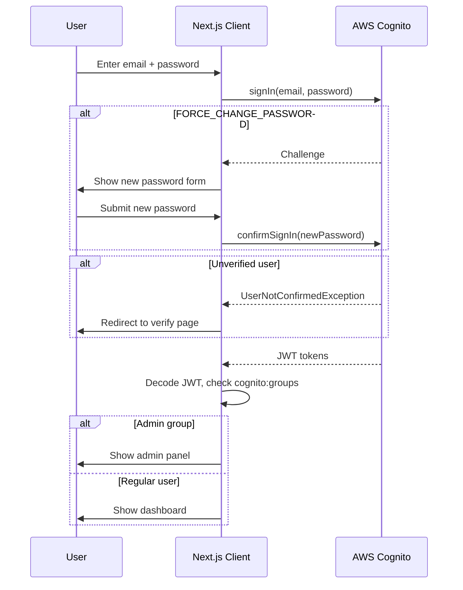
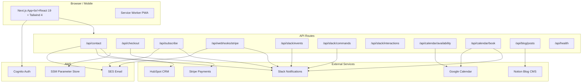
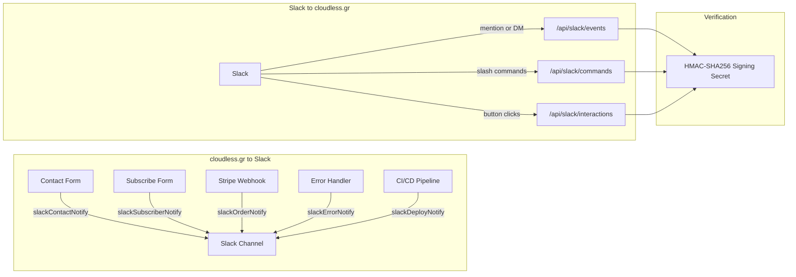

# Cloudless — cloudless.gr

Cloud computing, serverless development, data analytics, and AI-powered digital marketing for startups and SMBs.

Built with **Next.js 16**, **React 19**, **Tailwind CSS 4**, and **TypeScript**.

## Localization (i18n)

The app supports three locales with cookie-based switching:

- `en` — English (default, ~200+ translated keys)
- `el` — Greek (full translation)
- `fr` — French (UI-selectable, currently falls back to English strings)

Translation dictionaries live in `src/locales/en.json` and `src/locales/el.json`. The i18n system provides `translate(locale, key, fallback)` for strings and `translateArray(locale, key, fallback)` for array values. Server components use `getServerLocale()` from `src/lib/server-locale.ts`; client components use the `useCurrentLocale()` hook.

**Translated pages:** Homepage, Navbar, Footer, Contact, Login, Signup, Forgot Password, Dashboard, NewsletterForm, PWA install banner.

**Adding a new string:** Add the key to both `en.json` and `el.json`, then use `translate(locale, 'section.key', 'fallback')` in the component.

## Authentication



User authentication is powered by **AWS Cognito** via **Amplify v6**. The `AuthProvider` in `src/context/AuthContext.tsx` wraps the entire app and exposes sign-in, sign-up, sign-out, password reset, and admin detection through the `useAuth()` hook.

Key features of the auth system:

- Graceful configuration failure — if Cognito env vars are missing, the app sets a `configError` state instead of crashing.
- Friendly error messages — raw Cognito exceptions (e.g. `NotAuthorizedException`, `CodeMismatchException`) are mapped to plain-language strings via `friendlyAuthError()`.
- Sign-in edge case handling — `FORCE_CHANGE_PASSWORD` challenge, unverified users (`CONFIRM_SIGN_UP` → redirect to verify), and `UserAlreadyAuthenticatedException` (auto sign-out + retry) are all handled.
- Password manager support — all auth forms include `autoComplete` attributes (`email`, `current-password`, `new-password`, `one-time-code`).
- Admin detection — client-side via decoded JWT `cognito:groups` claim. Admin routes redirect non-admins to the dashboard.
- Route protection is client-side via layout guards in `/dashboard` and `/admin`.

## Architecture



The app uses the Next.js App Router with the following structure:

```
src/
├── app/                    # Pages & API routes (App Router)
│   ├── page.tsx            # Homepage — hero, services overview, CTA
│   ├── services/page.tsx   # Service offerings & pricing
│   ├── blog/               # Blog listing & [slug] detail pages
│   ├── store/              # E-commerce store, [id] detail, success page
│   ├── contact/page.tsx    # Contact form (AWS SES)
│   ├── auth/               # Authentication pages (Cognito)
│   │   ├── login/page.tsx       # Login with FORCE_CHANGE_PASSWORD support
│   │   ├── signup/page.tsx      # Two-step: signup form → email verification
│   │   └── forgot-password/page.tsx # Two-step: email → code + new password
│   ├── dashboard/          # Client dashboard (auth-protected)
│   ├── admin/              # Admin panel (admin-group-only)
│   ├── not-found.tsx       # Custom 404
│   └── api/
│       ├── contact/route.ts         # POST → AWS SES email
│       ├── checkout/route.ts        # POST → Stripe Checkout session
│       ├── subscribe/route.ts       # POST → SES + Slack subscriber notification
│       ├── webhooks/stripe/route.ts # Stripe webhook handler
│       └── slack/
│           ├── events/route.ts      # Slack Events API (mentions, DMs)
│           ├── commands/route.ts    # Slash commands (/cloudless-status, /cloudless-orders)
│           └── interactions/route.ts # Block Kit button clicks and modal submissions
├── components/             # Shared UI components
│   ├── Navbar.tsx
│   ├── Footer.tsx
│   ├── ScrollReveal.tsx
│   └── store/              # Cart button, slide-over, grid, add-to-cart
├── context/
│   ├── CartContext.tsx      # Shopping cart state (useReducer)
│   └── AuthContext.tsx      # Cognito auth state with friendly error mapping
└── lib/
    ├── amplify-config.ts   # Amplify v6 Cognito configuration (singleton)
    ├── ssm-config.ts       # AWS SSM Parameter Store config loader
    ├── integrations.ts     # Third-party integration config (Slack tokens)
    ├── stripe.ts           # Stripe client initialization
    ├── store-products.ts   # Demo product catalog
    ├── blog.ts             # Blog post data
    ├── email.ts            # Email helper (SES): order confirmation, team notifications
    ├── slack-notify.ts     # SlackClient with retry/backoff; Block Kit notifiers
    ├── slack-verify.ts     # Slack request signature verification (HMAC-SHA256)
    ├── i18n.ts             # Locale system with translate/translateArray
    ├── server-locale.ts    # Server-side locale reader (async cookies)
    └── use-locale.ts       # Client hook for locale switching
```

## Slack Integration



The app has a full two-way Slack integration. Last verified 2026-04-09 (56 unit tests, 12 integration tests — all pass).

**Outbound notifications** (cloudless.gr → Slack):
- `slackContactNotify` — fires on every contact form submission (fire-and-forget, parallel with HubSpot CRM upsert)
- `slackSubscriberNotify` — fires on every newsletter sign-up, in parallel with the SES email
- `slackOrderNotify` — fires on Stripe checkout completion with amount and session ID
- `slackErrorNotify` — surface unexpected API errors to your Slack channel
- `slackDeployNotify` — post deploy status from CI/CD

**Inbound endpoints** (Slack → cloudless.gr):
- `POST /api/slack/events` — Events API (app mentions, DMs)
- `POST /api/slack/commands` — Slash commands: `/cloudless-status`, `/cloudless-orders`
- `POST /api/slack/interactions` — Block Kit button clicks and modal submissions

All inbound requests are verified with HMAC-SHA256 using `SLACK_SIGNING_SECRET` before any payload is processed.

Required env vars (see `.env.local` for details):

| Variable | Purpose |
|----------|---------|
| `SLACK_BOT_TOKEN` | Bot OAuth token (`xoxb-...`) for sending messages and responding to events |
| `SLACK_SIGNING_SECRET` | Verifies all inbound requests from Slack |
| `SLACK_WEBHOOK_URL` | Incoming webhook URL (simpler alternative for outbound-only) |

Fu