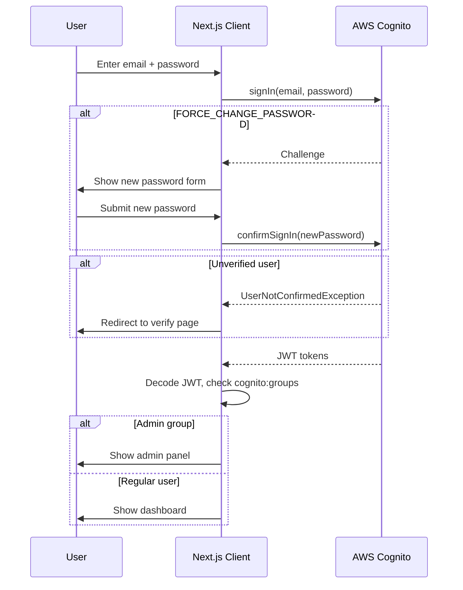
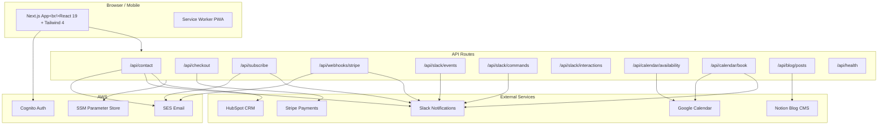
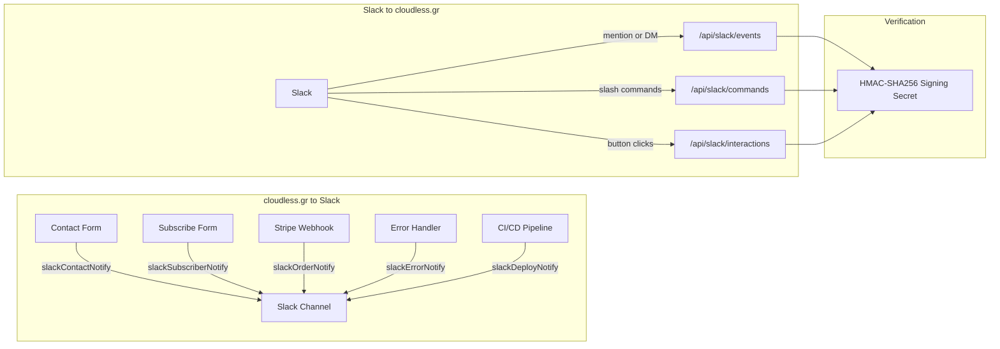
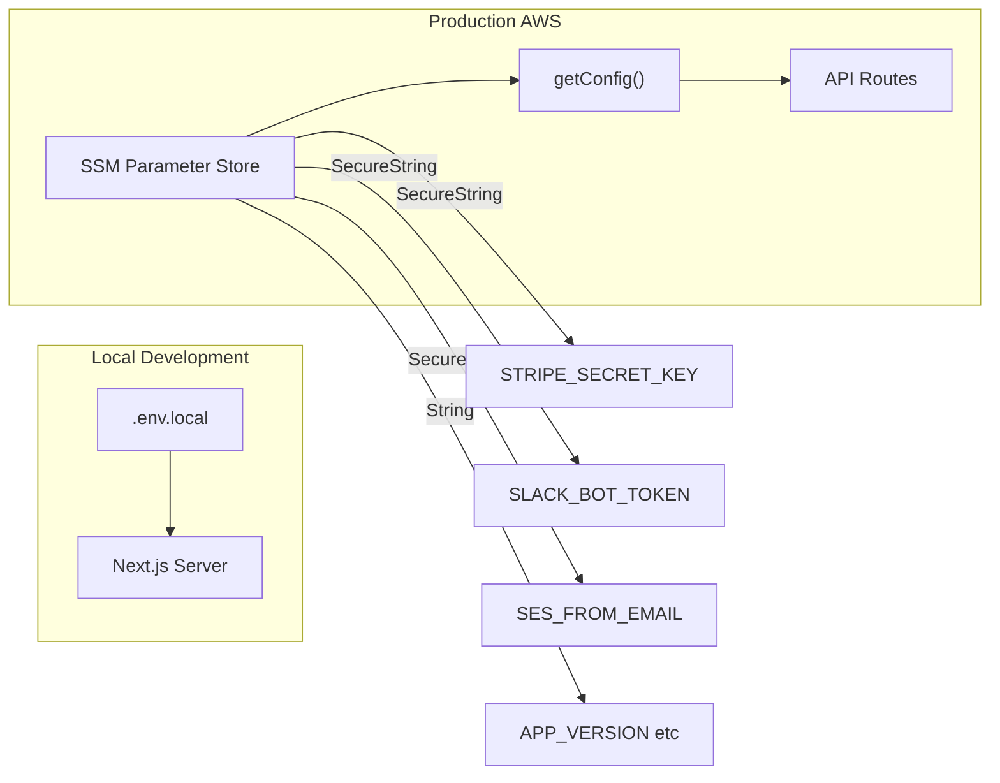

# Cloudless — cloudless.gr

Cloud computing, serverless development, data analytics, and AI-powered digital marketing for startups and SMBs.

Built with **Next.js 16**, **React 19**, **Tailwind CSS 4**, and **TypeScript**.

## Localization (i18n)

The app supports three locales with cookie-based switching:

- `en` — English (default, ~200+ translated keys)
- `el` — Greek (full translation)
- `fr` — French (UI-selectable, currently falls back to English strings)

Translation dictionaries live in `src/locales/en.json` and `src/locales/el.json`. The i18n system provides `translate(locale, key, fallback)` for strings and `translateArray(locale, key, fallback)` for array values. Server components use `getServerLocale()` from `src/lib/server-locale.ts`; client components use the `useCurrentLocale()` hook.

**Translated pages:** Homepage, Navbar, Footer, Contact, Login, Signup, Forgot Password, Dashboard, NewsletterForm, PWA install banner.

**Adding a new string:** Add the key to both `en.json` and `el.json`, then use `translate(locale, 'section.key', 'fallback')` in the component.

## Authentication



User authentication is powered by **AWS Cognito** via **Amplify v6**. The `AuthProvider` in `src/context/AuthContext.tsx` wraps the entire app and exposes sign-in, sign-up, sign-out, password reset, and admin detection through the `useAuth()` hook.

Key features of the auth system:

- Graceful configuration failure — if Cognito env vars are missing, the app sets a `configError` state instead of crashing.
- Friendly error messages — raw Cognito exceptions (e.g. `NotAuthorizedException`, `CodeMismatchException`) are mapped to plain-language strings via `friendlyAuthError()`.
- Sign-in edge case handling — `FORCE_CHANGE_PASSWORD` challenge, unverified users (`CONFIRM_SIGN_UP` → redirect to verify), and `UserAlreadyAuthenticatedException` (auto sign-out + retry) are all handled.
- Password manager support — all auth forms include `autoComplete` attributes (`email`, `current-password`, `new-password`, `one-time-code`).
- Admin detection — client-side via decoded JWT `cognito:groups` claim. Admin routes redirect non-admins to the dashboard.
- Route protection is client-side via layout guards in `/dashboard` and `/admin`.

## Architecture



The app uses the Next.js App Router with the following structure:

```
src/
├── app/                    # Pages & API routes (App Router)
│   ├── page.tsx            # Homepage — hero, services overview, CTA
│   ├── services/page.tsx   # Service offerings & pricing
│   ├── blog/               # Blog listing & [slug] detail pages
│   ├── store/              # E-commerce store, [id] detail, success page
│   ├── contact/page.tsx    # Contact form (AWS SES)
│   ├── auth/               # Authentication pages (Cognito)
│   │   ├── login/page.tsx       # Login with FORCE_CHANGE_PASSWORD support
│   │   ├── signup/page.tsx      # Two-step: signup form → email verification
│   │   └── forgot-password/page.tsx # Two-step: email → code + new password
│   ├── dashboard/          # Client dashboard (auth-protected)
│   ├── admin/              # Admin panel (admin-group-only)
│   ├── not-found.tsx       # Custom 404
│   └── api/
│       ├── contact/route.ts         # POST → AWS SES email
│       ├── checkout/route.ts        # POST → Stripe Checkout session
│       ├── subscribe/route.ts       # POST → SES + Slack subscriber notification
│       ├── webhooks/stripe/route.ts # Stripe webhook handler
│       └── slack/
│           ├── events/route.ts      # Slack Events API (mentions, DMs)
│           ├── commands/route.ts    # Slash commands (/cloudless-status, /cloudless-orders)
│           └── interactions/route.ts # Block Kit button clicks and modal submissions
├── components/             # Shared UI components
│   ├── Navbar.tsx
│   ├── Footer.tsx
│   ├── ScrollReveal.tsx
│   └── store/              # Cart button, slide-over, grid, add-to-cart
├── context/
│   ├── CartContext.tsx      # Shopping cart state (useReducer)
│   └── AuthContext.tsx      # Cognito auth state with friendly error mapping
└── lib/
    ├── amplify-config.ts   # Amplify v6 Cognito configuration (singleton)
    ├── ssm-config.ts       # AWS SSM Parameter Store config loader
    ├── integrations.ts     # Third-party integration config (Slack tokens)
    ├── stripe.ts           # Stripe client initialization
    ├── store-products.ts   # Demo product catalog
    ├── blog.ts             # Blog post data
    ├── email.ts            # Email helper (SES): order confirmation, team notifications
    ├── slack-notify.ts     # SlackClient with retry/backoff; Block Kit notifiers
    ├── slack-verify.ts     # Slack request signature verification (HMAC-SHA256)
    ├── i18n.ts             # Locale system with translate/translateArray
    ├── server-locale.ts    # Server-side locale reader (async cookies)
    └── use-locale.ts       # Client hook for locale switching
```

## Slack Integration



The app has a full two-way Slack integration. Last verified 2026-04-09 (56 unit tests, 12 integration tests — all pass).

**Outbound notifications** (cloudless.gr → Slack):
- `slackContactNotify` — fires on every contact form submission (fire-and-forget, parallel with HubSpot CRM upsert)
- `slackSubscriberNotify` — fires on every newsletter sign-up, in parallel with the SES email
- `slackOrderNotify` — fires on Stripe checkout completion with amount and session ID
- `slackErrorNotify` — surface unexpected API errors to your Slack channel
- `slackDeployNotify` — post deploy status from CI/CD

**Inbound endpoints** (Slack → cloudless.gr):
- `POST /api/slack/events` — Events API (app mentions, DMs)
- `POST /api/slack/commands` — Slash commands: `/cloudless-status`, `/cloudless-orders`
- `POST /api/slack/interactions` — Block Kit button clicks and modal submissions

All inbound requests are verified with HMAC-SHA256 using `SLACK_SIGNING_SECRET` before any payload is processed.

Required env vars (see `.env.local` for details):

| Variable | Purpose |
|----------|---------|
| `SLACK_BOT_TOKEN` | Bot OAuth token (`xoxb-...`) for sending messages and responding to events |
| `SLACK_SIGNING_SECRET` | Verifies all inbound requests from Slack |
| `SLACK_WEBHOOK_URL` | Incoming webhook URL (simpler alternative for outbound-only) |

Full setup instructions, ngrok local testing guide, and slash command reference: **[docs/SLACK.md](docs/SLACK.md)**

## Secrets Management



This project uses **no `.env` files** in production. All secrets are stored in **AWS SSM Parameter Store** under the path prefix `/cloudless/production/` and fetched at runtime via `src/lib/ssm-config.ts`.

Required SSM parameters:

| Parameter                | Type         | Description                   |
| ------------------------ | ------------ | ----------------------------- |
| `SES_FROM_EMAIL`         | String       | Verified SES sender address   |
| `SES_TO_EMAIL`           | String       | Contact form recipient        |
| `AWS_SES_REGION`         | String       | SES region (e.g. `us-east-1`) |
| `STRIPE_SECRET_KEY`      | SecureString | Stripe API secret key         |
| `STRIPE_PUBLISHABLE_KEY` | SecureString | Stripe publishable key        |
| `SLACK_BOT_TOKEN`        | SecureString | Slack bot OAuth token         |
| `SLACK_SIGNING_SECRET`   | SecureString | Slack request signing secret  |
| `SLACK_WEBHOOK_URL`      | SecureString | Slack incoming webhook URL    |

For local development, configure your AWS CLI with credentials that have `ssm:GetParametersByPath` permission.

## Getting Started

```bash
# Install dependencies
pnpm install

# Run the dev server (Turbopack)
pnpm dev

# Build for production
pnpm build

# Start production server
pnpm start
```

## Google Search Console (SEO)

The SEO integration in `src/lib/gsc.ts` uses the same Google service account already stored in SSM (`GOOGLE_CLIENT_EMAIL` + `GOOGLE_PRIVATE_KEY`) that powers Google Calendar.

### One-time setup

1. Enable the **Google Search Console API** in your GCP project.
2. In the GSC web UI go to **Settings → Users and permissions → Add user**: paste your service account email and set the role to **Full**.
3. Verify the property (`https://cloudless.gr/`) — the HTML meta tag method is already deployed.

### Exported API

| Function | Description |
|---|---|
| `getSeoSnapshot(siteUrl?)` | 28-day aggregate: clicks, impressions, CTR %, avg position, keyword count |
| `getTopKeywords(siteUrl?, limit?)` | Top N keywords by clicks |
| `getPerformanceHistory(siteUrl?, weeks?)` | Daily data for trend charts (default: 12 weeks) |
| `getTopPages(siteUrl?, limit?)` | Top pages by clicks |
| `getWebAnalytics(siteUrl?)` | Totals + top pages combined (used as analytics proxy) |
| `getCtrOpportunities(siteUrl?, limit?)` | Keywords ranking 4-20 with high impressions but CTR below 5% |
| `getDeviceBreakdown(siteUrl?)` | Traffic split by device type (DESKTOP, MOBILE, TABLET) |
| `getProductPageMetrics(siteUrl?, urlPattern?, limit?)` | Page metrics filtered by URL pattern (default: `/store/`) |
| `getQueryPageMapping(siteUrl?, limit?)` | Query-to-page relationships for keyword cannibalization detection |
| `getSearchIntentBreakdown(siteUrl?)` | Keywords grouped by intent: brand, product, informational, navigational |
| `getTrafficByCountry(siteUrl?, limit?)` | Organic traffic breakdown by country (ISO 3166-1 alpha-3) |

All functions return `null` / `[]` on error — they never throw — so dashboard widgets degrade gracefully.

### Admin API routes

| Route | Source | Notes |
|---|---|---|
| `GET /api/admin/analytics/seo` | GSC | Snapshot + top 20 keywords |
| `GET /api/admin/analytics/keywords?limit=N` | GSC | Top keywords, `limit` max 100 |
| `GET /api/admin/analytics/pages?limit=N` | GSC | Top pages, `limit` max 100 |
| `GET /api/admin/analytics/history?weeks=N` | GSC | Daily history, `weeks` max 52 |
| `GET /api/admin/analytics/ctr-opportunities?limit=N` | GSC | CTR optimization opportunities, `limit` max 200 |
| `GET /api/admin/analytics/devices` | GSC | Traffic breakdown by device type |
| `GET /api/admin/analytics/products?limit=N&pattern=…` | GSC | Product page metrics, `limit` max 100, `pattern` default `/store/` |
| `GET /api/admin/analytics/query-pages?limit=N` | GSC | Query-to-page mappings, `limit` max 500 |
| `GET /api/admin/analytics/search-intent` | GSC | Keywords grouped by search intent with bucket counts |
| `GET /api/admin/analytics/countries?limit=N` | GSC | Traffic by country, `limit` max 50 |

All GSC routes require admin JWT and return `503` when `GOOGLE_CLIENT_EMAIL` or `GOOGLE_PRIVATE_KEY` are absent from SSM.

### Weekly digest

A scheduled task (`scripts/weekly-seo-digest.ts`) posts a formatted SEO snapshot to Slack `#general` every Monday. Run manually with:

```bash
npx tsx scripts/weekly-seo-digest.ts
```

## Testing

Tests use **Vitest** + **React Testing Library** with jsdom, and **Playwright** for E2E.

```bash
# Run unit tests in watch mode
pnpm test

# Run unit tests once (CI)
pnpm test:ci

# Run E2E tests
npx playwright test

# Run E2E with visible browser
npx playwright test --headed
```

Unit test files live in `__tests__/` — key test modules:

| File | Coverage |
|---|---|
| `__tests__/admin-api.test.ts` | All `/api/admin/**` routes: auth, 503 on missing config, response shape |
| `__tests__/gsc.test.ts` | `src/lib/gsc.ts` — all 11 exported functions, success + error paths |
| `__tests__/hubspot-crm.test.ts` | `getPipelines`, `listCompanies`, `listDeals`, `listOwners` |
| `__tests__/contact-api.test.ts` | `POST /api/contact` |
| `e2e/*.spec.ts` | Full browser flows via Playwright |

## Brand Identity

The visual identity uses a navy/electric-blue/cyan palette with Instrument Sans for headings and Work Sans for body text. Full brand guidelines are in the `brand/` directory.

## CI/CD

GitHub Actions workflows in `.github/workflows/`:

- **deploy.yml** — Builds and deploys to AWS Amplify on push to `main`
- **lighthouse.yml** — Runs Lighthouse audits on PRs against key pages
- **pr-labeler.yml** — Auto-labels PRs by size and file paths
- **stale.yml** — Marks and closes stale issues/PRs

## Deployment

The app deploys to **AWS Amplify**. The deployment workflow handles build and deploy automatically on push to `main`. Production IAM role needs `ssm:GetParametersByPath` and `ses:SendEmail` permissions.

## Git Line Endings

This repository enforces LF line endings for text files via `.gitattributes`:

- `* text=auto eol=lf`
- `*.bat`, `*.cmd`, `*.ps1` are kept as CRLF

This avoids noisy `LF will be replaced by CRLF` warnings and keeps diffs stable across Windows/WSL environments.

## Tech Stack

- Next.js 16.2.3 (App Router, Turbopack)
- React 19.2.4
- TypeScript 5
- Tailwind CSS 4
- AWS Cognito + Amplify v6 (authentication)
- AWS SES (transactional email)
- AWS SSM Parameter Store (secrets)
- Stripe (checkout & payments)
- Vitest + React Testing Library (140+ tests)
