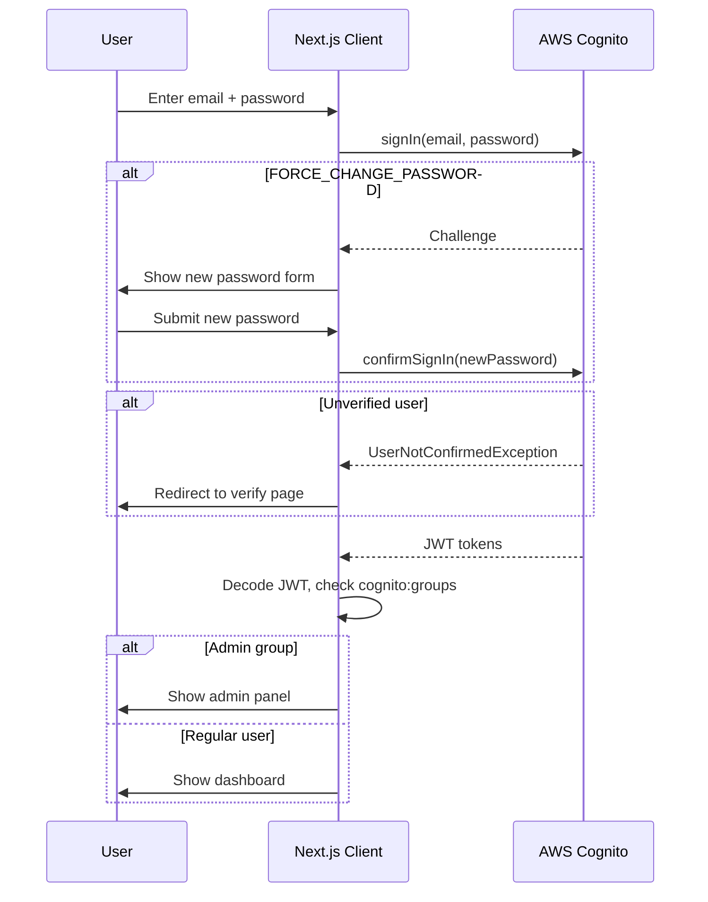
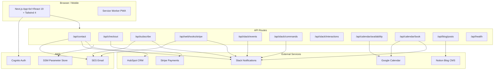
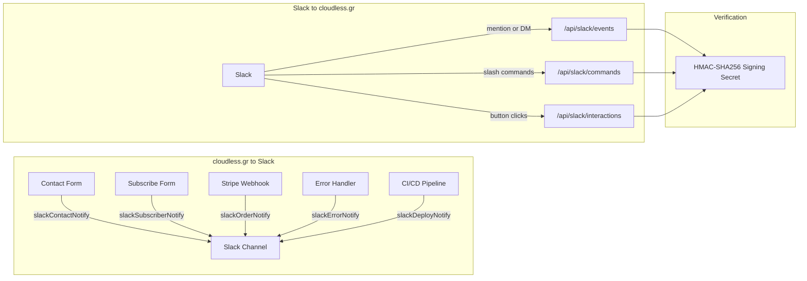
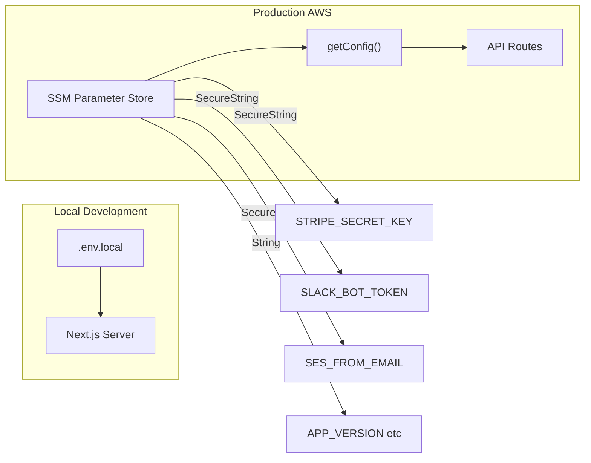

# Cloudless — cloudless.gr

Cloud computing, serverless development, data analytics, and AI-powered digital marketing for startups and SMBs.

Built with **Next.js 16**, **React 19**, **Tailwind CSS 4**, and **TypeScript**.

## Localization (i18n)

The app supports four locales with cookie-based switching:

- `en` — English (default)
- `el` — Greek (full translation)
- `fr` — French (full translation)
- `de` — German (full translation)

Translation dictionaries live in `src/locales/en.json` and `src/locales/el.json`. The i18n system provides `translate(locale, key, fallback)` for strings and `translateArray(locale, key, fallback)` for array values. Server components use `getServerLocale()` from `src/lib/server-locale.ts`; client components use the `useCurrentLocale()` hook.

**Translated pages:** Homepage, Navbar, Footer, Contact, Login, Signup, Forgot Password, Dashboard, NewsletterForm, PWA install banner.

**Adding a new string:** Add the key to both `en.json` and `el.json`, then use `translate(locale, 'section.key', 'fallback')` in the component.

## Authentication



User authentication is powered by **AWS Cognito** via **Amplify v6**. The `AuthProvider` in `src/context/AuthContext.tsx` wraps the entire app and exposes sign-in, sign-up, sign-out, password reset, and admin detection through the `useAuth()` hook.

Key features of the auth system:

- Graceful configuration failure — if Cognito env vars are missing, the app sets a `configError` state instead of crashing.
- Friendly error messages — raw Cognito exceptions (e.g. `NotAuthorizedException`, `CodeMismatchException`) are mapped to plain-language strings via `friendlyAuthError()`.
- Sign-in edge case handling — `FORCE_CHANGE_PASSWORD` challenge, unverified users (`CONFIRM_SIGN_UP` → redirect to verify), and `UserAlreadyAuthenticatedException` (auto sign-out + retry) are all handled.
- Password manager support — all auth forms include `autoComplete` attributes (`email`, `current-password`, `new-password`, `one-time-code`).
- Admin detection — client-side via decoded JWT `cognito:groups` claim. Admin routes redirect non-admins to the dashboard.
- Route protection is **server-side** via `src/proxy.ts` middleware (all unauthenticated requests to `/dashboard` and `/admin` are redirected to login before the page renders) and additionally client-side via layout guards. Locale-prefixed routes (e.g. `/en/dashboard`, `/el/admin/orders`) are normalized before authorization checks.
- Dashboard settings theme preference (`dark`/`light`/`system`) is now applied at runtime to `<html data-theme="...">` for signed-in users, with admin routes pinned to dark mode.
- JWT hardening — `verifyToken` in `src/lib/api-auth.ts` enforces `issuer`, `audience` (Cognito client ID), and `token_use: "id"` claims so only ID tokens issued for this app are accepted.

## Architecture



The app uses the Next.js App Router with the following structure:

```
src/
├── app/                    # Pages & API routes (App Router)
│   ├── page.tsx            # Homepage — hero, services overview, CTA
│   ├── services/page.tsx   # Service offerings & pricing
│   ├── blog/               # Blog listing & [slug] detail pages
│   ├── store/              # E-commerce store, [id] detail, success page
│   ├── contact/page.tsx    # Contact form (AWS SES)
│   ├── auth/               # Authentication pages (Cognito)
│   │   ├── login/page.tsx       # Login with FORCE_CHANGE_PASSWORD support
│   │   ├── signup/page.tsx      # Two-step: signup form → email verification
│   │   └── forgot-password/page.tsx # Two-step: email → code + new password
│   ├── dashboard/          # Client dashboard (auth-protected)
│   ├── admin/              # Admin panel (admin-group-only)
│   ├── not-found.tsx       # Custom 404
│   └── api/
│       ├── contact/route.ts         # POST → AWS SES email
│       ├── checkout/route.ts        # POST → Stripe Checkout session
│       ├── subscribe/route.ts       # POST → SES + Slack subscriber notification
│       ├── webhooks/stripe/route.ts # Stripe webhook handler
│       └── slack/
│           ├── events/route.ts      # Slack Events API (mentions, DMs)
│           ├── commands/route.ts    # Slash commands (/cloudless-status, /cloudless-orders)
│           └── interactions/route.ts # Block Kit button clicks and modal submissions
├── components/             # Shared UI components
│   ├── Navbar.tsx
│   ├── Footer.tsx
│   ├── ScrollReveal.tsx
│   └── store/              # Cart button, slide-over, grid, add-to-cart
├── context/
│   ├── CartContext.tsx      # Shopping cart state (useReducer)
│   └── AuthContext.tsx      # Cognito auth state with friendly error mapping
└── lib/
    ├── amplify-config.ts   # Amplify v6 Cognito configuration (singleton)
    ├── ssm-config.ts       # AWS SSM Parameter Store config loader
    ├── integrations.ts     # Third-party integration config (Slack tokens)
    ├── stripe.ts           # Stripe client initialization
    ├── store-products.ts   # Demo product catalog
    ├── blog.ts             # Blog post data
    ├── email.ts            # Email helper (SES): order confirmation, team notifications
    ├── slack-notify.ts     # SlackClient with retry/backoff; Block Kit notifiers
    ├── slack-verify.ts     # Slack request signature verification (HMAC-SHA256)
    ├── i18n.ts             # Locale system with translate/translateArray
    ├── server-locale.ts    # Server-side locale reader (async cookies)
    └── use-locale.ts       # Client hook for locale switching
```

## Slack Integration



The app has a full two-way Slack integration. Last verified 2026-04-09 (56 unit tests, 12 integration tests — all pass).

**Outbound notifications** (cloudless.gr → Slack):
- `slackContactNotify` — fires on every contact form submission (fire-and-forget, parallel with HubSpot CRM upsert)
- `slackSubscriberNotify` — fires on every newsletter sign-up, in parallel with the SES email
- `slackOrderNotify` — fires on Stripe checkout completion with amount and session ID
- `slackErrorNotify` — surface unexpected API errors to your Slack channel
- `slackDeployNotify` — post deploy status from CI/CD

**Inbound endpoints** (Slack → cloudless.gr):
- `POST /api/slack/events` — Events API (app mentions, DMs)
- `POST /api/slack/commands` — Slash commands: `/cloudless-status`, `/cloudless-orders`
- `POST /api/slack/interactions` — Block Kit button clicks and modal submissions

All inbound requests are verified with HMAC-SHA256 using `SLACK_SIGNING_SECRET` before any payload is processed.

Required env vars (see `.env.local` for details):

| Variable | Purpose |
|----------|---------|
| `SLACK_BOT_TOKEN` | Bot OAuth token (`xoxb-...`) for sending messages and responding to events |
| `SLACK_SIGNING_SECRET` | Verifies all inbound requests from Slack |
| `SLACK_WEBHOOK_URL` | Incoming webhook URL (simpler alternative for outbound-only) |

Full setup instructions, ngrok local testing guide, and slash command reference: **[docs/SLACK.md](docs/SLACK.md)**

## Secrets Management



This project uses **no `.env` files** in production. All secrets are stored in **AWS SSM Parameter Store** under the path prefix `/cloudless/production/` and fetched at runtime via `src/lib/ssm-config.ts`.

### How `ssm-config.ts` works

- `SSM_PREFIX` uses `||` (not `??`) so an empty string falls back to `/cloudless/production` and never fetches from the SSM root.
- A module-level singleton `SSMClient` avoids re-creating the connection pool on every 5-min cache refresh.
- On transient SSM failure, `getConfig()` serves the last known good (stale) cache instead of crashing all in-flight requests. If there is no prior cache, it throws so Lambda reports a cold-start failure.
- `NODE_ENV=test` short-circuits SSM entirely and reads from `process.env` (unit tests never touch AWS).

### Required SSM parameters (startup validation)

`getConfig()` throws on startup if any of these are missing:

| Parameter | Type | Description |
|---|---|---|
| `STRIPE_SECRET_KEY` | SecureString | Stripe API secret key |
| `STRIPE_WEBHOOK_SECRET` | SecureString | Stripe webhook signature secret |
| `COGNITO_USER_POOL_ID` | String | Cognito pool for JWT verification |
| `COGNITO_CLIENT_ID` | String | Cognito app client for JWT `aud` check |

### All SSM parameters

| Parameter                | Type         | Description                   |
| ------------------------ | ------------ | ----------------------------- |
| `SES_FROM_EMAIL`         | String       | Verified SES sender address   |
| `SES_TO_EMAIL`           | String       | Contact form recipient        |
| `AWS_SES_REGION`         | String       | SES region (e.g. `us-east-1`) |
| `STRIPE_SECRET_KEY`      | SecureString | Stripe API secret key         |
| `STRIPE_PUBLISHABLE_KEY` | SecureString | Stripe publishable key        |
| `STRIPE_WEBHOOK_SECRET`  | SecureString | Stripe webhook signature       |
| `COGNITO_USER_POOL_ID`   | String       | Cognito pool ID               |
| `COGNITO_CLIENT_ID`      | String       | Cognito app client ID         |
| `SLACK_BOT_TOKEN`        | SecureString | Slack bot OAuth token         |
| `SLACK_SIGNING_SECRET`   | SecureString | Slack request signing secret  |
| `SLACK_WEBHOOK_URL`      | SecureString | Slack incoming webhook URL    |
| `GOOGLE_CLIENT_EMAIL`    | String       | Google service account email  |
| `GOOGLE_PRIVATE_KEY`     | SecureString | Google service account key    |
| `NOTION_API_KEY`         | SecureString | Notion integration token      |
| `ANTHROPIC_API_KEY`      | SecureString | Claude AI API key             |
| _(+ all other integration keys in `AppConfig`)_ | | |

For local development, configure your AWS CLI with credentials that have `ssm:GetParametersByPath` permission on `/cloudless/production/*`.

### SSM as data store (separate from secrets)

Some features use SSM as a mutable JSON blob store for app state, separate from the secrets config:

| Key | Purpose |
|---|---|
| `/cloudless/PENDING_CLIENTS_JSON` | Client signup queue (`pending-clients.ts`) |
| `/cloudless/AB_FLAGS_JSON` | A/B test flag state (`admin/ab-tests`) |
| `/cloudless/CLIENT_PORTALS_JSON` | Portal token registry |
| `/cloudless/WORKSPACES_JSON` | Workspace config |

## Transactional Email (SES)

All outbound email uses **AWS SES v2** (`@aws-sdk/client-sesv2`) via `src/lib/email.ts`.

| Function | Trigger | Notes |
|---|---|---|
| `sendEmail()` | Base helper | Accepts optional `listUnsubscribeUrl` → adds RFC 8058 `List-Unsubscribe` + `List-Unsubscribe-Post` headers |
| `notifyTeam()` | Contact form, orders, subscribe, unsubscribe | Sends to `SES_TO_EMAIL` (from SSM) |
| `sendOrderConfirmation()` | Stripe `checkout.session.completed` | Sent to customer |
| `sendPaymentFailureNotice()` | Stripe `invoice.payment_failed` | Sent to customer |
| `sendSubscriberWelcome()` | Newsletter signup | Sent to subscriber with `List-Unsubscribe` header |

### Unsubscribe

Two endpoints handle opt-outs, both rate-limited to **5 requests / IP / minute**:

- `POST /api/unsubscribe` — JSON `{ email }`, used by the settings UI
- `GET /api/unsubscribe?email=…` — one-click link included in all subscriber emails (`List-Unsubscribe` header)

Both call `addToSuppressionList()` in `src/lib/ses-suppression.ts`, which adds the address to the SES account-level suppression list via `PutSuppressedDestinationCommand`. SES will reject all future sends to suppressed addresses at the infrastructure level.

### Reliability notes

- `POST /api/subscribe` sends both SES emails in `Promise.all()` — if either fails the subscriber gets a 500 and can retry. Slack notification is fire-and-forget and never fails the request.
- `sendEmail()` swallows AWS SDK XML parse errors on HTTP 200 responses (known SDK quirk where a successful send throws a deserialization error).
- No `.env` files in production — all SES credentials (`SES_FROM_EMAIL`, `SES_TO_EMAIL`, `AWS_SES_REGION`) are loaded from SSM at runtime.

## Stripe (Store, Checkout, Webhooks)

All Stripe operations use a lazy singleton from `src/lib/stripe.ts` (`getStripe()`) initialized once from SSM and reused across warm Lambda instances.

### Checkout (`POST /api/checkout`)

- Server-side price resolution only — client-submitted prices are ignored; all amounts come from the internal product catalog.
- Quantity clamped to 1-99.
- Origin validated against an allowlist to prevent open redirect on `success_url`/`cancel_url`.
- If the user is authenticated (Bearer token in `Authorization` header), the checkout session is pre-filled with `customer_email` and `metadata.userId` to link the Stripe order to the Cognito account.
- Every session includes `metadata.source = "cloudless.gr"` for tracing.

### Webhook (`POST /api/webhooks/stripe`)

- Signature verified via `stripe.webhooks.constructEvent()` (HMAC-SHA256) before any processing — returns 400 on failure.
- Webhook secret loaded exclusively from SSM (`STRIPE_WEBHOOK_SECRET`) — no env var fast-path.
- `checkout.session.completed`: order confirmation email sent only when `payment_status === "paid"` OR `mode === "subscription"`. One-time payments with `payment_status !== "paid"` (e.g. async bank transfers still pending) do not trigger the email.
- `invoice.payment_failed`: sends failure notice to customer + team alert.
- HubSpot contact upsert + deal creation runs fire-and-forget after `checkout.session.completed`.
- Sentry `captureException` and `flush` called on handler errors before Lambda returns.

### User purchases (`GET /api/user/purchases`)

Requires JWT auth. Looks up the Stripe customer by email, then returns checkout sessions and subscriptions. Falls back to a session scan filtered by email if no Stripe customer record exists yet.

## Notion (Blog CMS, Docs, Forms, Projects, Analytics)

All Notion operations use `src/lib/notion.ts` — a thin fetch wrapper that calls `getIntegrationsAsync()` for the API key on every request (no module-level secret capture).

### Webhook (`POST /api/webhooks/notion`)

- Shared secret verified via `x-webhook-secret` header using `crypto.timingSafeEqual` (timing-safe) before any payload is parsed. Secret loaded from SSM (`NOTION_WEBHOOK_SECRET`) via `getConfig()`.
- Missing or incorrect secret returns 401; invalid JSON returns 400.
- Supported event types and their effects:

| Event type | Effect |
|---|---|
| `page.updated` | Invalidates blog/docs cache, revalidates ISR paths + sitemap |
| `page.created` | Same revalidation + optional Slack notify for new docs |
| `submission.status` | Sends "inquiry reviewed" email to submitter when `status === "Done"` |
| `project.updated` | Slack alert on `Completed` or `Blocked` |
| `task.updated` | Slack alert on `Blocked` |
| `analytics.event` | Slack alert when error count >= 10 |

### Calendar persistence (`src/lib/notion-calendar.ts`)

Persists content calendar items to `NOTION_CALENDAR_DB_ID`. Reads config from `getIntegrationsAsync()` (env + SSM merged). Respects explicit `NOTION_CALENDAR_DB_ID = ""` env-var clears (disables integration without clearing SSM cache).

### Reports persistence (`src/lib/notion-reports.ts`)

Same pattern as calendar, uses `NOTION_REPORTS_DB_ID`.

## Getting Started

```bash
# Install dependencies
pnpm install

# Run the dev server (Turbopack)
pnpm dev

# Build for production
pnpm build

# Start production server
pnpm start
```

## Google Search Console (SEO)

The SEO integration in `src/lib/gsc.ts` uses the same Google service account already stored in SSM (`GOOGLE_CLIENT_EMAIL` + `GOOGLE_PRIVATE_KEY`) that powers Google Calendar.

### One-time setup

1. Enable the **Google Search Console API** in your GCP project.
2. In the GSC web UI go to **Settings → Users and permissions → Add user**: paste your service account email and set the role to **Full**.
3. Verify the property (`https://cloudless.gr/`) — the HTML meta tag method is already deployed.

### Exported API

| Function | Description |
|---|---|
| `getSeoSnapshot(siteUrl?)` | 28-day aggregate: clicks, impressions, CTR %, avg position, keyword count |
| `getTopKeywords(siteUrl?, limit?)` | Top N keywords by clicks |
| `getPerformanceHistory(siteUrl?, weeks?)` | Daily data for trend charts (default: 12 weeks) |
| `getTopPages(siteUrl?, limit?)` | Top pages by clicks |
| `getWebAnalytics(siteUrl?)` | Totals + top pages combined (used as analytics proxy) |
| `getCtrOpportunities(siteUrl?, limit?)` | Keywords ranking 4-20 with high impressions but CTR below 5% |
| `getDeviceBreakdown(siteUrl?)` | Traffic split by device type (DESKTOP, MOBILE, TABLET) |
| `getProductPageMetrics(siteUrl?, urlPattern?, limit?)` | Page metrics filtered by URL pattern (default: `/store/`) |
| `getQueryPageMapping(siteUrl?, limit?)` | Query-to-page relationships for keyword cannibalization detection |
| `getSearchIntentBreakdown(siteUrl?)` | Keywords grouped by intent: brand, product, informational, navigational |
| `getTrafficByCountry(siteUrl?, limit?)` | Organic traffic breakdown by country (ISO 3166-1 alpha-3) |

All functions return `null` / `[]` on error — they never throw — so dashboard widgets degrade gracefully.

### Admin API routes

| Route | Source | Notes |
|---|---|---|
| `GET /api/admin/analytics/seo` | GSC | Snapshot + top 20 keywords |
| `GET /api/admin/analytics/keywords?limit=N` | GSC | Top keywords, `limit` max 100 |
| `GET /api/admin/analytics/pages?limit=N` | GSC | Top pages, `limit` max 100 |
| `GET /api/admin/analytics/history?weeks=N` | GSC | Daily history, `weeks` max 52 |
| `GET /api/admin/analytics/ctr-opportunities?limit=N` | GSC | CTR optimization opportunities, `limit` max 200 |
| `GET /api/admin/analytics/devices` | GSC | Traffic breakdown by device type |
| `GET /api/admin/analytics/products?limit=N&pattern=…` | GSC | Product page metrics, `limit` max 100, `pattern` default `/store/` |
| `GET /api/admin/analytics/query-pages?limit=N` | GSC | Query-to-page mappings, `limit` max 500 |
| `GET /api/admin/analytics/search-intent` | GSC | Keywords grouped by search intent with bucket counts |
| `GET /api/admin/analytics/countries?limit=N` | GSC | Traffic by country, `limit` max 50 |

All GSC routes require admin JWT and return `503` when `GOOGLE_CLIENT_EMAIL` or `GOOGLE_PRIVATE_KEY` are absent from SSM.

### Weekly digest

A scheduled task (`scripts/weekly-seo-digest.ts`) posts a formatted SEO snapshot to Slack `#general` every Monday. Run manually with:

```bash
npx tsx scripts/weekly-seo-digest.ts
```

## Testing

Tests use **Vitest** + **React Testing Library** with jsdom, and **Playwright** for E2E.

```bash
# Run unit tests in watch mode
pnpm test

# Run unit tests once (CI)
pnpm test:ci

# Run E2E tests
npx playwright test

# Run E2E with visible browser
npx playwright test --headed
```

Unit test files live in `__tests__/` (99 suites, 1164 tests) — key modules:

| File | Coverage |
|---|---|
| `__tests__/admin-api.test.ts` | All `/api/admin/**` routes: auth, 503 on missing config, response shape |
| `__tests__/gsc.test.ts` | `src/lib/gsc.ts` — all 11 exported functions, success + error paths |
| `__tests__/hubspot-crm.test.ts` | `getPipelines`, `listCompanies`, `listDeals`, `listOwners` |
| `__tests__/contact-api.test.ts` | `POST /api/contact` |
| `__tests__/subscribe-api.test.ts` | `POST /api/subscribe` — SES + Slack + validation |
| `__tests__/notion-*.test.ts` | All Notion lib modules |
| `__tests__/store-components.test.tsx` | Cart, store grid, add-to-cart |
| `__tests__/locales-parity.test.ts` | All four locale files have matching keys |
| `e2e/*.spec.ts` | Full browser flows via Playwright + axe-core accessibility |

## Brand Identity

The visual identity uses a navy/electric-blue/cyan palette with Instrument Sans for headings and Work Sans for body text. Full brand guidelines are in the `brand/` directory.

## CI/CD

GitHub Actions workflows in `.github/workflows/`:

- **deploy.yml** — Builds and deploys to AWS Amplify on push to `main`
- **lighthouse.yml** — Runs Lighthouse audits on PRs against key pages
- **pr-labeler.yml** — Auto-labels PRs by size and file paths
- **stale.yml** — Marks and closes stale issues/PRs

## Deployment

The app deploys to **AWS Amplify**. The deployment workflow handles build and deploy automatically on push to `main`. Production IAM role needs `ssm:GetParametersByPath` and `ses:SendEmail` permissions.

## Git Line Endings

This repository enforces LF line endings for text files via `.gitattributes`:

- `* text=auto eol=lf`
- `*.bat`, `*.cmd`, `*.ps1` are kept as CRLF

This avoids noisy `LF will be replaced by CRLF` warnings and keeps diffs stable across Windows/WSL environments.

## Tech Stack

- Next.js 16.2.4 (App Router, Turbopack)
- React 19.2.4
- TypeScript 5
- Tailwind CSS 4
- AWS Cognito + Amplify v6 (authentication)
- AWS SES v2 (transactional email — contact, orders, newsletter, portal approvals)
- AWS SSM Parameter Store (secrets)
- Stripe (checkout & payments)
- Vitest + React Testing Library (1164 tests)

## Project MCP Configuration

The workspace MCP config lives in `mcp.json`. Three servers are configured:

| Server | Package | Purpose |
|--------|---------|---------|
| `project` | `project-mcp` | Project context for Claude Code |
| `mcp-tool-shop` | `mcp-tool-shop` | Additional Claude Code tools |
| `notion` | `@notionhq/notion-mcp-server` | Direct Notion API access (uses `NOTION_API_KEY`) |

All servers use `autoStart: true` and are launched via `npx -y` — no global installs required.

```json
{
  "mcpServers": {
    "project": { "command": "npx", "args": ["-y", "project-mcp"], "autoStart": true },
    "mcp-tool-shop": { "command": "npx", "args": ["-y", "mcp-tool-shop"], "autoStart": true },
    "notion": {
      "command": "npx",
      "args": ["-y", "@notionhq/notion-mcp-server"],
      "env": { "OPENAPI_MCP_HEADERS": "{\"Authorization\":\"Bearer ${NOTION_API_KEY}\",\"Notion-Version\":\"2022-06-28\"}" },
      "autoStart": true
    }
  }
}
```

The `.mcp.json` file is a symlink to `mcp.json` for tools that look for the dot-prefixed filename.
