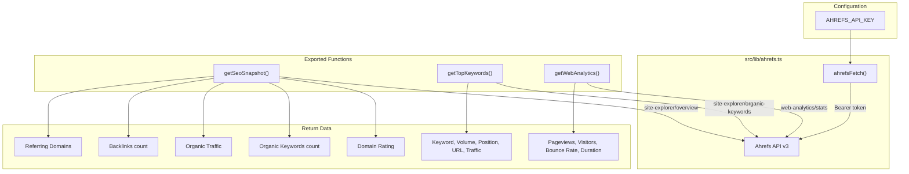

# Ahrefs SEO Integration

cloudless.gr integrates with the Ahrefs API for SEO monitoring: domain rating, organic keyword tracking, backlink analysis, and web analytics.

> **Status:** Optional integration — returns `null` or empty arrays when `AHREFS_API_KEY` is not configured. No other service depends on it.

---

## Architecture


---

## Environment Variables

### Local development (`.env.local`)

```bash
AHREFS_API_KEY=your-ahrefs-api-token
```

### Production (AWS SSM Parameter Store)

| Parameter path | Type |
|----------------|------|
| `/cloudless/production/AHREFS_API_KEY` | SecureString |

---

## API Reference

### `getSeoSnapshot(domain?): Promise<SeoSnapshot | null>`

Get domain-level SEO metrics. Default domain: `cloudless.gr`.

**Returns:**

| Field | Type | Description |
|-------|------|-------------|
| `domainRating` | number | Ahrefs Domain Rating (0-100) |
| `organicKeywords` | number | Total organic keywords ranking |
| `organicTraffic` | number | Estimated monthly organic traffic |
| `backlinks` | number | Total backlink count |
| `referringDomains` | number | Unique referring domains |

**Endpoint:** `GET /site-explorer/overview?target={domain}&mode=domain`

### `getTopKeywords(domain?, limit?): Promise<KeywordData[]>`

Get top organic keywords sorted by traffic descending.

**Params:** `domain` (default: `cloudless.gr`), `limit` (default: 20)

**Returns array of:**

| Field | Type | Description |
|-------|------|-------------|
| `keyword` | string | Search keyword |
| `volume` | number | Monthly search volume |
| `position` | number | Current SERP position |
| `url` | string | Ranking URL |
| `traffic` | number | Estimated traffic from this keyword |

**Endpoint:** `GET /site-explorer/organic-keywords?target={domain}&mode=domain&limit={limit}&order_by=traffic_desc`
### `getWebAnalytics(domain?): Promise<WebAnalyticsData | null>`

Get web analytics overview for the domain.

**Returns:**

| Field | Type | Description |
|-------|------|-------------|
| `pageviews` | number | Total pageviews |
| `visitors` | number | Unique visitors |
| `visits` | number | Total visits |
| `bounceRate` | number | Bounce rate percentage |
| `avgDuration` | number | Average visit duration (seconds) |

**Endpoint:** `GET /web-analytics/stats?target={domain}`

---

## Error Handling

All functions follow the same pattern:
- **Not configured:** `ahrefsFetch()` throws `"Ahrefs not configured"` → caught by caller → returns `null` or `[]`
- **API error:** Non-OK response → returns `null` or `[]`
- **Network error:** Caught by try/catch → logged to console → returns `null` or `[]`

No Ahrefs error ever surfaces to the end user.

---

## Ahrefs Setup

1. Sign up for an [Ahrefs API](https://ahrefs.com/api) plan
2. Generate an API token from your Ahrefs dashboard
3. Add the token to `.env.local` or SSM Parameter Store

---

## Key Files

| File | Purpose |
|------|---------|
| `src/lib/ahrefs.ts` | All Ahrefs API operations — `getSeoSnapshot()`, `getTopKeywords()`, `getWebAnalytics()` |
| `src/lib/integrations.ts` | Config loader for `AHREFS_API_KEY` |
