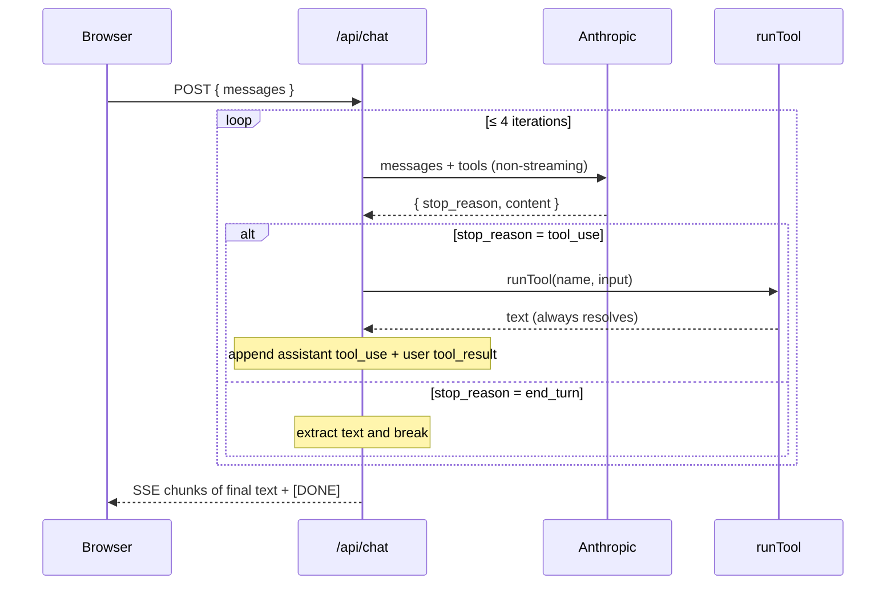

# Anthropic / Claude AI Integration

cloudless.gr uses the Anthropic Messages API for two distinct surfaces:

1. **Public chatbot agent** — `ChatWidget` on every page; calls `/api/chat`. Backed by a tool-use loop with two read-only tools (`lookup_product`, `check_calendar_availability`). The final response is delivered as SSE so the widget keeps its existing event handling.
2. **Admin AI tools** — copy generation, campaign strategy, audience targeting, and report insights under `/api/admin/ai/*`.

All surfaces share a single `ANTHROPIC_API_KEY` loaded through `src/lib/anthropic.ts`. The public chatbot model can be overridden with `ANTHROPIC_CHAT_MODEL`.

> **Status:** Optional — `/api/chat` returns 503 when the key is absent (widget shows a graceful error). Admin AI routes return 503 similarly. The rest of the site is unaffected.
>
> **Last verified:** 2026-05-03 — 35 tests pass (13 anthropic lib + 10 chat API + 9 chat-tools + 13 admin AI API).

---

## Architecture

```mermaid
graph TB
    subgraph Public["Public (all locales)"]
        Widget["ChatWidget.tsx\n(fixed bottom-right)"]
        ChatRoute["/api/chat\nStreaming SSE"]
    end

    subgraph Admin["Admin (auth required)"]
        Copy["/api/admin/ai/copy"]
        Campaign["/api/admin/ai/campaign"]
        Audience["/api/admin/ai/audience"]
        Insights["/api/admin/ai/report-insights"]
    end

    subgraph Lib["src/lib/anthropic.ts"]
        Key["getAnthropicApiKey()"]
        Call["callClaude()"]
        Verify["verifyAnthropicKey()"]
    end

    Widget -->|POST messages| ChatRoute
    ChatRoute -->|getAnthropicApiKey| Key
    Copy & Campaign & Audience & Insights -->|callClaude + getAnthropicApiKey| Call & Key

    Key -->|getConfig()| SSM["AWS SSM / .env.local"]
    Call -->|POST /v1/messages| Anthropic["api.anthropic.com"]
    Verify -->|1-token ping| Anthropic
```

---

## Environment Variables

### Local development (`.env.local`)

```bash
ANTHROPIC_API_KEY=sk-ant-api03-...
ANTHROPIC_CHAT_MODEL=claude-3-5-haiku-latest
```

### Production (AWS SSM Parameter Store)

| Parameter path | Type |
|----------------|------|
| `/cloudless/production/ANTHROPIC_API_KEY` | SecureString |
| `/cloudless/production/ANTHROPIC_CHAT_MODEL` | String (optional) |

---

## Public Chatbot — `ChatWidget`

`src/components/ChatWidget.tsx` is mounted on every page via `src/app/[locale]/layout.tsx`:

```tsx
const ChatWidget = dynamic(() => import("@/components/ChatWidget"));
// ...
<ChatWidget />
```

**Features:**
- Fixed bottom-right floating button, expands to a 380px chat panel
- Streaming responses via SSE — text appears token by token
- Retains last 10 turns for context window management
- Quick-suggestion chips on the first turn
- Graceful degradation: shows a "use Contact page" message if `/api/chat` returns an error

### `/api/chat` route

| Property | Value |
|----------|-------|
| Model | `ANTHROPIC_CHAT_MODEL` or fallback `claude-3-5-haiku-latest` |
| `max_tokens` | 600 (raised from 300 to leave room for tool-using turns) |
| Streaming | SSE (`text/event-stream`) — final assistant text is chunk-encoded back to the client |
| Tools | `lookup_product`, `check_calendar_availability` (see below) |
| Tool-use loop cap | 4 iterations (`MAX_TOOL_ITERATIONS`) |
| Upstream timeout | 20 s (`ANTHROPIC_TIMEOUT_MS`) |
| Max history | 10 turns |
| Max message length | 500 chars |
| Auth | None (public endpoint, rate-limited in `src/proxy.ts`) |
| Rate limit | 20 req/min/IP (set in `src/proxy.ts` RATE_LIMITS) |
| 503 when | `ANTHROPIC_API_KEY` not configured |
| 502 when | upstream non-2xx, timeout, or iteration cap hit |

The system prompt positions Claude as "Cloudless Assistant" with knowledge of services, pricing, and how to direct prospects to book a free audit. It also instructs the model to call tools only when their output would beat memory — never just to confirm something it already knows.

#### Tools (Phase 2a of `docs/AGENTS_ROADMAP.md`)

Tool definitions and the `runTool` dispatcher live in [`src/lib/chat-tools.ts`](../src/lib/chat-tools.ts). Each tool's executor returns a plain string — errors are converted to user-facing nudges so a thrown tool never crashes the loop.

| Tool | Input | What it does | Backed by |
|------|-------|--------------|-----------|
| `lookup_product(query)` | `query: string` | Searches the live storefront for matches by name / description / category / features. Returns up to 3 results with name, price, category, and `/store/<id>` URL. | `getProducts()` from `src/lib/store-products.ts` (5 min in-process cache, Stripe-backed when configured, else `defaultProducts`) |
| `check_calendar_availability(days_ahead?)` | `days_ahead?: integer` clamped to `[1, 14]` (default 7) | Returns up to 5 open 30-minute consultation slots in Athens local time, with a `/book` CTA. Returns a graceful contact-page nudge when Google Calendar isn't configured or no slots are open. | `getAvailableSlots()` from `src/lib/google-calendar.ts` |

#### Tool-use loop



If the loop hits the cap without a final text response, the route returns a single SSE message that nudges the visitor toward the Contact page. The intermediate Anthropic calls are non-streaming for simpler tool round-trips; the final text is chunked back as SSE so the existing `ChatWidget` event handlers keep working unchanged.

---

## Admin AI Routes

All require a valid Cognito JWT with the `admin` group. Return 503 when the API key is not configured.

### `POST /api/admin/ai/copy`

Generates 5 ad copy variants (headline + body + CTA + tone) for a given service and platform.

**Body:** `{ service, platform?, objective?, language? }`

**Platforms:** Meta, LinkedIn, TikTok, X, Google (each with correct character limits)

**Response:** `{ variants: [{ headline, body, cta, tone }] }`

### `POST /api/admin/ai/campaign`

Generates a full campaign strategy from a brief.

**Body:** `{ brief, budget?, targetAudience? }`

**Response:** `{ strategy: { recommended_platforms, campaign_objective, budget_split, audience, ad_formats, copy_suggestions, estimated_results, timeline } }`

### `POST /api/admin/ai/audience`

Generates platform-specific audience targeting parameters.

**Body:** `{ description, platforms?, objective? }`

**Response:** `{ targeting: { summary, demographics, platforms: { Meta, LinkedIn, Google, TikTok, X }, estimated_audience_size } }`

### `POST /api/admin/ai/report-insights`

Writes 3–5 sentences of marketing analyst commentary on campaign metrics.

**Body:** `{ metrics, period? }`

**Response:** `{ insights: "..." }`

---

## `src/lib/anthropic.ts` API

### `getAnthropicApiKey(): Promise<string | null>`

Reads `ANTHROPIC_API_KEY` from `getConfig()` (SSM-backed). Returns `null` when not configured.

### `isAnthropicConfigured(): Promise<boolean>`

Returns `true` if the API key is present.

### `verifyAnthropicKey(): Promise<{ status, message? }>`

Sends a 1-token ping to verify the key is valid.

| Status | Meaning |
|--------|---------|
| `valid` | Key accepted |
| `rejected` | 401/403 — key invalid or billing lapsed |
| `not_configured` | Key not in SSM/env |
| `error` | Network failure or unexpected HTTP error |

### `callClaude(prompt, apiKey, options?): Promise<string>`

Non-streaming single-turn call. Returns the text of the first content block.

| Option | Default |
|--------|---------|
| `model` | `claude-sonnet-4-6` |
| `maxTokens` | 1000 |
| `system` | — |

Throws on API errors — callers catch and return 500.

---

## Model Selection

| Surface | Model | Reason |
|---------|-------|--------|
| Public chatbot (`/api/chat`) | `ANTHROPIC_CHAT_MODEL` or `claude-3-5-haiku-latest` | Configurable per account and region availability |
| Admin AI routes | `claude-sonnet-4-6` | Higher reasoning quality for structured JSON outputs |
| `verifyAnthropicKey()` ping | `ANTHROPIC_CHAT_MODEL` (or fallback) | Verifies the key against the model your chatbot actually uses |

---

## Running Tests

```bash
# Shared lib
pnpm test -- --reporter=verbose __tests__/anthropic.test.ts

# Public chat route + tools
pnpm test -- --reporter=verbose __tests__/chat-api.test.ts __tests__/chat-tools.test.ts

# Admin AI routes
pnpm test -- --reporter=verbose __tests__/admin-ai-api.test.ts
```

Test coverage:

| File | Tests | What is tested |
|------|-------|---------------|
| `anthropic.test.ts` | 13 | `isAnthropicConfigured`, `verifyAnthropicKey` (5 paths), `callClaude` (6 paths: success, model/tokens, system prompt, api-key header, non-OK throws, empty content) |
| `chat-api.test.ts` | 10 | 400 validation, 503 no key, 502 upstream non-2xx, plain-text streaming, tools declared, history capped, tool-use round trip with `tool_result`, iteration-cap fallback |
| `chat-tools.test.ts` | 9 | `lookup_product` match / no-match / bad query, `check_calendar_availability` slots / no-config / no-slots / clamp, unknown tool, tool throw → contact nudge |
| `admin-ai-api.test.ts` | 13 | 401, 400, 503, 200 for campaign + copy + audience routes |

---

## Security Notes

- **Key in SSM SecureString:** `ANTHROPIC_API_KEY` is never committed. Stored as SecureString in SSM.
- **Public endpoint rate limiting:** `/api/chat` is rate-limited at 20 req/min/IP via `RATE_LIMITS` in `src/proxy.ts`. Tool round-trips amplify per-request LLM cost (1 chat → up to 4 LLM calls), so the cap is sized for that.
- **Message length cap:** User messages are truncated to 500 chars before being sent to the API.
- **History window:** Only the last 10 turns are forwarded — prevents unbounded context growth.
- **No PII forwarding:** The chat system prompt does not ask users for personal data. Conversation history lives only in the browser session (React state, cleared on refresh).
- **Tool execution is read-only:** Both shipped tools only read public-ish data (the storefront catalog and free/busy lookup). No mutations, no auth-scoped data, no secret leakage path.

---

## Key Files

| File | Purpose |
|------|---------|
| `src/lib/anthropic.ts` | Shared client: `callClaude`, `getAnthropicApiKey`, `verifyAnthropicKey` |
| `src/app/api/chat/route.ts` | Public chatbot endpoint — tool-use loop with SSE response |
| `src/lib/chat-tools.ts` | `CHAT_TOOLS` definitions + `runTool` dispatcher |
| `src/components/ChatWidget.tsx` | Floating chat UI — mounted in `[locale]/layout.tsx` |
| `src/app/api/admin/ai/copy/route.ts` | Ad copy generation |
| `src/app/api/admin/ai/campaign/route.ts` | Campaign strategy |
| `src/app/api/admin/ai/audience/route.ts` | Audience targeting |
| `src/app/api/admin/ai/report-insights/route.ts` | Report commentary |
| `__tests__/anthropic.test.ts` | Lib unit tests |
| `__tests__/chat-api.test.ts` | Chat route tests (tool-use loop, SSE, fallbacks) |
| `__tests__/chat-tools.test.ts` | Tool dispatcher tests |
