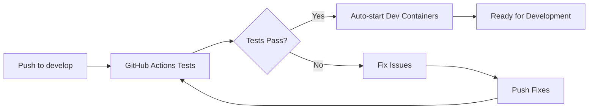

# 🚀 Auto-Start Dev Containers After Tests

This feature automatically starts your local development containers after all GitHub Actions tests succeed, providing a seamless development workflow.

## 🎯 **How It Works**

### **1. GitHub Actions Workflow**
When you push code to the `develop` branch, the following happens:

1. **Tests Run** - All validation, security, build, and integration tests execute
2. **Success Check** - If all tests pass, the `start-dev-containers` job triggers
3. **Container Management** - Stops existing containers and starts fresh ones
4. **Health Verification** - Waits for containers to be ready and verifies endpoints
5. **Ready Notification** - Displays URLs and status information

### **2. Manual Trigger**
You can also manually start dev containers after tests:

```powershell
# Start dev containers (checks tests first)
.\scripts\start-dev-after-tests.ps1

# Force start (skip test checks)
.\scripts\start-dev-after-tests.ps1 -Force

# Skip test checks
.\scripts\start-dev-after-tests.ps1 -SkipChecks
```

## 📋 **Workflow Steps**

### **GitHub Actions Job: `start-dev-containers`**

```yaml
start-dev-containers:
  name: 🚀 Start Local Dev Containers
  runs-on: [self-hosted, containerized, dev]
  needs: [validate, dependencies, security-quality, build-test, integration-tests]
  if: |
    always() &&
    needs.validate.result == 'success' &&
    needs.dependencies.result == 'success' &&
    needs.security-quality.result == 'success' &&
    needs.build-test.result == 'success' &&
    needs.integration-tests.result == 'success' &&
    github.ref == 'refs/heads/develop'
```

**Steps:**
1. **Check Container Status** - See if dev containers are already running
2. **Stop Existing** - Gracefully stop running containers if needed
3. **Start Fresh** - Start dev containers with latest code
4. **Wait for Ready** - Monitor health checks until containers are ready
5. **Verify Environment** - Test endpoints and services
6. **Display Info** - Show URLs and useful commands

## 🔧 **Configuration**

### **Trigger Conditions**
- ✅ All tests must pass
- ✅ Must be on `develop` branch
- ✅ Self-hosted runner must be available

### **Container Services Started**
- **App Dev** (`cloudlessgr-app-dev`) - Main application
- **Redis Dev** (`cloudlessgr-redis-dev`) - Caching and sessions
- **PostgreSQL Dev** (`cloudlessgr-postgres-dev`) - Database
- **Nginx** (if configured) - Reverse proxy

### **Health Checks**
- **App Health** - `http://localhost:3000/api/health`
- **API Endpoint** - `http://localhost:3000/api/v1`
- **Redis** - `redis-cli ping`
- **PostgreSQL** - `pg_isready`

## 🌐 **Access URLs**

After successful startup, you can access:

| Service | URL | Description |
|---------|-----|-------------|
| **Main App** | http://localhost:3000 | Your application |
| **Health Check** | http://localhost:3000/api/health | Application health |
| **API v1** | http://localhost:3000/api/v1 | API endpoints |
| **Node Debugger** | localhost:9229 | Debug your application |
| **Redis** | localhost:6379 | Cache and sessions |
| **PostgreSQL** | localhost:5432 | Database |

## 📊 **Monitoring**

### **Container Status**
```powershell
# View all dev containers
docker ps --filter "name=cloudlessgr"

# View specific container logs
docker logs -f cloudlessgr-app-dev
docker logs -f cloudlessgr-redis-dev
docker logs -f cloudlessgr-postgres-dev
```

### **Health Monitoring**
```powershell
# Check app health
curl http://localhost:3000/api/health

# Check Redis
docker exec cloudlessgr-redis-dev redis-cli ping

# Check PostgreSQL
docker exec cloudlessgr-postgres-dev pg_isready -U cloudless
```

## 🛠️ **Useful Commands**

### **Container Management**
```powershell
# Start dev containers manually
docker-compose -f scripts/docker/docker-compose.dev.yml up -d

# Stop dev containers
docker-compose -f scripts/docker/docker-compose.dev.yml down

# Restart dev containers
docker-compose -f scripts/docker/docker-compose.dev.yml restart

# View logs
docker-compose -f scripts/docker/docker-compose.dev.yml logs -f
```

### **Development Tools**
```powershell
# Access app shell
docker exec -it cloudlessgr-app-dev sh

# Access database
docker exec -it cloudlessgr-postgres-dev psql -U cloudless

# Access Redis CLI
docker exec -it cloudlessgr-redis-dev redis-cli
```

## 🔄 **Workflow Integration**

### **1. Development Workflow**


### **2. Manual Workflow**
```powershell
# Quick development setup
.\scripts\start-dev-after-tests.ps1 -SkipChecks

# Full test and start
.\scripts\start-dev-after-tests.ps1

# Force restart
.\scripts\start-dev-after-tests.ps1 -Force
```

## 🚨 **Troubleshooting**

### **Common Issues**

#### **1. Containers Won't Start**
```powershell
# Check Docker status
docker info

# Check available resources
docker system df

# Clean up Docker
docker system prune -f
```

#### **2. Port Conflicts**
```powershell
# Check what's using port 3000
netstat -ano | findstr :3000

# Stop conflicting services
# Or change ports in docker-compose.dev.yml
```

#### **3. Health Checks Fail**
```powershell
# Check container logs
docker logs cloudlessgr-app-dev

# Check environment variables
docker exec cloudlessgr-app-dev env

# Verify .env file
cat .env
```

#### **4. Database Connection Issues**
```powershell
# Check PostgreSQL status
docker exec cloudlessgr-postgres-dev pg_isready

# Check database logs
docker logs cloudlessgr-postgres-dev

# Reset database (if needed)
docker-compose -f scripts/docker/docker-compose.dev.yml down -v
docker-compose -f scripts/docker/docker-compose.dev.yml up -d
```

## 🎯 **Benefits**

### **✅ Automated Workflow**
- No manual container management
- Consistent environment setup
- Automatic health verification

### **✅ Development Efficiency**
- Immediate access after tests pass
- Hot reloading ready
- All services pre-configured

### **✅ Quality Assurance**
- Only starts after tests pass
- Ensures working codebase
- Prevents broken development environments

### **✅ Team Collaboration**
- Consistent setup across team
- Shared development environment
- Reduced onboarding time

## 📝 **Customization**

### **Modify Trigger Conditions**
Edit `.github/workflows/self-hosted-runner.yml`:

```yaml
if: |
  always() &&
  needs.validate.result == 'success' &&
  needs.dependencies.result == 'success' &&
  needs.security-quality.result == 'success' &&
  needs.build-test.result == 'success' &&
  needs.integration-tests.result == 'success' &&
  github.ref == 'refs/heads/develop'  # Change branch here
```

### **Add Custom Health Checks**
Edit the verification step:

```yaml
- name: Verify dev environment
  run: |
    # Add your custom health checks here
    curl -f http://localhost:3000/api/custom-endpoint
```

### **Modify Container Services**
Edit `scripts/docker/docker-compose.dev.yml` to add/remove services.

## 🎉 **Success Indicators**

When everything works correctly, you'll see:

```
🎉 Local Dev Environment is Ready!
==================================

🌐 Application URLs:
  • Main App: http://localhost:3000
  • API Health: http://localhost:3000/api/health
  • API v1: http://localhost:3000/api/v1

🔧 Development Tools:
  • Node.js Debugger: localhost:9229
  • Redis: localhost:6379
  • PostgreSQL: localhost:5432

🎯 All tests passed! Your dev environment is ready for development.
```

---

**🚀 Your development workflow is now fully automated!** 