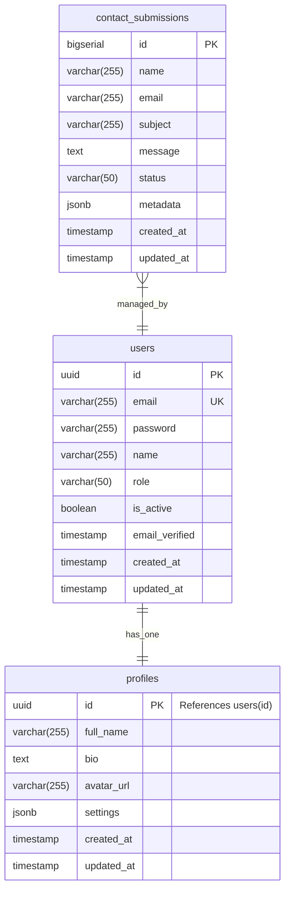

# Cloudless.gr Database Schema

## Table Structure Diagram

## Table Details

### contact_submissions

- Primary key: `id` (auto-incrementing)
- Tracks user contact form submissions
- Status options: 'pending', 'read', 'replied', 'archived'
- Includes metadata for tracking submission details
- Has automatic timestamps
- Protected by Row Level Security (RLS)

### users

- Primary key: `id` (UUID)
- Stores user authentication information
- Role options: 'USER', 'ADMIN'
- Tracks email verification status
- Handles account activation state
- Protected by Supabase Auth

### profiles

- Primary key: `id` (UUID, references users.id)
- Stores additional user information
- Customizable user settings in JSON format
- Handles user avatars and bios
- One-to-one relationship with users

## Security Features

1. **Row Level Security (RLS)**

   - Contact submissions have role-based access control
   - Public insert access for contact form
   - Admin-only access for read/update/delete operations

2. **Authentication**

   - Email/password authentication
   - Email verification
   - Role-based access control
   - Account activation status

3. **Indexing**
   - Email index for faster queries
   - Status index for filtering
   - Created_at index for chronological ordering

## Automated Features

1. **Timestamps**

   - Automatic `created_at` timestamp on insert
   - Automatic `updated_at` timestamp on update
   - Trigger-based timestamp management

2. **Data Validation**
   - Status field validation via CHECK constraint
   - Email format validation
   - Required field constraints
