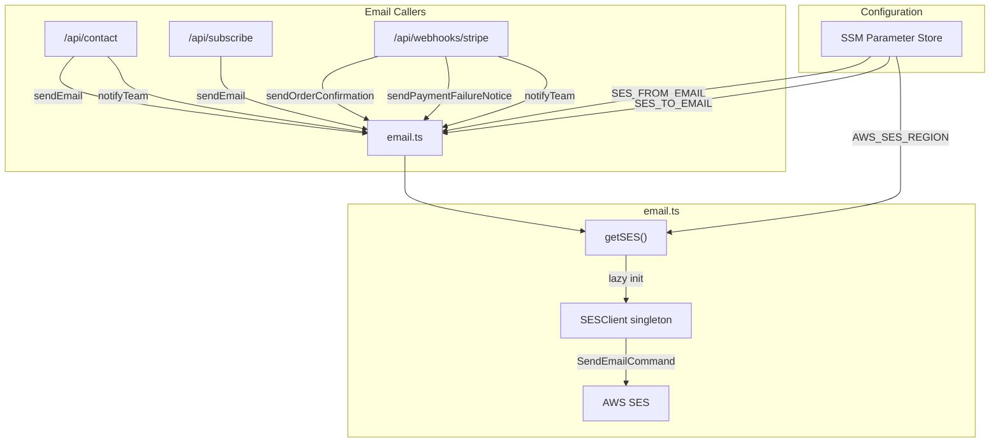
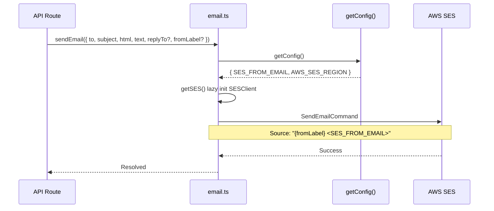

# AWS SES Email Integration

cloudless.gr uses Amazon Simple Email Service (SES) for all transactional email: contact form acknowledgments, order confirmations, payment failure notices, and internal team notifications.

> **Status:** Required for contact form and Stripe webhook fulfillment. The SES client is lazy-initialized with cached credentials from SSM.

---

## Architecture


## Email Sending Flow



---

## Environment Variables

### Local development (`.env.local`)

```bash
SES_FROM_EMAIL=noreply@cloudless.gr
SES_TO_EMAIL=inbox@cloudless.gr
AWS_SES_REGION=us-east-1
```

### Production (AWS SSM Parameter Store)

| Parameter path | Type |
|----------------|------|
| `/cloudless/production/SES_FROM_EMAIL` | String |
| `/cloudless/production/SES_TO_EMAIL` | String |
| `/cloudless/production/AWS_SES_REGION` | String |

> `getConfig()` validates that SES email fields are present.

---

## API Reference

### `sendEmail(options): Promise<void>`

Low-level email sending wrapper.

| Option | Type | Required | Description |
|--------|------|----------|-------------|
| `to` | string | Yes | Recipient email |
| `subject` | string | Yes | Email subject line |
| `html` | string | Yes | HTML body |
| `text` | string | Yes | Plain text body |
| `replyTo` | string[] | No | Reply-to addresses |
| `fromLabel` | string | No | Display name (default: "Cloudless") |

**Source format:** `{fromLabel} <{SES_FROM_EMAIL}>` (e.g., `"Cloudless Contact Form <noreply@cloudless.gr>"`)

### `sendOrderConfirmation(email, sessionId, amount, currency): Promise<void>`
Sends cyberpunk-styled order receipt to the customer.

- Formats amount using `Intl.NumberFormat` with the order currency
- Includes Order ID, total, and download/shipping instructions
- Reply-to: `tbaltzakis@cloudless.gr`

### `sendPaymentFailureNotice(email, invoiceId): Promise<void>`

Sends payment failure alert to the customer.

- Includes invoice ID and link to contact support
- Notes that automatic retry will occur
- Reply-to: `tbaltzakis@cloudless.gr`

### `notifyTeam(subject, body): Promise<void>`

Sends internal notification to the team inbox (`SES_TO_EMAIL`).

- Used for orders, subscription changes, and payment failures
- Wraps HTML body in a basic `font-family: sans-serif` container
- Generates plain text by stripping HTML tags

---

## Email Templates

All emails use inline CSS for maximum email client compatibility.

| Template | Triggered by | Audience | Style |
|----------|-------------|----------|-------|
| Order Confirmation | `checkout.session.completed` | Customer | Cyberpunk (cyan `#00fff5` header) |
| Payment Failure | `invoice.payment_failed` | Customer | Alert (red `#ff4444` header) |
| Team Notification | Multiple events | Internal team | Basic sans-serif |
| Contact Form | `/api/contact` | Internal team | HTML with escaped user input |
---

## SES Client Initialization

The SES client is lazy-initialized and cached as a module-level singleton:

```typescript
let sesClient: SESClient | null = null;

async function getSES(): Promise<SESClient> {
  if (sesClient) return sesClient;
  const config = await getConfig();
  sesClient = new SESClient({ region: config.AWS_SES_REGION });
  return sesClient;
}
```

This ensures the SSM config is loaded before the client is created, and subsequent calls reuse the same instance.

---

## Security Notes

- **HTML escaping:** All user input in email bodies passes through `escapeHtml()` to prevent injection
- **No PII logging:** Email errors are logged without exposing customer data
- **Validated sender:** SES requires verified sender identity; `SES_FROM_EMAIL` must be verified in the SES console
- **Reply-to isolation:** Customer-facing emails use a dedicated reply-to address, not the system sender

---

## Key Files

| File | Purpose |
|------|---------|
| `src/lib/email.ts` | SES client, `sendEmail()`, `sendOrderConfirmation()`, `sendPaymentFailureNotice()`, `notifyTeam()` |
| `src/lib/escape-html.ts` | `escapeHtml()` utility for email body sanitization |
| `src/lib/ssm-config.ts` | SSM config loader for SES credentials and region |
| `src/app/api/contact/route.ts` | Primary `sendEmail()` caller |
| `src/app/api/webhooks/stripe/route.ts` | Calls order confirmation, payment failure, and team notifications |
