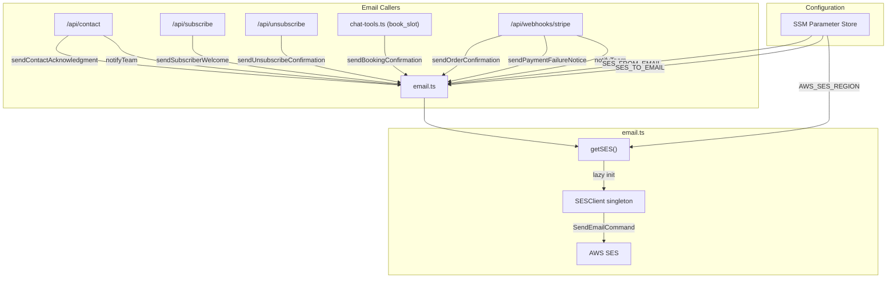
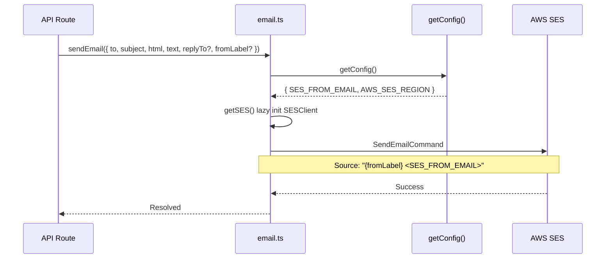

# AWS SES Email Integration

cloudless.gr uses Amazon Simple Email Service (SES) for all transactional email: contact form auto-replies, subscriber welcome emails, booking confirmations, unsubscribe confirmations, order confirmations, payment failure notices, and internal team notifications.

> **Status:** Required for contact form and Stripe webhook fulfillment. The SES client is lazy-initialized with cached credentials from SSM.

---

## Architecture


```mermaid
graph TB
    subgraph Callers["Email Callers"]
        Contact["/api/contact"] -->|sendContactAcknowledgment| EmailLib["email.ts"]
        Contact -->|notifyTeam| EmailLib
        Subscribe["/api/subscribe"] -->|sendSubscriberWelcome| EmailLib
        Unsub["/api/unsubscribe"] -->|sendUnsubscribeConfirmation| EmailLib
        ChatTools["chat-tools.ts (book_slot)"] -->|sendBookingConfirmation| EmailLib
        StripeWH["/api/webhooks/stripe"] -->|sendOrderConfirmation| EmailLib
        StripeWH -->|sendPaymentFailureNotice| EmailLib
        StripeWH -->|notifyTeam| EmailLib
    end

    subgraph Email["email.ts"]
        EmailLib --> GetSES["getSES()"]
        GetSES -->|lazy init| SESClient["SESClient singleton"]
        SESClient -->|SendEmailCommand| SES["AWS SES"]
    end

    subgraph Config["Configuration"]
        SSM["SSM Parameter Store"] -->|SES_FROM_EMAIL| EmailLib
        SSM -->|SES_TO_EMAIL| EmailLib
        SSM -->|AWS_SES_REGION| GetSES
    end
```

## Email Sending Flow


```mermaid
sequenceDiagram
    participant Route as API Route
    participant Email as email.ts
    participant SSM as getConfig()
    participant SES as AWS SES

    Route->>Email: sendEmail({ to, subject, html, text, replyTo?, fromLabel? })
    Email->>SSM: getConfig()
    SSM-->>Email: { SES_FROM_EMAIL, AWS_SES_REGION }
    Email->>Email: getSES() lazy init SESClient
    Email->>SES: SendEmailCommand
    Note over Email,SES: Source: "{fromLabel} <SES_FROM_EMAIL>"
    SES-->>Email: Success
    Email-->>Route: Resolved
```

---

## Environment Variables

### Local development (`.env.local`)

```bash
SES_FROM_EMAIL=noreply@cloudless.gr
SES_TO_EMAIL=inbox@cloudless.gr
AWS_SES_REGION=us-east-1
```

### Production (AWS SSM Parameter Store)

| Parameter path | Type |
|----------------|------|
| `/cloudless/production/SES_FROM_EMAIL` | String |
| `/cloudless/production/SES_TO_EMAIL` | String |
| `/cloudless/production/AWS_SES_REGION` | String |

> `getConfig()` validates that SES email fields are present.

---

## API Reference

### `sendEmail(options): Promise<void>`

Low-level email sending wrapper.

| Option | Type | Required | Description |
|--------|------|----------|-------------|
| `to` | string | Yes | Recipient email |
| `subject` | string | Yes | Email subject line |
| `html` | string | Yes | HTML body |
| `text` | string | Yes | Plain text body |
| `replyTo` | string[] | No | Reply-to addresses |
| `fromLabel` | string | No | Display name (default: "Cloudless") |

**Source format:** `{fromLabel} <{SES_FROM_EMAIL}>` (e.g., `"Cloudless Contact Form <noreply@cloudless.gr>"`)

### `sendOrderConfirmation(email, sessionId, amount, currency): Promise<void>`

Sends cyberpunk-styled order receipt to the customer.

- Formats amount using `Intl.NumberFormat` with the order currency
- Includes Order ID, total, and download/shipping instructions
- Reply-to: `tbaltzakis@cloudless.gr`

### `sendPaymentFailureNotice(email, invoiceId): Promise<void>`

Sends payment failure alert to the customer.

- Includes invoice ID and link to contact support
- Notes that automatic retry will occur
- Reply-to: `tbaltzakis@cloudless.gr`

### `sendSubscriberWelcome(subscriberEmail): Promise<void>`

Sends a welcome email to new newsletter subscribers. Includes an unsubscribe link (`/api/unsubscribe?email=...`) and next-steps messaging.

### `sendContactAcknowledgment({ name, email, service? }): Promise<void>`

Auto-reply sent to contact form submitters confirming receipt. Fires as **fire-and-forget** from `/api/contact` — never blocks the API response.

- Personalised with the submitter's first name
- Includes the service they enquired about (when provided)
- Escapes all user input via `escapeHtml()`

### `sendUnsubscribeConfirmation(email): Promise<void>`

Confirmation email sent when a subscriber unsubscribes. Called from both `POST /api/unsubscribe` (JSON body) and `GET /api/unsubscribe` (query param) handlers.

- Subject: "You've been unsubscribed — Cloudless"
- Confirms the address has been removed from all future sends

### `sendBookingConfirmation({ name, email, slotLabel, meetLink, notes? }): Promise<void>`

Sends a booking confirmation email to the visitor after the `book_slot` chat tool succeeds.

| Parameter | Type | Description |
|-----------|------|-------------|
| `name` | string | Visitor's full name |
| `email` | string | Destination address |
| `slotLabel` | string | Human-readable slot string, e.g. "Mon, 12 May, 10:00–10:30 Athens" |
| `meetLink` | string | Google Meet URL from the Calendar event |
| `notes` | string? | Optional notes the visitor shared |

Fires as **fire-and-forget** from `chat-tools.ts:runBookSlot()`.

### `notifyTeam(subject, body): Promise<void>`

Sends internal notification to the team inbox (`SES_TO_EMAIL`).

- Used for orders, subscription changes, and payment failures
- Wraps HTML body in a basic `font-family: sans-serif` container
- Generates plain text by stripping HTML tags

---

## Email Templates

All emails use inline CSS for maximum email client compatibility.

| Template | Triggered by | Audience | Style |
|----------|-------------|----------|-------|
| Order Confirmation | `checkout.session.completed` | Customer | Cyberpunk (cyan `#00fff5` header) |
| Payment Failure | `invoice.payment_failed` | Customer | Alert (red `#ff4444` header) |
| Team Notification | Multiple events | Internal team | Basic sans-serif |
| Contact Notification | `/api/contact` | Internal team | HTML with escaped user input |
| Contact Acknowledgment | `/api/contact` | Customer (auto-reply) | Branded, personalised with name + service |
| Subscriber Welcome | `/api/subscribe` | New subscriber | Branded, includes unsubscribe link |
| Unsubscribe Confirmation | `/api/unsubscribe` (GET + POST) | Unsubscribed user | Minimal, confirms removal |
| Booking Confirmation | `book_slot` chat tool | Visitor who booked | Branded, includes slot time + Meet link |

---

## SES Client Initialization

The SES client is lazy-initialized and cached as a module-level singleton:

```typescript
let sesClient: SESClient | null = null;

async function getSES(): Promise<SESClient> {
  if (sesClient) return sesClient;
  const config = await getConfig();
  sesClient = new SESClient({ region: config.AWS_SES_REGION });
  return sesClient;
}
```

This ensures the SSM config is loaded before the client is created, and subsequent calls reuse the same instance.

---

## Security Notes

- **HTML escaping:** All user input in email bodies passes through `escapeHtml()` to prevent injection
- **No PII logging:** Email errors are logged without exposing customer data
- **Validated sender:** SES requires verified sender identity; `SES_FROM_EMAIL` must be verified in the SES console
- **Reply-to isolation:** Customer-facing emails use a dedicated reply-to address, not the system sender

---

## Key Files

| File | Purpose |
|------|---------|
| `src/lib/email.ts` | SES client, `sendEmail()`, `sendOrderConfirmation()`, `sendPaymentFailureNotice()`, `sendSubscriberWelcome()`, `sendContactAcknowledgment()`, `sendUnsubscribeConfirmation()`, `sendBookingConfirmation()`, `notifyTeam()` |
| `src/lib/escape-html.ts` | `escapeHtml()` utility for email body sanitization |
| `src/lib/ssm-config.ts` | SSM config loader for SES credentials and region |
| `src/lib/chat-tools.ts` | `runBookSlot()` calls `sendBookingConfirmation` fire-and-forget |
| `src/app/api/contact/route.ts` | Calls `sendContactAcknowledgment` (auto-reply) + `notifyTeam` |
| `src/app/api/subscribe/route.ts` | Calls `sendSubscriberWelcome` |
| `src/app/api/unsubscribe/route.ts` | Calls `sendUnsubscribeConfirmation` (both GET + POST handlers) |
| `src/app/api/webhooks/stripe/route.ts` | Calls order confirmation, payment failure, and team notifications |
