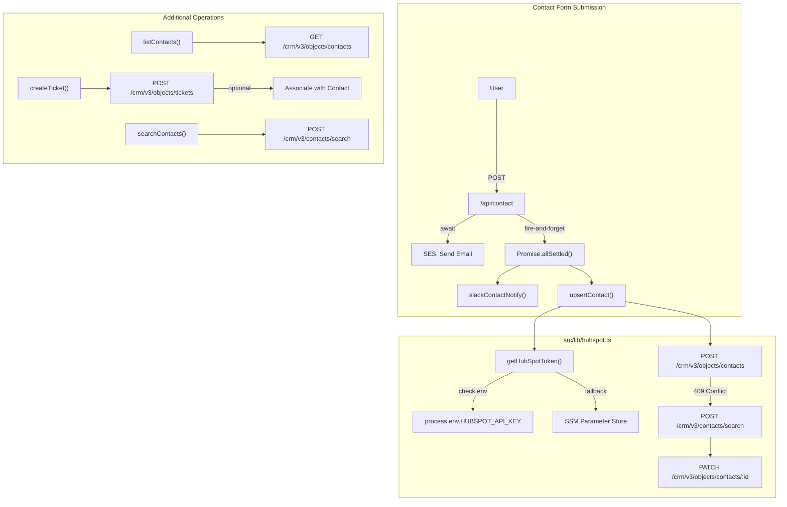
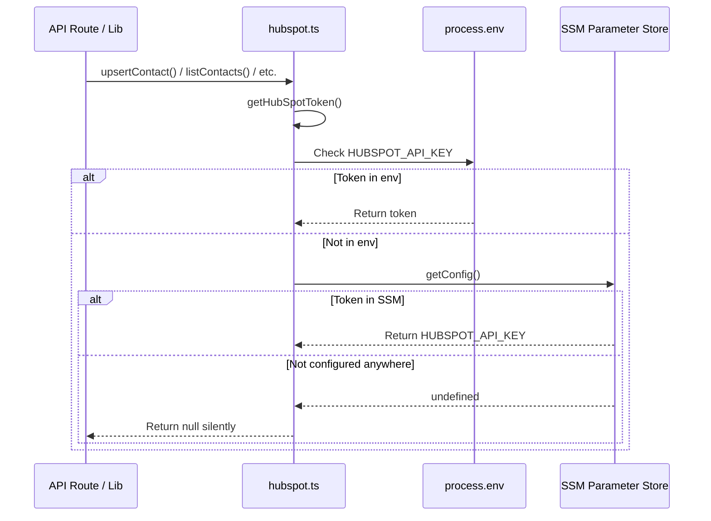
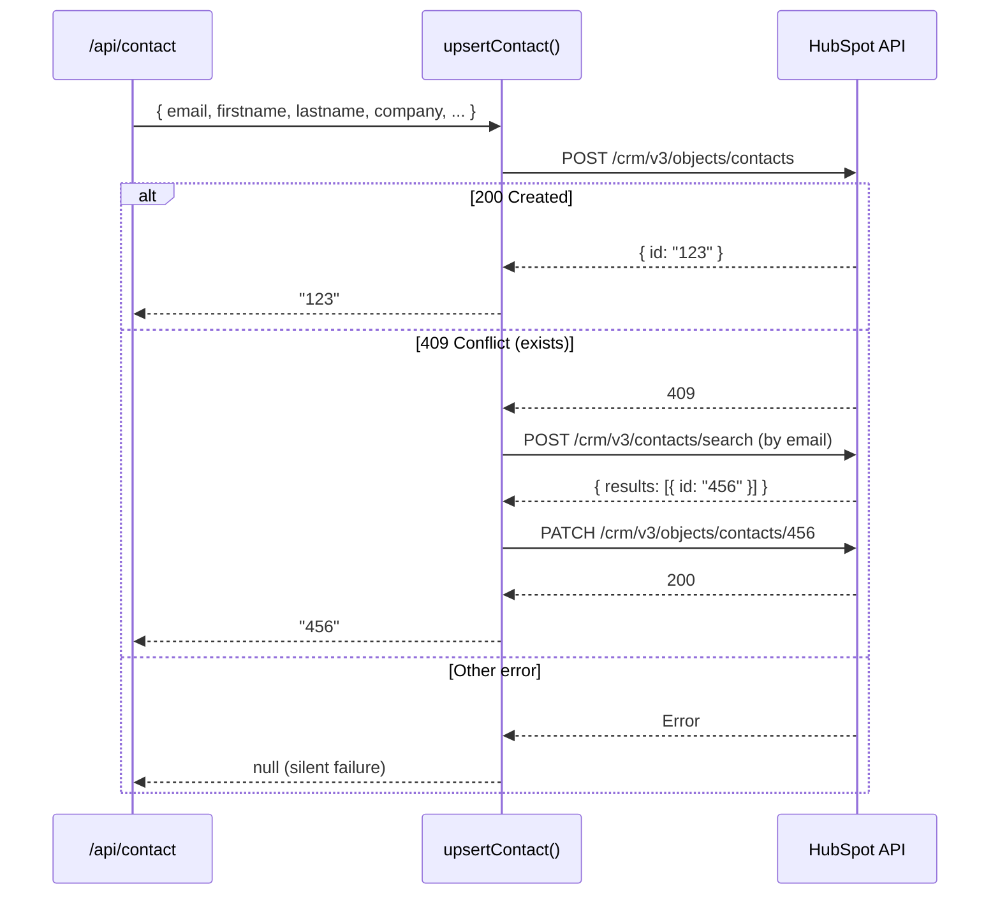
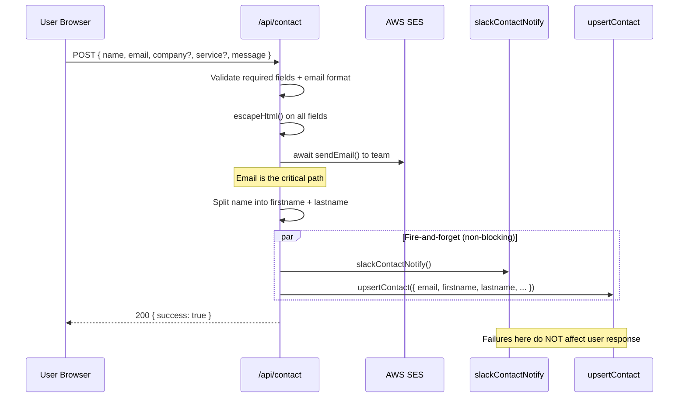

# HubSpot CRM Integration

cloudless.gr integrates with HubSpot CRM to automatically capture leads from the contact form and provide contact management, search, and ticket creation capabilities.

> **Status:** Optional integration — degrades gracefully when no HubSpot token is configured (`HUBSPOT_API_KEY`, `HUBSPOT_ACCESS_TOKEN`, or `HUBSPOT_PRIVATE_APP_TOKEN`). The contact form continues to work (email + Slack) even without HubSpot.

---

## Architecture



## Token Resolution



> **Why the fallback?** In Lambda deployments, `HUBSPOT_API_KEY` isn't set as an environment variable — SSM Parameter Store is the source of truth. Local development uses `.env.local`.

---

## Environment Variables

### Local development (`.env.local`)

```bash
HUBSPOT_API_KEY=pat-na1-xxxxxxxx-xxxx-xxxx-xxxx-xxxxxxxxxxxx
# optional aliases supported by the app
# HUBSPOT_ACCESS_TOKEN=pat-na1-xxxxxxxx-xxxx-xxxx-xxxx-xxxxxxxxxxxx
# HUBSPOT_PRIVATE_APP_TOKEN=pat-na1-xxxxxxxx-xxxx-xxxx-xxxx-xxxxxxxxxxxx
```

### Production (AWS SSM Parameter Store)

| Parameter path                        | Type         |
|---------------------------------------|--------------|
| `/cloudless/production/HUBSPOT_API_KEY` | SecureString |

### Required HubSpot scopes

The private app token needs these scopes:

| Scope | Used by |
|-------|---------|
| `crm.objects.contacts.read` | `listContacts()`, `searchContacts()` |
| `crm.objects.contacts.write` | `upsertContact()` |
| `crm.objects.tickets.write` | `createTicket()` |

---

## API Reference

### `upsertContact(contact: HubSpotContact): Promise<string | null>`

Create or update a CRM contact using email as the unique identifier.



**Input fields:**

| Field | Type | Required | Mapped to |
|-------|------|----------|-----------|
| `email` | string | Yes | `email` |
| `firstname` | string | No | `firstname` |
| `lastname` | string | No | `lastname` |
| `company` | string | No | `company` |
| `service_interest` | string | No | `service_interest` (custom property) |
| `message` | string | No | `message` (custom property) |
| `lead_source` | string | No | `lead_source` (default: `website_contact_form`) |

**Auto-set properties on create:**
- `hs_lead_status`: `NEW`
- `lifecyclestage`: `lead`

**On update (409 conflict):** Only patches `company`, `service_interest`, and `message` — does not overwrite name or lead status.

---

### `listContacts(limit?: number): Promise<unknown[]>`

Fetch recent contacts with key properties.

**Default limit:** 10

**Properties returned:** `email`, `firstname`, `lastname`, `company`, `createdate`, `hs_lead_status`

**Error handling:** Returns empty array `[]` on any failure.

---

### `createTicket(data: TicketData, contactId?: string): Promise<{ id: string } | null>`

Create a support ticket, optionally associated with an existing contact.

**Input fields:**

| Field | Type | Required | Default |
|-------|------|----------|---------|
| `subject` | string | Yes | — |
| `content` | string | Yes | — |
| `hs_pipeline` | string | No | `"0"` (default pipeline) |
| `hs_pipeline_stage` | string | No | `"1"` (first stage) |
| `hs_ticket_priority` | string | No | `"MEDIUM"` |

**Contact association:** If `contactId` is provided, the ticket is linked to that contact using HubSpot's association type ID `16` (ticket-to-contact).

**Error handling:** Returns `null` if HubSpot is not configured. Throws on API errors (non-2xx responses).

---

### `searchContacts(propertyName: string, value: string): Promise<{ total, results }>`

Search contacts by any property using exact match (`EQ` operator).

**Example:** `searchContacts("email", "user@example.com")`

**Error handling:** Throws on API errors.

---

## Contact Form Integration

The contact form (`/api/contact`) is the primary consumer of the HubSpot integration:



**Key design decisions:**
- Email sending is **awaited** (critical path) — if SES fails, the user gets a 500 error
- Slack and HubSpot are **fire-and-forget** via `Promise.allSettled().catch(() => {})` — failures are logged but don't block the response
- Name splitting: `"Themis Baltzakis"` → `firstname: "Themis"`, `lastname: "Baltzakis"`
- Message is truncated to 500 chars before sending to HubSpot

---

## Custom Properties

These custom properties must exist in your HubSpot account for full functionality:

| Property | Type | Group | Used by |
|----------|------|-------|---------|
| `service_interest` | Single-line text | Contact information | `upsertContact()` |
| `message` | Multi-line text | Contact information | `upsertContact()` |
| `lead_source` | Single-line text | Contact information | `upsertContact()` (default: `website_contact_form`) |

To create these in HubSpot:
1. Go to **Settings → Properties → Contact properties**
2. Click **Create property**
3. Set the internal name exactly as shown above
4. Choose the appropriate field type

---

## HubSpot App Setup

### 1. Create a Private App

1. Go to [HubSpot Developer](https://app.hubspot.com/) → **Settings → Integrations → Private Apps**
2. Click **Create a private app**
3. Name: `cloudless.gr`
4. Under **Scopes**, enable:
   - `crm.objects.contacts.read`
   - `crm.objects.contacts.write`
   - `crm.objects.tickets.write` (if using ticket creation)
5. Click **Create app** and copy the access token

### 2. Configure the Token

**Local development:**
```bash
# .env.local
HUBSPOT_API_KEY=pat-na1-xxxxxxxx-xxxx-xxxx-xxxx-xxxxxxxxxxxx
# optional aliases supported by the app
# HUBSPOT_ACCESS_TOKEN=pat-na1-xxxxxxxx-xxxx-xxxx-xxxx-xxxxxxxxxxxx
# HUBSPOT_PRIVATE_APP_TOKEN=pat-na1-xxxxxxxx-xxxx-xxxx-xxxx-xxxxxxxxxxxx
```

**Production (AWS):**
```bash
aws ssm put-parameter \
  --name "/cloudless/production/HUBSPOT_API_KEY" \
  --type SecureString \
  --value "pat-na1-xxxxxxxx-xxxx-xxxx-xxxx-xxxxxxxxxxxx"
```

### 3. Create Custom Properties

See the [Custom Properties](#custom-properties) section above.

---

## Testing

### Unit tests

The contact form test (`__tests__/contact-api.test.ts`) covers the integration indirectly — it mocks SSM config and verifies the contact route returns 200 with valid fields, which triggers the fire-and-forget HubSpot upsert.

```bash
# Run contact tests
pnpm test contact-api
```

### Manual verification

```bash
# Test upsert via the contact form (requires HUBSPOT_API_KEY in .env.local)
curl -X POST http://localhost:4000/api/contact \
  -H "Content-Type: application/json" \
  -d '{"name":"Test User","email":"test@example.com","message":"Integration test"}'

# Then check HubSpot → Contacts → search for test@example.com
```

### Verifying graceful degradation

```bash
# Remove HUBSPOT_API_KEY from .env.local, restart dev server
# Submit contact form — should still return 200 (email works, HubSpot silently skipped)
```

---

## Security Notes

- **Token storage:** Never commit `HUBSPOT_API_KEY` to the repo. Use `.env.local` (gitignored) locally, SSM Parameter Store in production.
- **Error isolation:** HubSpot failures never surface to the end user — they're caught by `Promise.allSettled` and logged to console.
- **Data minimization:** Only contact-relevant fields are sent to HubSpot. Message is truncated to 500 characters.
- **No PII in logs:** Error handlers log the error type but not the contact data.

---

## Key Files

| File | Purpose |
|------|---------|
| `src/lib/hubspot.ts` | All HubSpot API operations — upsertContact, listContacts, createTicket, searchContacts |
| `src/lib/integrations.ts` | Config loader — reads `HUBSPOT_API_KEY`, `HUBSPOT_ACCESS_TOKEN`, and `HUBSPOT_PRIVATE_APP_TOKEN` from env |
| `src/lib/ssm-config.ts` | SSM Parameter Store fallback for production token resolution |
| `src/app/api/contact/route.ts` | Contact form handler — calls `upsertContact()` as fire-and-forget |
| `__tests__/contact-api.test.ts` | Contact route unit tests (indirect HubSpot coverage) |
