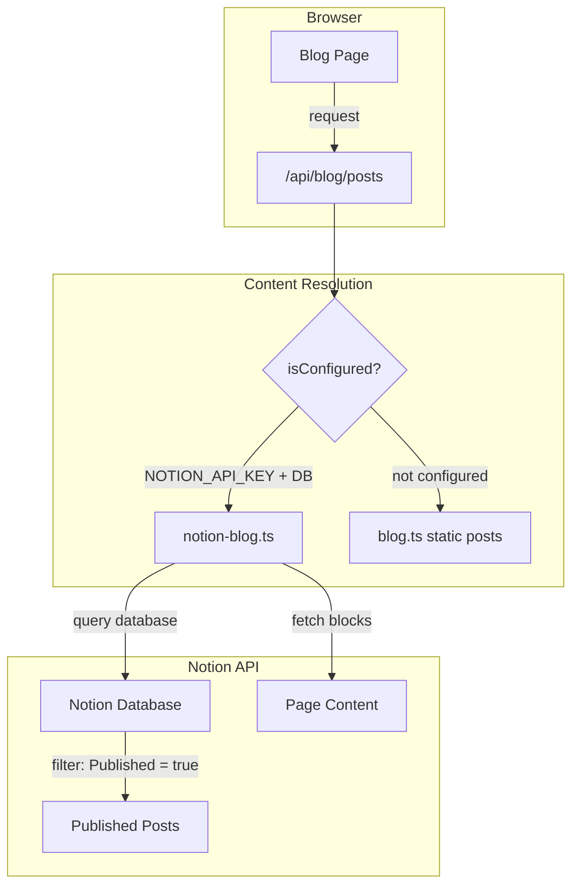
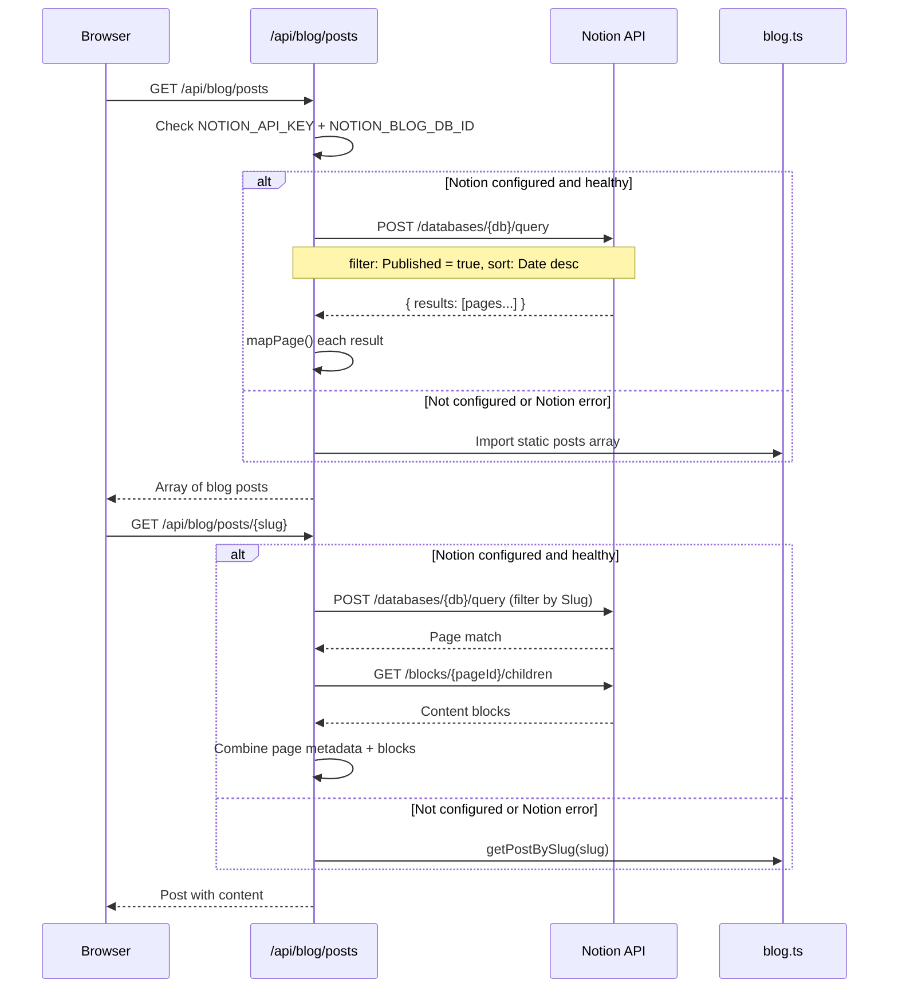

# Notion CMS Integration

cloudless.gr uses Notion as a headless CMS for the blog. Published posts are fetched from a Notion database and rendered on the site. When Notion is not configured or the Notion API is unavailable, the blog falls back to static content defined in `src/lib/blog.ts`.

> **Status:** Optional integration — falls back to 4 static blog posts when Notion is not configured or when upstream Notion calls fail.

---

## Architecture


## Content Flow



---

## Environment Variables

### Local development (`.env.local`)

```bash
NOTION_API_KEY=ntn_xxxxxxxxxxxxxxxxxxxxxxxxxxxxxxxxxxxxxxxxxxxx
NOTION_BLOG_DB_ID=xxxxxxxxxxxxxxxxxxxxxxxxxxxxxxxx
```
### Production (AWS SSM Parameter Store)

| Parameter path | Type |
|----------------|------|
| `/cloudless/production/NOTION_API_KEY` | SecureString |
| `/cloudless/production/NOTION_BLOG_DB_ID` | String |

---

## Notion Database Schema

The Notion database must have these properties:

| Property | Type | Required | Description |
|----------|------|----------|-------------|
| `Title` (or `Name`) | Title | Yes | Post title |
| `Slug` | Rich text | Yes | URL-friendly slug (e.g., `my-first-post`) |
| `Excerpt` | Rich text | Yes | Short description for listing pages |
| `Date` | Date | Yes | Publication date |
| `Author` | Rich text | No | Author name (default: "Cloudless Team") |
| `Tags` | Multi-select | No | Category tags |
| `Published` | Checkbox | Yes | Only `true` posts are fetched |

Cover images are pulled from the page's cover (external URL or Notion file).

---

## API Reference

### `getPosts(): Promise<NotionPost[]>`

Fetch all published blog posts, sorted by date descending.

- Queries the Notion database with `Published = true` filter
- Maps each page through `mapPage()` to extract properties
- Returns `[]` if Notion is not configured
- Throws on upstream Notion API/network failures (route handlers catch and fall back to static posts)

### `getPostBySlug(slug): Promise<NotionPost & { content } | null>`

Fetch a single post by its slug, including block content.

- Queries with compound filter: `Slug = slug AND Published = true`
- Fetches child blocks (up to 100) for the matched page
- Returns `null` if not found or Notion not configured
- Throws on upstream Notion API/network failures (route handlers catch and fall back to static posts)
---

## Static Fallback

When Notion is not configured, `src/lib/blog.ts` provides 4 hardcoded blog posts:

| Slug | Category | Read time |
|------|----------|-----------|
| `why-serverless-is-perfect-for-startups` | Serverless | 5 min |
| `cloud-cost-optimization-guide` | Cloud | 7 min |
| `ai-marketing-small-business` | AI Marketing | 6 min |
| `data-analytics-dashboards-for-growth` | Analytics | 5 min |

Each post includes full markdown-like content, category, and `formatDate()` helper.

---

## Notion Integration Setup

1. Go to [Notion Integrations](https://www.notion.so/my-integrations)
2. Create a new integration with **Read content** capability
3. Copy the Internal Integration Token
4. In your Notion workspace, share the blog database with the integration
5. Copy the database ID from the database URL

---

## Security Notes

- **Read-only:** The integration only reads from Notion; it never writes
- **API version pinned:** Uses Notion API version `2022-06-28` for stability
- **Graceful fallback:** Returns static content on any failure — no error exposed to users
- **No sensitive data:** Blog content is public; no PII flows through this integration

---

## Key Files

| File | Purpose |
|------|---------|
| `src/lib/notion-blog.ts` | Notion API client — `getPosts()`, `getPostBySlug()`, property mapping |
| `src/lib/blog.ts` | Static fallback blog posts (4 posts with full content) |
| `src/app/api/blog/` | Blog API routes |
| `src/lib/integrations.ts` | Config check for `NOTION_API_KEY` + `NOTION_BLOG_DB_ID` |
