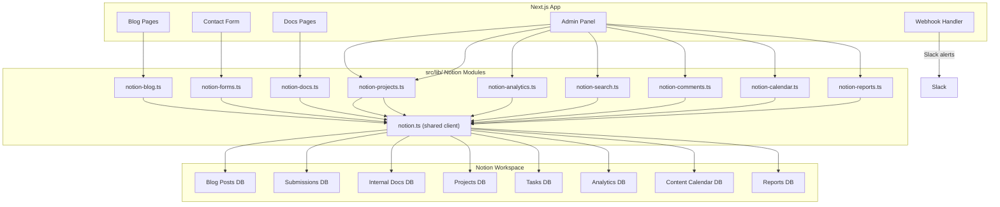

# Notion Integration

cloudless.gr uses **Notion as a workspace hub** with 8 databases powering the blog CMS, contact form storage, project tracking, task management, internal documentation, site analytics, content calendar, and client reports. The integration includes **search**, **comments**, **wiki features**, **sprint management**, **block building**, **content calendar**, and **report persistence** utilities. All integrations degrade gracefully when Notion is not configured.

> **Status:** Optional integration — all features fall back to empty/static data when `NOTION_API_KEY` is missing.

---

## Architecture



---

## Environment Variables

### Local development (`.env.local`)

```bash
# Required
NOTION_API_KEY=secret_xxxxxxxxxxxxxxxxxxxxxxxxxxxxxxxxxxxxxxxxxxxx

# Database IDs (all optional — features degrade individually)
NOTION_BLOG_DB_ID=0ac591657ee44063bbbc8004ea7ccd6c
NOTION_SUBMISSIONS_DB_ID=9abe0a5614d64b759d44a45cee2d0bbc
NOTION_DOCS_DB_ID=b45af6ed5bb64d89b9a92a8aff4a9b29
NOTION_PROJECTS_DB_ID=a9bab34b945e484fb6b0aa6034086e5c
NOTION_TASKS_DB_ID=14ce4ff6c400437597b13e70ac909354
NOTION_ANALYTICS_DB_ID=cc4287fcb42a42dc92a7053d6f1199c7
NOTION_CALENDAR_DB_ID=your-calendar-database-id
NOTION_REPORTS_DB_ID=your-reports-database-id

# Webhook authentication
NOTION_WEBHOOK_SECRET=your_random_secret_here
```

### Production (AWS SSM Parameter Store)

| Parameter path | Type |
|----------------|------|
| `/cloudless/production/NOTION_API_KEY` | SecureString |
| `/cloudless/production/NOTION_WEBHOOK_SECRET` | SecureString |

Database IDs are set as regular environment variables in `sst.config.ts` and passed directly to the Lambda function. Secrets are stored in SSM and loaded at Lambda cold start via `src/instrumentation.ts`.

#### How secrets reach Lambda

Next.js `instrumentation.ts` runs once on every Lambda cold start. It reads all parameters under the `SSM_PREFIX` path (`/cloudless/<stage>/`) with decryption enabled and injects them into `process.env`. This means `integrations.ts` (which reads `process.env`) works in Lambda without any code changes. The `SSM_PREFIX` env var is set by `sst.config.ts`.

---

## Databases

### 1. Blog Posts (`NOTION_BLOG_DB_ID`)

| Property | Type | Required | Description |
|----------|------|----------|-------------|
| Title (or Name) | Title | Yes | Post title |
| Slug | Rich text | Yes | URL-friendly identifier |
| Excerpt | Rich text | Yes | Post summary |
| Date | Date | Yes | Publication date |
| Author | People | No | Default: "Cloudless Team" |
| Category | Select | No | Post category |
| Tags | Multi-select | No | Post tags |
| Published | Checkbox | Yes | Publication gate |
| Featured | Checkbox | No | Homepage hero selection |
| Cover Image | URL | No | Header image |
| Read Time | Rich text | No | Default: "5 min read" |
| SEO Title | Rich text | No | Meta title override |
| SEO Description | Rich text | No | Meta description override |

**Library:** `src/lib/notion-blog.ts`
**Fallback:** 4 static posts in `src/lib/blog.ts`
**Caching:** ISR with `revalidate = 300` (5 minutes)

### 2. Contact Submissions (`NOTION_SUBMISSIONS_DB_ID`)

| Property | Type | Description |
|----------|------|-------------|
| Name | Title | Contact name |
| Email | Email | Contact email |
| Company | Rich text | Company name |
| Service | Rich text | Requested service |
| Message | Rich text | Message body (max 2000 chars) |
| Status | Select | New / In Review / Done |
| Source | Select | contact / subscribe / other |
| Submitted At | Date | ISO timestamp |

**Library:** `src/lib/notion-forms.ts`

### 3. Internal Docs (`NOTION_DOCS_DB_ID`)

| Property | Type | Description |
|----------|------|-------------|
| Title | Title | Document title |
| Slug | Rich text | URL identifier |
| Category | Select | Document category |
| Description | Rich text | Short description |
| Published | Checkbox | Publication gate |
| Order | Number | Sort order within category |
| Verification | Status/Select | Verified / Needs re-verification / Unverified (wiki mode) |
| Owner | Person/Rich text | Content owner for verification workflow |
| Last Verified | Date | When the page was last verified |

**Library:** `src/lib/notion-docs.ts`

### 4. Projects (`NOTION_PROJECTS_DB_ID`)

| Property | Type | Description |
|----------|------|-------------|
| Name | Title | Project name |
| Status | Select | Planning / In Progress / On Hold / Completed / Cancelled |
| Priority | Select | Critical / High / Medium / Low |
| Type | Select | Client / Internal / Maintenance |
| Owner | People | Project owner (Notion user ID) |
| Start Date | Date | Project start |
| Due Date | Date | Project deadline |
| Description | Rich text | Project description |
| Budget | Number | Budget amount |
| Progress | Number | 0-100 percentage |
| Tags | Multi-select | Project tags |
| Created | Created time | Auto-set by Notion |
| Last Edited | Last edited time | Auto-updated by Notion |

**Library:** `src/lib/notion-projects.ts`

### 5. Tasks (`NOTION_TASKS_DB_ID`)

| Property | Type | Description |
|----------|------|-------------|
| Task | Title | Task name |
| Status | Select | Backlog / To Do / In Progress / In Review / Done / Blocked |
| Priority | Select | Urgent / High / Medium / Low |
| Assignee | People | Assigned person (Notion user ID) |
| Project | Rich text | Parent project |
| Due Date | Date | Task deadline |
| Estimate | Select | XS / S / M / L / XL |
| Type | Select | Feature / Bug / Chore / Spike / Design |
| Description | Rich text | Task description |
| Labels | Multi-select | Task labels |
| Sprint | Select | Sprint name (for sprint management) |
| Created | Created time | Auto-set by Notion |
| Last Edited | Last edited time | Auto-updated by Notion |

**Library:** `src/lib/notion-projects.ts`

### 6. Site Analytics (`NOTION_ANALYTICS_DB_ID`)

| Property | Type | Description |
|----------|------|-------------|
| Event | Title | Event name |
| Type | Select | page_view / form_submit / blog_view / doc_view / signup / order / error / weekly_rollup |
| Page | Rich text | Page path |
| Source | Rich text | Traffic source |
| Count | Number | Event count |
| Date | Date | Event timestamp |
| Country | Rich text | Country code |
| Metadata | Rich text | JSON metadata |

**Library:** `src/lib/notion-analytics.ts`

### 7. Content Calendar (`NOTION_CALENDAR_DB_ID`)

Stores scheduled content items for the Marketing Hub calendar view. Used by `src/lib/content-calendar.ts` with Notion as primary backend and in-memory store as fallback.

| Property | Type | Description |
|----------|------|-------------|
| Name | Title | Content item title |
| CalID | Rich text | Internal ID (prefixed `cal_`) |
| Type | Select | social_post / blog_post / ad_campaign / email / other |
| Platform | Select | meta / linkedin / x / tiktok / google / email / organic |
| Date | Date | Scheduled date (start; optional end for campaigns) |
| Status | Select | draft / scheduled / published / cancelled |
| URL | URL | Published content URL |
| Notes | Rich text | Additional notes |

**Library:** `src/lib/notion-calendar.ts`
**Consumer:** `src/lib/content-calendar.ts` (async CRUD with in-memory fallback)
**Routes:** `src/app/api/admin/calendar/`
**Fallback:** In-memory store when `NOTION_CALENDAR_DB_ID` is not set

### 8. Client Reports (`NOTION_REPORTS_DB_ID`)

Stores generated client reports for the Marketing Hub reports view. Used by `src/lib/reports.ts` with Notion as primary backend and in-memory store as fallback.

| Property | Type | Description |
|----------|------|-------------|
| Name | Title | Client name |
| ReportID | Rich text | Internal ID (prefixed `report_`) |
| Status | Select | generating / ready / error |
| DateStart | Date | Report period start |
| DateEnd | Rich text | Report period end (ISO string) |
| Sections | Rich text | JSON array of report sections (capped at 2000 chars) |
| CreatedAt | Date | Report generation timestamp |

**Library:** `src/lib/notion-reports.ts`
**Consumer:** `src/lib/reports.ts` (async CRUD with in-memory fallback)
**Routes:** `src/app/api/admin/reports/`
**Fallback:** In-memory store when `NOTION_REPORTS_DB_ID` is not set

---

## Shared Client (`src/lib/notion.ts`)

All Notion modules use a shared client:

| Function | Description |
|----------|-------------|
| `notionFetch<T>(path, init?)` | Authenticated fetch wrapper with error handling |
| `notionFetchAll<T>(path, body?)` | Paginated POST for database queries |
| `notionListAll<T>(path)` | Paginated GET for block children |
| `extractText(richText)` | Rich text array → plain string |
| `blocksToHtml(blocks)` | Block array → safe HTML string |
| `updatePage(pageId, properties)` | PATCH page properties |
| `archivePage(pageId)` | Soft-delete (archive) a page |
| `restorePage(pageId)` | Restore an archived page |
| `appendBlocks(parentId, children)` | Append child blocks (max 100) |
| `deleteBlock(blockId)` | Delete (archive) a block |
| `extractToc(blocks)` | Extract table of contents from heading blocks |
| `paragraphBlock(text)` | Build a paragraph block object |
| `headingBlock(level, text)` | Build a heading block (h1/h2/h3) |
| `bulletBlock(text)` | Build a bulleted list item block |
| `numberedBlock(text)` | Build a numbered list item block |
| `todoBlock(text, checked?)` | Build a to-do block |
| `codeBlock(text, language?)` | Build a code block |
| `dividerBlock()` | Build a divider block |
| `calloutBlock(text, emoji?)` | Build a callout block |

API base: `https://api.notion.com/v1`, version: `2022-06-28`.

---

## Caching Layer (`src/lib/notion-cache.ts`)

An in-memory TTL cache sits between the app and the Notion API to reduce latency and API usage.

| Function | Description |
|----------|-------------|
| `getCached<T>(key, fetcher, ttlMs?)` | Return cached value or call fetcher; default TTL 5 min |
| `invalidateCache(key)` | Remove a single cache entry |
| `invalidateAll()` | Flush the entire cache |

The webhook handler (`/api/webhooks/notion`) calls `invalidateCache()` / `invalidateAll()` on relevant events so content updates appear immediately after editing in Notion.

---

## Analytics Archival (`archiveOldEvents`)

High-volume granular events (`page_view`, `blog_view`, `doc_view`) are archived after they've been rolled up into weekly summaries. The `archiveOldEvents(daysToKeep?)` function in `notion-analytics.ts` queries events older than `daysToKeep` (default 30) for each archivable type and soft-deletes them via the Notion API.

The admin analytics POST endpoint supports three actions: `rollup` (create weekly summary), `archive` (archive old granular events), and `maintain` (rollup + archive in one call).

---

## Search & Users (`src/lib/notion-search.ts`)

Cross-workspace search, user management, and database schema introspection.

| Function | Description |
|----------|-------------|
| `searchPages(query, options?)` | Search all accessible pages/databases with pagination |
| `searchDatabases(query, limit?)` | Search databases only |
| `listUsers()` | List all workspace users |
| `getBotUser()` | Get the integration bot user info |
| `getUser(userId)` | Get a specific user by ID |
| `getDatabaseSchema(databaseId)` | Get database schema with property types and options |
| `getPropertyOptions(databaseId, propertyName)` | Get select/multi-select options for a property |

---

## Comments (`src/lib/notion-comments.ts`)

Page comment management for review workflows and wiki verification.

| Function | Description |
|----------|-------------|
| `listComments(blockId)` | List all comments on a page/block |
| `addComment(pageId, text)` | Add a new comment to a page |
| `replyToDiscussion(discussionId, text)` | Reply to an existing discussion thread |
| `getCommentCount(blockId)` | Get comment count for UI badges |

---

## Blog Enhancements (`src/lib/notion-blog.ts`)

| Function | Description |
|----------|-------------|
| `getPosts()` | All published posts, sorted by date desc (cached) |
| `getAllPosts()` | All posts including drafts, no filter, not cached — for admin use |
| `searchPosts(query)` | Search posts by title, excerpt, or tags |
| `getRelatedPosts(post, limit?)` | Find related posts by shared tags/category |
| `getPostWithToc(slug)` | Get post with rendered HTML and table of contents |
| `getCategoryCounts()` | Category → post count map (for sidebar widgets) |
| `getTagCounts()` | Tag → post count map (for tag clouds) |
| `getPaginatedPosts(page, perPage?)` | Paginated post listing |

---

## Wiki / Docs Enhancements (`src/lib/notion-docs.ts`)

| Function | Description |
|----------|-------------|
| `getDocs()` | All published docs, sorted by Category + Order (cached) |
| `getAllDocs()` | All docs including unpublished, no filter, not cached — for admin use |
| `getWikiDocs()` | Docs with verification status, owner, last verified date |
| `getDocsNeedingVerification()` | Filter to docs needing re-verification |
| `getDocsByOwner(ownerName)` | Filter docs by content owner |
| `searchDocs(query)` | Search docs by title or description |
| `getDocContentWithToc(pageId)` | Doc content with table of contents |

---

## Sprint & Task Enhancements (`src/lib/notion-projects.ts`)

| Function | Description |
|----------|-------------|
| `getSprintTasks(sprintName)` | List tasks assigned to a sprint |
| `getSprintProgress(sprintName)` | Sprint progress (total, done, percent) |
| `rolloverSprintTasks(from, to)` | Move incomplete tasks between sprints |
| `bulkUpdateTaskStatus(taskIds, status)` | Bulk status update |
| `getOverdueTasks()` | Tasks past their due date that aren't Done |
| `getProjectDashboard(projectName)` | Combined project + tasks + summary view |

---

## Webhook Handler

`POST /api/webhooks/notion` processes events with HMAC signature verification.

| Event | Action |
|-------|--------|
| `page.updated` | Revalidate blog/doc pages |
| `page.created` | Revalidate indexes + Slack notify for docs |
| `submission.status` | Email submitter when status = Done |
| `project.updated` | Slack alerts for Completed/Blocked projects |
| `task.updated` | Slack alert for Blocked tasks |
| `analytics.event` | Slack alert for error spikes (count ≥ 10) |

---

## Admin Panel Pages

All Notion-backed admin pages live under the **Content** section of the admin sidebar (`/admin/layout.tsx`).

| Route | Feature |
|-------|---------|
| `/admin/blog` | All blog posts (published + drafts) with status filter tabs, category, tags, and featured badge |
| `/admin/docs` | All docs grouped by category; toggle to show/hide drafts; Notion deep-link per doc |
| `/admin/projects` | Two-tab view: Projects (inline status selector, progress bar, priority) and Tasks (inline status selector, estimate, type) |
| `/admin/notion` | Contact form submissions with expand/collapse message and status selector |

---

## API Routes

| Route | Method | Description |
|-------|--------|-------------|
| `/api/admin/notion/blog` | GET | All posts including drafts (`getAllPosts`) — no published filter |
| `/api/admin/notion/docs` | GET | All docs including unpublished (`getAllDocs`) — no published filter |
| `/api/admin/notion/submissions` | GET, PATCH | List and update form submissions |
| `/api/admin/notion/projects` | GET, POST, PATCH | CRUD for projects |
| `/api/admin/notion/tasks` | GET, POST, PATCH | CRUD for tasks |
| `/api/admin/notion/analytics` | GET, POST | Analytics summary; POST actions: `rollup`, `archive`, `maintain` |
| `/api/admin/notion/search` | GET | Cross-workspace search, users, and schemas |
| `/api/admin/notion/comments` | GET, POST | List and add page comments |
| `/api/admin/calendar` | GET | List calendar items (optional `from`/`to` query params) |
| `/api/admin/calendar/create` | POST | Create a calendar item |
| `/api/admin/calendar/[id]` | PATCH, DELETE | Update or delete a calendar item |
| `/api/admin/reports` | GET | List all reports |
| `/api/admin/reports/generate` | POST | Generate a new report |
| `/api/admin/reports/[id]` | GET, DELETE | Get or delete a report |
| `/api/admin/reports/[id]/pdf` | GET | Export report as PDF |
| `/api/webhooks/notion` | POST | Webhook handler |

---

## Setup Guide

1. Go to [notion.so/my-integrations](https://www.notion.so/my-integrations)
2. Create a new Internal integration
3. Copy the Internal Integration Secret
4. Share each database with the integration (database → … → Connections)
5. Set `NOTION_API_KEY` and database IDs in `.env.local`
6. For production, add `NOTION_API_KEY` to SSM as SecureString
7. (Optional) Enable wiki properties on the Docs database for verification workflows

---

## Notion Academy Skills

The project includes 8 skill reference files under `.claude/skills/`:

| Skill | Focus |
|-------|-------|
| `notion-database-management` | API: database CRUD, queries, schemas |
| `notion-page-blocks` | API: page/block CRUD, block rendering |
| `notion-search-users` | API: search, users, comments, file uploads |
| `notion-databases` | Academy: all property types, views, relations, rollups |
| `notion-formulas` | Academy: Formulas 2.0 — 80+ functions, patterns |
| `notion-automations` | Academy: triggers, actions, webhooks, buttons |
| `notion-projects` | Academy: sprints, task databases, project management |
| `notion-wikis` | Academy: teamspaces, verification, knowledge management |

---

## Key Files

| File | Purpose |
|------|---------|
| `src/lib/notion.ts` | Shared Notion API client + block builders + TOC |
| `src/lib/notion-blog.ts` | Blog CMS with search, related posts, pagination |
| `src/lib/notion-forms.ts` | Contact form storage |
| `src/lib/notion-docs.ts` | Internal docs + wiki verification features |
| `src/lib/notion-projects.ts` | Project & task tracker + sprints + bulk ops |
| `src/lib/notion-analytics.ts` | Site analytics |
| `src/lib/notion-search.ts` | Cross-workspace search, users, schemas |
| `src/lib/notion-comments.ts` | Page comments and discussions |
| `src/lib/notion-calendar.ts` | Content calendar Notion CRUD |
| `src/lib/notion-reports.ts` | Client reports Notion CRUD |
| `src/lib/content-calendar.ts` | Calendar CRUD (Notion + in-memory fallback) |
| `src/lib/reports.ts` | Reports CRUD (Notion + in-memory fallback) |
| `src/lib/blog.ts` | Static blog fallback |
| `src/lib/integrations.ts` | Integration config & `isConfigured()` |
| `src/lib/notion-cache.ts` | In-memory TTL cache for Notion queries |
| `src/instrumentation.ts` | Lambda cold-start SSM secret loader |
| `src/app/api/webhooks/notion/route.ts` | Webhook handler |
| `.env.local.example` | Environment variable reference |
