# Cloudflare Free Tier Migration - Rollback Guide

## Architecture Overview

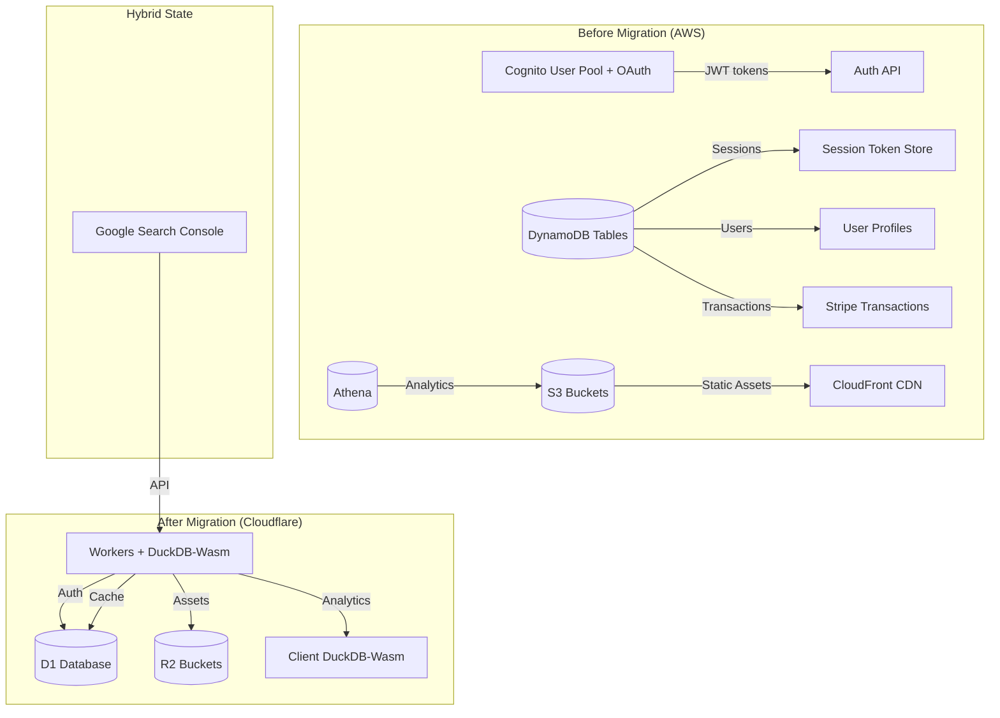

## Migration Architecture

```mermaid
graph LR
    A[User Request] --> B{Worker Handler}
    B -->|Auth| AUTH[/api/auth/*]
    B -->|Analytics| ANALYTICS[/api/analytics/*]
    B -->|Static| R2[cloudless-assets]
    
    AUTH --> D1[(user-auth-db)]
    ANALYTICS --> R2
    ANALYTICS -->|Cache| ANALYTICS_CACHE[analytics_cache]
    
    style D1 fill:#00fff5,stroke:#333,stroke-width:2px
    style R2 fill:#4d7cff,stroke:#333,stroke-width:2px
```

## Session Lifecycle

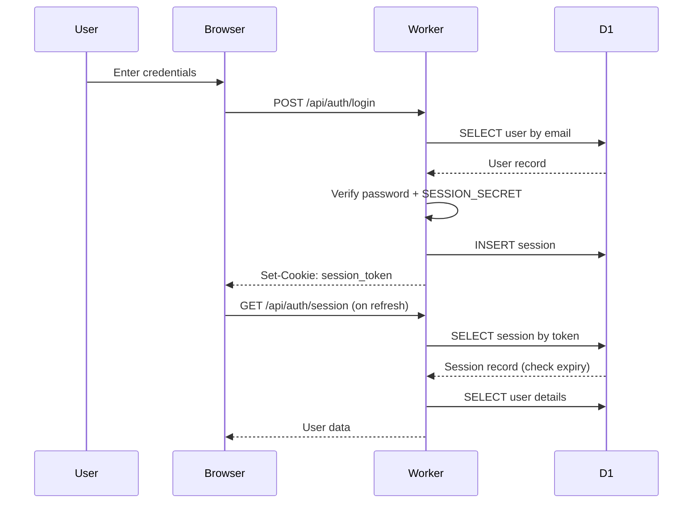

## Rollback Decision Flow

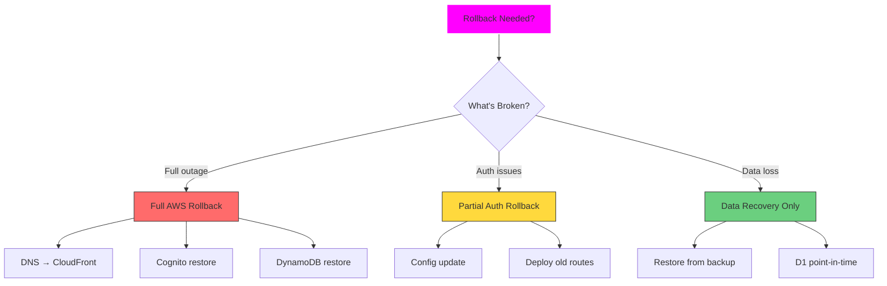

## Data Preservation Flow

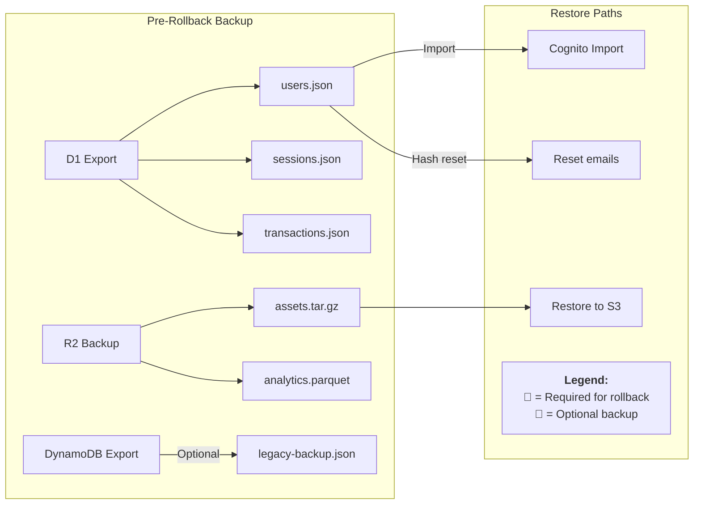

## Cache Architecture

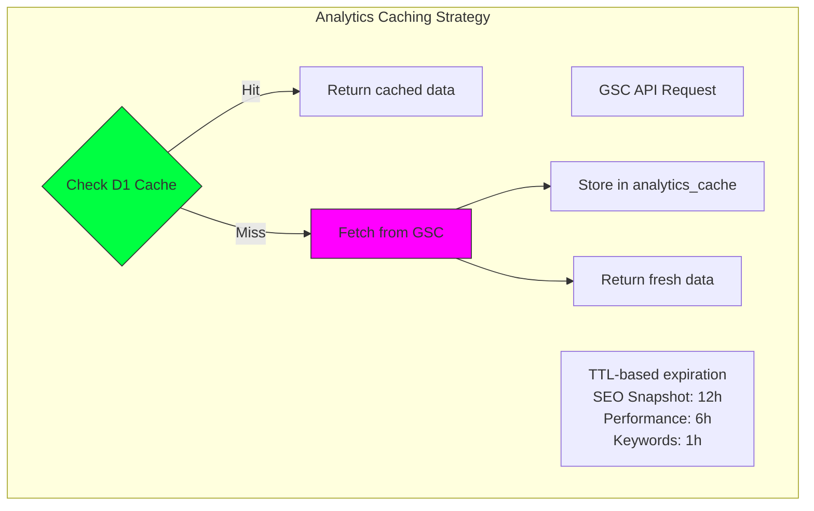

## Overview

This document provides step-by-step rollback procedures for the Cloudflare Free Tier migration. The migration replaced AWS Cognito, DynamoDB, S3, and Athena with Cloudflare D1, R2, and Workers AI.

## Critical Breaking Changes (Cannot Be Rolled Back Without Impact)

### 1. Authentication Changes

| Before | After | Impact |
|--------|-------|--------|
| Cognito with OAuth + MFA | Email/password with SHA-256 | All users must reset passwords |
| JWT tokens + refresh | Server-side sessions in D1 | Sessions invalidated on rollback |
| Centralized auth | Worker-native | Different failure modes |

### 2. Session Management Flow

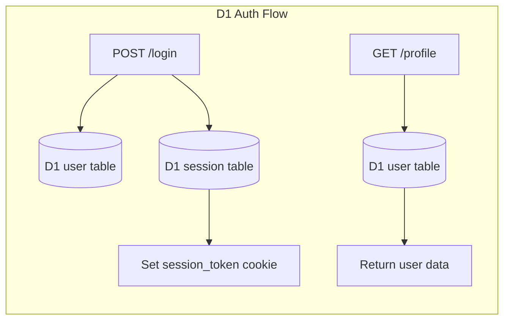

**Rollback Impact:** Users will need to re-authenticate; password hashes are not compatible between systems.

### 3. Analytics

| Before | After | Impact |
|--------|-------|--------|
| Real-time GSC API | Parquet files in R2 | Data freshness delay |
| Athena queries | DuckDB-Wasm client | Different query patterns |
| Server-side aggregation | Client-side processing | Browser CPU usage |

**Rollback Impact:** Historical analytics may need backfill; consider export before rollback.

## Rollback Scenarios

### Scenario A: Full Rollback to AWS (Complete Reversal)

```mermaid
gantt
    title Full Rollback Timeline
    dateFormat  HH:mm
    section DNS
    DNS Switch :done, des1, 09:00, 5m
    section Auth
    Cognito Restore :active, des2, 09:05, 15m
    section Data
    DynamoDB Restore :active, des3, 09:20, 20m
    section Assets
    S3 Restore :active, des4, 09:40, 10m
    section Verification
    Smoke Tests :done, des5, 09:50, 5m
```

#### Step 1: Revert DNS (if migrated)

```bash
# Point domain back to CloudFront / AWS
# Use your DNS provider's UI or CLI
# Example for Route53:
aws route53 change-resource-record-sets \
  --hosted-zone-id YOUR_ZONE_ID \
  --change-batch file://rollback-dns.json
```

#### Step 2: Restore Cognito User Pool

```bash
# If users were migrated to D1, they need to be re-imported to Cognito
# Cognito doesn't support direct import - users must reset passwords

# Option 1: Keep Cognito pool and re-invite users
aws cognito-idp admin-create-user \
  --user-pool-id YOUR_USER_POOL_ID \
  --username user@example.com \
  --message-action SUPPRESS

# Option 2: Recreate Cognito pool with fresh users
pnpm cognito:setup
```

#### Step 3: Restore DynamoDB Tables

```bash
# Recreate original table structure
# Original tables:
# - cloudless-session-tokens
# - cloudless-user-profiles
# - cloudless-stripe-transactions
# - cloudless-admin-notifications
# - cloudless-analytics-cache

# Use AWS CLI or console to recreate tables
aws dynamodb create-table --table-name cloudless-session-tokens ...
```

#### Step 4: Restore S3 Assets

```bash
# Sync R2 back to S3
pnpm r2:sync-to-s3  # if script exists
# Or use aws CLI to restore from backups
```

### Scenario B: Partial Rollback (Keep Data, Revert Auth Route)

#### Step 1: Update Wrangler Configuration

```bash
# Edit wrangler.jsonc to remove D1 auth binding
# Point NEXT_PUBLIC_AUTH_PROVIDER back to "cognito"
# Remove AUTH_DB binding
```

#### Step 2: Deploy Revert Worker

```bash
# Create a revert worker that proxies to AWS endpoints
# See: scripts/create-rollback-worker.sh
npx wrangler deploy --config wrangler-rollback.json
```

#### Step 3: Restore AWS Services

```bash
# Ensure SST config points to original Lambdas
pnpm deploy  # Deploys via SST to AWS
```

## Rollback Scripts

### `scripts/rollback-d1-to-dynamodb.ts`

```typescript
// Migration script to move D1 users back to DynamoDB
// WARNING: Password hashes are not compatible - force password reset required
// Usage: pnpm rollback:d1-users --days=N
```

### `scripts/restore-s3-from-r2.ts`

```typescript
// Sync R2 assets back to S3 bucket
// Usage: pnpm rollback:r2-to-s3
```

## Session Secret Rotation

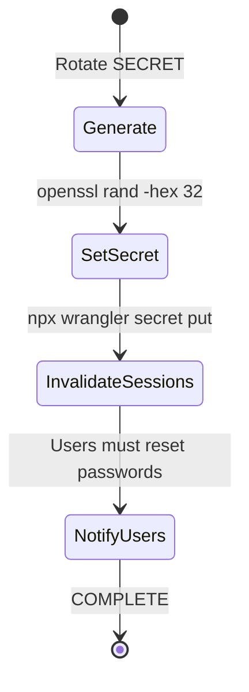

If `SESSION_SECRET` is compromised or missing:

```bash
# Generate new secret
NEW_SECRET=$(openssl rand -hex 32)

# Set it in Cloudflare
npx wrangler secret put SESSION_SECRET <<< "$NEW_SECRET"

# All passwords must be reset after changing SECRET
# Users cannot login until they reset via /auth/reset-password
```

## Data Preservation Checklist

| Resource | Action | Priority |
|----------|--------|----------|
| User table in D1 | Export to CSV/JSON | 🔴 Critical |
| Session table in D1 | Can be discarded (sessions expire) | 🟢 Low |
| Stripe transactions in D1 | Sync to DynamoDB | 🔴 Critical |
| Admin notifications in D1 | Sync to DynamoDB | 🟡 Medium |
| R2 assets | Backup to S3 or local | 🔴 Critical |
| Analytics parquet files | Export to desired format | 🟡 Medium |

```bash
# Pre-rollback backup command
npx wrangler d1 export user-auth-db --output=d1-backup.sql
npx wrangler r2 object get cloudless-analytics --recursive --local-path ./backup/
```

## Emergency Procedures

### If Cloudflare Worker is Down

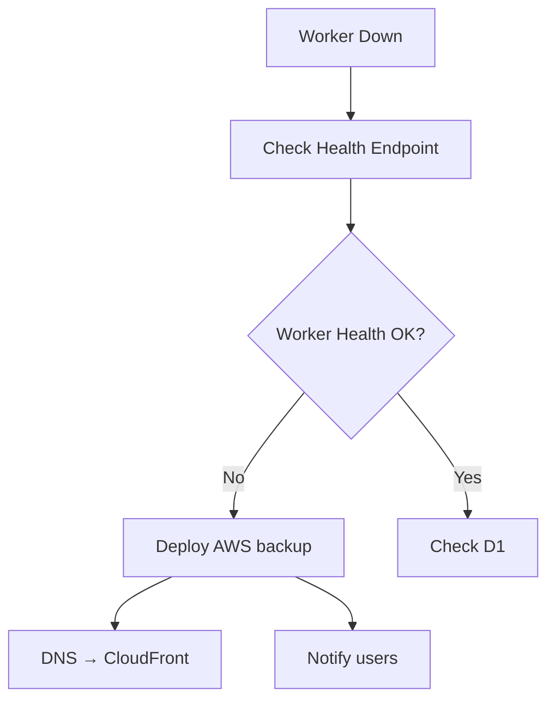

```bash
# Immediate: Point to backup AWS deployment
# 1. Deploy backup Lambda via SST
pnpm deploy

# 2. Update DNS to CloudFront
# Use Route53 or Cloudflare DNS

# 3. Notify users (if needed)
echo '{"error": "Temporary maintenance - please refresh"}' | curl -X POST -H "Content-Type: application/json" https://cloudless.gr/api/admin/notifications
```

### If D1 Database is Corrupted

```bash
# D1 has automatic backups every 24 hours
# Restore from backup:
npx wrangler d1 execute user-auth-db \
  --command="RESTORE FROM backup_timestamp"

# Or recreate from scratch:
npx wrangler d1 execute user-auth-db --file ./migrations/0001-auth-schema.sql --remote
pnpm migrate:dynamodb-to-d1  # Re-import users
```

## Verification Steps

After rollback, verify:

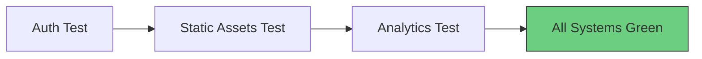

1. **Auth endpoints working:**

   ```bash
   curl -X POST https://cloudless.gr/api/auth/login \
     -H "Content-Type: application/json" \
     -d '{"email":"test@example.com","password":"test"}'
   ```

2. **Static assets loading:**

   ```bash
   curl -I https://cloudless.gr/assets/logo.png
   ```

3. **Analytics endpoints:**

   ```bash
   curl https://cloudless.gr/api/analytics/query
   ```

## Cache TTL Reference

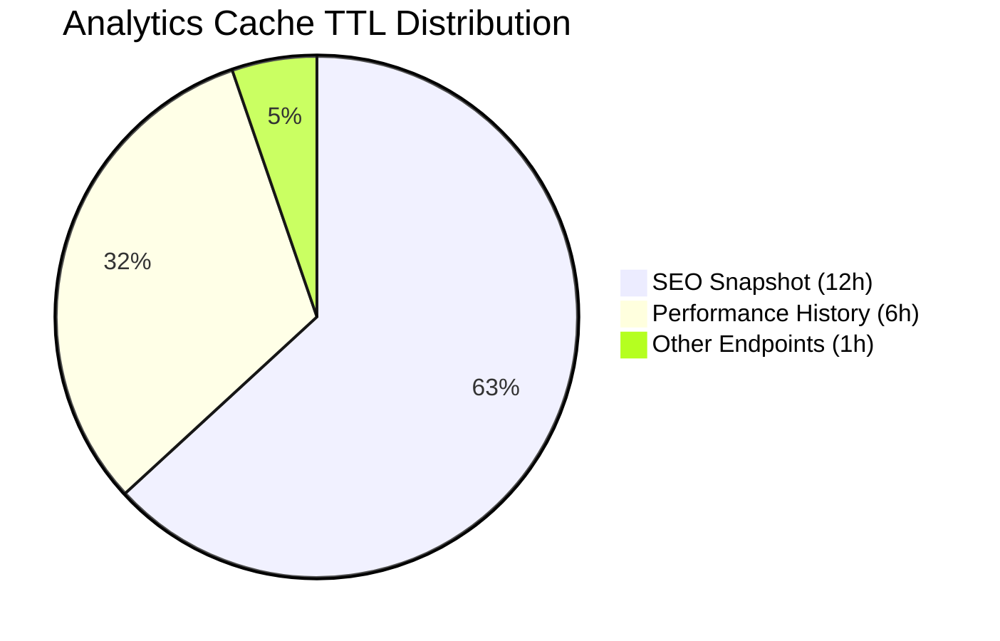

| Endpoint | TTL | Reason |
|----------|-----|--------|
| SEO Snapshot | 12 hours | Daily-changing data |
| Performance History | 6 hours | Weekly trends, less volatile |
| Top Keywords/Pages | 1 hour | Frequently changing |
| Device/Country Breakdown | 12 hours | Stable dimensions |

## Contact for Support

- **Primary:** tbaltzakis@cloudless.gr
- **Emergency:** See ops/ directory for on-call procedures
- **Status UI:** Check Cloudflare dashboard or AWS CloudWatch
