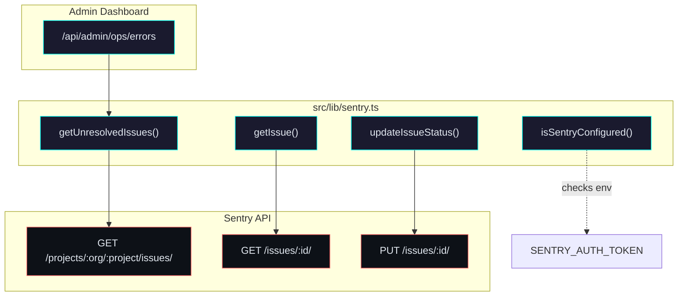
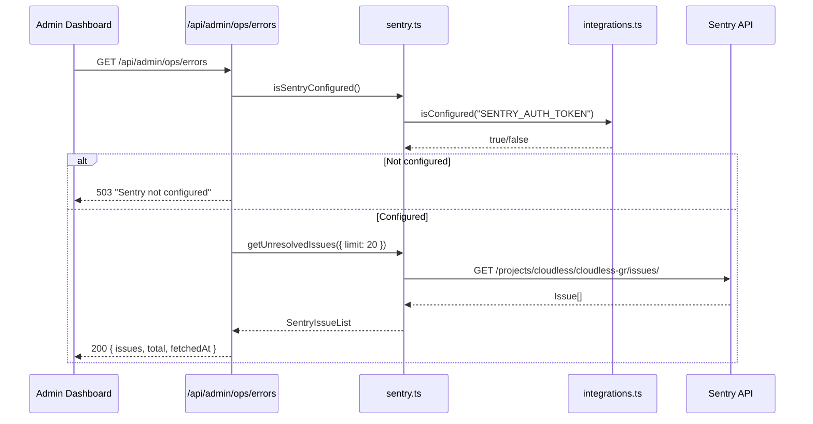

# Sentry Integration

Error tracking and monitoring via the [Sentry](https://sentry.io) API.

## Architecture



## API Flow



## Configuration

| Variable | Required | Default | Description |
|----------|----------|---------|-------------|
| `SENTRY_AUTH_TOKEN` | Yes | — | Internal integration or user auth token |
| `SENTRY_ORG` | No | `cloudless` | Sentry organization slug |
| `SENTRY_PROJECT` | No | `cloudless-gr` | Sentry project slug |

Set these in environment variables or add to SSM under `/cloudless/production/`.

## Functions

### `getUnresolvedIssues(options?)`

Fetches unresolved issues from the project. Options:

- `limit` — Max issues to return (default: 20)
- `sort` — Sort field: `date`, `new`, `freq`, `users` (default: `date`)
- `query` — Sentry search query (default: `is:unresolved`)

Returns `SentryIssueList | null`.

### `getIssue(issueId)`

Fetches a single issue by its Sentry ID. Returns `SentryIssue | null`.

### `updateIssueStatus(issueId, status)`

Updates an issue to `resolved`, `ignored`, or `unresolved`. Returns `boolean`.

### `isSentryConfigured()`

Returns `true` if `SENTRY_AUTH_TOKEN` is set.

## Error Handling

All functions return `null` on failure (graceful degradation pattern).
The admin route returns:

- **503** — Sentry not configured
- **502** — Sentry API unreachable or errored
- **200** — Success with issue list

## SentryIssue Shape

```typescript
interface SentryIssue {
  id: string;
  title: string;
  culprit: string;
  level: "fatal" | "error" | "warning" | "info" | "debug";
  count: string;
  userCount: number;
  firstSeen: string;
  lastSeen: string;
  status: "unresolved" | "resolved" | "ignored";
  permalink: string;
  shortId: string;
  metadata: {
    type?: string;
    value?: string;
    filename?: string;
    function?: string;
  };
}
```
