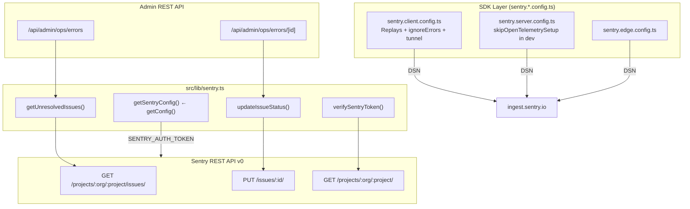
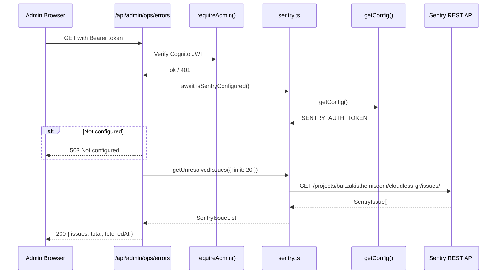

# Sentry Integration

cloudless.gr uses Sentry for error tracking and session replay. The integration has two layers:

1. **SDK** — `@sentry/nextjs` initialised in `sentry.*.config.ts`; captures unhandled errors, traces, and session replays automatically.
2. **REST API client** — `src/lib/sentry.ts`; lets the admin dashboard list, filter, and resolve Sentry issues without leaving the app.

> **Status:** Optional integration — all admin endpoints return 503 when `SENTRY_AUTH_TOKEN` is not configured. The SDK layer degrades gracefully when `NEXT_PUBLIC_SENTRY_DSN` is absent (no events sent).
>
> **Last verified:** 2026-05-01 — 15 unit tests pass (configured/not-configured, verifySentryToken, issue list, error counts, updateIssueStatus)

---

## Architecture



---

## Environment Variables

### Local development (`.env.local`)

```bash
# SDK — browser + server + edge
NEXT_PUBLIC_SENTRY_DSN=https://...@o0.ingest.sentry.io/...

# Admin REST API (issues panel)
SENTRY_AUTH_TOKEN=sntrys_...
SENTRY_ORG=baltzakisthemiscom
SENTRY_PROJECT=cloudless-gr
```

### Production (AWS SSM Parameter Store)

| Parameter path | Type | Notes |
|----------------|------|-------|
| `/cloudless/production/NEXT_PUBLIC_SENTRY_DSN` | String | Also set as `NEXT_PUBLIC_` env var at build time |
| `/cloudless/production/SENTRY_AUTH_TOKEN` | SecureString | Internal integration token — scopes: `project:read`, `project:write` |
| `/cloudless/production/SENTRY_ORG` | String | Default: `baltzakisthemiscom` |
| `/cloudless/production/SENTRY_PROJECT` | String | Default: `cloudless-gr` |

> `NEXT_PUBLIC_SENTRY_DSN` must be available at build time (Next.js bakes `NEXT_PUBLIC_*` vars into the client bundle). Set it both in SSM and as a plain env var in your CI/CD pipeline.

---

## SDK Configuration

Three config files initialise the SDK for each Next.js runtime:

| File | Runtime | Sample rate | Notes |
|------|---------|-------------|-------|
| `sentry.client.config.ts` | Browser | traces 10 %, replays 10 % (errors 100 %) | Session replay with `maskAllText` + `blockAllMedia`; `ignoreErrors` list for benign browser noise; tunnelled through `/monitoring` |
| `sentry.server.config.ts` | Node.js | traces 10 % | `skipOpenTelemetrySetup: true` in dev (Turbopack + OTel incompatibility) |
| `sentry.edge.config.ts` | Edge runtime | traces 5 % | Minimal config |

All three read `NEXT_PUBLIC_SENTRY_DSN`, `NODE_ENV`, and `NEXT_PUBLIC_APP_VERSION`.

---

## Admin API Endpoints

Both endpoints require a valid Cognito JWT with the `admin` group. Return 503 when `SENTRY_AUTH_TOKEN` is not configured.

### `GET /api/admin/ops/errors`

Returns the 20 most recently seen unresolved issues.

**Response:**
```json
{
  "issues": [{ "id": "...", "title": "...", "level": "error", "count": "42", ... }],
  "total": 20,
  "fetchedAt": "2026-05-01T12:00:00.000Z"
}
```

Returns 502 if the Sentry API is unreachable.

### `PUT /api/admin/ops/errors/[id]`

Update the status of a single issue.

**Body:** `{ "status": "resolved" | "ignored" | "unresolved" }`

**Response:** `{ "id": "...", "status": "resolved" }`

Returns 400 for missing/invalid body, 502 if the Sentry API call fails.

---

## `src/lib/sentry.ts` API

All functions call `getConfig()` from `ssm-config.ts` and return `null` / `false` / `[]` on unconfigured or API errors.

### `isSentryConfigured(): Promise<boolean>`

Returns `true` if `SENTRY_AUTH_TOKEN` is present in SSM / env.

### `verifySentryToken(): Promise<{ status, message? }>`

Pings `GET /projects/baltzakisthemiscom/cloudless-gr/` with the configured token.

| Status | Meaning |
|--------|---------|
| `valid` | Token accepted, project accessible |
| `rejected` | 401/403 — token invalid or missing `project:read` scope |
| `not_configured` | `SENTRY_AUTH_TOKEN` not set |
| `error` | Network failure or non-auth HTTP error |

### `getUnresolvedIssues(options?): Promise<SentryIssueList | null>`

| Option | Default | Notes |
|--------|---------|-------|
| `limit` | 20 | Max issues |
| `sort` | `"date"` | `date` \| `new` \| `freq` \| `users` |
| `query` | `"is:unresolved"` | Sentry search query |
| `level` | — | Filter: `fatal` \| `error` \| `warning` \| `info` \| `debug` |

### `getTopErrors(limit?): Promise<SentryIssue[]>`

Top errors sorted by frequency (most impactful first). Default limit 5. Returns `[]` when unconfigured.

### `getErrorCounts(): Promise<{ fatal, error, warning, total } | null>`

Aggregates severity counts across up to 100 unresolved issues.

### `updateIssueStatus(issueId, status): Promise<boolean>`

PATCH a single issue to `"resolved"`, `"ignored"`, or `"unresolved"`. Returns `true` on success.

Also available as typed shorthands: `resolveIssue(id)`, `ignoreIssue(id)`, `resolveInRelease(id, version)`.

---

## Request Flow



---

## Running Tests

```bash
pnpm test -- --reporter=verbose __tests__/sentry.test.ts
```

Test coverage (15 tests):

| Area | Tests |
|------|-------|
| `isSentryConfigured` | configured → true, missing token → false |
| `verifySentryToken` | not_configured, valid (200), rejected (401), error (500) |
| `getUnresolvedIssues` | null when unconfigured, returns list + total + fetchedAt, null on network error, null on 401 |
| `getTopErrors` | empty when unconfigured, returns issues |
| `getErrorCounts` | null when unconfigured, counts by level (fatal/error/warning/total) |
| `updateIssueStatus` | true on success, false when status mismatch |

---

## Security Notes

- **Auth required:** Both admin endpoints protected by `requireAdmin()` (Cognito JWT + `admin` group).
- **Token scopes:** `SENTRY_AUTH_TOKEN` needs `project:read` (list/get issues) and `project:write` (update status). Use an Internal Integration token in Sentry settings, not a personal auth token.
- **Token in SSM SecureString:** Never commit `SENTRY_AUTH_TOKEN` — store as SecureString.
- **503 guard fixed:** `isSentryConfigured()` is `async` — both routes use `await` to ensure the 503 path fires correctly when unconfigured.
- **DSN is public:** `NEXT_PUBLIC_SENTRY_DSN` is baked into the client bundle (by design — it identifies the project, not an auth credential).

---

## Key Files

| File | Purpose |
|------|---------|
| `src/lib/sentry.ts` | REST API client — issue queries, status updates, token verification |
| `sentry.client.config.ts` | Browser SDK: session replay, ignoreErrors, tunnel |
| `sentry.server.config.ts` | Node.js SDK: OTel workaround for dev/Turbopack |
| `sentry.edge.config.ts` | Edge runtime SDK |
| `src/app/api/admin/ops/errors/route.ts` | GET unresolved issues |
| `src/app/api/admin/ops/errors/[id]/route.ts` | PUT update issue status |
| `src/app/[locale]/admin/errors/page.tsx` | Admin errors panel UI |
| `__tests__/sentry.test.ts` | Unit tests |
