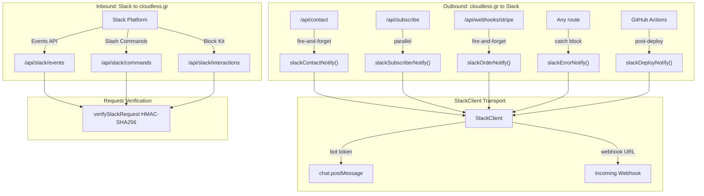
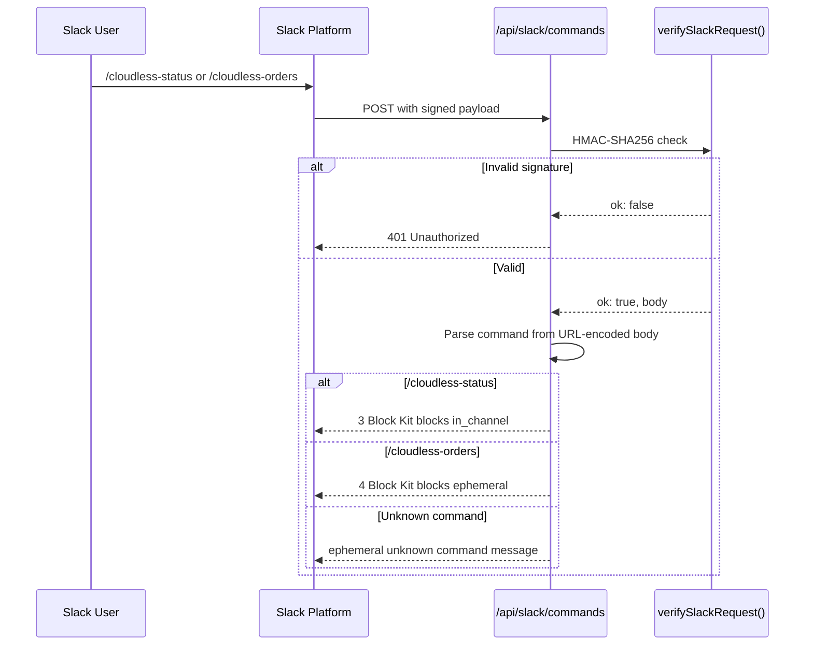
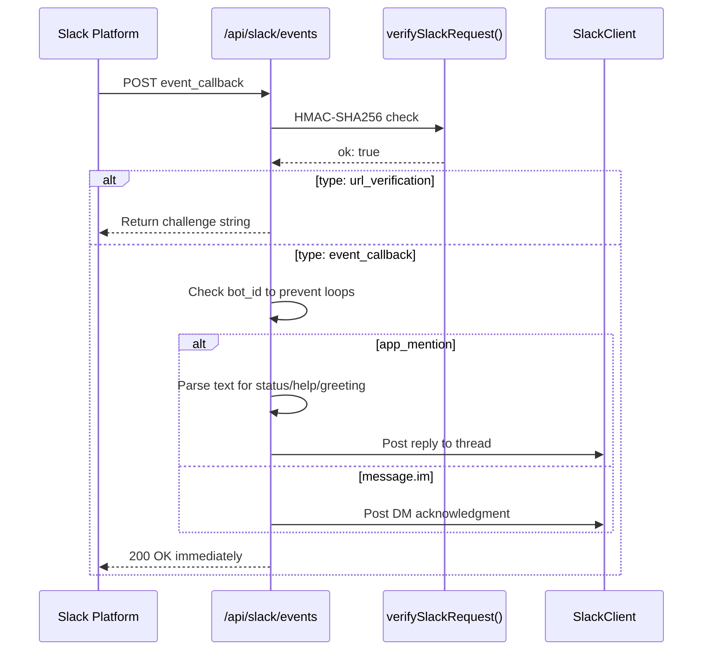
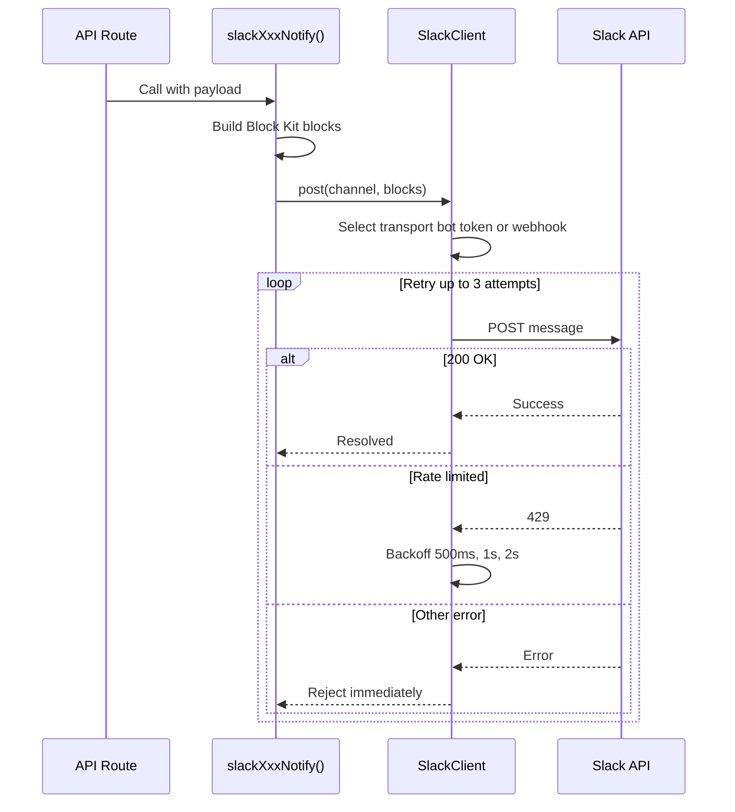

# Slack Integration

cloudless.gr uses a Slack app for two-way communication: outbound notifications (contact form submissions, new subscribers, orders, errors, deploys) and inbound commands (status checks, order lookups).

> **Last verified:** 2026-04-09 — all 56 Slack unit tests pass, all 12 integration tests pass (signed requests, unsigned rejection, webhook delivery).

---

## Architecture



**Key files:**

| File | Purpose |
|------|---------|
| `src/lib/integrations.ts` | Config loader — reads `SLACK_BOT_TOKEN`, `SLACK_SIGNING_SECRET`, `SLACK_WEBHOOK_URL` from env |
| `src/lib/slack-notify.ts` | `SlackClient` with retry/backoff; all outbound notifiers |
| `src/lib/slack-verify.ts` | Request signature verification (HMAC-SHA256 + timestamp check) |
| `src/app/api/slack/events/route.ts` | Events API handler |
| `src/app/api/slack/commands/route.ts` | Slash command handler |
| `src/app/api/slack/interactions/route.ts` | Block Kit interaction handler |
---

## Environment Variables

### Local development (`.env.local`)

```bash
# Bot OAuth token — required for chat.postMessage and Events API responses.
# Get it from: Slack App → OAuth & Permissions → Bot User OAuth Token
SLACK_BOT_TOKEN=xoxb-...

# Signing secret — required to verify every inbound Slack request.
# Get it from: Slack App → Basic Information → App Credentials → Signing Secret
SLACK_SIGNING_SECRET=...

# Incoming webhook URL — simpler alternative for outbound-only notifications.
# Only needed if you want notifications without a bot token.
# Get it from: Slack App → Incoming Webhooks → Add New Webhook
SLACK_WEBHOOK_URL=https://hooks.slack.com/services/T.../B.../...

# Default channel for bot-initiated messages (used by SlackClient)
SLACK_DEFAULT_CHANNEL=#general
```

### Production (AWS SSM Parameter Store)

Add the same keys under `/cloudless/production/`:

```
/cloudless/production/SLACK_BOT_TOKEN       SecureString
/cloudless/production/SLACK_SIGNING_SECRET  SecureString
/cloudless/production/SLACK_WEBHOOK_URL     SecureString
```

Then update `src/lib/ssm-config.ts` to fetch and pass these to `integrations.ts`, or ensure your deploy pipeline injects them as environment variables before the Next.js server starts.
---

## Slack App Setup

### 1. Create the App

Go to [api.slack.com/apps](https://api.slack.com/apps) → **Create New App** → **From scratch**.

Name: `Cloudless Bot`
Workspace: your workspace

### 2. OAuth Scopes

**OAuth & Permissions → Scopes → Bot Token Scopes:**

| Scope | Purpose |
|-------|---------|
| `chat:write` | Send messages |
| `commands` | Register slash commands |
| `app_mentions:read` | Receive @mentions |
| `im:history` | Read DMs sent to the bot |
| `im:read` | View DM channels |

### 3. Event Subscriptions

**Event Subscriptions → Enable Events → On**

Request URL:
```
https://cloudless.gr/api/slack/events
```

Slack will POST a `url_verification` challenge. The route responds automatically.

**Subscribe to bot events:**
- `app_mention` — bot was @mentioned in a channel
- `message.im` — message sent directly to the bot
### 4. Slash Commands

**Slash Commands → Create New Command** (repeat for each):

| Command | Request URL | Description |
|---------|-------------|-------------|
| `/cloudless-status` | `https://cloudless.gr/api/slack/commands` | App health check |
| `/cloudless-orders` | `https://cloudless.gr/api/slack/commands` | Recent store orders |

### 5. Interactivity

**Interactivity & Shortcuts → Interactivity → On**

Request URL:
```
https://cloudless.gr/api/slack/interactions
```

### 6. Install the App

**OAuth & Permissions → Install to Workspace**

Copy the **Bot User OAuth Token** (`xoxb-...`) into `SLACK_BOT_TOKEN`.

---

## Slash Commands Reference



### `/cloudless-status`

Returns app health in the channel (visible to everyone — `response_type: in_channel`).

**Response (3 Block Kit blocks):**
- Header: "✅ cloudless.gr Status"
- Section with fields: Version, Uptime, API status, Store status
- Context: Slack-formatted timestamp

### `/cloudless-orders`

Returns an ephemeral message (visible only to the user — `response_type: ephemeral`) with links to the Stripe Dashboard and the store.

**Response (4 Block Kit blocks):**
- Header: "🧾 Recent Orders"
- Section with explanation text
- Actions: "Open Stripe Dashboard" (primary) + "View Store" buttons
- Context: "Requested by @user"

> To show live order data, wire up a Stripe API call in `handleOrders()` inside `src/app/api/slack/commands/route.ts`.
---

## Events Handled



### `app_mention`

Triggered when someone @mentions the bot in a channel.

- If message contains **"status"** → responds with system status
- If message contains **"help"** → responds with command list
- Otherwise → generic greeting

Replies are threaded to the original message.

### `message.im`

Triggered when someone DMs the bot. Responds with a hint to use slash commands.

Bot messages (identified by `bot_id`) are always ignored to prevent feedback loops.

---

## Outbound Notifications



All outbound notifications use the `SlackClient` class, which automatically selects bot token or webhook transport and retries with exponential backoff.

### `slackContactNotify({ name, email, company?, service?, message })`

Called from `/api/contact` as **fire-and-forget** via `Promise.allSettled` (runs in paral