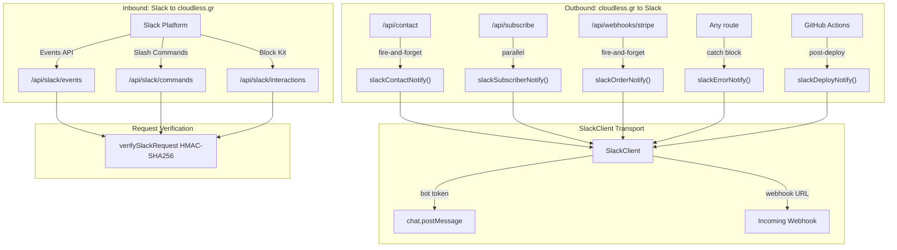
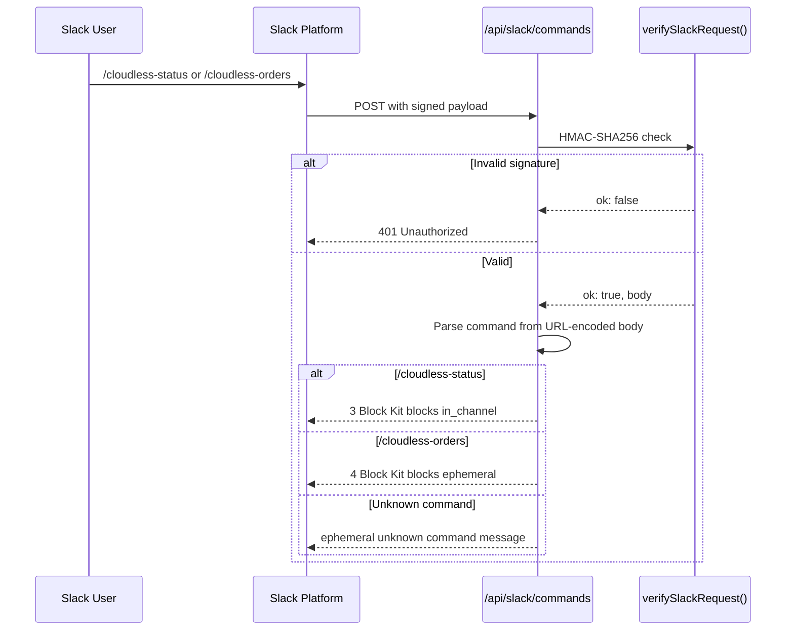
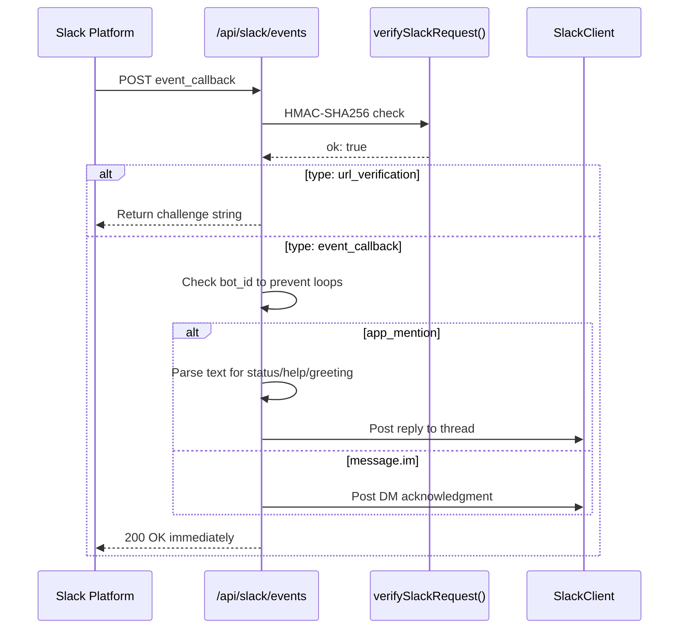
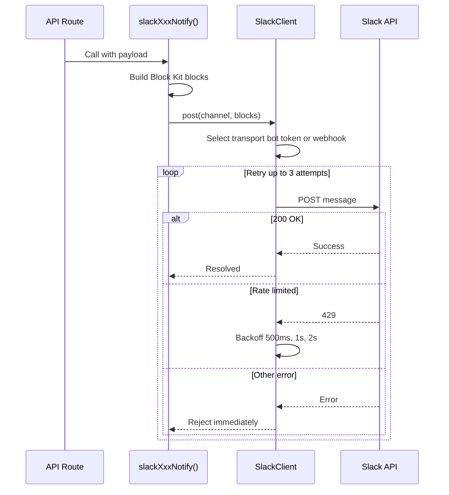
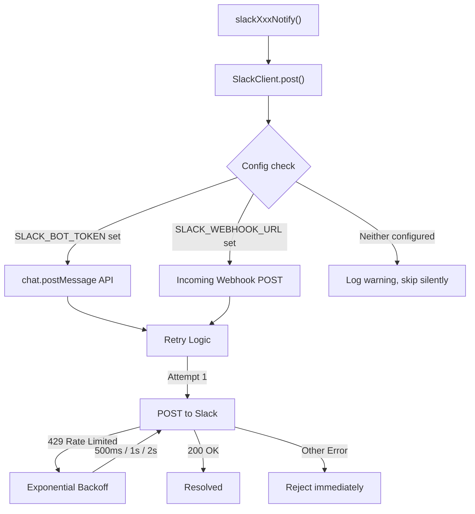

# Slack Integration

cloudless.gr uses a Slack app for two-way communication: outbound notifications (contact form submissions, new subscribers, orders, errors, deploys) and inbound commands (status checks, order lookups).

> **Last verified:** 2026-04-09 — all 56 Slack unit tests pass, all 12 integration tests pass (signed requests, unsigned rejection, webhook delivery).

---

## Architecture



**Key files:**

| File | Purpose |
|------|---------|
| `src/lib/integrations.ts` | Config loader — reads `SLACK_BOT_TOKEN`, `SLACK_SIGNING_SECRET`, `SLACK_WEBHOOK_URL` from env |
| `src/lib/slack-notify.ts` | `SlackClient` with retry/backoff; all outbound notifiers |
| `src/lib/slack-verify.ts` | Request signature verification (HMAC-SHA256 + timestamp check) |
| `src/app/api/slack/events/route.ts` | Events API handler |
| `src/app/api/slack/commands/route.ts` | Slash command handler |
| `src/app/api/slack/interactions/route.ts` | Block Kit interaction handler |
---

## Environment Variables

### Local development (`.env.local`)

```bash
# Bot OAuth token — required for chat.postMessage and Events API responses.
# Get it from: Slack App → OAuth & Permissions → Bot User OAuth Token
SLACK_BOT_TOKEN=xoxb-...

# Signing secret — required to verify every inbound Slack request.
# Get it from: Slack App → Basic Information → App Credentials → Signing Secret
SLACK_SIGNING_SECRET=...

# Incoming webhook URL — simpler alternative for outbound-only notifications.
# Only needed if you want notifications without a bot token.
# Get it from: Slack App → Incoming Webhooks → Add New Webhook
SLACK_WEBHOOK_URL=https://hooks.slack.com/services/T.../B.../...

# Default channel for bot-initiated messages (used by SlackClient)
SLACK_DEFAULT_CHANNEL=#general
```

### Production (AWS SSM Parameter Store)

Add the same keys under `/cloudless/production/`:

```
/cloudless/production/SLACK_BOT_TOKEN       SecureString
/cloudless/production/SLACK_SIGNING_SECRET  SecureString
/cloudless/production/SLACK_WEBHOOK_URL     SecureString
```

Then update `src/lib/ssm-config.ts` to fetch and pass these to `integrations.ts`, or ensure your deploy pipeline injects them as environment variables before the Next.js server starts.
---

## Slack App Setup

### 1. Create the App

Go to [api.slack.com/apps](https://api.slack.com/apps) → **Create New App** → **From scratch**.

Name: `Cloudless Bot`
Workspace: your workspace

### 2. OAuth Scopes

**OAuth & Permissions → Scopes → Bot Token Scopes:**

| Scope | Purpose |
|-------|---------|
| `chat:write` | Send messages |
| `commands` | Register slash commands |
| `app_mentions:read` | Receive @mentions |
| `im:history` | Read DMs sent to the bot |
| `im:read` | View DM channels |

### 3. Event Subscriptions

**Event Subscriptions → Enable Events → On**

Request URL:
```
https://cloudless.gr/api/slack/events
```

Slack will POST a `url_verification` challenge. The route responds automatically.

**Subscribe to bot events:**
- `app_mention` — bot was @mentioned in a channel
- `message.im` — message sent directly to the bot
### 4. Slash Commands

**Slash Commands → Create New Command** (repeat for each):

| Command | Request URL | Description |
|---------|-------------|-------------|
| `/cloudless-status` | `https://cloudless.gr/api/slack/commands` | App health check |
| `/cloudless-orders` | `https://cloudless.gr/api/slack/commands` | Recent store orders |

### 5. Interactivity

**Interactivity & Shortcuts → Interactivity → On**

Request URL:
```
https://cloudless.gr/api/slack/interactions
```

### 6. Install the App

**OAuth & Permissions → Install to Workspace**

Copy the **Bot User OAuth Token** (`xoxb-...`) into `SLACK_BOT_TOKEN`.

---

## Slash Commands Reference



### `/cloudless-status`

Returns app health in the channel (visible to everyone — `response_type: in_channel`).

**Response (3 Block Kit blocks):**
- Header: "✅ cloudless.gr Status"
- Section with fields: Version, Uptime, API status, Store status
- Context: Slack-formatted timestamp

### `/cloudless-orders`

Returns an ephemeral message (visible only to the user — `response_type: ephemeral`) with links to the Stripe Dashboard and the store.

**Response (4 Block Kit blocks):**
- Header: "🧾 Recent Orders"
- Section with explanation text
- Actions: "Open Stripe Dashboard" (primary) + "View Store" buttons
- Context: "Requested by @user"

> To show live order data, wire up a Stripe API call in `handleOrders()` inside `src/app/api/slack/commands/route.ts`.
---

## Events Handled



### `app_mention`

Triggered when someone @mentions the bot in a channel.

- If message contains **"status"** → responds with system status
- If message contains **"help"** → responds with command list
- Otherwise → generic greeting

Replies are threaded to the original message.

### `message.im`

Triggered when someone DMs the bot. Responds with a hint to use slash commands.

Bot messages (identified by `bot_id`) are always ignored to prevent feedback loops.

---

## Outbound Notifications



All outbound notifications use the `SlackClient` class, which automatically selects bot token or webhook transport and retries with exponential backoff.

### `slackContactNotify({ name, email, company?, service?, message })`

Called from `/api/contact` as **fire-and-forget** via `Promise.allSettled` (runs in parallel with HubSpot CRM upsert). Does not block the API response.

Block Kit message includes:
- Header: "📨 New Contact Form Submission"
- Fields: Name, Email, Company, Service
- Full message text (truncated to 2000 chars)
- Slack-formatted timestamp + source label
### `slackSubscriberNotify(email)`

Called automatically from `/api/subscribe` in parallel with the SES email notification.

Block Kit message includes:
- Header: "New Newsletter Subscriber"
- Email address
- Slack timestamp with date/time

### `slackOrderNotify({ email, amount, sessionId })`

Called from `/api/webhooks/stripe` when a checkout is completed.

Block Kit message includes:
- Header: "💰 New Order"
- Customer email, amount, and truncated Stripe session ID
- Slack-formatted timestamp + source label

### `slackErrorNotify({ title, message, route?, error? })`

Call this from any route handler to surface unexpected errors in Slack.

```typescript
import { slackErrorNotify } from "@/lib/slack-notify";

try {
  // ...
} catch (err) {
  await slackErrorNotify({
    title: "Checkout failed",
    message: "Stripe session could not be created",
    route: "/api/checkout",
    error: err,
  });
}
```
### `slackDeployNotify({ version, stage, status, actor?, commitSha? })`

Call from your CI/CD pipeline (GitHub Actions, SST, etc.) to post deploy status.

```typescript
import { slackDeployNotify } from "@/lib/slack-notify";

await slackDeployNotify({
  version: process.env.APP_VERSION ?? "unknown",
  stage: "production",
  status: "succeeded",
  actor: "github-actions",
  commitSha: process.env.GITHUB_SHA,
});
```

Status values: `"started"` | `"succeeded"` | `"failed"`

---

## SlackClient Internals



The `SlackClient` class (in `src/lib/slack-notify.ts`) selects the transport automatically:

1. **Bot token** (`SLACK_BOT_TOKEN`) → uses `chat.postMessage` API
2. **Webhook URL** (`SLACK_WEBHOOK_URL`) → uses incoming webhook
3. **Neither configured** → skips silently, logs a warning at startup

**Retry policy:** Up to 3 attempts with exponential backoff (500 ms, 1 000 ms, 2 000 ms). `ratelimited` errors from the Slack API are retried; all other Slack API errors stop immediately.

**Legacy API:** `slackNotify(message)` is still available for backward compatibility but deprecated in favor of `SlackClient.post()`.

**Cache:** Integration config and Slack config are cached in module-level variables. Call `resetSlackConfigCache()` in tests to clear.
---

## Local Testing with ngrok

To receive Slack events and test slash commands locally:

```bash
# 1. Start the dev server
pnpm dev   # runs on port 4000

# 2. In another terminal, start ngrok
ngrok http 4000

# 3. Copy the HTTPS forwarding URL, e.g.:
#    https://abc123.ngrok-free.app

# 4. In your Slack app settings, temporarily update:
#    Event Subscriptions → Request URL:
#      https://abc123.ngrok-free.app/api/slack/events
#    Slash Commands → Request URL (each):
#      https://abc123.ngrok-free.app/api/slack/commands
#    Interactivity → Request URL:
#      https://abc123.ngrok-free.app/api/slack/interactions

# 5. Set SLACK_BOT_TOKEN and SLACK_SIGNING_SECRET in .env.local
#    (restart the dev server after adding them)
```

> ngrok URLs change on every restart unless you have a paid plan with reserved domains. Update Slack app settings each session, or use a static domain.

---

## Running Tests

### Unit tests (Vitest)

```bash
# All Slack-related tests
pnpm test -- --reporter=verbose __tests__/slack/

# Individual test files
pnpm test -- __tests__/slack/slack-verify.test.ts
pnpm test -- __tests__/slack/slack-notify.test.ts
pnpm test -- __tests__/slack/slack-events.test.ts
pnpm test -- __tests__/slack/slack-commands.test.ts
pnpm test -- __tests__/slack/slack-interactions.test.ts
```
Test coverage (56 tests total):

| File | Tests | What is tested |
|------|-------|---------------|
| `slack-verify.test.ts` | 10 | Valid signature, expired timestamp, wrong secret, missing headers, future timestamp, 401 helper |
| `slack-notify.test.ts` | 21 | SlackClient via API and webhook, retry with backoff, no-config no-op, all five notifiers' Block Kit output |
| `slack-events.test.ts` | 8 | URL challenge, app_mention responses (status/help/default), bot loop prevention, DM handling, unknown events, invalid JSON |
| `slack-commands.test.ts` | 8 | /cloudless-status fields + response_type, /cloudless-orders buttons + response_type, unknown command, 401 on bad signature |
| `slack-interactions.test.ts` | 9 | Button actions (open_stripe_dashboard, open_store), empty actions, view_submission, unknown type, missing/invalid payload field |

### Integration tests (curl/Node.js against running dev server)

Start the dev server (`pnpm dev`) and run:

```bash
node /path/to/slack-test.mjs
```

The integration test script verifies all endpoints with properly signed HMAC-SHA256 requests and confirms unsigned requests are rejected with 401.

---

## Security Notes

- **Signature verification** uses constant-time comparison (`crypto.timingSafeEqual`) to prevent timing attacks.
- **Replay protection** rejects any request with a timestamp older than 5 minutes.
- **Token isolation** — all tokens are read from environment variables, never hardcoded. The `integrations.ts` config cache prevents repeated env reads.
- **Bot loop prevention** — the events handler checks for `bot_id` and skips all bot-originated messages.
- **Input sanitization** — contact form data is passed through Block Kit's `mrkdwn` format (not raw HTML), and message text is truncated to 2000 characters.
