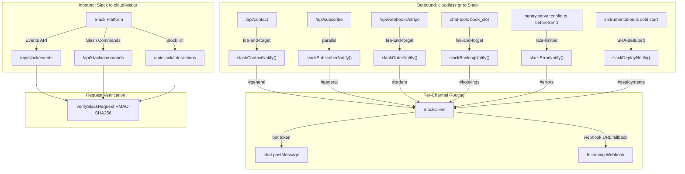
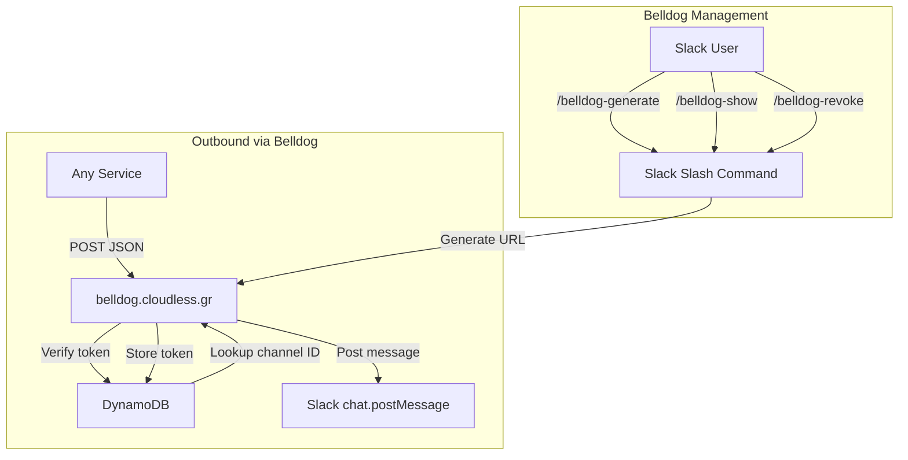
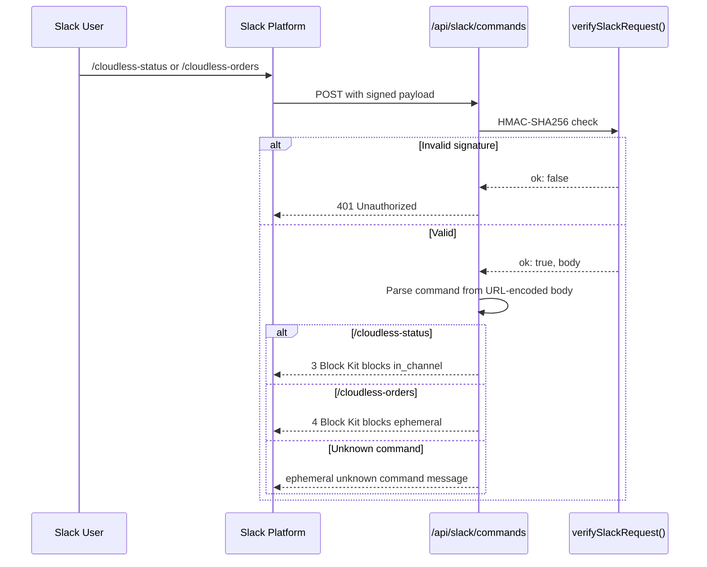
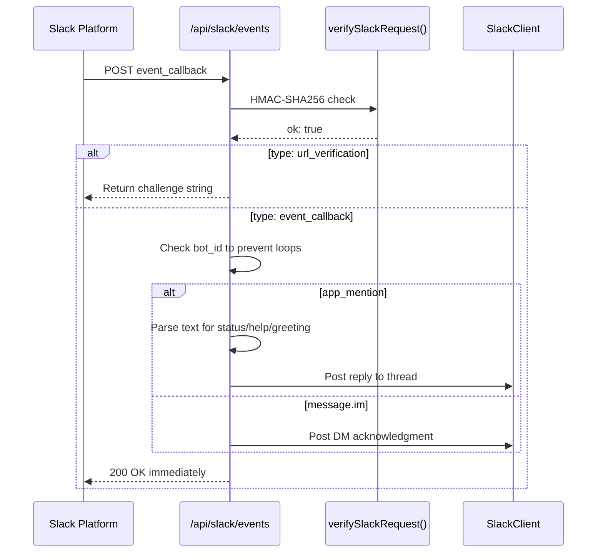
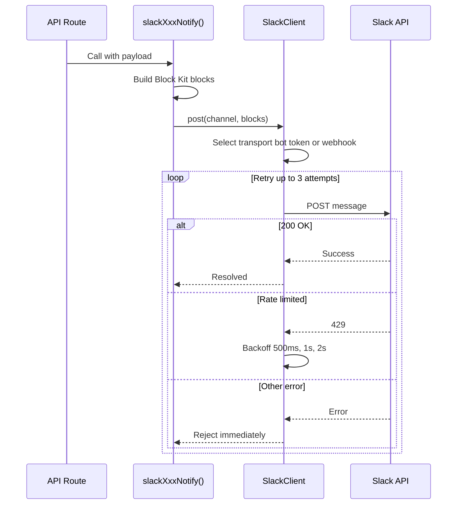
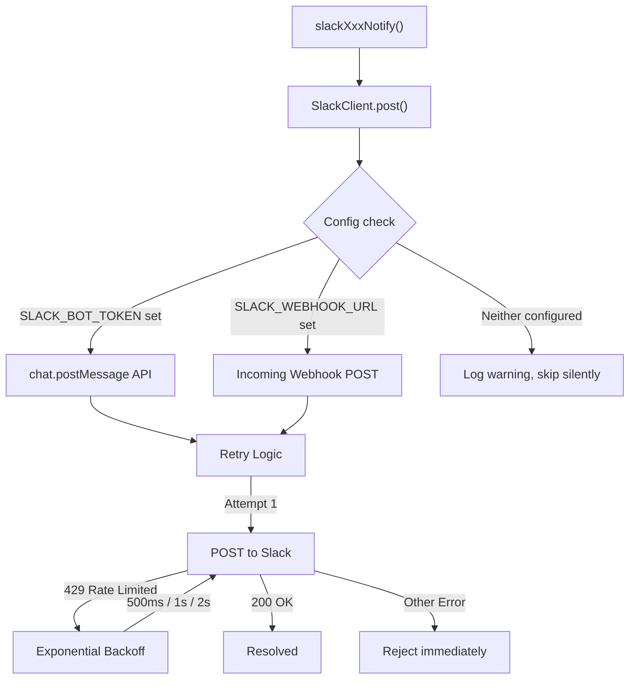

# Slack Integration

cloudless.gr uses a Slack app for two-way communication: outbound notifications (contact form submissions, new subscribers, orders, errors, deploys) and inbound commands (status checks, order lookups).

> **Last verified:** 2026-07-03 — Added Belldog self-hosted Slack webhook proxy for simplified webhook management, channel rename protection, and token rotation.

---

## Architecture Options

### Option 1: Direct Slack Integration (Recommended for most)
See the standard integration section below. Uses your Slack app's bot token for all outbound notifications.

### Option 2: Belldog Self-Hosted Proxy (NEW!)
**Use Belldog if you need to:**
- Generate webhook URLs dynamically without hardcoding them in services
- Handle channel renames gracefully
- Rotate tokens without updating service configs
- Centralize Slack webhook management

> **Advantages over direct webhooks:**
> - Channel-agnostic: Generate token once, use for any channel
> - Token rotation: Easy migration without updating services
> - Channel rename protection: Belldog tracks channel IDs
> - Centralized management: All tokens in DynamoDB
> - Security: Tokens not exposed in service configs

---

## Architecture: Direct Slack Integration

---

## Architecture


```mermaid
graph TB
    subgraph Outbound["Outbound: cloudless.gr to Slack"]
        direction LR
        C_API["/api/contact"] -->|fire-and-forget| SCN["slackContactNotify()"]
        S_API["/api/subscribe"] -->|parallel| SSN["slackSubscriberNotify()"]
        W_API["/api/webhooks/stripe"] -->|fire-and-forget| SON["slackOrderNotify()"]
        CT["chat-tools book_slot"] -->|fire-and-forget| SBN["slackBookingNotify()"]
        Sentry["sentry.server.config.ts beforeSend"] -->|rate-limited| SEN["slackErrorNotify()"]
        Instr["instrumentation.ts cold start"] -->|SHA-deduped| SDN["slackDeployNotify()"]
    end
    subgraph Channels["Per-Channel Routing"]
        SCN -->|#general| SC["SlackClient"]
        SSN -->|#general| SC
        SON -->|#orders| SC
        SBN -->|#bookings| SC
        SEN -->|#errors| SC
        SDN -->|#deployments| SC
        SC -->|bot token| API["chat.postMessage"]
        SC -->|webhook URL fallback| WH["Incoming Webhook"]
    end

    subgraph Inbound["Inbound: Slack to cloudless.gr"]
        direction LR
        SL["Slack Platform"] -->|Events API| EVT["/api/slack/events"]
        SL -->|Slash Commands| CMD["/api/slack/commands"]
        SL -->|Block Kit| INT["/api/slack/interactions"]
    end

    subgraph Verify["Request Verification"]
        EVT --> V["verifySlackRequest HMAC-SHA256"]
        CMD --> V
        INT --> V
    end
```


```mermaid
graph TB
    subgraph Outbound["Outbound via Belldog"]
        direction LR
        Service["Any Service"] -->|POST JSON| Belldog["belldog.cloudless.gr"]
        Belldog -->|Verify token| DynamoDB["DynamoDB"]
        DynamoDB -->|Lookup channel ID| Belldog
        Belldog -->|Post message| SlackAPI["Slack chat.postMessage"]
    end
    subgraph Management["Belldog Management"]
        User["Slack User"] -->|/belldog-generate| BelldogSlash["Slack Slash Command"]
        BelldogSlash -->|Generate URL| Belldog
        Belldog -->|Store token| DynamoDB
        User -->|/belldog-show| BelldogSlash
        User -->|/belldog-revoke| BelldogSlash
    end
```

**Key files:**

| File | Purpose |
|------|---------|
| `belldog/namespace.yaml` | Kubernetes namespace `belldog` |
| `belldog/configmap.yaml` | Belldog configuration |
| `belldog/deployment.yaml` | Belldog deployment |
| `belldog/service.yaml` | ClusterIP service |
| `belldog/ingress.yaml` | Nginx ingress (belldog.cloudless.gr) |
| `belldog/belldog-secrets.yaml` | Slack credentials (create with your values) |
| `belldog/SETUP-GUIDE.md` | Complete setup instructions |

---

## Belldog Self-Hosted Slack Proxy

**Location:** `belldog/` directory in project root

### What It Does
Belldog is a self-hosted Slack webhook proxy that:
- Generates webhook URLs with slash commands (`/belldog-generate`)
- Manages tokens and channels in DynamoDB
- Proxies webhooks from any service to Slack
- Handles channel renames and token migrations

### When to Use Belldog
- You need to share webhook URLs across multiple services
- You want to avoid hardcoding secrets in service configs
- You have channel renames that break webhooks
- You want centralized Slack webhook management

### Setup
See `belldog/SETUP-GUIDE.md` for complete setup instructions.

### Key Endpoints

| Endpoint | Method | Description |
|----------|--------|-------------|
| `/` | GET | Health check |
| `/slash` | POST | Slash command handler (all commands) |
| `/p/:channel/:token` | POST | Webhook proxy - posts message to channel |

### Slash Commands

| Command | Description |
|---------|-------------|
| `/belldog-generate` | Generate new webhook URL for current channel |
| `/belldog-show` | List all tokens in current channel |
| `/belldog-regenerate` | Generate another token (old remains valid) |
| `/belldog-revoke` | Revoke a token |
| `/belldog-revoke-renamed` | Revoke after channel rename |

### Configuration

**ConfigMap values (`belldog/configmap.yaml`):**
- `DDB_TABLE_NAME`: DynamoDB table for token storage (default: `belldog-tokens`)
- `MODE`: Operation mode - `proxy` (default) or `standalone`
- `OPS_NOTIFICATION_CHANNEL_NAME`: Default channel for ops alerts (default: `alerts`)

**Secrets (`belldog/belldog-secrets.yaml`):**
- `SLACK_TOKEN`: Bot OAuth token (`xoxb-...`)
- `SLACK_SIGNING_SECRET`: Slack signing secret

### Deployment
```bash
kubectl apply -f belldog/namespace.yaml
kubectl apply -f belldog/belldog-secrets.yaml  # Update with your Slack creds first!
kubectl apply -f belldog/configmap.yaml
kubectl apply -f belldog/deployment.yaml
kubectl apply -f belldog/service.yaml
kubectl apply -f belldog/ingress.yaml
```

### Testing
```bash
# Test slash command
/belldog-generate  # In any Slack channel

# Test webhook URL
curl -XPOST --json '{"text":"Hello from Belldog!"}' \
  'https://belldog.cloudless.gr/p/mychannel/abc123xyz/'
```

---

## Architecture: Belldog Proxy Flow

---

## Environment Variables

### Local development (`.env.local`)

```bash
# Bot OAuth token — required for chat.postMessage and Events API responses.
# Get it from: Slack App → OAuth & Permissions → Bot User OAuth Token
SLACK_BOT_TOKEN=xoxb-...

# Signing secret — required to verify every inbound Slack request.
# Get it from: Slack App → Basic Information → App Credentials → Signing Secret
SLACK_SIGNING_SECRET=...

# Incoming webhook URL — simpler alternative for outbound-only notifications.
# Only needed if you want notifications without a bot token.
# Get it from: Slack App → Incoming Webhooks → Add New Webhook
SLACK_WEBHOOK_URL=https://hooks.slack.com/services/T.../B.../...

# Default channel for bot-initiated messages (used by SlackClient)
SLACK_DEFAULT_CHANNEL=#general
```

### Production (AWS SSM Parameter Store)

In Lambda the env vars are not set; SSM is the source of truth. `slack-notify.ts`
and the Events route both call `getSlackConfigAsync()` which falls back to SSM
when `SLACK_SIGNING_SECRET` is missing from `process.env`. Add the same keys
under `/cloudless/production/`:

```
/cloudless/production/SLACK_BOT_TOKEN       SecureString
/cloudless/production/SLACK_SIGNING_SECRET  SecureString
/cloudless/production/SLACK_WEBHOOK_URL     SecureString
```

> **Note:** `SlackClient.post()` resolves config lazily on every call (cached
> after the first SSM lookup). It does **not** capture the token in the
> constructor, so the module-level `const client = new SlackClient()` works
> correctly even when env vars aren't populated at module-load time.

---

## Slack App Setup

### 1. Create the App

Go to [api.slack.com/apps](https://api.slack.com/apps) → **Create New App** → **From scratch**.

Name: `Cloudless Bot`
Workspace: your workspace

### 2. OAuth Scopes

**OAuth & Permissions → Scopes → Bot Token Scopes:**

| Scope | Purpose |
|-------|---------|
| `chat:write` | Send messages |
| `commands` | Register slash commands |
| `app_mentions:read` | Receive @mentions |
| `im:history` | Read DMs sent to the bot |
| `im:read` | View DM channels |

### 3. Event Subscriptions

**Event Subscriptions → Enable Events → On**

Request URL:

```
https://cloudless.gr/api/slack/events
```

Slack will POST a `url_verification` challenge. The route responds automatically.

**Subscribe to bot events:**

- `app_mention` — bot was @mentioned in a channel
- `message.im` — message sent directly to the bot

### 4. Slash Commands

**Slash Commands → Create New Command** (repeat for each):

| Command | Request URL | Description |
|---------|-------------|-------------|
| `/cloudless-status` | `https://cloudless.gr/api/slack/commands` | App health check |
| `/cloudless-orders` | `https://cloudless.gr/api/slack/commands` | Recent store orders |

### 5. Interactivity

**Interactivity & Shortcuts → Interactivity → On**

Request URL:

```
https://cloudless.gr/api/slack/interactions
```

### 6. Install the App

**OAuth & Permissions → Install to Workspace**

Copy the **Bot User OAuth Token** (`xoxb-...`) into `SLACK_BOT_TOKEN`.

---

## Slash Commands Reference


```mermaid
sequenceDiagram
    participant User as Slack User
    participant Slack as Slack Platform
    participant Cmd as /api/slack/commands
    participant Verify as verifySlackRequest()

    User->>Slack: /cloudless-status or /cloudless-orders
    Slack->>Cmd: POST with signed payload
    Cmd->>Verify: HMAC-SHA256 check
    alt Invalid signature
        Verify-->>Cmd: ok: false
        Cmd-->>Slack: 401 Unauthorized
    else Valid
        Verify-->>Cmd: ok: true, body
        Cmd->>Cmd: Parse command from URL-encoded body
        alt /cloudless-status
            Cmd-->>Slack: 3 Block Kit blocks in_channel
        else /cloudless-orders
            Cmd-->>Slack: 4 Block Kit blocks ephemeral
        else Unknown command
            Cmd-->>Slack: ephemeral unknown command message
        end
    end
```

### `/cloudless-status`

Returns app health in the channel (visible to everyone — `response_type: in_channel`).

**Response (3 Block Kit blocks):**

- Header: "✅ cloudless.gr Status"
- Section with fields: Version, Uptime, API status, Store status
- Context: Slack-formatted timestamp

### `/cloudless-orders`

Returns an ephemeral message (visible only to the user — `response_type: ephemeral`) with links to the Stripe Dashboard and the store.

**Response (4 Block Kit blocks):**

- Header: "🧾 Recent Orders"
- Section with explanation text
- Actions: "Open Stripe Dashboard" (primary) + "View Store" buttons
- Context: "Requested by @user"

> To show live order data, wire up a Stripe API call in `handleOrders()` inside `src/app/api/slack/commands/route.ts`.

---

## Events Handled


```mermaid
sequenceDiagram
    participant Slack as Slack Platform
    participant Evt as /api/slack/events
    participant Verify as verifySlackRequest()
    participant Bot as SlackClient

    Slack->>Evt: POST event_callback
    Evt->>Verify: HMAC-SHA256 check
    Verify-->>Evt: ok: true

    alt type: url_verification
        Evt-->>Slack: Return challenge string
    else type: event_callback
        Evt->>Evt: Check bot_id to prevent loops
        alt app_mention
            Evt->>Evt: Parse text for status/help/greeting
            Evt->>Bot: Post reply to thread
        else message.im
            Evt->>Bot: Post DM acknowledgment
        end
        Evt-->>Slack: 200 OK immediately
    end
```

### `app_mention`

Triggered when someone @mentions the bot in a channel.

- If message contains **"status"** → responds with system status
- If message contains **"help"** → responds with command list
- Otherwise → generic greeting

Replies are threaded to the original message.

### `message.im`

Triggered when someone DMs the bot. Responds with a hint to use slash commands.

Bot messages (identified by `bot_id`) are always ignored to prevent feedback loops.

---

## Outbound Notifications


```mermaid
sequenceDiagram
    participant Route as API Route
    participant Notifier as slackXxxNotify()
    participant SC as SlackClient
    participant SlackAPI as Slack API

    Route->>Notifier: Call with payload
    Notifier->>Notifier: Build Block Kit blocks
    Notifier->>SC: post(channel, blocks)
    SC->>SC: Select transport bot token or webhook

    loop Retry up to 3 attempts
        SC->>SlackAPI: POST message
        alt 200 OK
            SlackAPI-->>SC: Success
            SC-->>Notifier: Resolved
        else Rate limited
            SlackAPI-->>SC: 429
            SC->>SC: Backoff 500ms, 1s, 2s
        else Other error
            SlackAPI-->>SC: Error
            SC-->>Notifier: Reject immediately
        end
    end
```

All outbound notifications use the `SlackClient` class, which automatically selects bot token or webhook transport and retries with exponential backoff.

### `slackContactNotify({ name, email, company?, service?, message })`

Called from `/api/contact` as **fire-and-forget** via `Promise.allSettled` (runs in parallel with EspoCRM CRM upsert). Does not block the API response.

Block Kit message includes:

- Header: "📨 New Contact Form Submission"
- Fields: Name, Email, Company, Service
- Full message text (truncated to 2000 chars)
- Slack-formatted timestamp + source label

### `slackSubscriberNotify(email)`

Called automatically from `/api/subscribe` in parallel with the SES email notification.

Block Kit message includes:

- Header: "New Newsletter Subscriber"
- Email address
- Slack timestamp with date/time

### `slackOrderNotify({ email, amount, sessionId })`

Called from `/api/webhooks/stripe` when a checkout is completed.

Block Kit message includes:

- Header: "💰 New Order"
- Customer email, amount, and truncated Stripe session ID
- Slack-formatted timestamp + source label

### `slackBookingNotify({ name, email, start, notes?, meetLink? })`

Called from `chat-tools.ts:runBookSlot()` as **fire-and-forget** after a consultation booking is confirmed via the AI chat assistant.

Block Kit message includes:

- Header: "📅 New Consultation Booked"
- Visitor name, email, slot time (Athens local), Google Meet link
- Optional notes the visitor shared
- Brand icon: `https://cloudless.gr/favicon.ico`
- Channel: `#bookings`

### `slackErrorNotify({ title, message, route?, error? })`

**Wired automatically via Sentry `beforeSend`** — do not call manually from route handlers for unhandled errors. Sentry captures the error first, then `maybeAlertSlack()` in `sentry.server.config.ts` calls this function with rate-limiting (one alert per fingerprint per 5 minutes).

For expected errors that Sentry won't capture, you may still call it directly:

```typescript
import { slackErrorNotify } from "@/lib/slack-notify";

// Only for expected/caught errors you want to surface in Slack
// Unhandled errors are automatically forwarded via Sentry beforeSend
await slackErrorNotify({
  title: "Checkout failed",
  message: "Stripe session could not be created",
  route: "/api/checkout",
  error: err,
});
```

Channel: `#errors`

### `slackDeployNotify({ version, stage, status, actor?, commitSha? })`

**Fires automatically from `src/instrumentation.ts`** on every Lambda cold start. A SHA-based deduplication check (`lastNotifiedVersion`) ensures only one notification per unique deployment version.

Status values: `"started"` | `"succeeded"` | `"failed"`

Channel: `#deployments`

> **Note:** Do not call `slackDeployNotify` from GitHub Actions — it now fires from the instrumentation module when the new Lambda version first initialises. This means the notification arrives when the code is actually running, not when CI finishes deploying.

---

## Channel Routing

Each notifier posts to a dedicated Slack channel. Create these channels and invite `@cloudless_bot` to each before enabling notifications:

| Channel | Notifier | Trigger |
|---------|----------|---------|
| `#general` | `slackContactNotify` | New contact form submission |
| `#general` | `slackSubscriberNotify` | New newsletter subscriber |
| `#orders` | `slackOrderNotify` | Stripe checkout completed |
| `#bookings` | `slackBookingNotify` | Consultation booked via AI chat |
| `#errors` | `slackErrorNotify` | Server error (rate-limited via Sentry) |
| `#deployments` | `slackDeployNotify` | Lambda cold start on new version |

All notifiers use `icon_url: "https://cloudless.gr/favicon.ico"` (Cloudless brand logo) as the bot icon rather than per-notifier emoji.

---

## SlackClient Internals


```mermaid
graph TB
    Call["slackXxxNotify()"] --> SC["SlackClient.post()"]
    SC --> Check{"Config check"}
    Check -->|SLACK_BOT_TOKEN set| BotPath["chat.postMessage API"]
    Check -->|SLACK_WEBHOOK_URL set| WHPath["Incoming Webhook POST"]
    Check -->|Neither configured| Skip["Log warning, skip silently"]

    BotPath --> Retry["Retry Logic"]
    WHPath --> Retry
    Retry -->|Attempt 1| Send["POST to Slack"]
    Send -->|429 Rate Limited| Backoff["Exponential Backoff"]
    Backoff -->|500ms / 1s / 2s| Send
    Send -->|200 OK| Done["Resolved"]
    Send -->|Other Error| Fail["Reject immediately"]
```

The `SlackClient` class (in `src/lib/slack-notify.ts`) selects the transport automatically:

1. **Bot token** (`SLACK_BOT_TOKEN`) → uses `chat.postMessage` API
2. **Webhook URL** (`SLACK_WEBHOOK_URL`) → uses incoming webhook
3. **Neither configured** → skips silently, logs a warning at startup

**Config resolution:** The constructor only stores `defaultChannel`. Token
and webhook are resolved lazily inside `post()` via `getSlackConfigAsync()`
so SSM-backed values are picked up in Lambda. The async config has a
module-level cache, so subsequent calls within the same invocation are free.

**Retry policy:** Up to 3 attempts with exponential backoff (500 ms, 1 000 ms, 2 000 ms). `ratelimited` errors from the Slack API are retried; all other Slack API errors stop immediately.

**Cache:** Integration config and Slack config are cached in module-level variables. Call `resetSlackConfigCache()` in tests to clear.

### `slackEscape()` — mrkdwn injection guard

User-supplied strings (contact form name/email/message, subscriber email,
order email) are passed through `slackEscape()` before being interpolated
into Block Kit `mrkdwn` text. The helper escapes `&`, `<`, `>` so that
inputs like `<@here>` or `<!channel>` cannot be rendered as Slack mentions
or links.

Apply to any new user-controlled value before composing a Block Kit message.

---

## Local Testing with ngrok

To receive Slack events and test slash commands locally:

```bash
# 1. Start the dev server
pnpm dev   # runs on port 4000

# 2. In another terminal, start ngrok
ngrok http 4000

# 3. Copy the HTTPS forwarding URL, e.g.:
#    https://abc123.ngrok-free.app

# 4. In your Slack app settings, temporarily update:
#    Event Subscriptions → Request URL:
#      https://abc123.ngrok-free.app/api/slack/events
#    Slash Commands → Request URL (each):
#      https://abc123.ngrok-free.app/api/slack/commands
#    Interactivity → Request URL:
#      https://abc123.ngrok-free.app/api/slack/interactions

# 5. Set SLACK_BOT_TOKEN and SLACK_SIGNING_SECRET in .env.local
#    (restart the dev server after adding them)
```

> ngrok URLs change on every restart unless you have a paid plan with reserved domains. Update Slack app settings each session, or use a static domain.

---

## Running Tests

### Unit tests (Vitest)

```bash
# All Slack-related tests
pnpm test -- --reporter=verbose __tests__/slack/

# Individual test files
pnpm test -- __tests__/slack/slack-verify.test.ts
pnpm test -- __tests__/slack/slack-notify.test.ts
pnpm test -- __tests__/slack/slack-events.test.ts
pnpm test -- __tests__/slack/slack-commands.test.ts
pnpm test -- __tests__/slack/slack-interactions.test.ts
```

Test coverage:

| File | What is tested |
|------|---------------|
| `slack-verify.test.ts` | Valid signature, expired timestamp, wrong secret, missing headers, future timestamp, 401 helper |
| `slack/slack-notify.test.ts` | SlackClient via API and webhook, retry with backoff, no-config no-op, all notifiers' Block Kit output (including `slackBookingNotify`), brand `icon_url` assertion, **mrkdwn escaping for user-supplied fields** |
| `slack-notify.test.ts` (top-level) | SlackClient with mocked `getSlackConfigAsync`, transport selection, terminal-error handling |
| `slack-events.test.ts` | URL challenge, app_mention responses (status/help/default), bot loop prevention, DM handling, unknown events, invalid JSON, rate-limit |
| `slack-commands.test.ts` | /cloudless-status fields + response_type, /cloudless-orders buttons + response_type, unknown command, 401 on bad signature |
| `slack-interactions.test.ts` | Button actions (open_stripe_dashboard, open_store), empty actions, view_submission, unknown type, missing/invalid payload field |
| `slack-rate-limit.test.ts` | Sliding-window rate limiter — under/over threshold, key isolation, reset |

### Integration tests (curl/Node.js against running dev server)

Start the dev server (`pnpm dev`) and run:

```bash
node /path/to/slack-test.mjs
```

The integration test script verifies all endpoints with properly signed HMAC-SHA256 requests and confirms unsigned requests are rejected with 401.

---

## Security Notes

- **Signature verification** uses constant-time comparison (`crypto.timingSafeEqual`) to prevent timing attacks.
- **Replay protection** rejects any request with a timestamp older than 5 minutes; signatures seen within the window are also rejected as duplicates.
- **Token isolation** — tokens come from `process.env` first, falling back to AWS SSM Parameter Store via `getSlackConfigAsync()`. The integration cache prevents repeated SSM lookups.
- **Bot loop prevention** — the events handler checks for `bot_id` and skips all bot-originated messages.
- **Mrkdwn-injection prevention** — every user-supplied string (contact form name/email/message/company/service, subscriber email, order email) is passed through `slackEscape()` before being interpolated into Block Kit text. This blocks attacks like `<@here>` (channel ping) or `<!channel>` (broadcast) embedded in form input. Message text is also truncated to 2000 characters.
