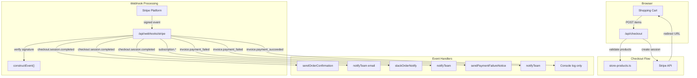
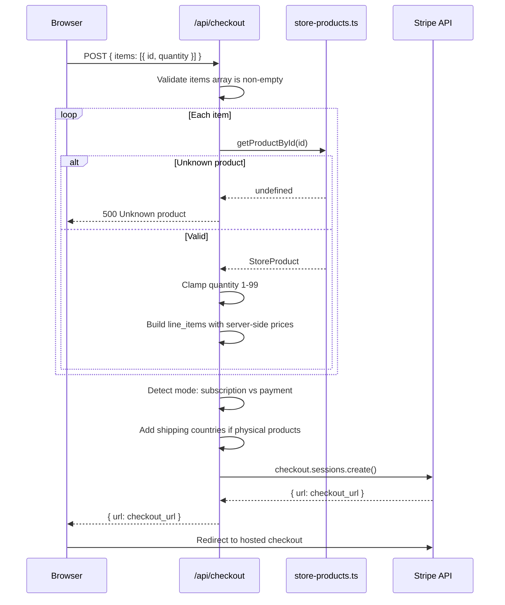
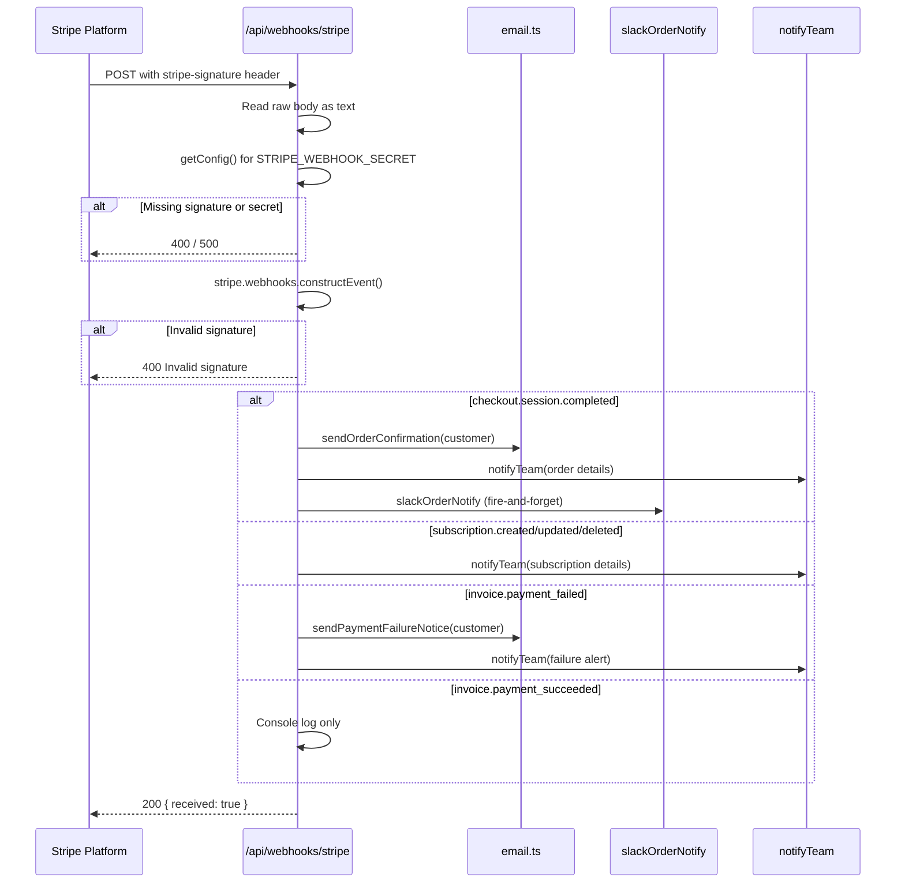

# Stripe Payments Integration
cloudless.gr uses Stripe for one-time payments and recurring subscriptions. The integration covers checkout session creation, webhook event processing, order confirmation emails, and Slack notifications.

> **Status:** Required for store functionality. The app throws if `STRIPE_SECRET_KEY` or `STRIPE_WEBHOOK_SECRET` are missing from SSM.

---

## Architecture



## Checkout Flow


**Security:** Prices are **never** sent from the client. The checkout route looks up each product by ID in the server-side catalog (`store-products.ts`) and uses the server-side `price` field. This prevents price manipulation attacks.

**Subscription detection:** If any item has `recurring: true`, the session mode is set to `subscription`. Otherwise it's `payment`.

**Shipping:** Physical products (`category: "physical"`) trigger shipping address collection for 30 countries (EU + US, GB, CA, AU).

---

## Webhook Processing



### Handled Event Types

| Event | Action |
|-------|--------|
| `checkout.session.completed` | Send order confirmation email to customer + notify team via email + Slack |
| `customer.subscription.created` | Notify team of new subscription |
| `customer.subscription.updated` | Notify team of plan/status change |
| `customer.subscription.deleted` | Notify team of cancellation |
| `invoice.payment_failed` | Send payment failure notice to customer + notify team |
| `invoice.payment_succeeded` | Log payment (no email) |

Unhandled event types are logged with a warning and return 200.

---

## Environment Variables
### Local development (`.env.local`)

```bash
STRIPE_SECRET_KEY=sk_test_xxxxxxxxxxxxxxxxxxxxxxxx
STRIPE_PUBLISHABLE_KEY=pk_test_xxxxxxxxxxxxxxxxxxxxxxxx
STRIPE_WEBHOOK_SECRET=whsec_xxxxxxxxxxxxxxxxxxxxxxxx
```

### Production (AWS SSM Parameter Store)

| Parameter path | Type |
|----------------|------|
| `/cloudless/production/STRIPE_SECRET_KEY` | SecureString |
| `/cloudless/production/STRIPE_PUBLISHABLE_KEY` | String |
| `/cloudless/production/STRIPE_WEBHOOK_SECRET` | SecureString |

> `getConfig()` **throws** if `STRIPE_SECRET_KEY` or `STRIPE_WEBHOOK_SECRET` are missing. The store cannot function without them.

---

## Product Catalog

Products are defined server-side in `src/lib/store-products.ts`. The catalog includes 9 demo products across 3 categories:

| Category | Products | Price range |
|----------|----------|-------------|
| Services | Cloud Audit, Serverless Starter, Analytics & Dashboards, AI Growth Engine (recurring) | EUR 800 - 2,400 |
| Digital | Cloud Playbook, Analytics Templates, Serverless Masterclass | EUR 29 - 99 |
| Physical | Dev Kit, T-Shirt | EUR 25 - 35 |

**Key functions:**
- `getProductById(id)` — used by checkout to validate items
- `getProductsByCategory(category)` — used by store UI
- `categoryLabels` / `categoryColors` — UI presentation helpers
---

## Stripe Client Initialization

The Stripe SDK instance is lazy-initialized and cached:

```typescript
let stripeInstance: Stripe | null = null;

export async function getStripe(): Promise<Stripe> {
  if (stripeInstance) return stripeInstance;
  const config = await getConfig();
  stripeInstance = new Stripe(config.STRIPE_SECRET_KEY);
  return stripeInstance;
}
```

This ensures the SSM config is loaded before Stripe is initialized, and subsequent calls reuse the same instance.

---

## Local Testing

### Webhook testing with Stripe CLI

```bash
# 1. Install Stripe CLI and login
stripe login

# 2. Forward webhooks to your local dev server
stripe listen --forward-to localhost:4000/api/webhooks/stripe

# 3. In another terminal, trigger test events
stripe trigger checkout.session.completed
stripe trigger invoice.payment_failed
```

### Manual checkout test

```bash
curl -X POST http://localhost:4000/api/checkout \
  -H "Content-Type: application/json" \
  -d '{"items":[{"id":"dig-cloud-playbook","quantity":1}]}'
# Returns { url: "https://checkout.stripe.com/..." }
```

---
## Security Notes

- **Server-side pricing:** Client sends product IDs only; prices come from `store-products.ts`
- **Signature verification:** Every webhook is verified via `stripe.webhooks.constructEvent()` before processing
- **HTML escaping:** All user/Stripe data inserted into email templates goes through `escapeHtml()`
- **Secret management:** Keys stored in SSM as SecureString; app throws if missing (no silent degradation)
- **Quantity clamping:** Cart quantities are clamped to 1-99 server-side

---

## Key Files

| File | Purpose |
|------|---------|
| `src/lib/stripe.ts` | Stripe SDK initialization with SSM config, lazy singleton |
| `src/lib/store-products.ts` | Server-side product catalog (9 products, 3 categories) |
| `src/app/api/checkout/route.ts` | Checkout session creation with server-side price validation |
| `src/app/api/webhooks/stripe/route.ts` | Webhook handler for 6 event types |
| `src/lib/email.ts` | `sendOrderConfirmation()`, `sendPaymentFailureNotice()`, `notifyTeam()` |
| `src/lib/slack-notify.ts` | `slackOrderNotify()` — fire-and-forget Slack notification |


## Compliance And Legal Alignment (EU + US)

The payment flow is hardened for cross-region operation across the primary application and HA/failover path with a common baseline aligned to GDPR (EU), CCPA/CPRA (US-CA), and PCI-DSS operational expectations.

### Technical controls implemented

- **Idempotent checkout creation:** `POST /api/checkout` accepts a validated `Idempotency-Key` header and forwards it to Stripe request options to prevent duplicate charge/session creation on retries.
- **Webhook replay protection:** `POST /api/webhooks/stripe` tracks recently processed Stripe event IDs and returns success for duplicates without reprocessing side effects.
- **PII minimization in logs:** Checkout webhook logs omit customer email in top-level operational log lines.
- **In-transit encryption:** HTTPS enforcement + HSTS applies at edge/proxy; webhook signing verifies payload integrity/authenticity.
- **At-rest encryption:** Stripe secrets are stored in AWS SSM Parameter Store (`SecureString`) and loaded server-side.

### EU (GDPR) mapping

- **Data minimization (Art. 5(1)(c))**: Avoids unnecessary logging of personal data in webhook processing.
- **Integrity and confidentiality (Art. 5(1)(f), Art. 32)**: TLS + signature verification + secret management controls reduce unauthorized access and tampering risk.
- **Accountability (Art. 5(2))**: Deterministic dedupe/idempotency behavior supports auditable, predictable payment processing.

### US (CCPA/CPRA) mapping

- **Reasonable security procedures**: Encrypted transport, secret management, and replay/idempotency controls reduce risk of unauthorized processing and duplicate transactions.
- **Data minimization / purpose limitation**: Operational logs avoid collecting excess customer identifiers where not needed.

### PCI-DSS scope posture

- cloudless.gr uses **Stripe-hosted Checkout** and does not directly handle raw card PAN/CVV in application code.
- Security controls above support SAQ-A style architecture assumptions, but merchant obligations remain (access control, incident response, key rotation, least privilege, retention controls).

### Primary and failover parity requirements

For payment readiness, both primary and HA app paths must keep equivalent controls for:

- HTTPS/TLS policy floor and HSTS behavior.
- Secret sourcing from encrypted stores (no plaintext checked into repo).
- Stripe webhook signature validation before event handling.
- Idempotent request handling and webhook replay suppression.
- PII-safe observability and log redaction standards.
