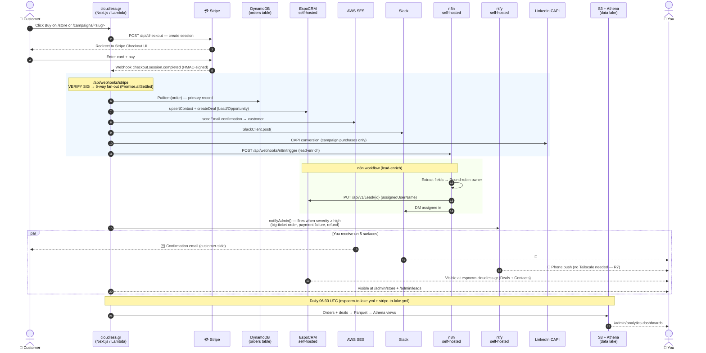

# Purchase flow — how the self-hosted apps connect end-to-end

This doc traces a single customer purchase from the click on `/store` or a
`/campaigns/<slug>` LinkedIn landing page, through every self-hosted app and
SaaS the order touches, all the way to your phone / Slack / dashboards.

The same fan-out runs for both store purchases and LinkedIn-campaign
purchases; the only diff is that campaign purchases additionally fire the
LinkedIn CAPI server-side conversion (per `skills/linkedin-campaigns/SKILL.md`).

## Live sequence — buy click to operator notification



## Static system map — who talks to whom

```mermaid
flowchart TB
    classDef web fill:#dbeafe,stroke:#1e40af,color:#1e3a8a
    classDef shop fill:#dcfce7,stroke:#166534,color:#14532d
    classDef self fill:#fef3c7,stroke:#92400e,color:#78350f
    classDef saas fill:#fce7f3,stroke:#9d174d,color:#831843
    classDef store fill:#e0e7ff,stroke:#3730a3,color:#312e81
    classDef you fill:#fee2e2,stroke:#991b1b,color:#7f1d1d

    User([👤 Customer]):::web
    You([👤 Operator]):::you

    subgraph App["🌐 cloudless.gr (Next.js Lambda)"]
      Checkout[/api/checkout]:::web
      WHStripe[/api/webhooks/stripe]:::web
      WHN8N[/api/webhooks/n8n/trigger]:::web
      WHAlert[/api/webhooks/admin-alert]:::web
      AdminUI[/admin/* pages]:::web
      Cart[/store]:::web
      Camp[/campaigns/...]:::web
    end

    subgraph SaaS["☁️ External SaaS"]
      Stripe[💳 Stripe]:::saas
      LIN[LinkedIn Ads CAPI]:::saas
      Slack[Slack workspace]:::saas
      SES[AWS SES]:::saas
    end

    subgraph Self["🏠 Self-hosted on k3s (omv + omv-ha)"]
      Espo[EspoCRM<br/>espocrm.cloudless.gr]:::self
      N8N[n8n<br/>n8n.cloudless.gr]:::self
      Ntfy[ntfy<br/>ntfy.cloudless.gr]:::self
      Postiz[Postiz<br/>postiz.cloudless.gr]:::self
      AppFlowy[AppFlowy<br/>appflowy.cloudless.gr]:::self
      Kuma[Uptime Kuma<br/>kuma.cloudless.gr]:::self
      Grafana[Grafana<br/>cluster-only]:::self
      Mqtt[Mosquitto MQTT<br/>cluster-only]:::self
      AlertAPI[Pi alert-api Lambda]:::self
    end

    subgraph Store["📦 Storage"]
      DDB[DynamoDB orders]:::store
      Lake[S3 + Athena data lake]:::store
    end

    User --> Cart & Camp
    Cart & Camp --> Checkout --> Stripe
    Stripe -->|webhook| WHStripe
    WHStripe --> DDB & Espo & SES & Slack & LIN & WHN8N
    WHN8N --> N8N
    N8N --> Espo & Slack
    WHStripe -->|SEV1| Ntfy
    WHAlert --> Slack & Ntfy
    AlertAPI --> Mqtt
    AlertAPI -->|webhook| WHAlert
    Kuma -->|monitors| Cart & Espo & N8N & Ntfy & Postiz
    Mqtt --> Grafana
    Espo -.->|nightly ETL| Lake
    DDB -.->|nightly ETL| Lake
    Lake --> AdminUI

    SES ==>|✉️| User
    Slack ==>|💬| You
    Ntfy ==>|📱| You
    Espo ==> You
    AdminUI ==> You

    linkStyle default stroke:#94a3b8,stroke-width:1.5px
```

## Why this design

- **Fan-out via `Promise.allSettled`**: one failing destination (e.g. n8n
  down) doesn't break the order recording in DynamoDB or the customer's
  confirmation email. Per the `/api/webhooks/stripe` route + `notifyAdmin`
  helper, each side-effect is independent.
- **EspoCRM is the canonical customer record.** DynamoDB stores the order
  itself (idempotency, fast lookups); EspoCRM stores the customer
  relationship (Lead → Contact → Account → Deal lifecycle).
- **n8n is the workflow engine for non-realtime ops** — round-robin lead
  assignment, owner notification, sequence enrollment. Keeps complex
  routing logic out of the Lambda hot path.
- **ntfy is the "wake me on my phone" channel.** Reserved for severity
  `high|critical` only — high-value orders, payment failures, refunds,
  SEV1 system alerts. R7 made it publicly tunneled so the phone works
  without Tailscale.
- **Slack is the "always-on" channel** — every order + lead lands in a
  channel + ops-user DM. Lower noise floor than ntfy on purpose.
- **Postiz + AppFlowy are content/social, not transactional.** They don't
  participate in the purchase flow. (Postiz fires on blog publish via R1;
  AppFlowy hosts internal docs.)
- **Uptime Kuma + Grafana are observability, not transactional.** They
  watch the apps + the cloudless.gr surface to warn you if any of these
  paths breaks.
- **Mosquitto MQTT is the homelab side-channel** — the Pi alert-api
  publishes `homelab/alerts/status` so the ESP32 LED display reflects
  current incident state. The webhook publish route also fans into
  `notifyAdmin()` for high-severity messages.

## How notifications reach you, ranked by latency

| Channel | Latency | Reaches you when offline? | Source of truth |
|---|---|---|---|
| **ntfy 📱** | <2 s | Yes (phone always notified) | `notifyAdmin()` |
| **Slack #orders + DM 💬** | <5 s | Yes (mobile Slack app) | `SlackClient.post` |
| **EspoCRM Deals view** | Realtime via UI poll | Only when you open it | `upsertContact + createDeal` |
| **/admin/leads + /admin/store** | Realtime via API | Only when you open it | DynamoDB + EspoCRM |
| **SES daily digest** ✉️ | 24 h | Email | nightly cron |
| **Athena dashboards** 📊 | T+1 day | Only when you open it | ETL → S3 → Athena view |

## Related runbooks

- Purchase webhook source: `src/app/api/webhooks/stripe/route.ts`
- Lead/Order → EspoCRM: `src/lib/espocrm.ts` (per `reference_espocrm_operator_skill`)
- n8n trigger: `src/app/api/webhooks/n8n/trigger/route.ts` + `infrastructure/n8n/workflows/lead-enrich.json`
- Admin alert helper: `src/lib/admin-alerts.ts` (R4 + R8 wireup)
- LinkedIn CAPI: `skills/linkedin-campaigns/SKILL.md` + `src/app/api/campaigns/conversion/route.ts`
- Cluster status chips: `src/app/[locale]/admin/cluster/page.tsx`
