# Tailscale Fabric — Architecture

> **⚠️ Topology note (2026-08-08):** references to a 2-node cluster or `omv-ha`
> as a k3s worker below are **historical**. The cluster is now single-node
> (`omv` only, running a 4K-page kernel); `omv-ha` was drained + removed from
> k3s and repurposed as the dedicated mail host. See `CLAUDE.md` "Cluster
> Topology" for current state.
> **Status:** source of truth (2026-07-30)  
> **Audience:** operators + agents touching Pi k3s, GHA, or admin GUIs  
> **Scope:** private admin mesh only — **not** the public `cloudless.gr` edge

Tailscale is the **admin fabric** for the two-node Pi k3s cluster. Public HTTP
stays on **Cloudflare** (Workers Free `cloudless2` proxy → Tunnel → Pi NodePort).
Mixing those trust boundaries is how we got Funnel 403s, Bot Fight false alarms,
and one Tailscale device per Service.

Canonical manifests: [`infrastructure/tailscale/`](../../infrastructure/tailscale/).  
Operator kubectl runbook: [`kubectl-tailscale.md`](kubectl-tailscale.md).

---

## 1. Trust boundaries

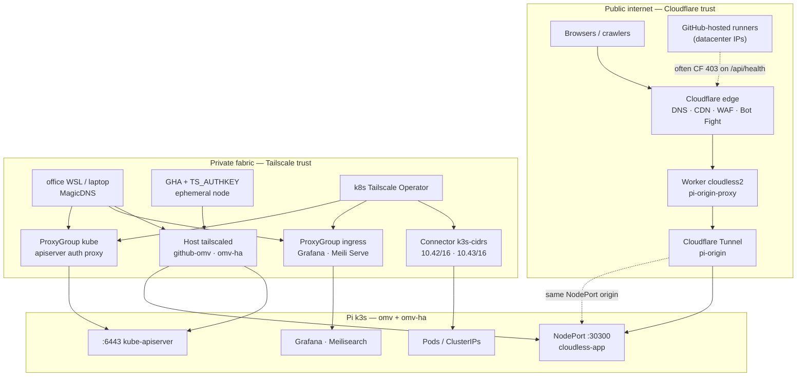

| Boundary | Who | What travels | Auth |
|----------|-----|--------------|------|
| **Cloudflare public** | Humans, bots, Lighthouse (when not CF-blocked) | App HTTP/S for `*.cloudless.gr` | App session / D1 auth / CRON_SECRET |
| **Tailscale fabric** | Admins (full), members (HTTPS Serve only), GHA with `TS_AUTHKEY` | SSH, `:6443`, NodePorts, Serve HTTPS, pod CIDRs | Tailnet ACL grants + device identity |
| **Never cross** | — | DB TCP, etcd, Redis | Stay ClusterIP; use `kubectl port-forward` |

---

## 2. Why Tailscale exists here

| Need | Solution | Not this |
|------|----------|----------|
| `kubectl` from office / cloud agents | Host mesh + optional `kube` ProxyGroup | Exposing `:6443` on WAN |
| SSH / runner restart / disk cleanup | Host `tailscaled` on omv | Public SSH |
| Grafana / Meili for admins | Shared `ingress` ProxyGroup + Serve | Public Funnel or one device per Service |
| Hit pod / ClusterIP from a laptop | `Connector` subnet routes | Publishing every Service |
| Public website | Cloudflare Worker + Tunnel | Tailscale Funnel as primary edge |

**Architectural rule:** Funnel may exist on a node for **diagnostics**
(`https://github-omv.<tailnet>.ts.net/…`), but it is **not** the HA or SEO path.
Production URLs are Cloudflare-fronted.

---

## 3. Physical + logical topology

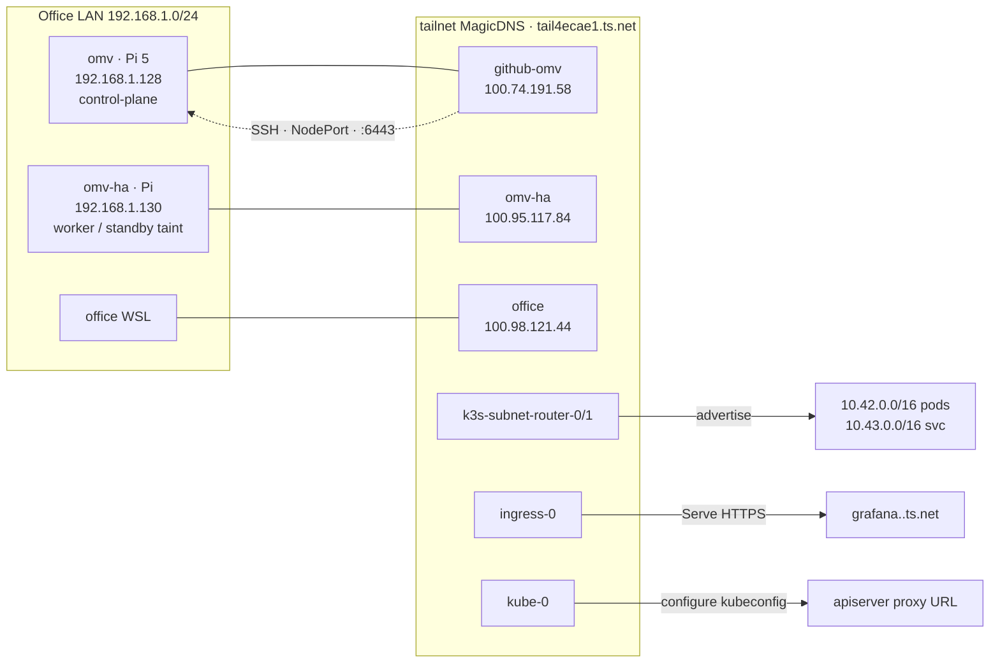

### Node inventory (host mesh)

| Hostname (Machines) | Role | LAN | Tailscale IPv4 | MagicDNS |
|---------------------|------|-----|----------------|----------|
| `github-omv` | k3s control-plane, GH runners, app NodePort | `192.168.1.128` | `100.74.191.58` | `github-omv.tail4ecae1.ts.net` |
| `omv-ha` | worker (often `NoSchedule` standby) | `192.168.1.130` | `100.95.117.84` | `omv-ha.tail4ecae1.ts.net` |
| `office` | Admin WSL | — | DYNAMIC | `office.tail4ecae1.ts.net` |
| `office-1` | Admin WSL | — | DYNAMIC | `office-1.tail4ecae1.ts.net` |
| `office-2` | Admin WSL (OFFLINE - needs reconnection) | — | DYNAMIC | `office-2.tail4ecae1.ts.net` |
| `office-3` | Admin WSL | — | DYNAMIC | `office-3.tail4ecae1.ts.net` |

> **IP caveat:** Tailscale CGNAT addresses **rotate** after reimage / re-auth.
> Prefer **MagicDNS** (`github-omv.tail4ecae1.ts.net`) in new scripts.
> Stale literals still floating in some workflows / `mcp.json`:
> `100.113.41.119`, Funnel host `omv.tail8eb71.ts.net` — treat as **drift**, not SoT.

### Operator-owned devices (fabric)

| Prefix / name | Kind | Purpose |
|---------------|------|---------|
| `k3s-subnet-router-*` | Connector replicas | Advertise pod + ClusterIP CIDRs |
| `ingress-*` | ProxyGroup `ingress` | Shared L7 Serve for annotated Ingresses |
| `kube-*` | ProxyGroup `kube-apiserver` | `tailscale configure kubeconfig` |

**Delete in admin if offline forever:** old per-Service proxies
(`monitoring-proxies-*`, `ts-n8n-*`, `appflowy`, `grafana`, …). Those came from
missing `tailscale.com/proxy-group: ingress` — see §7.

---

## 4. Layered architecture

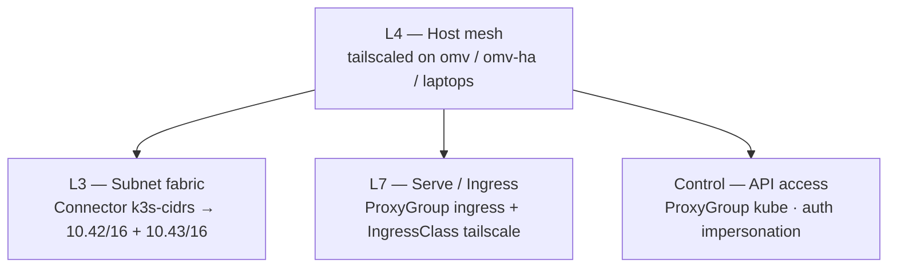

| Layer | Kubernetes / host object | Consumers | Notes |
|-------|--------------------------|-----------|-------|
| **L4 Host mesh** | `tailscaled` systemd on Pis + client apps | SSH, NodePort `:30300`, direct `:6443` (if TLS SAN includes TS IP) | Always on; baseline for GHA Tailscale Action |
| **L3 Subnet** | `Connector/k3s-cidrs` + `ProxyClass/pi-fabric` | Laptop → ClusterIP / pod IP | Requires `--accept-routes` on client; ACL `autoApprovers.routes` |
| **L7 Serve** | `ProxyGroup/ingress` + Ingresses in `ingresses.yaml` | Admins → Grafana, Meilisearch | **No Funnel**; private HTTPS certs need HTTPS Certificates enabled |
| **API proxy** | `ProxyGroup/kube` | Off-LAN kubectl | Preferred over raw `:6443` from WSL userspace |
| **Operator** | Default namespace is `tailscale` (configurable via `TS_OPERATOR_NS`) | Deploy scripts use `--namespace $NS` | All pods + CRDs in same namespace |

Manifest map:

| File | Layer |
|------|-------|
| `connector.yaml` | L3 + `ProxyClass` |
| `proxygroup.yaml` | L7 + API |
| `ingresses.yaml` | L7 backends |
| `ingress-class.yaml` | `IngressClass` `tailscale` |
| `acl-policy.example.json` | ACL tags / autoApprovers / grants / ssh / Apps `nodeAttrs` |
| `deploy.sh` | Helm operator install (OAuth env — **no AWS SSM**) |

---

## 4b. DNS, ACL, Apps, VIP Services (operator console)

Day-2 detail also lives in
[`infrastructure/tailscale/README.md`](../../infrastructure/tailscale/README.md).

### DNS (`tail4ecae1.ts.net`)

| Setting | Value | Do not |
|---------|-------|--------|
| MagicDNS | On | Disable / rename tailnet casually |
| Global nameserver | `100.100.100.100` (MagicDNS) | Add Pi-hole/router as override unless intentional |
| Search domains | `tail4ecae1.ts.net` | Stuff home-LAN domains in without need |
| HTTPS Certificates | On | Disable (breaks Serve TLS) |

Connector hosts use `--accept-dns=false` so MagicDNS is not the system
resolver on the Pi (CoreDNS / LAN DNS stay authoritative).

### Grants + Tailscale SSH (hardened 2026-07-30)

| Src | Dst | Allow |
|-----|-----|-------|
| admin | `tag:k8s` / `tag:k8s-operator` / `tag:app-connector` | `*` |
| member | `tag:k8s` | `tcp:80`, `tcp:443` |
| member | `tag:app-connector` | DNS `53` only |
| admin SSH | self + tagged fabric | `accept` |
| member SSH | self | `check` |

Apply via CI with **`acl_only=true`** (skips dangerous Machine cleanup):

```bash
gh workflow run tailscale-admin-api.yml -f dry_run=false -f acl_only=true
```

### VIP Services vs endpoint discovery

| Console surface | What it is | Action |
|-----------------|------------|--------|
| **Services** (`svc:grafana`, `svc:meilisearch`, `svc:kube`) | Approved Serve VIP hosts | Keep; prune orphans with `tailscale-approve-service-hosts` |
| **Machines → discovered endpoints** | Inventory (sshd, node_exporter, k3s, …) | Ignore noise; grants control reachability |

### Apps (app connectors)

Live connector: **`github-omv`** with `tag:app-connector`, advertising SaaS
CIDRs. Presets + custom domains are in `acl-policy.example.json` `nodeAttrs`.
Do **not** put `*.cloudless.gr` or Serve VIP hosts into Apps.

---

## 5. Critical traffic flows

### 5.1 Public app (not Tailscale)

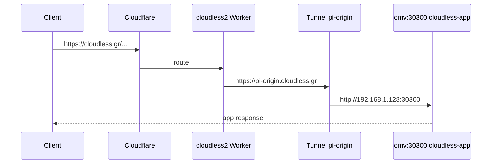

GHA `ubuntu-latest` often gets **HTTP 403** on custom-domain `/api/health`
(datacenter reputation / Bot Fight) even when TLS succeeds and the site is fine
from residential IPs. That is a **Cloudflare** problem, not a Tailscale one.

Intermittent **HTTP 502** on apex / `pi-origin` with `x-served-by: pi-tunnel-proxy`
means the Worker received a Tunnel 502 (or threw) — origin may still be healthy
on fabric L4. The HTTPS probe distinguishes:

| Public | Fabric NodePort | Meaning |
|--------|-----------------|---------|
| 200 | — | Public path OK |
| 403 | 200 | Bot Fight; origin OK via fabric |
| 502/503 | 200 | **Tunnel/Worker flap**; origin OK — check `cloudflared` |
| 502/503 | fail | Origin / NodePort actually down |

`cloudless2` (`workers/pi-origin-proxy`) retries once on idempotent methods for
transient upstream 502 / network errors.

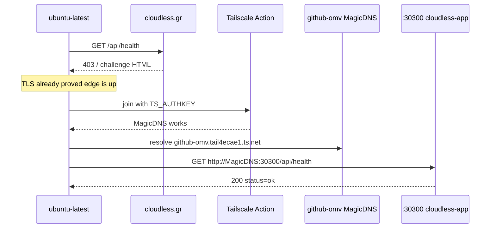

| Do | Don't |
|----|-------|
| Join the tailnet, then hit **NodePort `:30300` via MagicDNS** | Use public **Funnel** as the CI SLA path (DERP-mediated, flaky timeouts) |
| Prefer MagicDNS over CGNAT literals | Hardcode `100.x` (rotates; e.g. stale `100.113.41.119`) |
| Treat CF 403 + healthy fabric NodePort as “edge blocked bots, origin up” | Soft-pass 403 without validating origin |

Funnel (`https://github-omv.…ts.net` from the public internet) may still answer
sometimes — it is **break-glass / diagnostic only**, not an availability contract.

### 5.2 kubectl on the office LAN (preferred)

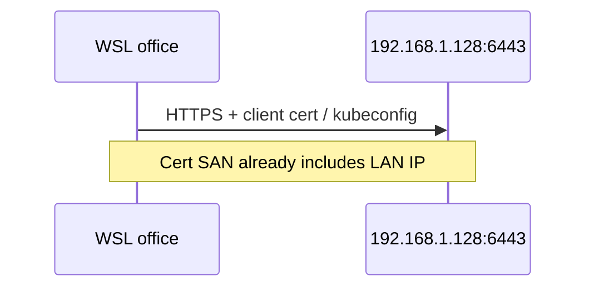

### 5.3 kubectl off-LAN (preferred path)

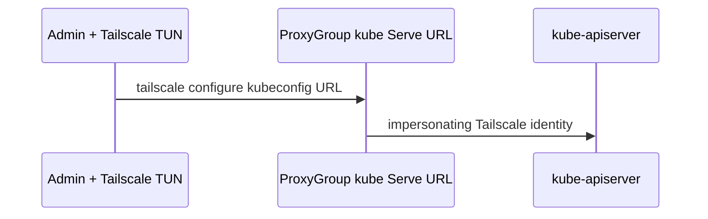

Fallback: add TLS SANs (`100.74.191.58`, MagicDNS) via `scripts/configure-k3s.sh`,
then dial `:6443` with `--accept-routes`. WSL **userspace** Tailscale is unreliable
for raw `100.x` TCP — use LAN or the kube ProxyGroup instead.

### 5.4 Private admin GUI (Serve)

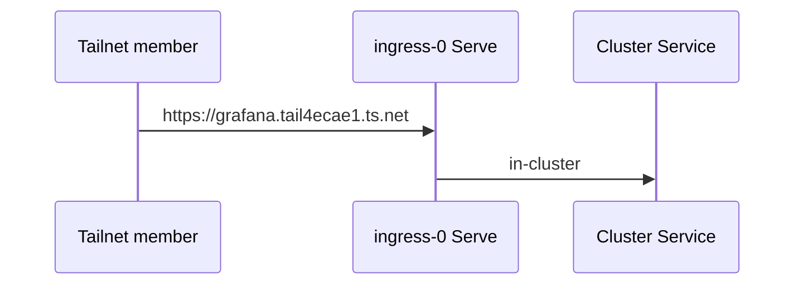

Requires: HTTPS Certificates on, Service host **approved**, Ingress annotated
`tailscale.com/proxy-group: ingress` + usually `tailscale.com/http-endpoint: enabled`.

### 5.5 GitHub Actions → cluster

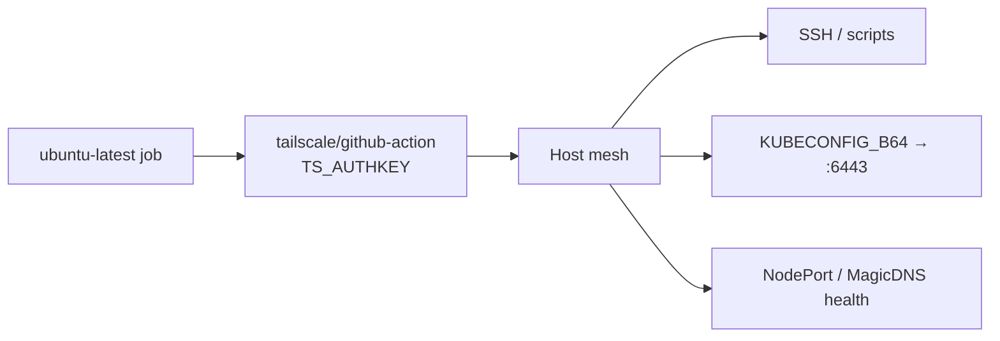

Typical secrets: `TS_AUTHKEY` (ephemeral, pre-authorized), `KUBECONFIG_B64`,
`OMV_SSH_KEY`. Do not pin workflows to obsolete Funnel hostnames.

---

## 6. Decision records

| ID | Decision | Rationale |
|----|----------|-----------|
| D1 | Public edge = Cloudflare, not Funnel | Free Bot Fight + Funnel as primary broke SEO/CI; CF Tunnel already terminates at NodePort |
| D2 | One shared `ingress` ProxyGroup | Per-Ingress proxies exploded Machines (`monitoring-proxies-0..9`) and RAM on Pi |
| D3 | Subnet routes only via `Connector` | ProxyGroup cannot advertise routes; wrong CRD caused silent failures |
| D4 | `ProxyClass/pi-fabric` arm64 + tiny limits | Pi 5 RAM budget; avoid scheduling operator proxies on starved nodes |
| D5 | kube ProxyGroup for off-LAN kubectl | Avoids k3s TLS SAN churn and WSL userspace TCP pain |
| D6 | No AWS SSM in `deploy.sh` | Free-tier / Cloudflare-first policy — OAuth env only |
| D7 | Prefer MagicDNS over CGNAT literals | Tailscale IPs rotate; docs and new automation must not hardcode |
| D8 | CI origin fallback = private fabric L4, not Funnel | Funnel is public Serve over DERP — intermittent timeouts from GHA; NodePort via MagicDNS after `TS_AUTHKEY` is the same origin Cloudflare Tunnel uses |
| D9 | Members HTTPS-only to `tag:k8s`; admins `*` | Stops accidental reach to node_exporter / k3s / discovery ports over the tailnet |
| D10 | ACL CI with `acl_only=true` by default | Full admin-api cleanup can delete Connector Machines that look “stale” |
| D11 | App connector on a tagged Linux host + MagicDNS DNS page unchanged | SaaS egress via Apps; public site stays Cloudflare |

---

## 7. Anti-patterns (do not reintroduce)

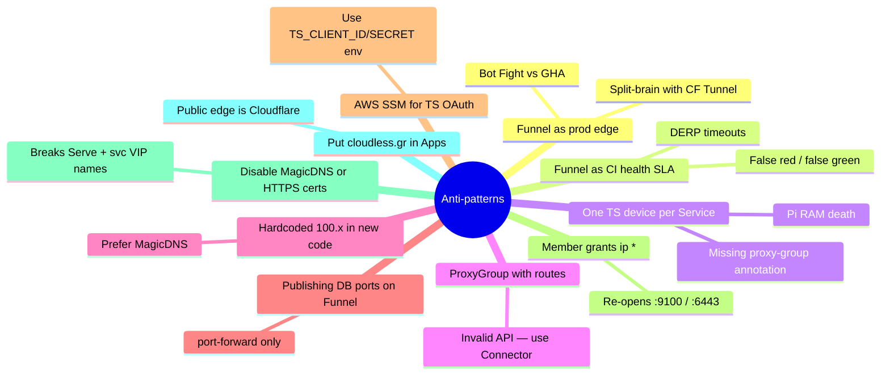

Checklist before merging Tailscale changes:

- [ ] Public URL still goes Cloudflare → Worker/Tunnel?
- [ ] New Ingress has `tailscale.com/proxy-group: ingress`?
- [ ] No new Funnel-primary path for `cloudless.gr`?
- [ ] CI origin checks use **private** MagicDNS NodePort (not public Funnel)?
- [ ] Scripts use MagicDNS or document IP refresh?
- [ ] ACL `tag:k8s` / `tag:k8s-operator` / `tag:app-connector` still owned?
- [ ] Member grants still HTTPS/DNS-only (not `*` to tagged nodes)?
- [ ] ACL apply uses `acl_only=true` unless device cleanup is intentional?
- [ ] DNS page still MagicDNS + HTTPS Certificates on?

---

## 8. Deploy & operate

### 8.1 Prerequisites

1. OAuth client (Devices Core + Auth Keys write) tagged **`tag:k8s-operator`**:
   https://login.tailscale.com/admin/settings/oauth
2. Merge [`acl-policy.example.json`](../../infrastructure/tailscale/acl-policy.example.json)
   into Access controls (`tagOwners`, `autoApprovers`, `grants`, `ssh`, `nodeAttrs`):

```bash
gh workflow run tailscale-admin-api.yml -f dry_run=false -f acl_only=true
```

3. Confirm DNS console: MagicDNS on, global NS `100.100.100.100`, HTTPS
   Certificates on (see §4b).
4. Enable HTTPS Certificates if the toggle was ever off:

```bash
bash scripts/tailscale-enable-https.sh
# Workflow: Tailscale enable HTTPS
```

5. Approve Service hosts (HA VIPs stay dark until approved):

```bash
bash scripts/tailscale-approve-service-hosts.sh
# Workflow: Tailscale approve service hosts
```

### 8.2 Install / refresh operator

```bash
export TS_CLIENT_ID=…
export TS_CLIENT_SECRET=…
export KUBECONFIG=~/.kube/config-cloudless-ts   # LAN kubeconfig at office
bash infrastructure/tailscale/deploy.sh
```

```bash
kubectl wait connector k3s-cidrs --for=condition=ConnectorReady=true --timeout=5m
kubectl wait proxygroup ingress --for=condition=ProxyGroupReady=true --timeout=5m
kubectl wait proxygroup kube --for=condition=ProxyGroupReady=true --timeout=5m
kubectl get ingress -A
kubectl get pods -n tailscale
```

Empty TLS Secrets after HTTPS enable:

```bash
bash scripts/tailscale-refresh-tls-secrets.sh
```

### 8.3 k3s TLS SANs (only if dialing `:6443` over Tailscale)

```yaml
# /etc/rancher/k3s/config.yaml (via scripts/configure-k3s.sh)
tls-san:
  - "192.168.1.128"
  - "100.74.191.58"                 # refresh if CGNAT changed
  - "github-omv.tail4ecae1.ts.net"
```

```bash
sudo TLS_SAN_TS=100.74.191.58 TLS_SAN_MAGICDNS=github-omv.tail4ecae1.ts.net \
  ./scripts/configure-k3s.sh
sudo systemctl restart k3s
```

Clients:

```bash
sudo tailscale set --accept-routes   # Linux with real TUN
```

### 8.4 Workflows & scripts

| Workflow / script | Purpose |
|-------------------|---------|
| `tailscale-deploy.yml` / `tailscale-fabric-deploy.yml` | Operator / fabric apply |
| `tailscale-enable-https.yml` | Tailnet HTTPS setting |
| `tailscale-approve-service-hosts.yml` | Approve `svc:*` hosts |
| `tailscale-fix-fabric-acl.yml` | ACL merge helper |
| `tailscale-probe-posture.yml` | Posture / health of fabric |
| `tailscale-admin-api.yml` | ACL merge (+ optional device cleanup); prefer `acl_only=true` |
| `scripts/tailscale-diagnose.sh` | Local diagnosis |
| `scripts/setup-kubectl-tailscale.sh` | Client kubeconfig helper |
| `scripts/ts-wsl.sh` | WSL userspace Tailscale |

---

## 9. Troubleshooting map

```mermaid
flowchart TD
  Q{Symptom?}
  Q -->|kubectl timeout off-LAN| A1[Use kube ProxyGroup URL<br/>or LAN 192.168.1.128]
  Q -->|ping 100.x OK, TCP fail| A2[WSL userspace — switch TUN<br/>or ProxyGroup]
  Q -->|Ingress ADDRESS empty| A3[HTTPS certs + host approval<br/>+ http-endpoint annotation]
  Q -->|Many new Machines| A4[Missing proxy-group annotation<br/>delete stale devices]
  Q -->|GHA 403 on cloudless.gr| A5[CF Bot Fight — not Tailscale<br/>join TS → MagicDNS:30300]
  Q -->|Funnel HTTPS times out| A5b[Expected — Funnel is not SLA<br/>use private NodePort path]
  Q -->|NodePort timeout on 100.x| A6[Stale CGNAT — resolve MagicDNS<br/>after Tailscale join]
  Q -->|Offline tagged device| A7[Delete in admin UI<br/>see OFFLINE-DEVICE-TROUBLESHOOTING]
  Q -->|Member hits :9100/:6443| A8[Expected deny — grants are HTTPS-only<br/>promote to admin or use LAN]
  Q -->|Apps red / SaaS not routed| A9[Connector tag + advertise-connector<br/>ACL nodeAttrs + MagicDNS on]
  Q -->|svc VIP empty/dark| A10[Approve Service host<br/>HTTPS Certificates on]
```

```bash
tailscale status
kubectl get connector,proxygroup,proxyclass -A
kubectl get pods -n tailscale
kubectl logs -n tailscale -l app.kubernetes.io/name=operator --tail=100
bash scripts/tailscale-diagnose.sh
bash scripts/tailscale-probe-posture.sh
```

Offline / orphaned devices: [`OFFLINE-DEVICE-TROUBLESHOOTING.md`](../../infrastructure/tailscale/OFFLINE-DEVICE-TROUBLESHOOTING.md)
(device IPs in that file are historical snapshots).

---

## 10. Related documents

| Doc | Role |
|-----|------|
| [`kubectl-tailscale.md`](kubectl-tailscale.md) | Day-2 kubectl from WSL / LAN |
| [`infrastructure/tailscale/README.md`](../../infrastructure/tailscale/README.md) | Manifest index + quick deploy |
| [`databases/omv-cluster.md`](../databases/omv-cluster.md) | DB access rules (no TS exposure) |
| [`CLUSTER-MAP.md`](../../CLUSTER-MAP.md) | Live pod map (refresh periodically) |
| Cloudflare tunnel ops skill | Public `*.cloudless.gr` ingress |

---

## 11. Version compatibility

**CLI version mismatch:** Client (1.98.10) and server pods (v1.98.9) may show warnings. This is acceptable for most operations but consider updating the operator deployment to match the CLI version:

```bash
# Check current versions
tailscale version
kubectl get deployment -n tailscale operator -o jsonpath='{.spec.template.spec.containers[0].image}'

# Update to match (optional)
kubectl set image deployment/operator tailscale=tailscale/k8s-operator:v1.98.10 -n tailscale-operator
```

**Best practice:** Keep operator and CLI versions within 1 minor version for optimal compatibility.

---

## 12. Glossary

| Term | Meaning here |
|------|----------------|
| **Fabric** | Private Tailscale mesh used by admins and automation |
| **Serve** | Tailscale HTTPS to a node/ProxyGroup VIP (tailnet-only unless Funnel) |
| **Funnel** | Expose Serve to the public internet — **not** our production edge |
| **Connector** | Operator CR that advertises subnet routes |
| **ProxyGroup** | Shared proxy StatefulSet (`ingress` / `egress` / `kube-apiserver`) |
| **MagicDNS** | `*.tail4ecae1.ts.net` names — prefer over CGNAT IPs |
| **VIP Service** | Approved `svc:*` Serve host (grafana / meilisearch / kube) |
| **App connector** | Tagged node advertising SaaS routes for Tailscale Apps |
| **Endpoint discovery** | Machines UI inventory — not an allow rule |
| **pi-origin** | Cloudflare hostname → Tunnel → `192.168.1.128:30300` |
