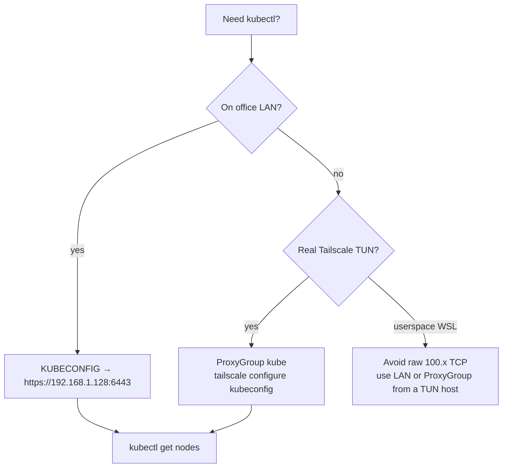

# kubectl via Tailscale / office LAN

> Architecture & trust boundaries: **[`TAILSCALE-FABRIC.md`](TAILSCALE-FABRIC.md)**  
> This page is the **day-2 operator runbook** only.

Use the office LAN or Tailscale mesh so WSL can run `kubectl` against the Pi
k3s API **without** SSH ProxyJump for every apply.

## Choose a path



| Situation | Use |
|-----------|-----|
| Sitting on office LAN | LAN kubeconfig → `https://192.168.1.128:6443` |
| Off-LAN, system Tailscale (TUN) | `ProxyGroup/kube` Serve URL |
| WSL userspace only | Prefer LAN; userspace SOCKS to `100.x:6443` is unreliable |

## Endpoints (prefer MagicDNS)

| Role | LAN | Tailscale IPv4 | MagicDNS |
|------|-----|----------------|----------|
| omv control-plane | **192.168.1.128** | `100.74.191.58` | `github-omv.tail4ecae1.ts.net` |
| omv-ha worker | 192.168.1.130 | `100.95.117.84` | `omv-ha.tail4ecae1.ts.net` |
| office WSL | — | `100.98.121.44` | `office.…` |

Tailscale IPs **rotate**. New automation should use MagicDNS. Stale
`100.113.41.119` / `omv.tail8eb71.ts.net` references elsewhere are drift — see
fabric doc §3.

## One-time client setup (WSL)

```bash
bash scripts/ts-wsl.sh status          # userspace daemon + SOCKS :1055
bash scripts/ts-wsl.sh login           # approve in admin console if needed
bash scripts/setup-kubectl-tailscale.sh
```

Persist:

```bash
export PATH="$HOME/bin:$PATH"
export KUBECONFIG=~/.kube/config-cloudless-ts
export TS_SOCKET=~/.local/tailscale/tailscaled.sock
```

## Daily use

```bash
kubectl get nodes
kubectl get pods -n monitoring
```

## Off-LAN: kube-apiserver ProxyGroup

After [`infrastructure/tailscale/deploy.sh`](../infrastructure/tailscale/deploy.sh)
(see fabric doc §8):

```bash
URL=$(kubectl get proxygroup kube -o jsonpath='{.status.url}')
tailscale configure kubeconfig "$URL"
kubectl get nodes
```

Alternative (TUN client + TLS SANs on k3s): dial
`https://github-omv.tail4ecae1.ts.net:6443` or the current CGNAT IP with
`--accept-routes`. SAN setup is in fabric doc §8.3.

## Fallback (SSH)

```bash
ssh -J tbaltzakis@192.168.1.130 tbaltzakis@192.168.1.128 \
  'KUBECONFIG=~/.kube/config kubectl get nodes'
```

Over Tailscale (MagicDNS):

```bash
ssh tbaltzakis@github-omv.tail4ecae1.ts.net 'kubectl get nodes'
```

## Machines hygiene

**Keep online:** `github-omv`, `omv-ha`, `office`, Connector / ProxyGroup
devices owned by the operator (`k3s-subnet-router-*`, `ingress-*`, `kube-*`).

**Safe to delete when offline forever:** old per-app proxies
(`monitoring-proxies-*`, `ts-n8n-*`, `appflowy`, `grafana`, …) from before
shared `proxy-group` annotations. Details:
[`OFFLINE-DEVICE-TROUBLESHOOTING.md`](../infrastructure/tailscale/OFFLINE-DEVICE-TROUBLESHOOTING.md).

## Notes

- Do **not** commit `~/.kube/config-cloudless-ts`.
- Subnet routes (`10.42.0.0/16`, `10.43.0.0/16`) are optional — only for direct
  ClusterIP access from a laptop with `--accept-routes`.
- DB ports stay ClusterIP — use `pnpm db:forward` / port-forward
  ([databases/omv-cluster.md](databases/omv-cluster.md)).
