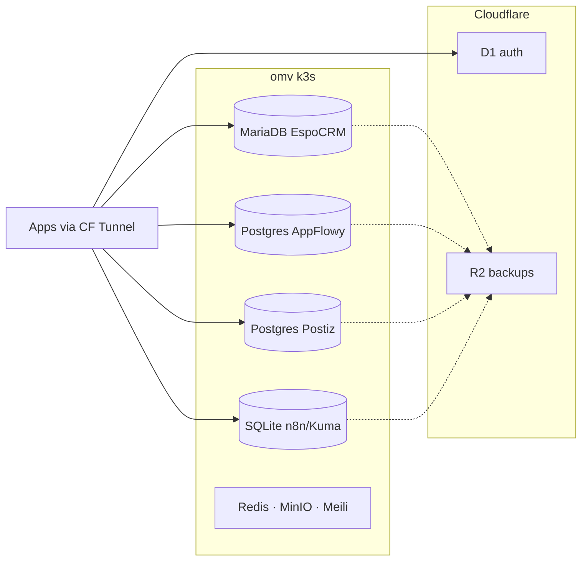

# Databases

Canonical docs for every data store used by cloudless.gr — Pi k3s app databases, Cloudflare D1, and how to open them from Cursor (SQLTools).

Passwords are **never** stored in these docs. Use `pnpm db:passwords` (k8s Secrets) or Wrangler / Cloudflare for D1.

## Docs in this folder

| Doc | What it covers |
|-----|----------------|
| [landscape.md](landscape.md) | **Start here** — logical/physical diagrams, trust boundaries, backup RPO, per-product data planes |
| [omv-cluster.md](omv-cluster.md) | Field inventory (engines, NS, PVCs, secrets, SQLTools ports, D1 IDs, backup schedule) |
| [ADR-001-mediated-db-access.md](ADR-001-mediated-db-access.md) | **Accepted** — mediated SQLTools access; reject public DB TCP and ms-mssql |

Related: datalake / ETL / Athena SQL live under [../data/](../data/).

## Landscape at a glance



Full diagrams: [landscape.md](landscape.md).

## Quick commands

```bash
pnpm db:ready            # start forwards + print status (do this first)
pnpm db:forward          # TCP stores → localhost (SQLTools)
pnpm db:forward:status
pnpm db:passwords        # usernames + passwords from Secrets (do not commit)
pnpm db:sqlite:pull      # n8n / Kuma / Grafana → .local/db/
pnpm db:d1:pull          # Cloudflare D1 → .local/db/*.sqlite
pnpm db:refresh-snapshots # sqlite + d1 (avoid stale SQLTools views)
pnpm db:forward:stop
pnpm db:backup:test list|minio|kuma   # CronJob NS = workload NS
CONFIRM=1 pnpm d1:retire:cloudless-auth  # idempotent orphan D1 guard
```

After `pnpm db:ready`, open the **SQLTools** sidebar in Cursor (not SQL Server), connect a profile under `omv` / `omv-sqlite` / `cloudflare-d1`, and paste the matching password from `pnpm db:passwords` when prompted. Reload the Cursor window once if connections do not appear after pulling this branch.

Gap closure (MinIO/Kuma R2, D1 retire, accepted non-HA) is tabulated in
[landscape.md](landscape.md#gap-status-post-pr-1451). Orphan D1 `cloudless-auth`
and KV `HEALTH_CACHE` were deleted 2026-07-30.

Scripts: `scripts/db-port-forward.sh`, `scripts/db-sqlite-pull.sh`, `scripts/db-d1-pull.sh`.  
SQLTools config: `.vscode/settings.json` (`sqltools.connections`).  
Use **SQLTools**, not the Microsoft SQL Server extension (`ms-mssql`).

## Related docs (elsewhere)

| Doc | Topic |
|-----|--------|
| [kubectl-tailscale.md](../kubectl-tailscale.md) | Cluster API access (LAN / Tailscale) |
| [TAILSCALE-FABRIC.md](../TAILSCALE-FABRIC.md) | Tailscale admin fabric architecture (trust boundaries, ProxyGroups) |
| [datalake.md](../datalake.md) | Analytics / lake layout |
| [etl.md](../etl.md) | ETL jobs |
| [appflowy-deploy.md](../appflowy-deploy.md) | AppFlowy (Postgres + Redis + MinIO) |
| [POSTIZ.md](../POSTIZ.md) | Postiz (Postgres + Redis) |
| [roadmap/r21-meilisearch-operations.md](../roadmap/r21-meilisearch-operations.md) | Meilisearch ops |
| [infrastructure/backup/README.md](../../infrastructure/backup/README.md) | Daily R2 PVC dumps |
| [infrastructure/espocrm/README.md](../../infrastructure/espocrm/README.md) | EspoCRM + MariaDB runbook |
