# Database landscape

> **⚠️ Topology note (2026-08-08):** references to a 2-node cluster or `omv-ha`
> as a k3s worker below are **historical**. The cluster is now single-node
> (`omv` only, running a 4K-page kernel); `omv-ha` was drained + removed from
> k3s and repurposed as the dedicated mail host. See `CLAUDE.md` "Cluster
> Topology" for current state.
Architect view of every durable and ephemeral store for cloudless.gr.
Inventory detail: [omv-cluster.md](omv-cluster.md). Folder index: [README.md](README.md).

**Principles**

1. **No public DB TCP** — ClusterIP only; apps reach the edge via Cloudflare, not the engines.
2. **One store per product domain** — no shared `database` / `cache` namespaces on the live cluster.
3. **Edge SQLite (D1) for auth/session** — Workers path; not on the Pi.
4. **R2 is the off-box backup plane** — daily logical dumps for the primary RDBMS + n8n.
5. **Developer access is mediated** — `kubectl port-forward` or snapshot pull; never tunnel DB ports through Cloudflare.

Decision record: [ADR-001 — Mediated database access](ADR-001-mediated-db-access.md).

## Gap status (post PR #1451)

| Item | Status | Owner action |
| ---- | ------ | -------------- |
| AppFlowy MinIO → R2 backup | **Closed** | `pvc-backup-appflowy-minio` in `appflowy` NS |
| Uptime Kuma SQLite → R2 | **Closed** | `pvc-backup-uptime-kuma` in `uptime-kuma` NS |
| `cloudless-auth` D1 empty | **Closed in tooling** | Removed from SQLTools/pull; `CONFIRM=1 pnpm d1:retire:cloudless-auth` |
| 2-node k3s ≠ DB HA | **Accepted** | Warm restore from R2 until 3rd Pi ([ADR-001](ADR-001-mediated-db-access.md)) |
| SQLTools SQLite/D1 copies | **Closed** | `pnpm db:refresh-snapshots` before forensic reads |
| Grafana durability | **Closed in values** | 2Gi PVC in `kube-prom-stack-values.yaml` — Helm upgrade when ready |

**DevOps rule:** CronJob namespace equals workload namespace. Use
`pnpm db:backup:test list|minio|kuma` so kubectl never queries the wrong NS
(`scripts/pvc-backup-test.sh`).

---

## 1. Logical landscape

Systems of record vs caches / indexes vs edge vs platform control plane.

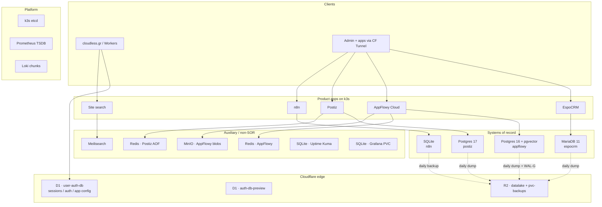

| Tier | Stores | Durability expectation |
|------|--------|------------------------|
| System of record | MariaDB, AppFlowy PG, Postiz PG, n8n SQLite, D1 | Daily R2 (cluster) or CF-managed (D1) |
| Blob / object | MinIO | PVC + daily R2 mirror (`pvc-backups/appflowy-minio/`) |
| Cache / queue | Redis ×2 | Ephemeral or AOF-local; rebuildable |
| Search index | Meilisearch | Rebuildable from source |
| Ops UI state | Kuma SQLite, Grafana SQLite | Kuma → daily R2; Grafana → PVC 2Gi |
| Control plane | etcd, Prometheus, Loki | Separate platform backup story |

---

## 2. Physical topology (Pi k3s + edge)

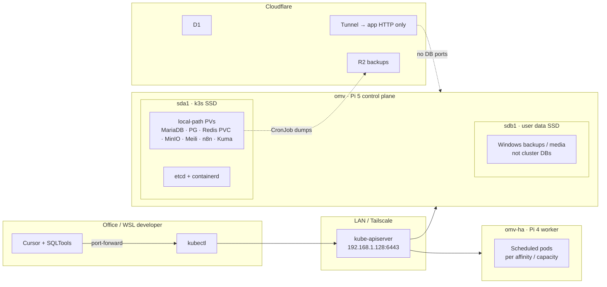

**Storage rule of thumb:** all k3s PVs live on **sda1**. Filling **sdb1** (Windows backups) must not take down databases.

---

## 3. Trust boundary — how traffic reaches data

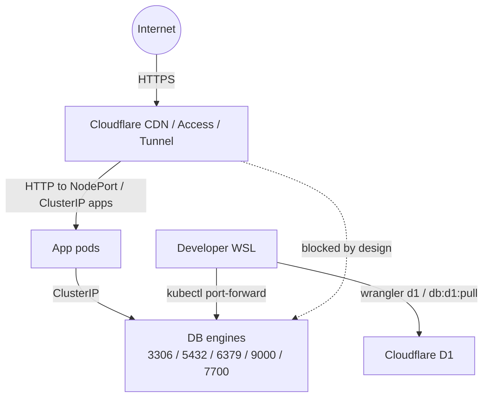

| Path | Allowed? |
|------|----------|
| Public → Cloudflare → app HTTP | Yes |
| Public → MariaDB / Postgres / Redis | **No** |
| Developer → `pnpm db:forward` → localhost | Yes (cluster auth required) |
| Developer → D1 via Wrangler / snapshot | Yes (CF account auth) |

---

## 4. Per-product data planes

### EspoCRM (CRM SOR)

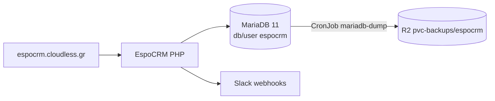

### AppFlowy (collab SOR + blobs)

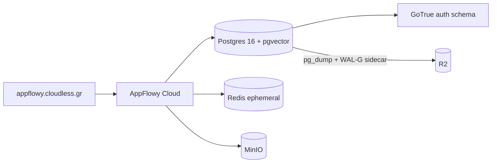

### Postiz (social publisher)

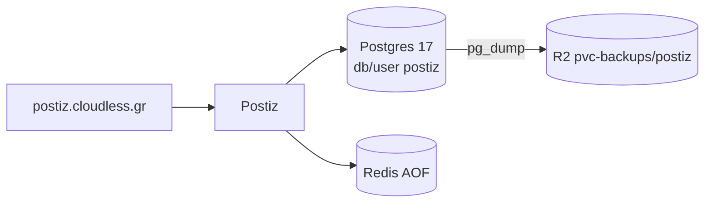

### Cloudflare D1 (edge auth / config)

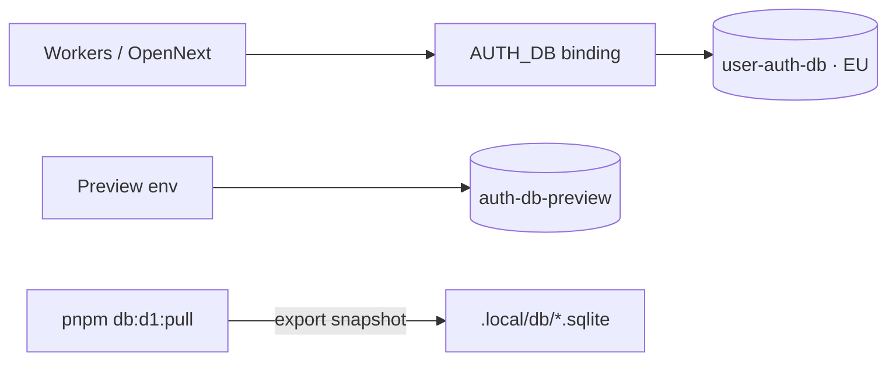

Retired orphan D1 `cloudless-auth` — deleted 2026-07-30. Orphan KV `HEALTH_CACHE` deleted the same day.

### Embedded SQLite apps

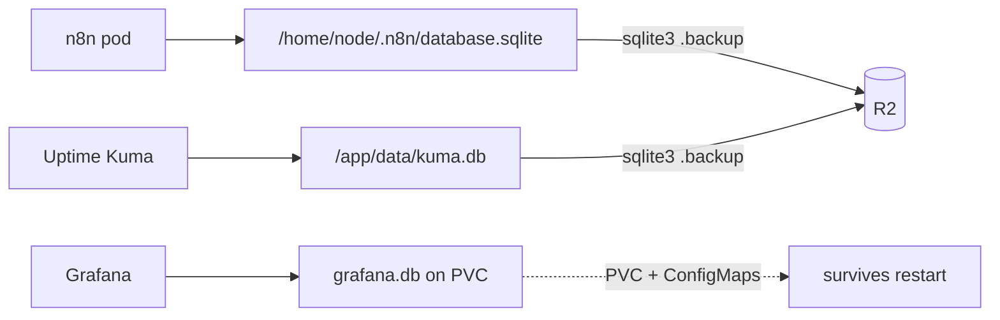

---

## 5. Backup & recovery posture

```mermaid
gantt
  title Daily logical backups to R2 (UTC)
  dateFormat HH:mm
  axisFormat %H:%M

  section AppFlowy PG
  pg_dump custom     :a1, 03:30, 15m
  section EspoCRM
  mariadb-dump gzip  :a2, 03:45, 15m
  section Postiz PG
  pg_dump custom     :a3, 04:00, 15m
  section n8n
  sqlite3 .backup    :a4, 04:15, 15m
  section AppFlowy MinIO
  rclone sync        :a5, 04:30, 15m
  section Uptime Kuma
  sqlite3 .backup    :a6, 04:45, 15m
```

| Store | Method | R2 prefix | Gap |
|-------|--------|-----------|-----|
| AppFlowy Postgres | `pg_dump` (+ WAL-G sidecar) | `pvc-backups/appflowy/daily/` | — |
| EspoCRM MariaDB | `mariadb-dump` | `pvc-backups/espocrm/daily/` | — |
| Postiz Postgres | `pg_dump` | `pvc-backups/postiz/daily/` | — |
| n8n SQLite | `sqlite3 .backup` | `pvc-backups/n8n/daily/` | — |
| AppFlowy MinIO | `rclone sync` | `pvc-backups/appflowy-minio/daily/` | — |
| Uptime Kuma | `sqlite3 .backup` | `pvc-backups/uptime-kuma/daily/` | — |
| Meilisearch / Redis | — | — | rebuild / accept loss (by design) |
| Grafana | PVC 2Gi | — | dashboards also in-repo ConfigMaps |
| D1 | Cloudflare Time Travel / export | — | use `wrangler d1` |

**RPO (covered stores):** ~24h for logical dumps (tighter for AppFlowy if WAL-G continuous path is healthy).  
**RTO:** restore dump into a new PVC + point Service. **Accepted:** 2-node k3s is not HA Postgres — warm restore from R2 is the DR story until a third Pi enables odd Raft quorum.

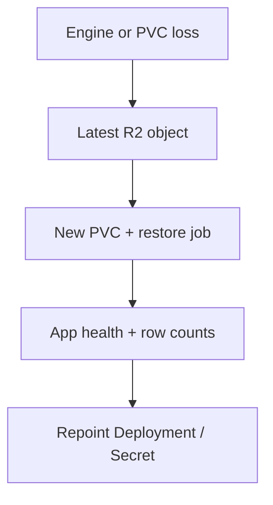

---

## 6. Developer access architecture

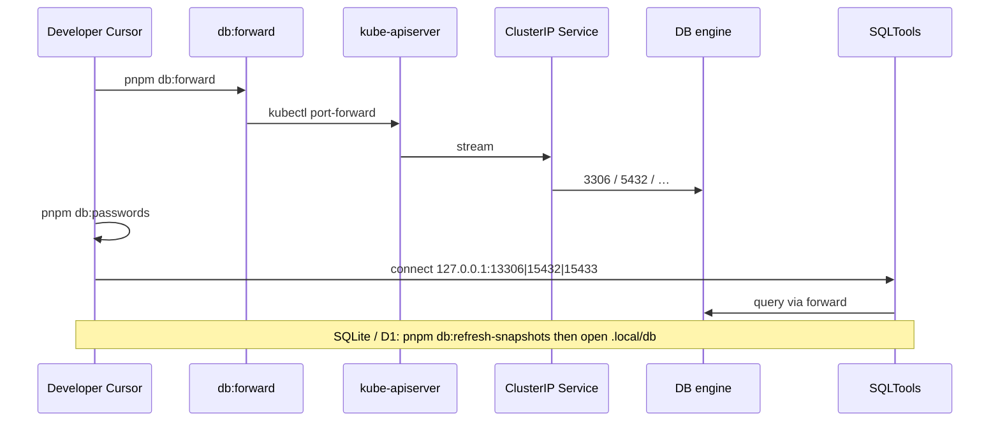

| Local | Engine | Auth source |
|-------|--------|-------------|
| `:13306` | EspoCRM MariaDB | `espocrm-secrets` |
| `:15432` | AppFlowy Postgres | `appflowy-secrets` |
| `:15433` | Postiz Postgres | `postiz-secrets` |
| `.local/db/*.sqlite` | n8n / Kuma / Grafana / D1 | file snapshot (stale until refresh) |

---

## 7. Capacity & placement notes

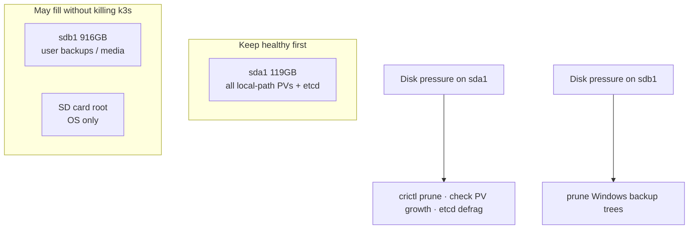

| Engine | PVC size (declared) | Growth risk |
|--------|---------------------|-------------|
| AppFlowy Postgres | 20Gi | Highest — docs/blobs metadata + pgvector |
| AppFlowy MinIO | 10Gi | Blob growth |
| Meilisearch | 5Gi | Index size |
| n8n | 5Gi | Execution history |
| EspoCRM MariaDB | 4Gi | CRM volume |
| Postiz Postgres | 2Gi | Moderate |
| Postiz Redis | 512Mi | AOF |
| Grafana | 2Gi PVC | Dashboards + prefs |

---

## 8. Target-state direction (Cloudflare-first)

| Keep on Pi | Prefer Cloudflare |
|------------|-------------------|
| EspoCRM MariaDB — CRM SOR | D1 — auth / session / app config |
| AppFlowy PG + MinIO — collab + blobs | R2 — backups + datalake |
| Postiz PG — publisher state | New edge-fit state → D1 / R2 / Queues |
| n8n SQLite — workflow history | **No** new AWS RDS / S3 backup paths |

AWS-shaped shared DB HA manifests under `infrastructure/database/` are **not live**. Prefer Cloudflare-native durability where the app already runs on Workers:

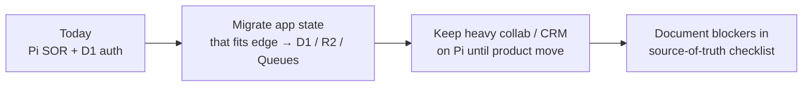

Do not expand AWS RDS / S3 backup paths for new work; R2 + existing CronJobs are the backup plane.

---

## Related

- [omv-cluster.md](omv-cluster.md) — field-level inventory, ports, secrets
- [README.md](README.md) — commands and SQLTools
- [ADR-001](ADR-001-mediated-db-access.md) — mediated access decision
- [../kubectl-tailscale.md](../kubectl-tailscale.md) — API access (day-2)
- [../TAILSCALE-FABRIC.md](../TAILSCALE-FABRIC.md) — Tailscale fabric architecture
- [../../infrastructure/backup/README.md](../../infrastructure/backup/README.md) — CronJob details
