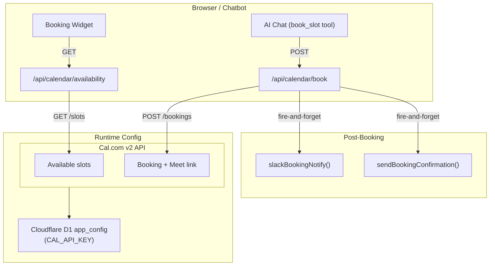

# Calendar Integration (Cal.com)

> **Status:** Live — powered by Cal.com v2 REST API. Replaced the former Google Calendar service-account integration (retired 2026-09-06).
>
> **Last verified:** 2026-09-07 — chatbot shows real availability slots, booking confirmed end-to-end via Cal.com.

---

## Architecture



---

## Environment Variables

### Local development (`.env.local`)

```bash
CAL_API_KEY=cal_live_xxxxxxxxxxxx
```

### Production (Cloudflare D1 `app_config` table)

Write to D1 via the GitHub Actions workflow:

```
Actions → "Set D1 config value" → Run workflow
  config_key:   CAL_API_KEY
  config_value: cal_live_xxxxxxxxxxxx
```

See `.github/workflows/set-d1-config.yml`. Changes take effect within 5 minutes (cache TTL) without a pod restart.

---

## API Reference

### `GET /api/calendar/availability`

Returns available 30-minute consultation slots.

**Query params:**

- `days` (optional, default: 7, range: 1–14) — how many days ahead to check

**Response:** `{ slots: [{ start: ISO8601, end: ISO8601 }, ...] }`

**Caching:** `Cache-Control: public, s-maxage=300, stale-while-revalidate=60`

**Returns 503** when `CAL_API_KEY` is not configured.

### `POST /api/calendar/book`

Books a consultation slot.

**Rate limiting:** 5 requests per IP per 10 minutes.

**Request body:**

```json
{ "name": "string", "email": "string", "start": "ISO8601", "end": "ISO8601", "notes": "optional string" }
```

**On success:**

- Creates a Cal.com booking (30-min meeting with Themistoklis Baltzakis at Cloudless.gr)
- Returns Google Meet link from the Cal.com booking response
- Fires `slackBookingNotify()` and `sendBookingConfirmation()` (fire-and-forget)
- Returns `{ success: true, meetLink }`

---

## Chatbot Booking Flow

The AI chat assistant (`/api/chat`) uses two Cal.com-backed tools:

1. `check_calendar_availability` — fetches open slots, presents a markdown table branded as  
   _"30-min consultation slots with Themistoklis Baltzakis at Cloudless.gr"_

2. `book_slot` — confirms booking after visitor provides row, name, and email; returns a branded confirmation:  
   _"Your consultation with Themistoklis Baltzakis at Cloudless.gr is confirmed!"_

---

## Key Files

| File | Purpose |
|------|---------|
| `src/lib/cal-com.ts` | Cal.com v2 client — `getAvailableSlots()`, `bookConsultation()`, `getConsultationsByEmail()` |
| `src/lib/booking-slots.ts` | Shared slot formatting helpers (`formatAthensSlot`, `formatAthensSlotsTable`, `clampDaysAhead`) |
| `src/lib/chat-tools.ts` | `check_calendar_availability` + `book_slot` tool implementations for the AI chat loop |
| `src/app/api/calendar/availability/route.ts` | GET available slots (5-min CDN cache) |
| `src/app/api/calendar/book/route.ts` | POST booking with validation, rate-limit, notifications |
| `src/app/api/user/consultations/route.ts` | GET past/upcoming consultations for authenticated users |
| `.github/workflows/set-d1-config.yml` | Write any config key (incl. `CAL_API_KEY`) to D1 |

---

## Running Tests

```bash
pnpm test -- __tests__/calendar-api.test.ts
pnpm test -- __tests__/agent-book.test.ts
pnpm test -- __tests__/agent-book-api.test.ts
pnpm test -- __tests__/chat-tools.test.ts
```

---

## Security Notes

- `CAL_API_KEY` is stored in Cloudflare D1 `app_config` — never committed to the repo.
- Integration returns 503 when unconfigured — the rest of the app is unaffected.
- Rate limiting: 5 booking attempts per IP per 10 minutes prevents calendar spam.
- Cal.com handles Google Meet link generation and calendar invite delivery to attendees.
