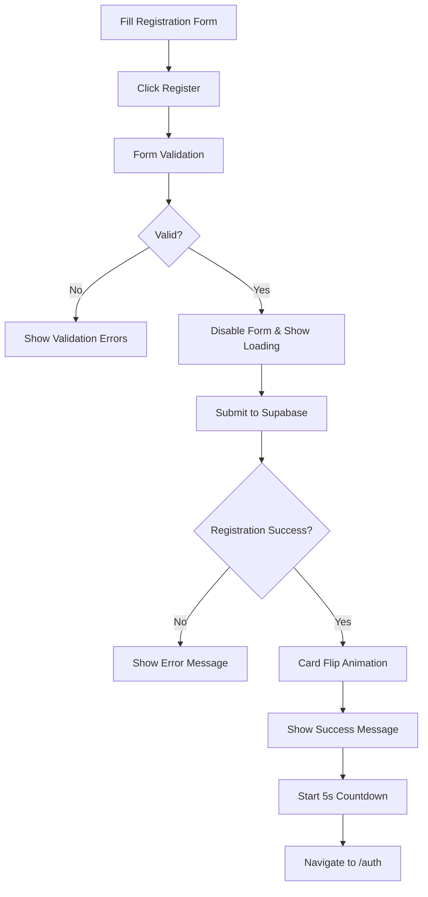

# Registration Card Flip Feature Test

This document describes the enhanced registration flow with card flip animation.

## 🎯 New Features Implemented

### 1. **Card Flip Animation**
- **Front Card**: Registration form
- **Back Card**: Success message with countdown
- **Smooth Transition**: 3D flip animation using CSS transforms
- **Duration**: 0.8s with cubic-bezier easing for smooth effect

### 2. **Enhanced User Experience**
- **Loading States**: Form disables during submission with loading button
- **Success Animation**: Pulsing success icon and fade-in effects
- **Countdown Timer**: 5-second countdown with visual progress circle
- **Auto Redirect**: Automatic redirect to `/auth` (login page)
- **Manual Override**: "Go to Login" button for immediate navigation

### 3. **Improved Form Behavior**
- **Form Validation**: All inputs validated before submission
- **Loading Feedback**: Button shows "Creating Account..." during processing
- **Error Handling**: Graceful error handling with user feedback
- **Profile Setup**: Complete user profile creation in database

## 🚀 How It Works

### Registration Flow:
1. **User fills form** → First name, last name, email, password
2. **Form submission** → Button shows loading state, form disabled
3. **Registration processing** → Supabase auth.signUp() called
4. **Success handling** → Card flips to show success message
5. **Profile creation** → User profile and info tables populated
6. **Countdown starts** → 5-second timer with visual progress
7. **Auto redirect** → Navigate to `/auth` (login page)

### Card Flip Animation:
```css
/* 3D flip effect */
.card-flip-container {
  perspective: 1000px;
}

.card-front, .card-back {
  backface-visibility: hidden;
  transition: transform 0.8s cubic-bezier(0.175, 0.885, 0.32, 1.275);
}

.flipped .card-front {
  transform: rotateY(-180deg);
}

.flipped .card-back {
  transform: rotateY(0deg);
}
```

## 🎨 Visual Enhancements

### Success Card Features:
- **Large Success Icon**: Animated pulsing checkmark
- **Welcome Message**: Personalized greeting with user's first name
- **Progress Circle**: Visual countdown with percentage completion
- **Smooth Animations**: Fade-in effects for different elements
- **Consistent Styling**: Matches the glass-morphism design

### Responsive Design:
- **Mobile Optimized**: Adjusted card height and padding for mobile
- **Glass Effect**: Maintained backdrop blur and transparency
- **Typography**: Clear hierarchy with proper contrast

## 🧪 Testing Instructions

1. **Navigate to Registration**:
   ```
   http://localhost:3000/auth/register
   ```

2. **Fill in the Form**:
   - First Name: `John`
   - Last Name: `Doe`
   - Email: `john.doe@example.com`
   - Password: `password123`

3. **Submit Registration**:
   - Click "Register" button
   - Observe loading state
   - Watch for card flip animation

4. **Success Experience**:
   - Card flips to show success message
   - Countdown timer starts from 5
   - Progress circle fills up
   - Automatic redirect to login page

5. **Manual Navigation**:
   - Click "Go to Login" to skip countdown
   - Immediate navigation to `/auth`

## 🔧 Technical Implementation

### Key Components Modified:

#### `RegisterForm.vue`:
- **Template**: Added flip container with front/back cards
- **Script**: Added state management for flip animation and countdown
- **Styles**: Implemented 3D flip animations and responsive design

#### New State Variables:
```typescript
const isSubmitting = ref(false)      // Form submission state
const registrationSuccess = ref(false) // Triggers card flip
const countdown = ref(5)             // Countdown timer
const countdownInterval = ref(null)  // Timer reference
```

#### New Functions:
- `handleSuccessfulRegistration()`: Triggers flip and starts countdown
- `startCountdownAndRedirect()`: Manages countdown timer
- `goToLogin()`: Navigation to login page
- Cleanup functions for timer management

## 🎯 User Experience Benefits

1. **Visual Feedback**: Clear indication of successful registration
2. **Smooth Transitions**: Professional animations enhance perceived quality
3. **Immediate Clarity**: User knows exactly what happened and what's next
4. **Flexible Navigation**: Can wait for auto-redirect or click to proceed
5. **Error Recovery**: Graceful handling of edge cases

## 🔄 Registration Success Flow



The enhanced registration form now provides a delightful user experience with smooth animations, clear feedback, and professional polish!
