# CloudlessGR Documentation


Welcome to the comprehensive documentation for the CloudlessGR Nuxt/Supabase application. This documentation is organized by service areas to provide clear, focused information for development, deployment, and maintenance.

## 🏗️ Application Architecture Overview

### Full Stack Architecture

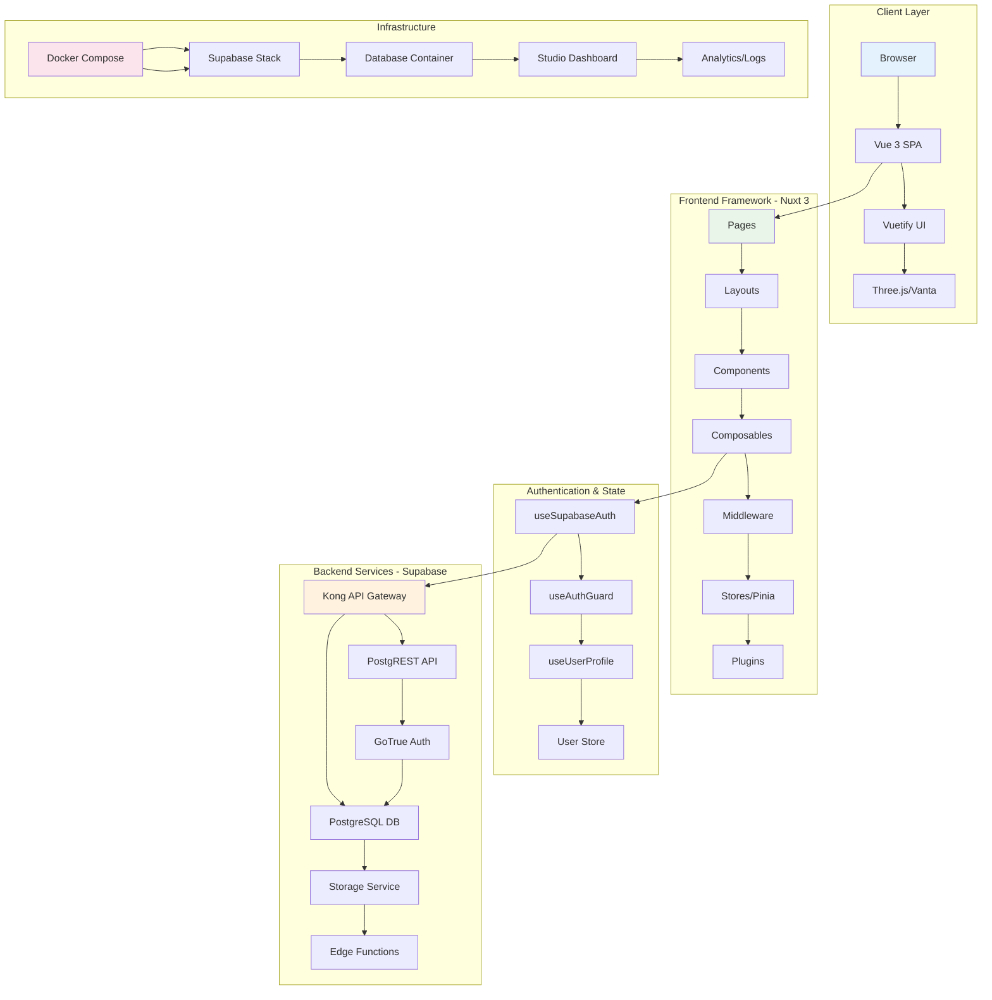

### Application Layer Structure

```mermaid
graph LR
    subgraph "Pages Structure"
        A1[index.vue] --> A2[admin/]
        A2 --> A3[auth/]
        A3 --> A4[info/]
        A4 --> A5[projects/]
        A5 --> A6[settings/]
        A6 --> A7[storage/]
        A7 --> A8[users/]
        A8 --> A9[[...slug].vue]
    end
    
    subgraph "Composables Layer"
        B1[useSupabaseAuth] --> B2[useAuthGuard]
        B2 --> B3[useUserProfile]
        B3 --> B4[useContactForm]
        B4 --> B5[useStorage]
        B5 --> B6[useSupabase]
        B6 --> B7[useMainNavLinks]
        B7 --> B8[useVantaClouds2]
    end
    
    subgraph "Middleware Layer"
        C1[auth.global.ts] --> C2[admin.ts]
        C2 --> C3[auth.ts]
    end
    
    A1 --> B1
    B1 --> C1
    
    style A1 fill:#e8f5e8
    style B1 fill:#e3f2fd
    style C1 fill:#fff3e0
```

## 🛠️ Supabase Stack Architecture

### Complete Supabase Setup

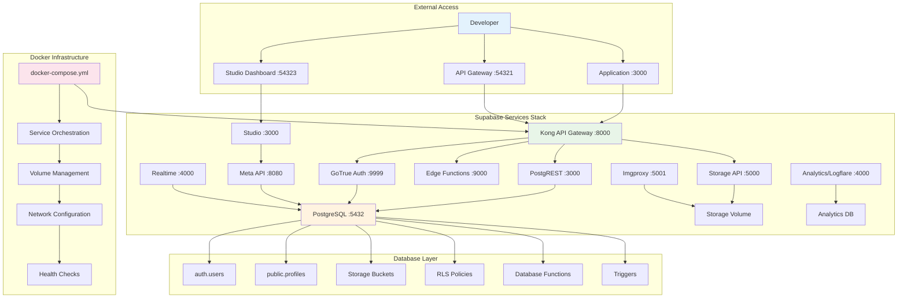

### Database Schema & Relationships

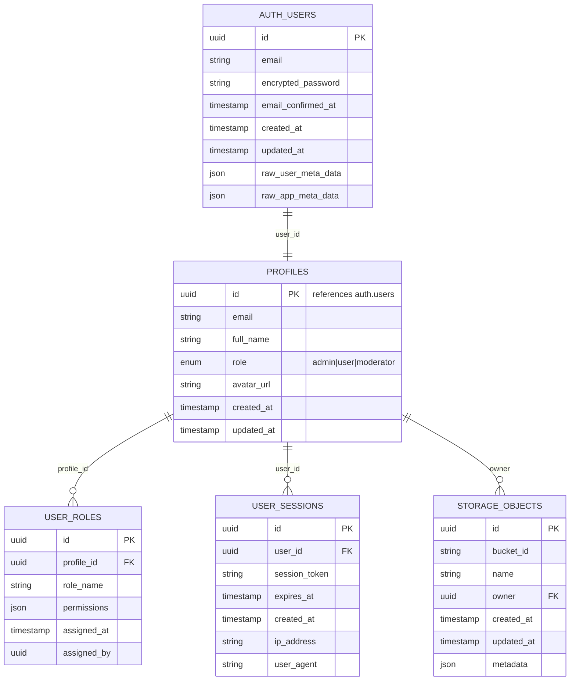

### Service Communication Flow

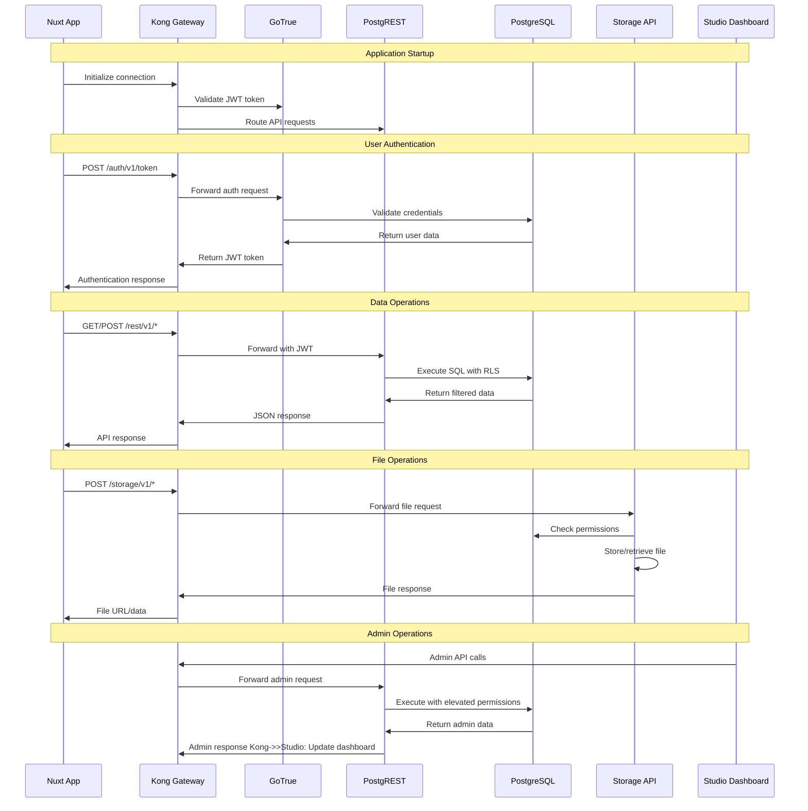

## 🐳 Docker Infrastructure

### Container Architecture

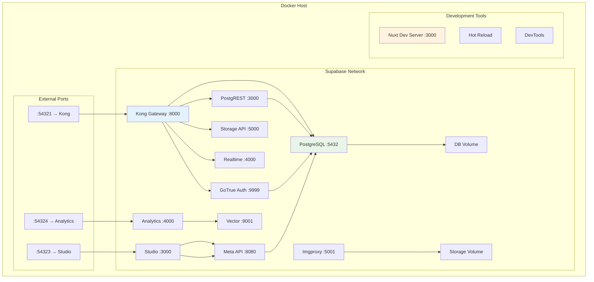

### Development vs Production Setup

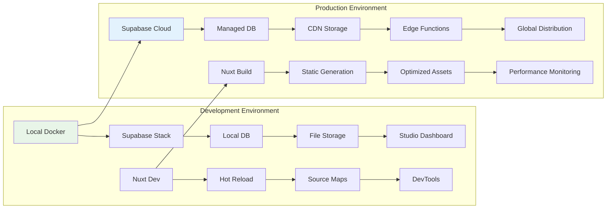

### Service Dependencies

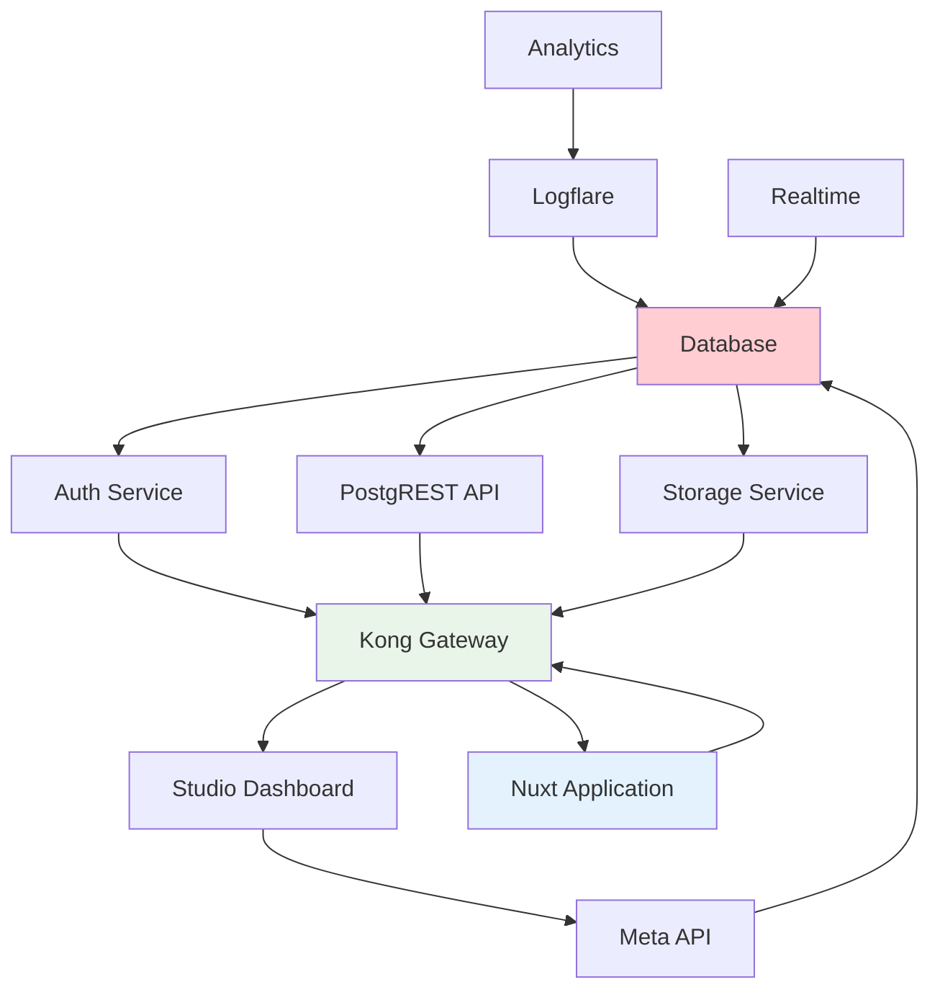

## � Detailed Supabase Setup Architecture

### Supabase Service Configuration

```mermaid
graph TB
    subgraph "Environment Configuration"
        A[.env Variables] --> B[SUPABASE_URL]
        A --> C[SUPABASE_ANON_KEY]
        A --> D[SUPABASE_SERVICE_ROLE_KEY]
        A --> E[DATABASE_URL]
        A --> F[JWT_SECRET]
    end
    
    subgraph "Docker Service Configuration"
        G[docker-compose.yml] --> H[Service Definitions]
        H --> I[kong: API Gateway]
        H --> J[auth: GoTrue]
        H --> K[rest: PostgREST]
        H --> L[realtime: WebSocket]
        H --> M[storage: File Storage]
        H --> N[imgproxy: Image Processing]
        H --> O[meta: Metadata API]
        H --> P[studio: Dashboard]
        H --> Q[analytics: Logging]
        H --> R[db: PostgreSQL]
        H --> S[vector: Log Processing]
    end
    
    subgraph "Service Dependencies"
        I --> R
        J --> R
        K --> R
        L --> R
        M --> R
        O --> R
        P --> O
        Q --> S
        N --> M
    end
    
    subgraph "Port Mapping"
        T[Host Ports] --> U[:54321 → kong:8000]
        T --> V[:54323 → studio:3000]
        T --> W[:54324 → analytics:4000]
    end
    
    B --> I
    C --> K
    D --> K
    E --> R
    F --> J
    
    G --> I
    U --> I
    V --> P
    W --> Q
    
    style A fill:#e3f2fd
    style G fill:#e8f5e8
    style T fill:#fff3e0
    style R fill:#ffcdd2
```

### Database Setup & Migration Flow

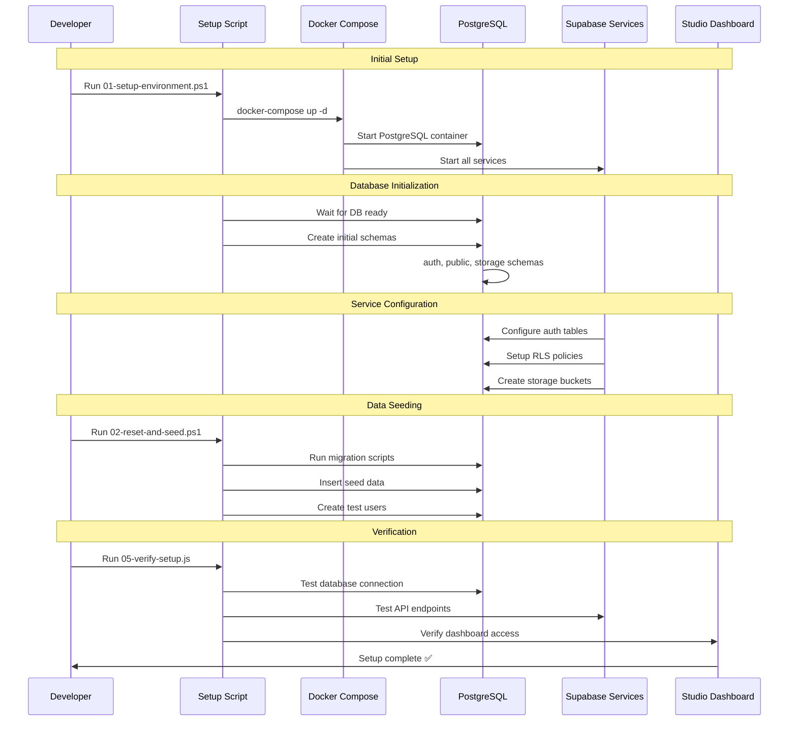

### Advanced Application Architecture

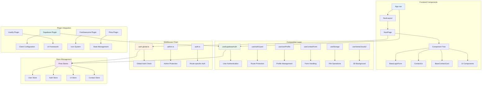

### Page Structure & Routing

```mermaid
graph TB
    subgraph "Public Pages"
        A[index.vue] --> B[Landing Page]
        C[info/about.vue] --> D[About Page]
        C[info/contact.vue] --> E[Contact Page]
        F[[...slug].vue] --> G[Dynamic Routes]
    end
    
    subgraph "Authentication Pages"
        H[auth/login.vue] --> I[Login Form]
        J[auth/register.vue] --> K[Registration]
        L[auth/forgot.vue] --> M[Password Reset]
        N[auth/callback.vue] --> O[OAuth Callback]
    end
    
    subgraph "User Dashboard"
        P[settings/profile.vue] --> Q[Profile Management]
        R[settings/security.vue] --> S[Security Settings]
        T[storage/index.vue] --> U[File Manager]
        V[projects/index.vue] --> W[Project List]
    end
    
    subgraph "Admin Panel"
        X[admin/dashboard.vue] --> Y[Admin Overview]
        Z[admin/users.vue] --> AA[User Management]
        BB[admin/logs.vue] --> CC[System Logs]
        DD[admin/settings.vue] --> EE[System Config]
    end
    
    subgraph "Layout Assignment"
        FF[default.vue] --> A
        FF --> C
        GG[auth.vue] --> H
        GG --> J
        HH[user.vue] --> P
        HH --> T
        II[admin.vue] --> X
        II --> Z
    end
    
    A --> H
    H --> P
    P --> X
    
    style A fill:#e8f5e8
    style H fill:#e3f2fd
    style P fill:#fff3e0
    style X fill:#ffebee
```

### Authentication & Authorization Flow

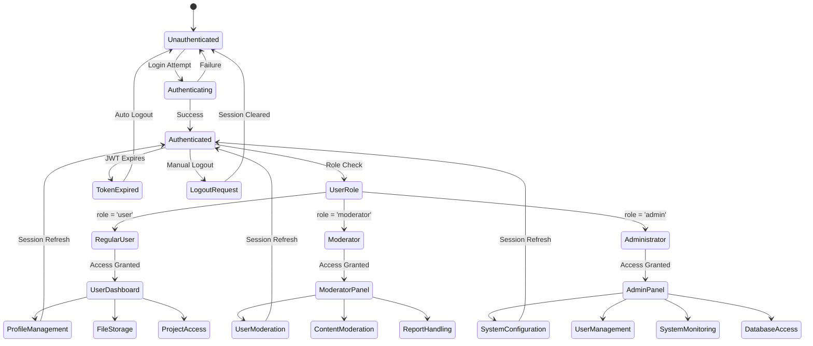

### Data Flow & State Management

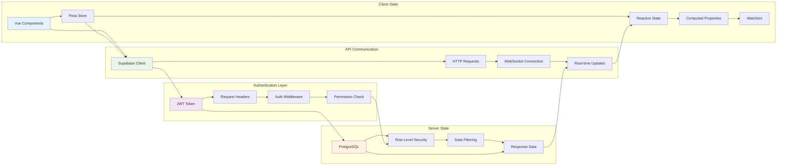

### Performance & Optimization Architecture

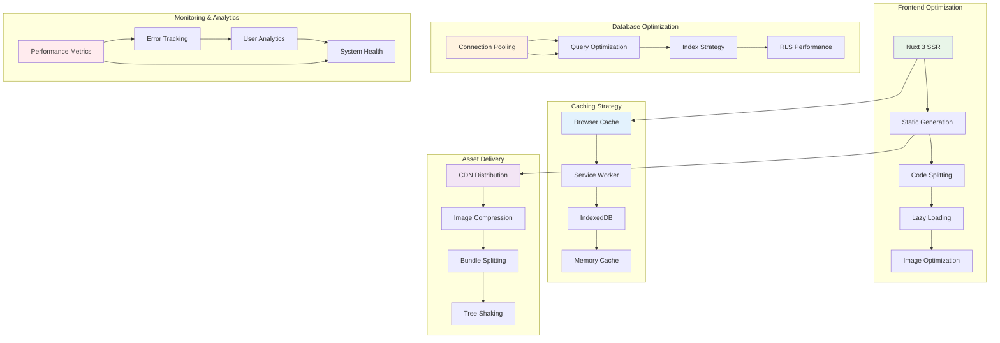

## �📚 Documentation Structure

### Services Documentation

The documentation is organized into the following service areas:

#### 🔐 [Authentication & Authorization](./services/authentication.md)
- Authentication system architecture
- Role-based access control (RBAC)
- Security best practices
- Auth recovery procedures
- Admin setup and management

#### 👥 [User Management](./services/user-management.md)
- User registration and profiles
- Role assignment and management
- User management scripts
- Login resolution procedures
- Security and permissions

#### 🗄️ [Database Service](./services/database.md)
- Database architecture and setup
- Database seeding and migration
- Recovery and emergency procedures
- Performance optimization
- Backup and restore procedures

#### 🛠️ [Development & Scripts](./services/development-scripts.md)
- Development workflow automation
- Script architecture and organization
- Fast development procedures
- Testing and validation
- Maintenance and cleanup

#### 🏗️ [Infrastructure & Docker](./services/infrastructure.md)
- Docker containerization
- Environment configuration
- Deployment strategies
- Monitoring and logging
- Performance optimization

## 🚀 Quick Start Guide

### Complete Setup Flow

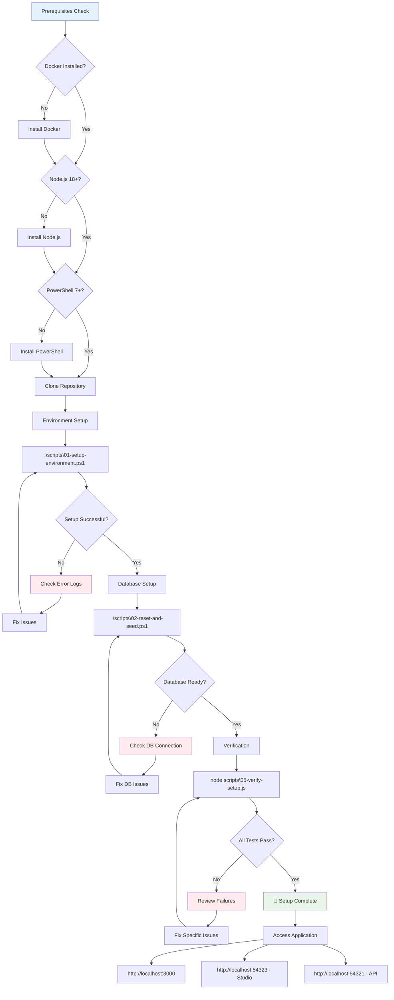

### New Developer Setup

1. **Environment Setup**
   ```bash
   # Complete environment setup
   .\scripts\01-setup-environment.ps1
   ```

2. **Database Setup**
   ```bash
   # Reset and seed database
   .\scripts\02-reset-and-seed.ps1
   ```

3. **Verification**
   ```bash
   # Verify setup
   node scripts\05-verify-setup.js
   ```

### Daily Development Workflow

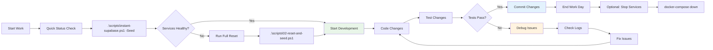

1. **Start Development Environment**
   ```bash
   # Quick start (10-20 seconds)
   .\scripts\instant-supabase.ps1 -Seed
   ```

2. **Check System Status**
   ```bash
   # Database health check
   node scripts\06-check-database.js
   
   # Connectivity test
   node scripts\12-test-connectivity.ps1
   ```

3. **Development Tools**
   - Access Supabase Studio: http://localhost:54323
   - Application: http://localhost:3000
   - API Gateway: http://localhost:54321

## 🆘 Emergency Procedures

### Emergency Recovery Decision Tree

```mermaid
flowchart TD
    A[🚨 System Issue Detected] --> B{What's the Problem?}
    
    B -->|Authentication Issues| C[Auth Problems]
    B -->|Database Connection| D[DB Problems]
    B -->|Container Issues| E[Docker Problems]
    B -->|Port Conflicts| F[Network Problems]
    B -->|Complete Failure| G[Nuclear Option]
    
    C --> C1[node scripts/11-test-authentication.js]
    C1 --> C2{Auth Working?}
    C2 -->|Yes| C3[Check User Roles]
    C2 -->|No| C4[Restart Auth Service]
    C3 --> C5[Fix Role Assignment]
    C4 --> C6[Check Environment Variables]
    
    D --> D1[node scripts/06-check-database.js]
    D1 --> D2{DB Connected?}
    D2 -->|Yes| D3[Check RLS Policies]
    D2 -->|No| D4[Restart DB Container]
    D3 --> D5[Fix Data Issues]
    D4 --> D6[Check Docker Network]
    
    E --> E1[docker-compose ps]
    E1 --> E2{Containers Running?}
    E2 -->|Some Down| E3[docker-compose restart]
    E2 -->|All Down| E4[docker-compose up -d]
    E3 --> E5[Check Service Health]
    E4 --> E6[Check Port Conflicts]
    
    F --> F1[netstat -an | findstr :54321]
    F1 --> F2{Ports Available?}
    F2 -->|No| F3[Kill Conflicting Process]
    F2 -->|Yes| F4[Check Firewall]
    F3 --> F5[Restart Services]
    F4 --> F6[Configure Network]
    
    G --> G1[.\scripts\18-emergency-restore.ps1]
    G1 --> G2[Complete System Reset]
    G2 --> G3[Verify All Services]
    
    C5 --> H[✅ Issue Resolved]
    C6 --> H
    D5 --> H
    D6 --> H
    E5 --> H
    E6 --> H
    F5 --> H
    F6 --> H
    G3 --> H
    
    H --> I[Test Application]
    I --> J{Working Properly?}
    J -->|Yes| K[🎉 Success]
    J -->|No| L[Escalate to Nuclear Option]
    L --> G1
    
    style A fill:#ffebee
    style K fill:#e8f5e8
    style G1 fill:#ffcdd2
    style H fill:#fff3e0
```

### Recovery Severity Levels

```mermaid
graph LR
    subgraph "Level 1: Quick Fixes"
        A1[Service Restart] --> A2[Config Refresh]
        A2 --> A3[Cache Clear]
    end
    
    subgraph "Level 2: Component Reset"
        B1[Database Reset] --> B2[Auth Service Reset]
        B2 --> B3[Container Restart]
    end
    
    subgraph "Level 3: System Reset"
        C1[Full Stack Reset] --> C2[Volume Cleanup]
        C2 --> C3[Network Reset]
    end
    
    subgraph "Level 4: Nuclear Option"
        D1[Complete Rebuild] --> D2[Fresh Installation]
        D2 --> D3[Data Recovery]
    end
    
    A3 --> B1
    B3 --> C1
    C3 --> D1
    
    style A1 fill:#e8f5e8
    style B1 fill:#fff3e0
    style C1 fill:#ffecb3
    style D1 fill:#ffcdd2
```

### Quick Recovery

For immediate issues:
```bash
# Quick fixes for common issues
.\scripts\quick-fix.ps1
```

### Complete Recovery

For severe issues:
```bash
# Nuclear option - complete restore
.\scripts\18-emergency-restore.ps1
```

### Service-Specific Recovery

- **Authentication Issues**: See [Authentication Service](./services/authentication.md#troubleshooting)
- **Database Issues**: See [Database Service](./services/database.md#database-recovery--emergency-procedures)
- **Container Issues**: See [Infrastructure Service](./services/infrastructure.md#troubleshooting)

## 📖 Documentation Navigation

### By Use Case

#### Setting Up New Environment
1. [Infrastructure Setup](./services/infrastructure.md#environment-setup)
2. [Database Configuration](./services/database.md#seeding-guide)
3. [Authentication Setup](./services/authentication.md#admin-setup-guide)
4. [User Management](./services/user-management.md#usage-examples)

#### Daily Development
1. [Development Scripts](./services/development-scripts.md#fast-development-scripts)
2. [Database Operations](./services/database.md#fast-database-operations)
3. [Testing Procedures](./services/development-scripts.md#testing--validation)

#### Troubleshooting
1. [Emergency Recovery](./services/database.md#emergency-scenarios)
2. [Authentication Issues](./services/authentication.md#troubleshooting)
3. [Infrastructure Problems](./services/infrastructure.md#common-issues)
4. [User Management Issues](./services/user-management.md#troubleshooting)

#### Production Deployment
1. [Infrastructure Deployment](./services/infrastructure.md#production-deployment)
2. [Database Migration](./services/database.md#database-maintenance)
3. [Security Configuration](./services/authentication.md#security-best-practices)

### By Service Area

Each service documentation includes:
- **Overview**: Service purpose and architecture
- **Setup**: Installation and configuration procedures
- **Usage**: Common operations and examples
- **API Reference**: Technical specifications
- **Troubleshooting**: Common issues and solutions
- **Best Practices**: Recommended approaches

## 🔧 Available Scripts

### Core Scripts (Sequential)
- **01-05**: Setup and initialization
- **06-10**: Maintenance and operations
- **11-15**: Testing and validation
- **16-20**: Utilities and cleanup

### Fast Scripts
- **instant-supabase.ps1**: 10-20 second startup
- **quick-reset.ps1**: 5-10 second data reset
- **reset-and-seed-v2.ps1**: 30-60 second optimized reset

### Emergency Scripts
- **18-emergency-restore.ps1**: Complete system recovery
- **quick-fix.ps1**: Common issue fixes

## 📊 Service Overview

| Service | Purpose | Key Files | Quick Access |
|---------|---------|-----------|--------------|
| Authentication | User auth & RBAC | `auth.global.ts`, `useSupabaseAuth.ts` | [Docs](./services/authentication.md) |
| User Management | User operations | `10-manage-users.js`, `profiles` table | [Docs](./services/user-management.md) |
| Database | Data management | `06-check-database.js`, `07-seed-database.js` | [Docs](./services/database.md) |
| Development | Build & deploy | `01-setup-environment.ps1`, `scripts/` | [Docs](./services/development-scripts.md) |
| Infrastructure | Docker & hosting | `docker-compose.yml`, `Dockerfile` | [Docs](./services/infrastructure.md) |

## 🔗 External Resources

### Supabase Documentation
- [Supabase Docs](https://supabase.com/docs)
- [Supabase JavaScript Client](https://supabase.com/docs/reference/javascript)
- [Row Level Security](https://supabase.com/docs/guides/auth/row-level-security)

### Nuxt.js Documentation
- [Nuxt 3 Docs](https://nuxt.com/docs)
- [Nuxt Supabase Module](https://supabase.nuxtjs.org/)
- [Nuxt Deployment](https://nuxt.com/docs/getting-started/deployment)

### Docker Documentation
- [Docker Compose](https://docs.docker.com/compose/)
- [Docker Best Practices](https://docs.docker.com/develop/dev-best-practices/)

## 🤝 Contributing

### Documentation Updates

When updating documentation:
1. Update the relevant service documentation
2. Update this index if adding new sections
3. Maintain consistent formatting and structure
4. Include practical examples and code snippets

### Script Documentation

When adding new scripts:
1. Follow the numbered naming convention
2. Include inline documentation
3. Update the [Development Scripts](./services/development-scripts.md) documentation
4. Add usage examples

## 📝 Recent Updates

This documentation was last reorganized on **June 16, 2025** to consolidate scattered documentation files into a coherent service-based structure.

### Consolidated Files
- `AUTH_SYSTEM_RECOVERY.md` → [Authentication Service](./services/authentication.md)
- `USER_MANAGEMENT.md` → [User Management Service](./services/user-management.md)
- `SEEDING_GUIDE.md` → [Database Service](./services/database.md)
- `SCRIPTS_REFERENCE.md` → [Development Scripts Service](./services/development-scripts.md)
- `docker/README.md` → [Infrastructure Service](./services/infrastructure.md)
- And many more...

The original files have been moved to maintain version history while providing a cleaner, more organized documentation structure.
