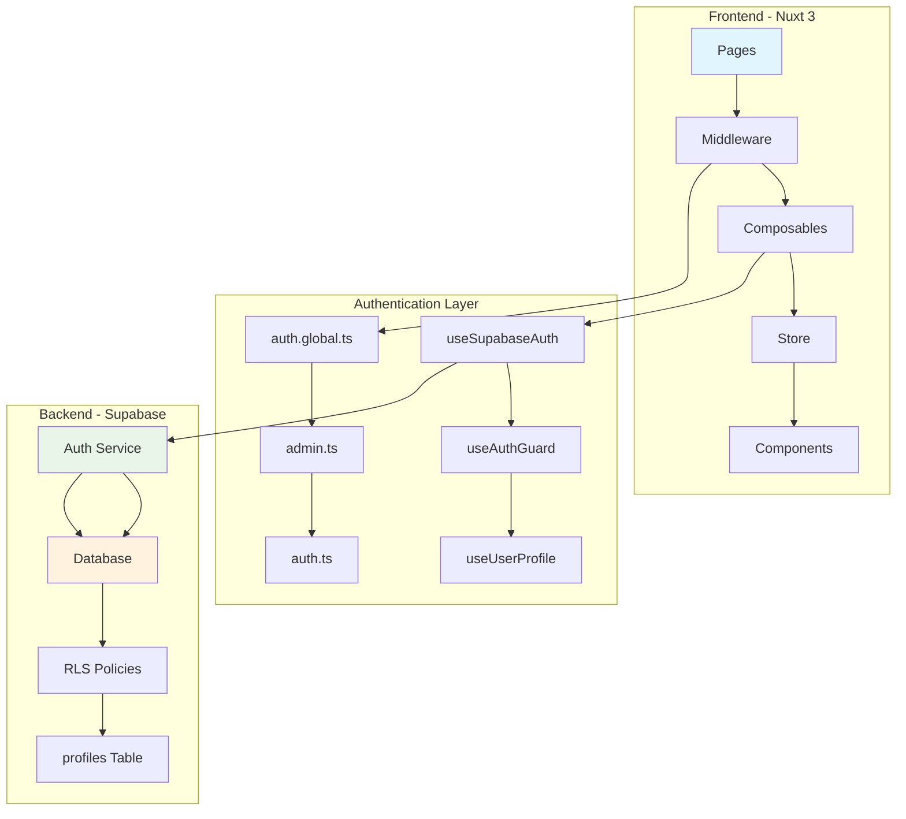
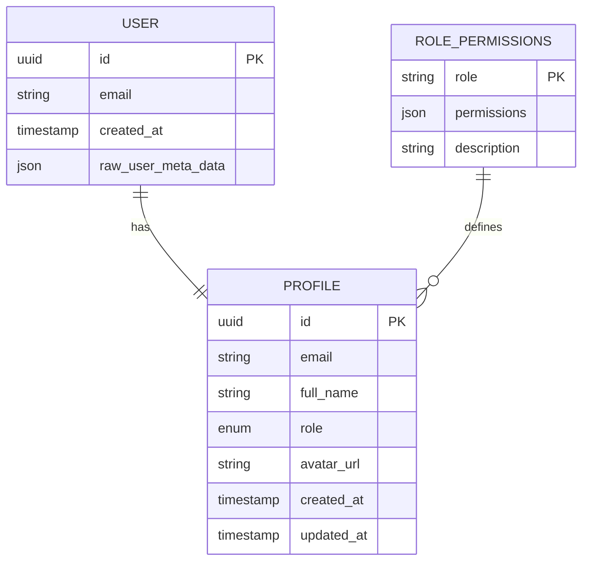
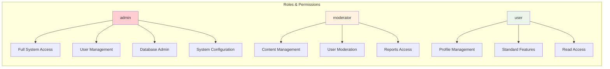
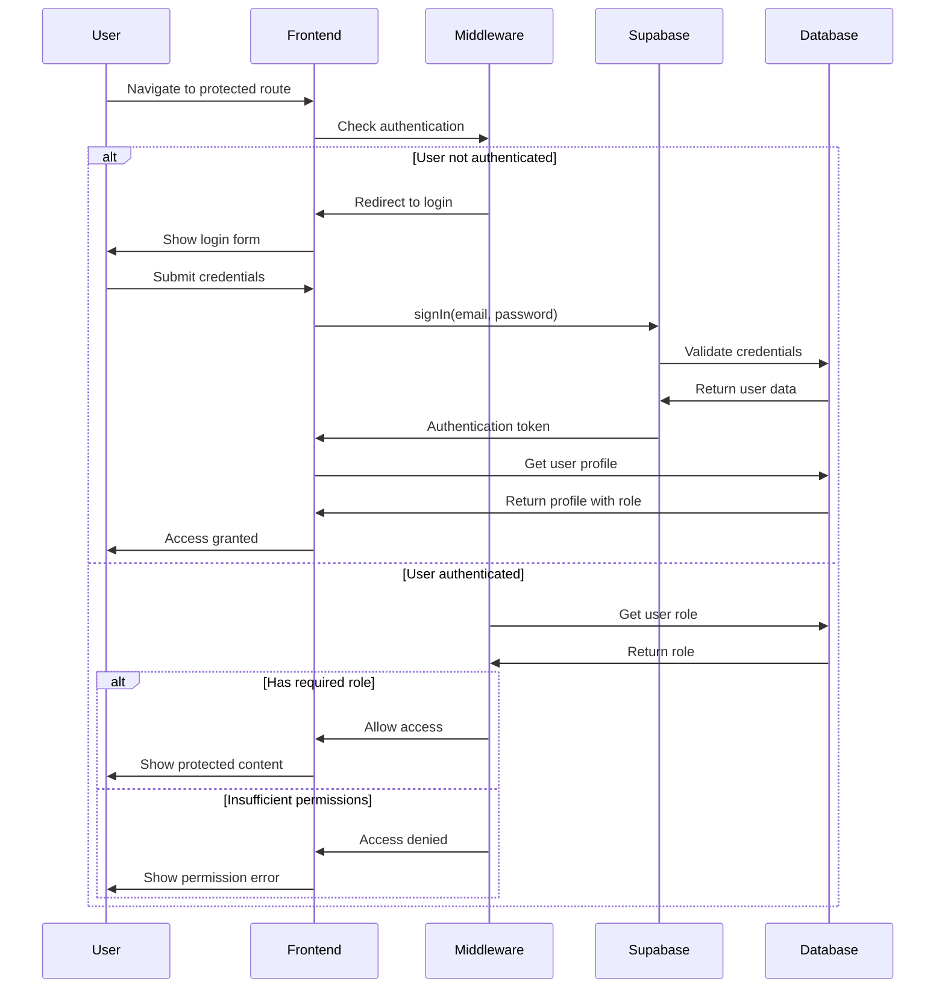
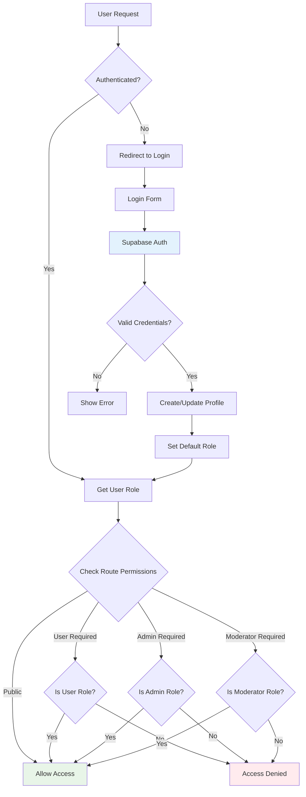
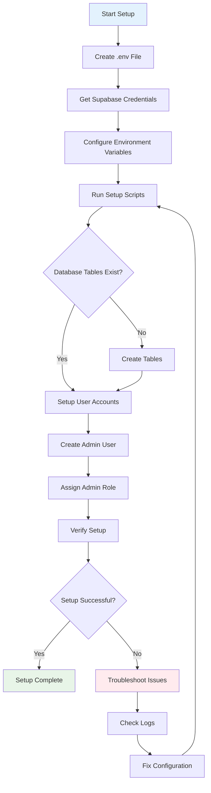
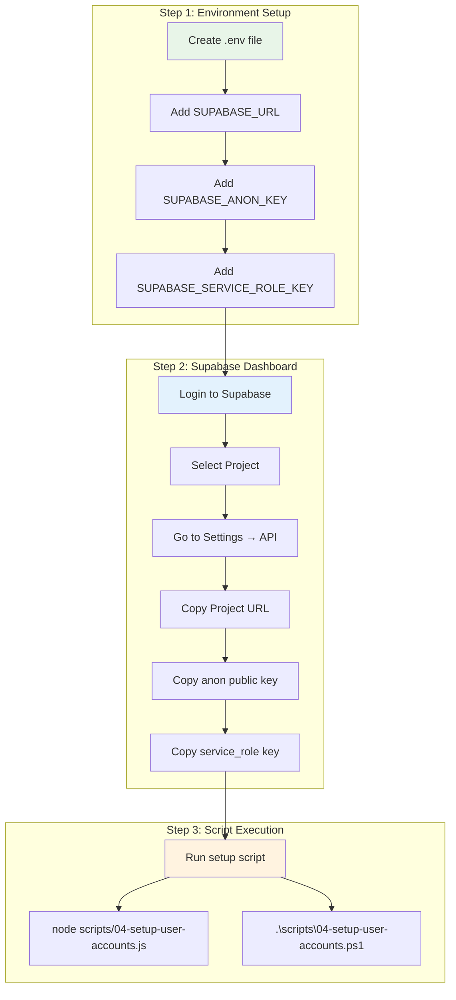
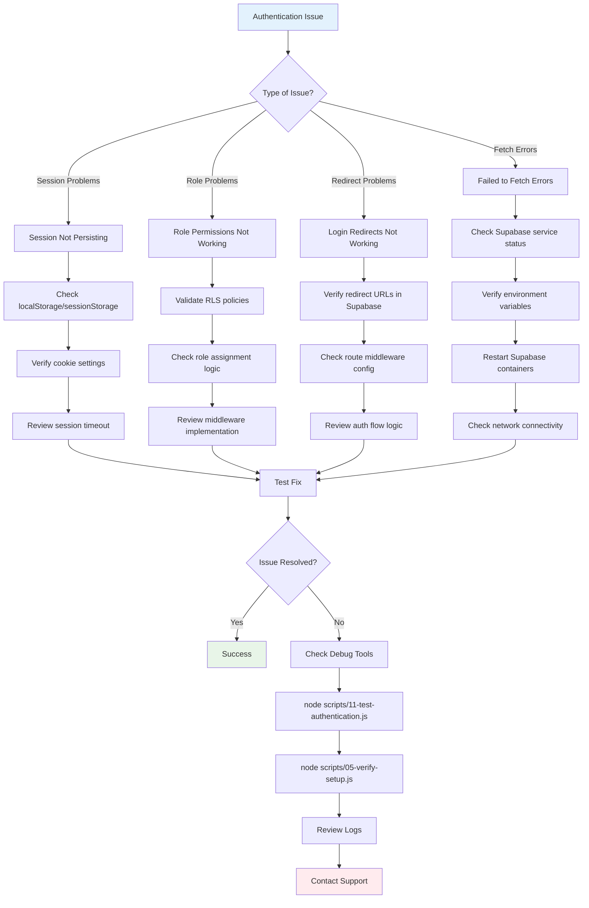
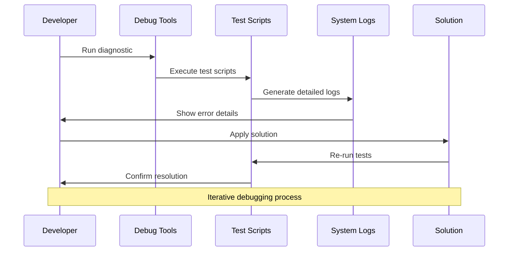

# Authentication & Authorization Service Documentation


This document consolidates all authentication and authorization related documentation for the CloudlessGR application.

## Overview

The authentication system uses Supabase Auth with role-based access control (RBAC). It includes comprehensive error handling, type safety, and role-based access control.

## Architecture

### System Overview



### Core Components

1. **Middleware System**
   - `auth.global.ts` - Global authentication guard
   - `admin.ts` - Admin-specific middleware
   - `auth.ts` - User authentication middleware

2. **Composables**
   - `useSupabaseAuth.ts` - Enhanced auth methods with role checking
   - `useAuthGuard.ts` - Advanced auth guards and permissions
   - `useUserProfile.ts` - User profile management

3. **Store**
   - `userStore.ts` - User state management with role support

4. **Types**
   - `auth.d.ts` - TypeScript definitions for auth system

## Authentication System Recovery

### Role-Based Access Control



### Permission Matrix



The system supports multiple user roles:
- **admin**: Full system access
- **user**: Standard user access
- **moderator**: Enhanced user access (optional)

### Authentication Flow



### Role-Based Access Control Flow



1. **User Registration/Login**
   - Users authenticate through Supabase Auth
   - Profile is automatically created in `profiles` table
   - Default role is assigned based on configuration

2. **Role Assignment**
   - Roles are stored in the `profiles.role` field
   - Admin users can modify roles through admin interface
   - Role changes are immediately reflected in the application

3. **Access Control**
   - Middleware checks user roles before page access
   - Composables provide role-checking utilities
   - API routes validate user permissions

## Authentication Validation Checklist

### Pre-Setup Validation
- [ ] Supabase project is created and accessible
- [ ] Environment variables are properly configured
- [ ] Database tables exist and are properly structured
- [ ] RLS policies are correctly implemented

### Post-Setup Validation
- [ ] User registration works correctly
- [ ] User login/logout functions properly
- [ ] Role-based access control is enforced
- [ ] Admin functions are restricted to admin users
- [ ] Session persistence works across page reloads

### Common Issues and Solutions

#### "Failed to fetch" Errors
**Symptoms:**
- Browser console shows `Failed to fetch` errors
- Authentication requests fail

**Solutions:**
1. Check Supabase service status
2. Verify environment variables
3. Restart Supabase containers
4. Check network connectivity

#### Role Assignment Issues
**Symptoms:**
- Users don't have correct roles
- Permission denied errors

**Solutions:**
1. Verify profile creation triggers
2. Check RLS policies
3. Validate role assignment logic
4. Review database constraints

## Admin Setup Guide

### Setup Process Flow



### Environment Configuration Steps



### Step 1: Environment Configuration

Create a `.env` file in the root directory:

```env
SUPABASE_URL=your_supabase_project_url
SUPABASE_ANON_KEY=your_supabase_anon_key
SUPABASE_SERVICE_ROLE_KEY=your_supabase_service_role_key
```

### Step 2: Get Supabase Credentials

1. Go to your Supabase dashboard (https://app.supabase.com)
2. Select your project
3. Go to Settings → API
4. Copy the following:
   - Project URL → SUPABASE_URL
   - Project API keys → anon public → SUPABASE_ANON_KEY
   - Project API keys → service_role (secret) → SUPABASE_SERVICE_ROLE_KEY

### Step 3: Admin User Creation

Run the admin setup script:
```bash
node scripts/04-setup-user-accounts.js
```

Or use the PowerShell version:
```powershell
.\scripts\04-setup-user-accounts.ps1
```

## Security Best Practices

### Environment Variables
- Never commit `.env` files to version control
- Use different keys for development and production
- Rotate service role keys regularly

### Role-Based Access Control
- Implement principle of least privilege
- Regularly audit user roles and permissions
- Use middleware for consistent access control

### Authentication Flow
- Implement proper session management
- Use secure password policies
- Enable multi-factor authentication where appropriate

## API Reference

### Authentication Composables

#### useSupabaseAuth()
```typescript
const { user, signIn, signOut, signUp, updateProfile } = useSupabaseAuth()
```

#### useAuthGuard()
```typescript
const { requireAuth, requireRole, hasPermission } = useAuthGuard()
```

### Middleware Usage

#### Global Auth Middleware
```typescript
// auth.global.ts
export default defineNuxtRouteMiddleware((to) => {
  // Global authentication logic
})
```

#### Admin Middleware
```typescript
// admin.ts
export default defineNuxtRouteMiddleware(() => {
  // Admin-only access logic
})
```

## Troubleshooting

### Common Issues Flowchart



### Debugging Workflow



### Common Authentication Issues

1. **Session not persisting**
   - Check localStorage/sessionStorage
   - Verify cookie settings
   - Review session timeout configuration

2. **Role permissions not working**
   - Validate RLS policies
   - Check role assignment logic
   - Review middleware implementation

3. **Login redirects not working**
   - Verify redirect URLs in Supabase dashboard
   - Check route middleware configuration
   - Review authentication flow logic

### Debug Tools

Use the built-in debugging tools:
```bash
# Test authentication status
node scripts/11-test-authentication.js

# Verify user setup
node scripts/05-verify-setup.js
```

## Related Files

- `AUTH_SYSTEM_RECOVERY.md` (source)
- `AUTH_VALIDATION_CHECKLIST.md` (source)
- `ADMIN_SETUP.md` (source)
- `admin-keys-report.md` (source)
