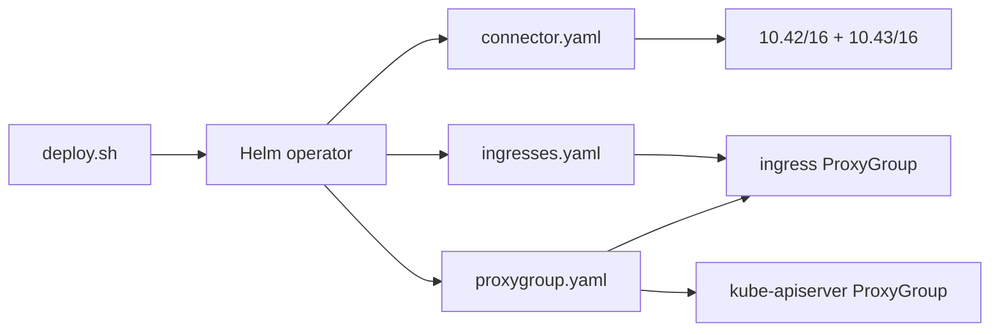

# Tailscale Operator (fabric interconnect)

Canonical architecture: [`docs/cluster/TAILSCALE-FABRIC.md`](../../docs/cluster/TAILSCALE-FABRIC.md)  
kubectl day-2: [`docs/cluster/kubectl-tailscale.md`](../../docs/cluster/kubectl-tailscale.md)

Private admin mesh for Pi k3s. **Public** `*.cloudless.gr` stays on Cloudflare
(Worker + Tunnel) — do not reintroduce Funnel as the production edge.

**Tailnet:** `tail4ecae1.ts.net`  
**Admin:** https://login.tailscale.com/admin

---

## Quick deploy

```bash
export TS_CLIENT_ID=…          # OAuth client, tag:k8s-operator
export TS_CLIENT_SECRET=…
export KUBECONFIG=~/.kube/config-cloudless-ts
bash infrastructure/tailscale/deploy.sh
```

Then:

1. Merge `acl-policy.example.json` into Access controls (prefer CI below).
2. Enable HTTPS Certificates (`scripts/tailscale-enable-https.sh`).
3. Approve Service hosts (`scripts/tailscale-approve-service-hosts.sh`).
4. Delete stale per-Service Machines from earlier ProxyGroup mistakes.

### Apply ACL from CI (preferred)

```bash
# ACL only — skips device cleanup (safe default)
gh workflow run tailscale-admin-api.yml -f dry_run=false -f acl_only=true
```

Always use `acl_only=true` unless you intentionally want device orphan cleanup.
Full cleanup can delete mis-matched Machines (e.g. Connector replicas).

---

## Layout



| File | Purpose |
|------|---------|
| `connector.yaml` | `Connector` advertises pod + ClusterIP CIDRs (HA replicas: 2) + `ProxyClass/pi-fabric` |
| `proxygroup.yaml` | Shared `ingress` ProxyGroup + `kube-apiserver` ProxyGroup |
| `ingresses.yaml` | Grafana / Meili with `tailscale.com/proxy-group: ingress` |
| `ingress-class.yaml` | `IngressClass` `tailscale` |
| `acl-policy.example.json` | tagOwners + autoApprovers + grants + ssh + **Apps** (`nodeAttrs`) |
| `deploy.sh` | Helm install (OAuth env only — no AWS SSM) |
| `subnet-router.yaml` / `proxygroup-monitoring.yaml` | Deprecated stubs — do not apply |
| `OFFLINE-DEVICE-TROUBLESHOOTING.md` | Stale Machines cleanup |

---

## DNS (admin console — leave as-is)

Console: **DNS** → https://login.tailscale.com/admin/dns

| Setting | Required value | Why |
|---------|----------------|-----|
| Tailnet DNS name | `tail4ecae1.ts.net` | MagicDNS, Serve, VIP Services, certs |
| MagicDNS | **On** | Hostnames + `svc:*` names |
| Global nameserver | MagicDNS `100.100.100.100` | Resolves tailnet + Apps connector domains |
| Search domains | `tail4ecae1.ts.net` only | Short names work; do not add home LAN domains unless needed |
| HTTPS Certificates | **On** | Serve TLS for Grafana / Meili / kube |
| Extra / local nameservers | **None** | Do not override with Pi-hole/router here |

Do **not** rename the tailnet, disable MagicDNS, or disable HTTPS.

**Host flag:** connector / overloaded Pis use `--accept-dns=false` so MagicDNS is
not the system resolver (avoids fights with CoreDNS / LAN DNS). Clients
(office laptop, phone) should keep default DNS accept so MagicDNS works.

---

## Access controls (grants + SSH)

Source of truth: [`acl-policy.example.json`](acl-policy.example.json).  
Live merge: `scripts/tailscale-admin-api.sh` (grants upsert by src/dst; **ssh
section is replaced** from the example file).

| Who | Destination | Ports / action |
|-----|-------------|----------------|
| `autogroup:admin` | `tag:k8s`, `tag:k8s-operator`, `tag:app-connector` | `*` (full) |
| `autogroup:member` | `tag:k8s` | `tcp:80`, `tcp:443` only (Serve HTTPS) |
| `autogroup:member` | `tag:app-connector` | `tcp:53`, `udp:53` only |
| `autogroup:member` | `autogroup:self` / `internet` | `*` |
| Admin SSH | self + tagged fabric | `action: accept` (users include `tbaltzakis`) |
| Member SSH | `autogroup:self` | `action: check` only |

Members must **not** get `ip: ["*"]` to tagged nodes — that re-opens
node_exporter (`:9100`), k3s (`:6443`), SSH, and discovery noise as real
reachability.

### Tailscale SSH

```bash
# From any tailnet device (Windows / WSL / phone) — admin
ssh tbaltzakis@github-omv
ssh tbaltzakis@omv-ha
```

Hosts need `--ssh` (`tailscale set --ssh`). Keep classic `sshd` on the LAN
for break-glass; Tailscale ACLs gate who can reach the Pis over the tailnet.

---

## VIP Services (Serve hosts)

Console: **Services** (VIP / `svc:*`) — not the same as **Machines** discovery.

Expected approved hosts (keep):

| Service | MagicDNS |
|---------|----------|
| `svc:grafana` | `grafana.tail4ecae1.ts.net` |
| `svc:meilisearch` | `meilisearch.tail4ecae1.ts.net` |
| `svc:kube` | kube ProxyGroup Serve URL |

Approve / prune orphans:

```bash
gh workflow run tailscale-approve-service-hosts.yml
# or: bash scripts/tailscale-approve-service-hosts.sh
```

Do **not** keep legacy per-stack names like
`svc:monitoring-grafana-tailscale-ingress` — delete those orphans.

---

## Endpoint discovery (Machines UI)

The admin UI may list discovered endpoints (SSH, hallpass, node_exporter,
k3s, random `:8080`). That is **inventory**, not ACL permission.

- Noise is OK to leave; do not “fix” discovery by opening grants.
- Reachability is controlled by **grants** above (members = HTTPS only).
- Public `*.cloudless.gr` stays on Cloudflare — never put those in Apps.

---

## Tailscale Apps (SaaS app connectors)

ACL includes `tag:app-connector` plus presets (**GitHub**, **Stripe**,
**Google Workspace**) and custom domains (**Notion**, **Sentry**, **Slack**,
**Cloudflare**, **Anthropic**). Names in `nodeAttrs` must be hyphenated
(no spaces).

```bash
gh workflow run tailscale-admin-api.yml -f dry_run=false -f acl_only=true
```

Live connector is on **`github-omv`** (stable enough; prefer a quiet office/NAS
host if omv is overloaded):

```bash
sudo tailscale up --hostname=github-omv --advertise-connector \
  --advertise-tags=tag:app-connector \
  --accept-routes --accept-dns=false --ssh
```

Apps go green at https://login.tailscale.com/admin/apps once the connector is
online and advertising SaaS CIDRs. Copy **Egress IPs** into SaaS allowlists
when you tighten access.

**Do not** put public `*.cloudless.gr` or Grafana/Meili Serve hosts in Apps —
those stay on Cloudflare Tunnel / ProxyGroup.

---

## Design rules

1. **Subnet routes → Connector**, never ProxyGroup.
2. **Many services → one ingress ProxyGroup** (annotate `proxy-group`).
3. **HA subnet routers** advertise identical CIDR strings.
4. **kubectl remotely → kube-apiserver ProxyGroup** (`tailscale configure kubeconfig`).
5. **No Funnel** for these GUIs — Cloudflare Access / Tunnel covers public HTTP.
6. **MagicDNS over CGNAT literals** in new scripts (`*.tail4ecae1.ts.net`).
7. **ACL apply with `acl_only=true`** unless you mean to run device cleanup.
8. **Members → HTTPS-only** on `tag:k8s`; admins keep full fabric access.
