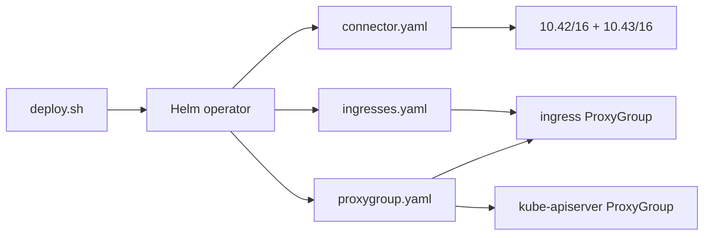

# Tailscale Operator (fabric interconnect)

Canonical architecture: [`docs/cluster/TAILSCALE-FABRIC.md`](../../docs/cluster/TAILSCALE-FABRIC.md)  
kubectl day-2: [`docs/kubectl-tailscale.md`](../../docs/kubectl-tailscale.md)

Private admin mesh for Pi k3s. **Public** `*.cloudless.gr` stays on Cloudflare
(Worker + Tunnel) — do not reintroduce Funnel as the production edge.

## Quick deploy

```bash
export TS_CLIENT_ID=…          # OAuth client, tag:k8s-operator
export TS_CLIENT_SECRET=…
export KUBECONFIG=~/.kube/config-cloudless-ts
bash infrastructure/tailscale/deploy.sh
```

Then:

1. Merge `acl-policy.example.json` into Tailscale Access controls.
2. Enable HTTPS Certificates (`scripts/tailscale-enable-https.sh`).
3. Approve Service hosts (`scripts/tailscale-approve-service-hosts.sh`).
4. Delete stale per-Service Machines from earlier ProxyGroup mistakes.

## Layout



| File | Purpose |
|------|---------|
| `connector.yaml` | `Connector` advertises pod + ClusterIP CIDRs (HA replicas: 2) + `ProxyClass/pi-fabric` |
| `proxygroup.yaml` | Shared `ingress` ProxyGroup + `kube-apiserver` ProxyGroup |
| `ingresses.yaml` | Grafana / Meili with `tailscale.com/proxy-group: ingress` |
| `ingress-class.yaml` | `IngressClass` `tailscale` |
| `acl-policy.example.json` | tagOwners + autoApprovers + grants |
| `deploy.sh` | Helm install (OAuth env only — no AWS SSM) |
| `subnet-router.yaml` / `proxygroup-monitoring.yaml` | Deprecated stubs — do not apply |
| `OFFLINE-DEVICE-TROUBLESHOOTING.md` | Stale Machines cleanup |

## Design rules

1. **Subnet routes → Connector**, never ProxyGroup.
2. **Many services → one ingress ProxyGroup** (annotate `proxy-group`).
3. **HA subnet routers** advertise identical CIDR strings.
4. **kubectl remotely → kube-apiserver ProxyGroup** (`tailscale configure kubeconfig`).
5. **No Funnel** for these GUIs — Cloudflare Access / Tunnel covers public HTTP.
6. **MagicDNS over CGNAT literals** in new scripts (`*.tail4ecae1.ts.net`).
